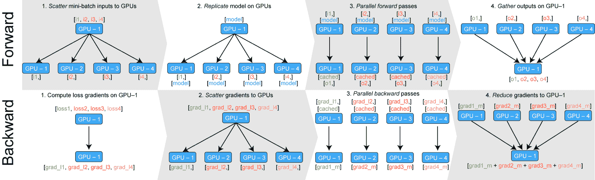
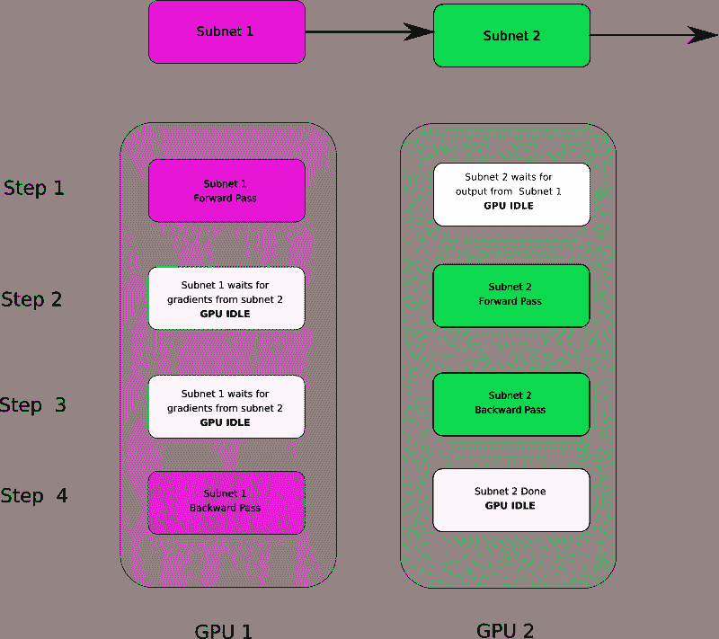
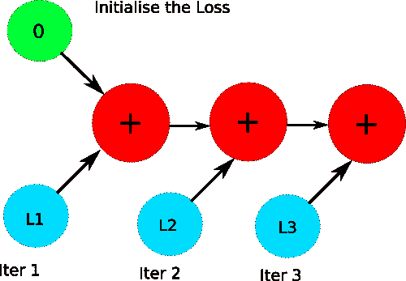

# PyTorch 101，第 4 部分:内存管理和使用多个 GPU

> 原文：<https://blog.paperspace.com/pytorch-memory-multi-gpu-debugging/>

*图片来源:cryptocurrency360.com*

你好。这是我们 PyTorch 101 系列的第 4 部分，我们将在这篇文章中讨论多种 GPU 的使用。

在这一部分中，我们将讨论，

1.  如何为您的网络使用多个 GPU，无论是使用数据并行还是模型并行。
2.  如何在创建新对象时自动选择 GPU？
3.  如何诊断和分析可能出现的内存问题。

那么，我们开始吧。

在我们开始之前，让我提醒您这是我们 PyTorch 系列的第 4 部分。

1.  [理解图形，自动微分和亲笔签名](https://blog.paperspace.com/pytorch-101-understanding-graphs-and-automatic-differentiation/)
2.  [建立你的第一个神经网络](https://blog.paperspace.com/pytorch-101-building-neural-networks/)
3.  [深入 PyTorch](blog.paperspace.com/pytorch-101-advanced/)
4.  [内存管理和使用多个 GPU](blog.paperspace.com/pytorch-memory-multi-gpu-debugging/)
5.  [理解挂钩](blog.paperspace.com/pytorch-hooks-gradient-clipping-debugging/)

你可以在 Github repo [这里](https://github.com/Paperspace/PyTorch-101-Tutorial-Series)获得这篇文章(以及其他文章)中的所有代码。

* * *

### 围绕 CPU/GPU 移动张量

PyTorch 中的每个张量都有一个`to()`成员函数。它的工作是把调用它的张量放到某个设备上，不管是 CPU 还是 GPU。`to`功能的输入是一个`torch.device`对象，可通过以下任一输入进行初始化。

1.  `cpu`为 CPU
2.  `cuda:0`用于放在 0 号 GPU 上。类似地，如果你想把张量放上去

一般来说，每当你初始化一个张量，它就被放在 CPU 上。然后就可以把它移到 GPU 上了。您可以通过调用`torch.cuda.is_available`函数来检查 GPU 是否可用。

```py
if torch.cuda.is_available():
	dev = "cuda:0"
else:
	dev = "cpu"

device = torch.device(dev)

a = torch.zeros(4,3)   
a = a.to(device)       #alternatively, a.to(0)
```

你也可以通过将张量的索引作为`to`函数的参数，将张量移动到某个 GPU。

重要的是，上面这段代码是设备不可知的，也就是说，您不必单独更改它就可以在 GPU 和 CPU 上工作。

### cuda()函数

将张量放在 GPU 上的另一种方法是对它们调用`cuda(n)`函数，其中`n`是 GPU 的索引。如果你只是调用`cuda`，那么张量放在 GPU 0 上。

`torch.nn.Module`类也有`to`和`cuda`功能，将整个网络放在一个特定的设备上。不像，`Tensors`在`nn.Module`对象上调用`to`就足够了，不需要分配`to`函数的返回值。

```py
clf = myNetwork()
clf.to(torch.device("cuda:0")    # or clf = clf.cuda() 
```

### GPU 的自动选择

虽然能够明确决定张量在哪个 GPU 上运行是件好事，但一般来说，我们在运算过程中会创建很多张量。我们希望它们在某个设备上自动创建，以减少跨设备传输，这会降低我们代码的速度。在这方面，PyTorch 为我们提供了一些功能来实现这一点。

首先，是`torch.get_device`函数。只支持 GPU 张量。它返回张量所在的 GPU 的索引。我们可以用这个函数来确定张量的设备，这样我们就可以把一个创建的张量自动移动到这个设备上。

```py
#making sure t2 is on the same device as t2

a = t1.get_device()
b = torch.tensor(a.shape).to(dev)
```

我们还可以在创建新张量的同时调用`cuda(n)`。默认情况下，由`cuda`调用创建的所有张量都放在 GPU 0 上，但这可以通过以下语句来更改。

```py
torch.cuda.set_device(0)   # or 1,2,3 
```

如果一个张量是由同一设备上的两个操作数之间的运算产生的，那么结果张量也是如此。如果操作数在不同的设备上，就会导致错误。

### 新 _*函数

你也可以使用 py torch 1.0 版本中的一堆`new_`函数。当在`Tensor`上调用类似`new_ones`的函数时，它返回一个相同数据类型的新张量 cof，并且与调用`new_ones`函数的张量在同一设备上。

```py
ones = torch.ones((2,)).cuda(0)

# Create a tensor of ones of size (3,4) on same device as of "ones"
newOnes = ones.new_ones((3,4)) 

randTensor = torch.randn(2,4) 
```

在 PyTorch 文档中可以找到`new_`函数的详细列表，我在下面提供了该文档的链接。

## 使用多个 GPU

我们可以通过两种方式来利用多个 GPU。

1.  **数据并行**，这里我们将批次划分成更小的批次，在多个 GPU 上并行处理这些更小的批次。
2.  **模型并行**，我们将神经网络分成更小的子网络，然后在不同的 GPU 上执行这些子网络。

### 数据并行性

PyTorch 中的数据并行是通过`nn.DataParallel`类实现的。你用一个代表你的网络的`nn.Module`对象和一个 GPU IDs 列表初始化一个`nn.DataParallel`对象，批处理必须通过它们被并行化。

```py
parallel_net = nn.DataParallel(myNet, gpu_ids = [0,1,2]) 
```

现在，您可以像执行`nn.Module`一样简单地执行`nn.DataParallel`对象。

```py
predictions = parallel_net(inputs)           # Forward pass on multi-GPUs
loss = loss_function(predictions, labels)     # Compute loss function
loss.mean().backward()                        # Average GPU-losses + backward pass
optimizer.step() 
```

然而，有几件事我想说明一下。尽管我们的数据必须在多个 GPU 上并行处理，但我们最初必须将它存储在单个 GPU 上。

我们还需要确保`DataParallel`对象也在那个特定的 GPU 上。语法仍然类似于我们之前对`nn.Module`所做的。

```py
input        = input.to(0)
parallel_net = parellel_net.to(0)
```

实际上，下图描述了`nn.DataParallel`是如何工作的。



Working of nn.DataParallel. [Source](https://medium.com/huggingface/training-larger-batches-practical-tips-on-1-gpu-multi-gpu-distributed-setups-ec88c3e51255) 

`DataParallel`获取输入，将其分成更小的批次，在所有设备上复制神经网络，执行传递，然后在原始 GPU 上收集输出。

`DataParallel`的一个问题是它可能会给一个 GPU(主节点)带来不对称的负载。通常有两种方法来避免这些问题。

1.  首先是计算向前传递时的损耗。这确保至少损失计算阶段是并行的。
2.  另一种方法是实现并行损失功能层。这超出了本文的范围。不过，对于那些感兴趣的人，我在本文末尾给出了一个链接，链接到一篇详细介绍这种层的实现的中型文章。

### 模型并行性

模型并行意味着将网络分成更小的子网，然后放在不同的 GPU 上。这样做的主要动机是，您的网络可能太大，无法容纳在单个 GPU 中。

请注意，模型并行性通常比数据并行性慢，因为将单个网络分成多个 GPU 会在 GPU 之间引入依赖性，从而阻止它们以真正并行的方式运行。从模型并行性中获得的优势不是速度，而是运行网络的能力，这些网络的规模太大，无法在单个 GPU 上运行。

正如我们在图 b 中看到的，子网 2 在正向传递期间等待子网 1，而子网 1 在反向传递期间等待子网 2。



Model Parallelism with Dependencies

* * *

只要记住两件事，实现模型并行是非常容易的。

1.  输入和网络应该总是在同一设备上。
2.  `to`和`cuda`函数具有自动签名支持，因此您的渐变可以在反向传递期间从一个 GPU 复制到另一个 GPU。

我们将使用下面这段代码来更好地理解这一点。

```py
class model_parallel(nn.Module):
	def __init__(self):
		super().__init__()
		self.sub_network1 = ...
		self.sub_network2 = ...

		self.sub_network1.cuda(0)
		self.sub_network2.cuda(1)

	def forward(x):
		x = x.cuda(0)
		x = self.sub_network1(x)
		x = x.cuda(1)
		x = self.sub_network2(x)
		return x 
```

在`init`函数中，我们将子网分别放在 GPUs 0 和 1 上。

注意，在`forward`函数中，我们将中间输出从`sub_network1`传送到 GPU 1，然后再传送给`sub_network2`。由于`cuda`有亲笔签名的支持，从`sub_network2`反向传播的丢失将被复制到`sub_network1`的缓冲区，以供进一步反向传播。

## 排除内存不足错误

在这一节中，我们将介绍如何诊断内存问题，以及如果您的网络使用的内存超过需求时可能的解决方案。

虽然用尽内存可能需要减少批处理大小，但是可以进行某些检查来确保内存的使用是最佳的。

**使用 GPUtil 跟踪内存使用情况**

跟踪 GPU 使用情况的一种方法是在控制台中使用`nvidia-smi`命令监控内存使用情况。这种方法的问题是，GPU 使用高峰和内存不足发生得如此之快，以至于您无法确定是哪部分代码导致了内存溢出。

为此，我们将使用一个名为`GPUtil`的扩展，您可以通过运行以下命令用 pip 安装它。

```py
pip install GPUtil
```

用法也很简单。

```py
import GPUtil
GPUtil.showUtilization()
```

只需将第二行放在您想要查看 GPU 利用率的地方。通过将该语句放在代码的不同位置，您可以找出是哪个部分导致了网络崩溃。

* * *

现在让我们来谈谈纠正 OOM 错误的可能方法。

### 使用 del 关键字处理记忆缺失

PyTorch 有一个相当激进的垃圾收集器。一旦变量超出范围，垃圾收集就会释放它。

需要记住的是，Python 并不像其他语言(如 C/C++)那样强制执行作用域规则。一个变量只有在没有指向它的指针时才会被释放。(这与变量不需要在 Python 中声明的事实有关)

因此，即使你退出训练循环，保持你的`input`、`output`张量的张量所占用的内存仍然不能被释放。考虑下面的代码块。

```py
for x in range(10):
	i = x

print(i)   # 9 is printed
```

运行上面的代码片段将打印出`i`的值，即使我们在初始化`i`的循环之外。同样，持有`loss`和`output`的张量可以活出训练圈。为了真正释放这些张量占据的空间，我们使用`del`关键字。

```py
del out, loss
```

事实上，根据一般的经验法则，如果你完成了一个张量，你应该`del`因为它不会被垃圾收集，除非没有对它的引用。

### 使用 Python 数据类型代替一维张量

通常，我们在训练循环中聚合值来计算一些指标。最大的例子是我们在每次迭代中更新运行损失。但是，如果在 PyTorch 中不小心的话，这样的事情可能会导致内存的过度使用。

考虑下面的代码片段。

```py
total_loss = 0

for x in range(10):
  # assume loss is computed 
  iter_loss = torch.randn(3,4).mean()
  iter_loss.requires_grad = True     # losses are supposed to differentiable
  total_loss += iter_loss            # use total_loss += iter_loss.item) instead
```

我们期望在随后的迭代中，对`iter_loss`的引用被重新分配给新的`iter_loss`，并且从早期表示中表示`iter_loss`的对象将被释放。但这不会发生。为什么？

由于`iter_loss`是可微的，所以线`total_loss += iter_loss`创建了具有一个`AddBackward`功能节点的计算图。在随后的迭代中，`AddBackward`节点被添加到这个图中，并且不释放保存有`iter_loss`值的对象。通常，当调用`backward`时，分配给计算图的内存被释放，但是这里没有调用`backward`的范围。



The computation graph created when you keep adding the loss tensor to the variable `loss`

这个问题的解决方案是添加一个 python 数据类型，而不是添加一个张量到`total_loss`中，这会阻止任何计算图的创建。

我们只是用`total_loss += iter_loss.item()`替换了行`total_loss += iter_loss`。`item`从包含单个值的张量返回 python 数据类型。

### 清空 Cuda 缓存

虽然 PyTorch 积极地释放内存，但 pytorch 进程可能不会将内存归还给操作系统，即使在您完成 tensors 之后。此内存被缓存，以便可以快速分配给正在分配的新张量，而无需向操作系统请求新的额外内存。

当您在工作流中使用两个以上的流程时，这可能会成为一个问题。

第一个进程可以占用 GPU 内存，即使它的工作已经完成，当第二个进程启动时会导致 OOM。要解决这个问题，您可以在代码末尾编写命令。

```py
torch.cuda.empy_cache()
```

这将确保进程占用的空间被释放。

```py
import torch
from GPUtil import showUtilization as gpu_usage

print("Initial GPU Usage")
gpu_usage()                             

tensorList = []
for x in range(10):
  tensorList.append(torch.randn(10000000,10).cuda())   # reduce the size of tensor if you are getting OOM

print("GPU Usage after allcoating a bunch of Tensors")
gpu_usage()

del tensorList

print("GPU Usage after deleting the Tensors")
gpu_usage()  

print("GPU Usage after emptying the cache")
torch.cuda.empty_cache()
gpu_usage()
```

在 Tesla K80 上执行此代码时，会产生以下输出

```py
Initial GPU Usage
| ID | GPU | MEM |
------------------
|  0 |  0% |  5% |
GPU Usage after allcoating a bunch of Tensors
| ID | GPU | MEM |
------------------
|  0 |  3% | 30% |
GPU Usage after deleting the Tensors
| ID | GPU | MEM |
------------------
|  0 |  3% | 30% |
GPU Usage after emptying the cache
| ID | GPU | MEM |
------------------
|  0 |  3% |  5% |
```

### 使用 torch.no_grad()进行推理

默认情况下，PyTorch 将在向前传递期间创建一个计算图形。在创建此图的过程中，它将分配缓冲区来存储梯度和中间值，这些值用于在反向传递过程中计算梯度。

在向后传递期间，除了分配给叶变量的缓冲区之外，所有这些缓冲区都被释放。

然而，在推理过程中，没有向后传递，这些缓冲区也不会被释放，导致内存堆积。因此，每当你想执行一段不需要反向传播的代码时，把它放在一个`torch.no_grad()`上下文管理器中。

```py
with torch.no_grad()
	# your code 
```

### 使用 CuDNN 后端

您可以利用`cudnn`基准来代替普通基准。CuDNN 可以提供很多优化，可以降低您的空间使用，特别是当输入到您的神经网络是固定大小。在代码顶部添加以下代码行，以启用 CuDNN 基准测试。

```py
torch.backends.cudnn.benchmark = True
torch.backends.cudnn.enabled = True
```

### 使用 16 位浮点

nVidia 的新 RTX 和沃尔特卡支持 16 位训练和推理。

```py
model = model.half()     # convert a model to 16-bit
input = input.half()     # convert a model to 16-bit
```

然而，16 位培训选项必须有所保留。

虽然使用 16 位张量可以将 GPU 的使用量减少近一半，但它们也存在一些问题。

1.  在 PyTorch 中，批处理规范层在半精度浮点运算时存在收敛问题。如果你是这种情况，确保批量定额层是`float32`。

```py
model.half()  # convert to half precision
for layer in model.modules():
  if isinstance(layer, nn.BatchNorm2d):
    layer.float()
```

此外，您需要确保当输出通过`forward`函数中的不同层时，批处理规范层的输入从`float16`转换为`float32`，然后输出需要转换回`float16`

你可以在 PyTorch [这里](https://discuss.pytorch.org/t/training-with-half-precision/11815)找到关于 16 位训练的很好的讨论。

2.16 位浮点数可能会有溢出问题。有一次，我记得在试图将两个边界框的合并区域(用于计算借据)存储在一个`float16`中时，出现了这样的溢出。所以要确保你有一个现实的界限来限制你试图存进 float16 的值。

Nvidia 最近发布了一个名为 Apex 的 PyTorch 扩展，它有助于 PyTorch 中的数字安全混合精度训练。我在文章的最后提供了链接。

## 结论

以上是关于 PyTorch 中内存管理和多 GPU 使用的讨论。以下是你可能想跟进这篇文章的重要链接。

## 进一步阅读

1.  [PyTorch `new`功能](https://pytorch.org/docs/stable/tensors.html#torch.Tensor.new_tensor)
2.  并行损失层:[在较大批量上训练神经网络:单 GPU、多 GPU &分布式设置的实用技巧](https://medium.com/huggingface/training-larger-batches-practical-tips-on-1-gpu-multi-gpu-distributed-setups-ec88c3e51255)
3.  [GPUtil Github 页面](https://github.com/anderskm/gputil)
4.  PyTorch 中半精确训练的讨论
5.  [Nvidia Apex Github 页面](https://github.com/nvidia/apex)
6.  [英伟达 Apex 教程](https://medium.com/the-artificial-impostor/use-nvidia-apex-for-easy-mixed-precision-training-in-pytorch-46841c6eed8c)