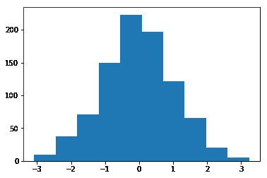
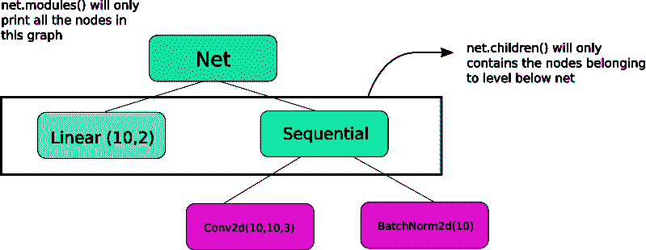

# PyTorch 101，第 3 部分:深入 PyTorch

> 原文：<https://blog.paperspace.com/pytorch-101-advanced/>

读者们好，这是我们正在做的 PyTorch 系列的又一篇文章。这篇文章的目标读者是 PyTorch 用户，他们熟悉 PyTorch 的基础知识，并且希望进入中级水平。虽然我们已经在之前的帖子中介绍了如何实现基本的分类器，但在这篇帖子中，我们将讨论如何使用 PyTorch 实现更复杂的深度学习功能。这篇文章的一些目的是让你明白。

1.  PyTorch 类像`nn.Module`、`nn.Functional`、`nn.Parameter`有什么区别，什么时候用哪个
2.  如何定制您的培训选项，例如不同层次的不同学习率，不同的学习率计划
3.  自定义重量初始化

在我们开始之前，让我提醒您这是我们 PyTorch 系列的第 3 部分。

1.  [理解图形，自动微分和亲笔签名](https://blog.paperspace.com/pytorch-101-understanding-graphs-and-automatic-differentiation/)
2.  [建立你的第一个神经网络](https://blog.paperspace.com/pytorch-101-building-neural-networks/)
3.  [深入 PyTorch](https://blog.paperspace.com/pytorch-101-advanced/blog.paperspace.com/pytorch-101-advanced/)
4.  [内存管理和使用多个 GPU](https://blog.paperspace.com/pytorch-101-advanced/blog.paperspace.com/pytorch-memory-multi-gpu-debugging/)
5.  [理解挂钩](https://blog.paperspace.com/pytorch-101-advanced/blog.paperspace.com/pytorch-hooks-gradient-clipping-debugging/)

你可以在 Github repo [这里](https://github.com/Paperspace/PyTorch-101-Tutorial-Series)获得这篇文章(以及其他文章)中的所有代码。

* * *

那么，我们开始吧。

你可以在 Github repo [这里](https://github.com/Paperspace/PyTorch-101-Tutorial-Series)获得这篇文章(以及其他文章)中的所有代码。

## nn。模块 vs 神经网络。功能的

这是经常发生的事情，尤其是当你阅读开源代码的时候。在 PyTorch 中，层通常被实现为`torch.nn.Module`对象或`torch.nn.Functional`函数。用哪个？哪个更好？

正如我们在第 2 部分中所介绍的，`torch.nn.Module`基本上是 PyTorch 的基石。它的工作方式是首先定义一个`nn.Module`对象，然后调用它的`forward`方法来运行它。这是一种面向对象的做事方式。

另一方面，`nn.functional`以函数的形式提供了一些层/激活，这些函数可以在输入端直接调用，而不是定义一个对象。例如，为了重新缩放图像张量，您在图像张量上调用`torch.nn.functional.interpolate`。

那么我们如何选择什么时候用什么呢？当我们实现的层/激活/损耗有损耗时。

### 理解有状态性

正常情况下，任何一层都可以看成一个函数。例如，卷积运算只是一堆乘法和加法运算。所以，我们把它作为一个函数来实现是有意义的，对吗？但是等等，这个层包含了我们训练时需要存储和更新的权重。因此，从编程的角度来看，层不仅仅是功能。它还需要保存数据，这些数据会随着我们对网络的训练而变化。

我现在想让你强调这样一个事实，卷积层保存的数据**会改变**。这意味着该层有一个随着我们训练而变化的*状态*。为了实现执行卷积运算的函数，我们还需要定义一个数据结构来独立于函数本身保存层的权重。然后，将这个外部数据结构作为函数的输入。

或者为了避免麻烦，我们可以定义一个类来保存数据结构，并将卷积运算作为成员函数。这将真正简化我们的工作，因为我们不必担心函数外部存在有状态变量。在这些情况下，我们更喜欢使用`nn.Module`对象，这里我们有权重或其他可能定义层行为的状态。例如，在训练和推断过程中，辍学/批量范数层的行为会有所不同。

另一方面，在不需要状态或权重的情况下，可以使用`nn.functional`。例如，调整大小(`nn.functional.interpolate`)、平均池(`nn.functional.AvgPool2d`)。

尽管有上面的推理，大多数的`nn.Module`类都有它们的`nn.functional`对应物。然而，在实际工作中要尊重上述推理。

## nn。参数

PyTorch 中的一个重要类是`nn.Parameter`类，令我惊讶的是，它在 PyTorch 的介绍性文本中几乎没有涉及到。考虑下面的情况。

```py
class net(nn.Module):
  def __init__(self):
    super().__init__()
    self.conv = nn.Linear(10,5)

  def forward(self, x):
    return self.linear(x)

myNet = net()

#prints the weights and bias of Linear Layer
print(list(myNet.parameters())) 
```

每个`nn.Module`都有一个`parameters()`函数，它返回可训练的参数。我们必须隐式定义这些参数是什么。在`nn.Conv2d`的定义中，PyTorch 的作者将权重和偏差定义为层的*参数*。然而，请注意，当我们定义`net`时，我们不需要将`nn.Conv2d`的`parameters`添加到`net`的`parameters`。这是通过将`nn.Conv2d`对象设置为`net`对象的成员而隐式发生的。

这是由`nn.Parameter`类在内部实现的，它是`Tensor`类的子类。当我们调用一个`nn.Module`对象的`parameters()`函数时，它返回所有属于`nn.Parameter`对象的成员。

事实上，`nn.Module`类的所有训练权重都被实现为`nn.Parameter`对象。每当一个`nn.Module`(在我们的例子中为`nn.Conv2d`)被指派为另一个`nn.Module`的成员时，被指派对象的“参数”(即`nn.Conv2d`的权重)也被添加到被指派对象的“参数”(`net`对象的参数)中。这被称为注册`nn.Module`的“参数”

如果你试图给`nn.Module`对象分配一个张量，它不会出现在`parameters()`中，除非你将其定义为`nn.Parameter`对象。这样做是为了方便可能需要缓存一个不可微张量的场景，例如在 RNNs 的情况下缓存以前的输出。

```py
class net1(nn.Module):
  def __init__(self):
    super().__init__()
    self.conv = nn.Linear(10,5)
    self.tens = torch.ones(3,4)                       # This won't show up in a parameter list 

  def forward(self, x):
    return self.linear(x)

myNet = net1()
print(list(myNet.parameters()))

##########################################################

class net2(nn.Module):
  def __init__(self):
    super().__init__()
    self.conv = nn.Linear(10,5) 
    self.tens = nn.Parameter(torch.ones(3,4))                       # This will show up in a parameter list 

  def forward(self, x):
    return self.linear(x)

myNet = net2()
print(list(myNet.parameters()))

##########################################################

class net3(nn.Module):
  def __init__(self):
    super().__init__()
    self.conv = nn.Linear(10,5) 
    self.net  = net2()                      # Parameters of net2 will show up in list of parameters of net3

  def forward(self, x):
    return self.linear(x)

myNet = net3()
print(list(myNet.parameters())) 
```

### nn。ModuleList 和 nn。参数列表()

我记得当我在 PyTorch 中实现 YOLO v3 时，我不得不使用一个`nn.ModuleList`。我必须通过解析包含架构的文本文件来创建网络。我将所有对应的`nn.Module`对象存储在一个 Python 列表中，然后将该列表作为我的代表网络的`nn.Module`对象的成员。

简单来说，大概是这样。

```py
layer_list = [nn.Conv2d(5,5,3), nn.BatchNorm2d(5), nn.Linear(5,2)]

class myNet(nn.Module):
  def __init__(self):
    super().__init__()
    self.layers = layer_list

  def forward(x):
    for layer in self.layers:
      x = layer(x)

net = myNet()

print(list(net.parameters()))  # Parameters of modules in the layer_list don't show up.
```

正如你所看到的，不像我们注册单个模块，分配一个 Python 列表并不注册列表中模块的参数。为了解决这个问题，我们用`nn.ModuleList`类包装我们的列表，然后将它指定为 network 类的成员。

```py
layer_list = [nn.Conv2d(5,5,3), nn.BatchNorm2d(5), nn.Linear(5,2)]

class myNet(nn.Module):
  def __init__(self):
    super().__init__()
    self.layers = nn.ModuleList(layer_list)

  def forward(x):
    for layer in self.layers:
      x = layer(x)

net = myNet()

print(list(net.parameters()))  # Parameters of modules in layer_list show up.
```

类似地，可以通过将列表包装在一个`nn.ParameterList`类中来注册一个张量列表。

## 重量初始化

重量初始化会影响您的训练结果。此外，对于不同种类的层，你可能需要不同的权重初始化方案。这可以通过`modules`和`apply`功能来完成。`modules`是`nn.Module`类的成员函数，它返回一个迭代器，包含一个`nn.Module`函数的所有成员`nn.Module`成员对象。然后使用`apply`函数可以在每个 nn 上调用。用于设置其初始化的模块。

```py
import matplotlib.pyplot as plt
%matplotlib inline

class myNet(nn.Module):

  def __init__(self):
    super().__init__()
    self.conv = nn.Conv2d(10,10,3)
    self.bn = nn.BatchNorm2d(10)

  def weights_init(self):
    for module in self.modules():
      if isinstance(module, nn.Conv2d):
        nn.init.normal_(module.weight, mean = 0, std = 1)
        nn.init.constant_(module.bias, 0)

Net = myNet()
Net.weights_init()

for module in Net.modules():
  if isinstance(module, nn.Conv2d):
    weights = module.weight
    weights = weights.reshape(-1).detach().cpu().numpy()
    print(module.bias)                                       # Bias to zero
    plt.hist(weights)
    plt.show() 
```



Histogram of weights initialised with Mean = 1 and Std = 1

在`torch..nn.init`模块中有大量的原位初始化功能。

### 模块()和子模块()

与`modules`非常相似的功能是`children`。这是一个微小但重要的区别。我们知道，`nn.Module`对象可以包含其他`nn.Module`对象作为它的数据成员。

`children()`将只返回`nn.Module`对象的列表，这些对象是调用`children`的对象的数据成员。

另一方面，`nn.Modules`递归地进入每个`nn.Module`对象，创建一个每个`nn.Module`对象的列表，直到没有`nn.module`对象。注意，`modules()`也返回它被调用的`nn.Module`作为列表的一部分。

注意，上面的陈述对于从`nn.Module`类继承的所有对象/类都是正确的。

```py
class myNet(nn.Module):
  def __init__(self):
    super().__init__()
    self.convBN =  nn.Sequential(nn.Conv2d(10,10,3), nn.BatchNorm2d(10))
    self.linear =  nn.Linear(10,2)

  def forward(self, x):
    pass

Net = myNet()

print("Printing children\n------------------------------")
print(list(Net.children()))
print("\n\nPrinting Modules\n------------------------------")
print(list(Net.modules())) 
```

因此，当我们初始化权重时，我们可能想要使用`modules()`函数，因为我们不能进入`nn.Sequential`对象并为其成员初始化权重。



## 打印网络信息

我们可能需要打印关于网络的信息，无论是为了用户还是为了调试目的。PyTorch 使用它的`named_*`函数提供了一种非常简洁的方式来打印大量关于我们网络的信息。有 4 个这样的函数。

1.  `named_parameters`。返回一个迭代器，该迭代器给出一个元组，该元组包含参数的**名称**(如果一个卷积层被指定为`self.conv1`，那么它的参数将是`conv1.weight`和`conv1.bias`)以及由`nn.Parameter`的`__repr__`函数返回的值

2.`named_modules`。同上，但是迭代器像`modules()`函数一样返回模块。

3.`named_children`同上，但是迭代器返回模块像`children()`返回

4.`named_buffers`返回缓冲张量，如批次范数层的移动平均。

```py
for x in Net.named_modules():
  print(x[0], x[1], "\n-------------------------------")
```

## 不同层次的学习率不同

在本节中，我们将学习如何对不同的层使用不同的学习率。总的来说，我们将讨论如何为不同的参数组设置不同的超参数，无论是不同层的不同学习率，还是偏差和权重的不同学习率。

实现这种东西的想法相当简单。在我们之前的文章中，我们实现了一个 CIFAR 分类器，我们将网络的所有参数作为一个整体传递给优化器对象。

```py
class myNet(nn.Module):
  def __init__(self):
    super().__init__()
    self.fc1 = nn.Linear(10,5)
    self.fc2 = nn.Linear(5,2)

  def forward(self, x):
    return self.fc2(self.fc1(x))

Net = myNet()
optimiser = torch.optim.SGD(Net.parameters(), lr = 0.5)
```

然而，`torch.optim`类允许我们以字典的形式提供具有不同学习速率的不同参数集。

```py
optimiser = torch.optim.SGD([{"params": Net.fc1.parameters(), 'lr' : 0.001, "momentum" : 0.99},
                             {"params": Net.fc2.parameters()}], lr = 0.01, momentum = 0.9)
```

在上面的场景中，“fc1”的参数使用 0.01 的学习率和 0.99 的动量。如果没有为一组参数指定超参数(如“fc2 ”),它们将使用该超参数的默认值，作为优化器函数的输入参数。您可以使用上面提到的`named_parameters()`函数，基于不同的层创建参数列表，或者无论参数是权重还是偏差。

## 学习率调度

安排你的学习率是你想要调整的一个主要的超参数。PyTorch 通过其`torch.optim.lr_scheduler`模块提供了对学习率计划的支持，该模块有多种学习率计划。下面的例子演示了这样一个例子。

```py
scheduler = torch.optim.lr_scheduler.MultiStepLR(optimiser, milestones = [10,20], gamma = 0.1)
```

每当我们到达包含在`milestones`列表中的时期时，上面的调度程序将学习速率乘以`gamma`。在我们的例子中，学习率在第 10 个和第 20 个时期乘以 0.1。您还必须在代码的循环中编写一行`scheduler.step`,遍历各个时期，以便更新学习率。

通常，训练循环由两个嵌套循环组成，其中一个循环遍历历元，而嵌套循环遍历该历元中的批次。确保在纪元循环开始时调用`scheduler.step`,以便更新你的学习率。注意不要写在批处理循环中，否则你的学习率可能会在第 10 个批处理而不是第 10 个历元更新。

还要记住,`scheduler.step`不能代替`optim.step`,而且每次你后退的时候都必须调用`optim.step`。(这将在“批处理”循环中)。

## 保存您的模型

您可能想要保存您的模型，以便以后用于推理，或者可能只是想要创建训练检查点。在 PyTorch 中保存模型时，有两种选择。

首先是使用`torch.save`。这相当于使用 Pickle 序列化整个`nn.Module`对象。这会将整个模型保存到磁盘上。你可以用`torch.load`将这个模型载入内存。

```py
torch.save(Net, "net.pth")

Net = torch.load("net.pth")

print(Net)
```

以上将保存整个模型的权重和架构。如果您只需要保存权重，而不是保存整个模型，您可以只保存模型的`state_dict`。`state_dict`基本上是一个字典，它将网络的`nn.Parameter`对象映射到它们的值。

如上所述，可以将一个现有的`state_dict`加载到一个`nn.Module`对象中。请注意，这并不涉及保存整个模型，而只是保存参数。在你加载状态字典之前，你必须创建一个分层的网络。如果网络架构与我们保存的`state_dict`不完全相同，PyTorch 将抛出一个错误。

```py
for key in Net.state_dict():
  print(key, Net.state_dict()[key])

torch.save(Net.state_dict(), "net_state_dict.pth")

Net.load_state_dict(torch.load("net_state_dict.pth"))
```

来自`torch.optim`的优化器对象也有一个`state_dict`对象，用于存储优化算法的超参数。它可以像我们在上面做的那样，通过在一个优化器对象上调用`load_state_dict`来保存和加载。

## 结论

这就完成了我们对 PyTorch 的一些更高级特性的讨论。我希望你在这篇文章中读到的东西将帮助你实现你可能已经想到的复杂的深度学习想法。如果你感兴趣的话，这里有进一步研究的链接。

1.  [py torch 中的学习率计划选项列表](https://pytorch.org/docs/stable/optim.html#how-to-adjust-learning-rate)
2.  [保存和加载模型 PyTorch 官方教程](https://pytorch.org/tutorials/beginner/saving_loading_models.html)
3.  [torch . nn 到底是什么？](https://pytorch.org/tutorials/beginner/nn_tutorial.html)