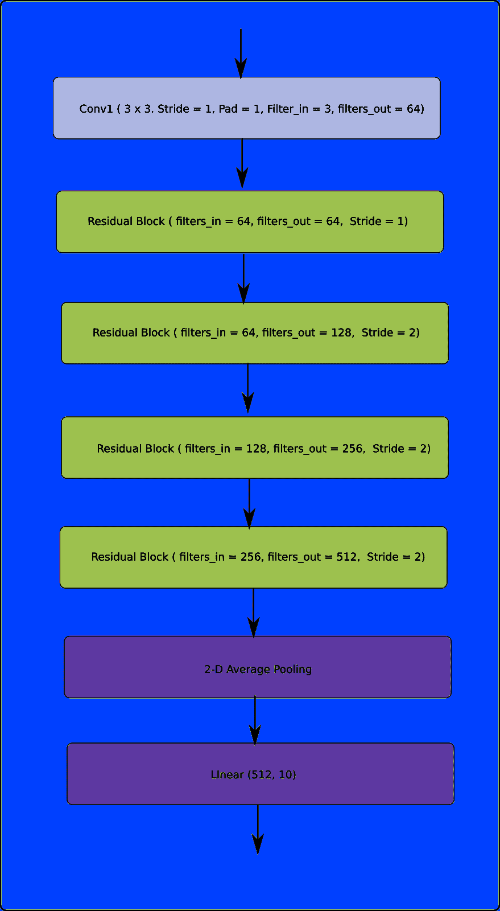
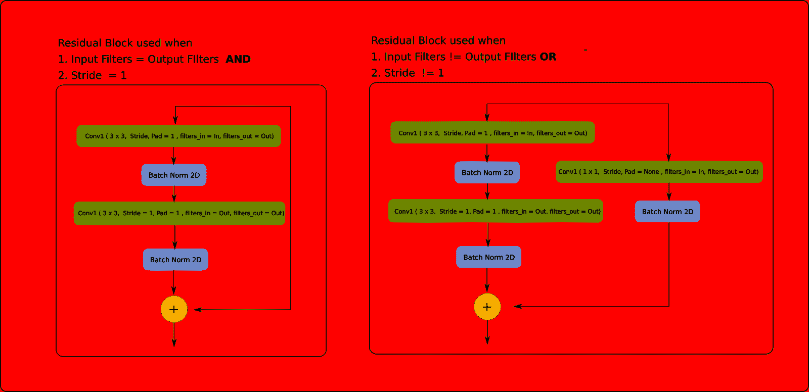

# PyTorch 101，第 2 部分:构建您的第一个神经网络

> 原文：<https://blog.paperspace.com/pytorch-101-building-neural-networks/>

在本文中，我们将讨论如何使用 PyTorch 构建定制的神经网络架构，以及如何配置您的训练循环。我们将实现一个 ResNet 来对来自 CIFAR-10 数据集的图像进行分类。

在我们开始之前，让我说一下，本教程的目的不是为了在任务中达到尽可能好的精确度，而是向您展示如何使用 PyTorch。

让我提醒您，这是 PyTorch 系列教程的第 2 部分。强烈建议阅读第一部分，尽管这不是本文所必需的。

1.  [理解图形，自动微分和亲笔签名](https://blog.paperspace.com/pytorch-101-understanding-graphs-and-automatic-differentiation/)
2.  [建立你的第一个神经网络](https://blog.paperspace.com/pytorch-101-building-neural-networks/)
3.  [深入 PyTorch](blog.paperspace.com/pytorch-101-advanced/)
4.  [内存管理和使用多个 GPU](blog.paperspace.com/pytorch-memory-multi-gpu-debugging/)
5.  [理解挂钩](blog.paperspace.com/pytorch-hooks-gradient-clipping-debugging/)

你可以在 Github repo [这里](https://github.com/Paperspace/PyTorch-101-Tutorial-Series)获得这篇文章(以及其他文章)中的所有代码。

* * *

在本帖中，我们将介绍

1.  如何使用`nn.Module`类构建神经网络
2.  如何使用`Dataset`和`Dataloader`类构建带有数据扩充的定制数据输入管道。
3.  如何使用不同的学习率计划来配置您的学习率
4.  训练 Resnet bases 图像分类器对来自 CIFAR-10 数据集的图像进行分类。

## 先决条件

1.  链式法则
2.  对深度学习的基本理解
3.  PyTorch 1.0
4.  本教程的第 1 部分

你可以在 Github repo [这里](https://github.com/Paperspace/PyTorch-101-Tutorial-Series)获得这篇文章(以及其他文章)中的所有代码。

## 一个简单的神经网络

在本教程中，我们将实现一个非常简单的神经网络。



Diagram of the Network

## 构建网络

`torch.nn`模块是 PyTorch 中设计神经网络的基石。这个类可用于实现一个层，如全连接层、卷积层、池层、激活函数，还可以通过实例化一个`torch.nn.Module`对象来实现整个神经网络。(从现在开始，我将简称它为`nn.module`)

多个`nn.Module`对象可以串在一起形成一个更大的`nn.Module`对象，这就是我们如何使用许多层来实现一个神经网络。事实上，`nn.Module`可以用来表示 PyTorch 中的任意函数 *f* 。

`nn.Module`类有两个您必须覆盖的方法。

1.  `__init__`功能。当您创建一个`nn.Module`的实例时，这个函数被调用。在这里，您将定义层的各种参数，如过滤器、卷积层的内核大小、丢失层的丢失概率。
2.  `forward`功能。这是您定义如何计算输出的地方。这个函数不需要显式调用，只需调用`nn.Module`实例就可以运行，就像一个以输入作为参数的函数一样。

```py
# Very simple layer that just multiplies the input by a number
class MyLayer(nn.Module):
  def __init__(self, param):
    super().__init__()
    self.param = param 

  def forward(self, x):
    return x * self.param

myLayerObject = MyLayer(5)
output = myLayerObject(torch.Tensor([5, 4, 3]) )    #calling forward inexplicitly 
print(output)
```

另一个广泛使用且重要的类是`nn.Sequential`类。当初始化这个类时，我们可以以特定的顺序传递一个`nn.Module`对象的列表。`nn.Sequential`返回的对象本身就是一个`nn.Module`对象。当这个对象是带输入的 *run* 时，它会按照我们传递给它的顺序，依次通过所有的`nn.Module`对象运行输入。

```py
combinedNetwork = nn.Sequential(MyLayer(5), MyLayer(10))

output = combinedNetwork([3,4])

#equivalent to..
# out = MyLayer(5)([3,4])
# out = MyLayer(10)(out)
```

* * *

让我们现在开始实施我们的分类网络。我们将利用卷积层和池层，以及自定义实现的残差块。



Diagram of the Residual Block

虽然 PyTorch 用它的`torch.nn`模块提供了许多现成的层，但我们必须自己实现剩余的块。在实现神经网络之前，我们先实现 ResNet 块。

```py
class ResidualBlock(nn.Module):
    def __init__(self, in_channels, out_channels, stride=1):
        super(ResidualBlock, self).__init__()

        # Conv Layer 1
        self.conv1 = nn.Conv2d(
            in_channels=in_channels, out_channels=out_channels,
            kernel_size=(3, 3), stride=stride, padding=1, bias=False
        )
        self.bn1 = nn.BatchNorm2d(out_channels)

        # Conv Layer 2
        self.conv2 = nn.Conv2d(
            in_channels=out_channels, out_channels=out_channels,
            kernel_size=(3, 3), stride=1, padding=1, bias=False
        )
        self.bn2 = nn.BatchNorm2d(out_channels)

        # Shortcut connection to downsample residual
        # In case the output dimensions of the residual block is not the same 
        # as it's input, have a convolutional layer downsample the layer 
        # being bought forward by approporate striding and filters
        self.shortcut = nn.Sequential()
        if stride != 1 or in_channels != out_channels:
            self.shortcut = nn.Sequential(
                nn.Conv2d(
                    in_channels=in_channels, out_channels=out_channels,
                    kernel_size=(1, 1), stride=stride, bias=False
                ),
                nn.BatchNorm2d(out_channels)
            )

    def forward(self, x):
        out = nn.ReLU()(self.bn1(self.conv1(x)))
        out = self.bn2(self.conv2(out))
        out += self.shortcut(x)
        out = nn.ReLU()(out)
        return out
```

如您所见，我们在`__init__`函数中定义了网络的层或组件。在`forward`函数中，我们如何将这些组件串在一起，从我们的输入计算输出。

现在，我们可以定义我们的完整网络。

```py
class ResNet(nn.Module):
    def __init__(self, num_classes=10):
        super(ResNet, self).__init__()

        # Initial input conv
        self.conv1 = nn.Conv2d(
            in_channels=3, out_channels=64, kernel_size=(3, 3),
            stride=1, padding=1, bias=False
        )

        self.bn1 = nn.BatchNorm2d(64)

        # Create blocks
        self.block1 = self._create_block(64, 64, stride=1)
        self.block2 = self._create_block(64, 128, stride=2)
        self.block3 = self._create_block(128, 256, stride=2)
        self.block4 = self._create_block(256, 512, stride=2)
        self.linear = nn.Linear(512, num_classes)

    # A block is just two residual blocks for ResNet18
    def _create_block(self, in_channels, out_channels, stride):
        return nn.Sequential(
            ResidualBlock(in_channels, out_channels, stride),
            ResidualBlock(out_channels, out_channels, 1)
        )

    def forward(self, x):
	# Output of one layer becomes input to the next
        out = nn.ReLU()(self.bn1(self.conv1(x)))
        out = self.stage1(out)
        out = self.stage2(out)
        out = self.stage3(out)
        out = self.stage4(out)
        out = nn.AvgPool2d(4)(out)
        out = out.view(out.size(0), -1)
        out = self.linear(out)
        return out
```

## 输入格式

现在我们有了网络对象，我们把焦点转向输入。在处理深度学习时，我们会遇到不同类型的输入。图像、音频或高维结构数据。

我们正在处理的数据类型将决定我们使用什么样的输入。一般来说，在 PyTorch 中，你会发现批处理始终是第一维。由于我们在这里处理的是图像，所以我将描述图像所需的输入格式。

图像的输入格式为`[B C H W]`。其中`B`是批量，`C`是通道，`H`是高度，`W`是宽度。

我们的神经网络的输出现在是乱码，因为我们使用了随机权重。让我们现在训练我们的网络。

## 加载数据

现在让我们加载数据。为此，我们将使用`torch.utils.data.Dataset`和`torch.utils.data.Dataloader`类。

我们首先将 CIFAR-10 数据集下载到与代码文件相同的目录中。

启动终端，`cd`到您的代码目录并运行以下命令。

```py
wget http://pjreddie.com/media/files/cifar.tgz
tar xzf cifar.tgz
```

如果你在 macOS 上，你可能需要使用`curl`或者如果你在 windows 上，你可能需要手动下载它。

我们现在读取 CIFAR 数据集中存在的类的标签。

```py
data_dir = "cifar/train/"

with open("cifar/labels.txt") as label_file:
    labels = label_file.read().split()
    label_mapping = dict(zip(labels, list(range(len(labels))))) 
```

我们将使用`PIL`库读取图像。在编写加载数据的功能之前，我们先编写一个预处理函数，它完成以下工作。

1.  随机水平移动图像，概率为 0.5
2.  使用 CIFAR 数据集的平均值和标准偏差归一化图像
3.  将其从`W  H  C`重塑为`C  H  W`。

```py
def preprocess(image):
    image = np.array(image)

    if random.random() > 0.5:
        image = image[::-1,:,:]

    cifar_mean = np.array([0.4914, 0.4822, 0.4465]).reshape(1,1,-1)
    cifar_std  = np.array([0.2023, 0.1994, 0.2010]).reshape(1,1,-1)
    image = (image - cifar_mean) / cifar_std

    image = image.transpose(2,1,0)
    return image 
```

通常，PyTorch 提供了两个与构建输入管道以加载数据相关的类。

1.  `torch.data.utils.dataset`，我们现在称之为`dataset`类。
2.  `torch.data.utils.dataloader`，我们现在称之为`dataloader`类。

### torch.utils.data.dataset

`dataset`是一个加载数据并返回生成器的类，这样你就可以迭代它。它还允许您将数据扩充技术整合到输入管道中。

如果你想为你的数据创建一个`dataset`对象，你需要重载三个函数。

1.  `__init__`功能。在这里，您可以定义与数据集相关的内容。最重要的是，你的数据的位置。您还可以定义想要应用的各种数据扩充。
2.  `__len__`功能。这里，您只需返回数据集的长度。
3.  `__getitem__`功能。该函数将索引`i`作为参数，并返回一个数据示例。在我们的训练循环中，这个函数会在每次迭代时被`dataset`对象用不同的`i`调用。

这是 CIFAR 数据集的`dataset`对象的一个实现。

```py
class Cifar10Dataset(torch.utils.data.Dataset):
    def __init__(self, data_dir, data_size = 0, transforms = None):
        files = os.listdir(data_dir)
        files = [os.path.join(data_dir,x) for x in files]

        if data_size < 0 or data_size > len(files):
            assert("Data size should be between 0 to number of files in the dataset")

        if data_size == 0:
            data_size = len(files)

        self.data_size = data_size
        self.files = random.sample(files, self.data_size)
        self.transforms = transforms

    def __len__(self):
        return self.data_size

    def __getitem__(self, idx):
        image_address = self.files[idx]
        image = Image.open(image_address)
        image = preprocess(image)
        label_name = image_address[:-4].split("_")[-1]
        label = label_mapping[label_name]

        image = image.astype(np.float32)

        if self.transforms:
            image = self.transforms(image)

        return image, label 
```

我们还使用了`__getitem__`函数来提取编码在文件名中的图像标签。

类允许我们结合惰性数据加载原则。这意味着不是一次将所有数据加载到内存中(这可以通过在`__init__`函数中加载内存中的所有图像来完成，而不仅仅是地址)，而是只在需要的时候加载一个数据示例(当`__getitem__`被调用时)。

当您创建一个`Dataset`类的对象时，您基本上可以像遍历任何 python iterable 一样遍历该对象。每次迭代，`__getitem__`用递增的索引`i`作为它的输入参数。

### 数据扩充

我还在`__init__`函数中传递了一个`transforms`参数。这可以是任何进行数据扩充的 python 函数。虽然可以在预处理代码中进行数据扩充，但是在`__getitem__`中进行只是个人喜好的问题。

在这里，我们还可以添加数据增强。这些数据扩充可以作为函数或类来实现。你只需要确保你能够在`__getitem__`功能中将它们应用到你想要的结果中。

我们有大量的数据扩充库可以用来扩充数据。

对于我们的例子，`torchvision` library 提供了许多预构建的转换，以及将它们组合成一个更大的转换的能力。但是我们将把我们的讨论限制在 PyTorch。

### torch.utils.data.Dataloader

`Dataloader`类促进了

1.  数据批处理
2.  数据混洗
3.  使用线程一次加载多个数据
4.  预取，即在 GPU 处理当前批次的同时，`Dataloader`可以同时将下一批次加载到内存中。这意味着 GPU 不必等待下一批，它加快了训练速度。

用一个`Dataset`对象实例化一个`Dataloader`对象。然后你可以迭代一个`Dataloader`对象实例，就像你迭代一个`dataset`实例一样。

但是，您可以指定各种选项，以便更好地控制循环选项。

```py
trainset = Cifar10Dataset(data_dir = "cifar/train/", transforms=None)
trainloader = torch.utils.data.DataLoader(trainset, batch_size=128, shuffle=True, num_workers=2)

testset = Cifar10Dataset(data_dir = "cifar/test/", transforms=None)
testloader = torch.utils.data.DataLoader(testset, batch_size=128, shuffle=True, num_workers=2)
```

`trainset`和`trainloader`对象都是 python 生成器对象，可以通过以下方式迭代。

```py
for data in trainloader:   # or trainset
	img, label = data
```

但是，`Dataloader`类比`Dataset`类方便多了。在每次迭代中，`Dataset`类只会返回给我们`__getitem__`函数的输出，`Dataloader`做的远不止这些。

1.  请注意，`trainset`的方法`__getitem__`返回了一个形状为`3 x 32 x 32`的 numpy 数组。`Dataloader`将图像批量化为形状张量 `128 x 3 x 32 x 32`。(因为`batch_size` = 128 在我们的代码中)。
2.  还要注意，当我们的`__getitem__`方法输出一个 numpy 数组时，`Dataloader`类自动将其转换成一个`Tensor`
3.  即使`__getitem__`方法返回一个非数字类型的对象，`Dataloader`类也会将它转换成一个大小为`B`的列表/元组(在我们的例子中是 128)。假设`__getitem__`也返回一个字符串，即标签字符串。如果我们在实例化 dataloader 时设置 batch = 128，那么每次迭代，`Dataloader`都会给我们一个 128 个字符串的元组。

加上预取，多线程加载到上面的好处，几乎每次都首选使用`Dataloader`类。

## 培训和评估

在开始编写训练循环之前，我们需要确定超参数和优化算法。PyTorch 通过其`torch.optim`为我们提供了许多预置的优化算法。

### 火炬. optim

`torch.optim`模块为您提供多种与培训/优化相关的功能，例如。

1.  不同的优化算法(如`optim.SGD`、`optim.Adam`)
2.  能够安排学习速度(使用`optim.lr_scheduler`)
3.  对于不同的参数有不同的学习率的能力(我们不会在这篇文章中讨论)。

我们使用交叉熵损失和基于动量的 SGD 优化算法。我们的学习率在第 150 和 200 个纪元时衰减了 0.1 倍。

```py
device = torch.device("cuda:0" if torch.cuda.is_available() else "cpu")     #Check whether a GPU is present.

clf = ResNet()
clf.to(device)   #Put the network on GPU if present

criterion = nn.CrossEntropyLoss()
optimizer = optim.SGD(clf.parameters(), lr=0.1, momentum=0.9, weight_decay=5e-4)
scheduler = torch.optim.lr_scheduler.MultiStepLR(optimizer, milestones=[150, 200], gamma=0.1)
```

在第一行代码中，如果 GPU 编号为 0(如果存在的话),那么`device`将被设置为`cuda:0`,否则将被设置为`cpu`。

默认情况下，当我们初始化一个网络时，它驻留在 CPU 上。`clf.to(device)`将网络移动到 GPU(如果有)。我们将在另一部分更详细地讨论如何使用多个 GPU。我们也可以使用`clf.cuda(0)`将我们的网络`clf`转移到 GPU `0`。(一般情况下用 GPU 的索引代替`0`

`criterion`基本上是一个`nn.CrossEntropy`类对象，顾名思义，实现了交叉熵损失。它基本上是`nn.Module`的子类。

然后我们将变量`optimizer`定义为一个`optim.SGD`对象。`optim.SGD`的第一个参数是`clf.parameters()`。一个`nn.Module`对象的`parameters()`函数返回它所谓的`parameters`(实现为`nn.Parameter`对象，我们将在下一部分学习这个类，在那里我们将探索高级 PyTorch 功能。现在，把它想象成一个相关的`Tensors`列表，它们是**可以学习的。** `clf.parameters()`基本上都是我们神经网络的权重。

正如您将在代码中看到的，我们将在代码中对`optimizer`调用`step()`函数。当调用`step()`时，优化器使用梯度更新规则等式更新`clf.parameters()`中的每个`Tensor`。使用每个`Tensor`的`grad`属性访问渐变

一般来说，对于任何优化器，不管是 SGD、Adam 还是 RMSprop，第一个参数都是它应该更新的`Tensors`列表。其余的参数定义了各种超参数。

`scheduler`顾名思义，可以调度`optimizer`的各种超参数。`optimizer`用于实例化`scheduler`。每次我们调用`scheduler.step()`时，它都会更新超参数

### 编写训练循环

我们最终训练了 200 个纪元。您可以增加纪元的数量。这在 GPU 上可能需要一段时间。同样，本教程的目的是展示 PyTorch 是如何工作的，而不是达到最佳精度。

我们评估每个时期的分类准确性。

```py
for epoch in range(10):
    losses = []
    scheduler.step()
    # Train
    start = time.time()
    for batch_idx, (inputs, targets) in enumerate(trainloader):
        inputs, targets = inputs.to(device), targets.to(device)

        optimizer.zero_grad()                 # Zero the gradients

        outputs = clf(inputs)                 # Forward pass
        loss = criterion(outputs, targets)    # Compute the Loss
        loss.backward()                       # Compute the Gradients

        optimizer.step()                      # Updated the weights
        losses.append(loss.item())
        end = time.time()

        if batch_idx % 100 == 0:
          print('Batch Index : %d Loss : %.3f Time : %.3f seconds ' % (batch_idx, np.mean(losses), end - start))

          start = time.time()
    # Evaluate
    clf.eval()
    total = 0
    correct = 0

    with torch.no_grad():
      for batch_idx, (inputs, targets) in enumerate(testloader):
          inputs, targets = inputs.to(device), targets.to(device)

          outputs = clf(inputs)
          _, predicted = torch.max(outputs.data, 1)
          total += targets.size(0)
          correct += predicted.eq(targets.data).cpu().sum()

      print('Epoch : %d Test Acc : %.3f' % (epoch, 100.*correct/total))
      print('--------------------------------------------------------------')
    clf.train() 
```

上面是一大段代码。我没有把它分成更小的部分，以免影响连续性。虽然我已经在代码中添加了注释来通知读者发生了什么，但我现在将解释代码中不那么琐碎的部分。

我们首先在 epoch 开始时调用`scheduler.step()`，以确保`optimizer`将使用正确的学习速率。

我们在循环中做的第一件事是将我们的`input`和`target`移动到 GPU 0。这应该是我们的模型所在的设备，否则 PyTorch 将会抛出错误并停止。

注意我们在向前传球之前调用了`optimizer.zero_grad()`。这是因为叶子`Tensor` s(权重是)将保留先前过程的梯度。如果在丢失时再次调用`backward`，新的渐变将简单地添加到由`grad`属性包含的早期渐变中。使用 RNNs 时，此功能很方便，但现在，我们需要将梯度设置为零，这样梯度就不会在后续过程之间累积。

我们还将评估代码放在`torch.no_grad`上下文中，这样就不会为评估创建图形。如果您觉得这令人困惑，您可以回到第 1 部分来更新您亲笔签名的概念。

还要注意，我们在评估之前调用模型上的`clf.eval()`，然后在评估之后调用`clf.train()`。PyTorch 中的模型有两种状态`eval()`和`train()`。状态之间的差异源于状态层，如批处理范数(训练中的批处理统计与推理中的总体统计)和丢弃，它们在推理和训练期间表现不同。`eval`告诉`nn.Module`将这些层置于推理模式，而训练告诉`nn.Module`将其置于训练模式。

# 结论

这是一个详尽的教程，我们向你展示了如何建立一个基本的训练分类器。虽然这只是一个开始，但是我们已经涵盖了可以让您开始使用 PyTorch 开发深层网络的所有构件。

在本系列的下一部分，我们将研究 PyTorch 中的一些高级功能，这些功能将增强您的深度学习设计。这些包括创建更复杂架构的方法，如何定制培训，例如不同参数有不同的学习率。

# 进一步阅读

1.  [PyTorch 文档](https://pytorch.org/docs/stable/index.html)
2.  [更多 PyTorch 教程](https://pytorch.org/tutorials/)
3.  [如何配合 PyTorch 使用 Tensorboard】](https://medium.com/@dexterhuang/tensorboard-for-pytorch-201a228533c5)