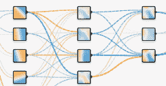
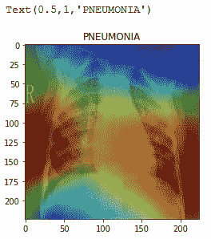
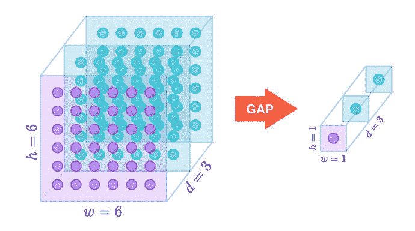
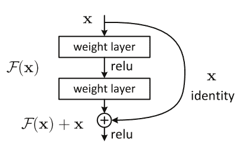
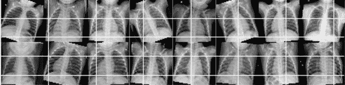
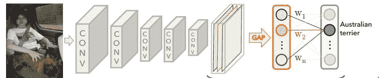
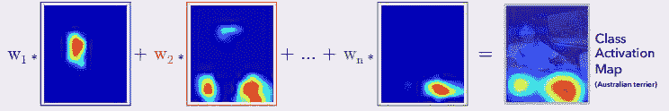
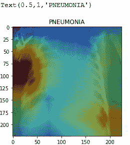
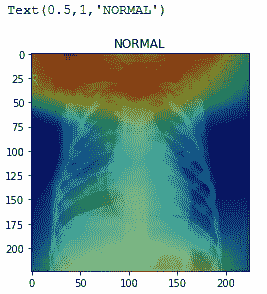
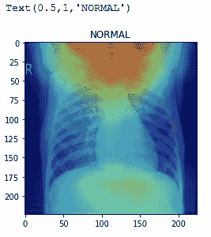

# 用 PyTorch 从胸部 X 线扫描中检测和定位肺炎

> 原文：<https://blog.paperspace.com/detecting-and-localizing-pneumonia-from-chest-x-ray-scans-with-pytorch/>

这些年来，我们已经看到了非常强大的模型被建立来区分物体。这些模型在性能和延迟方面一天天变得越来越好，但我们是否想过这些模型从用于训练它们做出几乎完美预测的图像中提取了什么？毫无疑问，我们提供给这些模型的图像中有一些特征，它们可以用来进行预测，这也是我们在本文中试图探索的。不久前，斯坦福大学的研究人员发布了一篇论文[https://arxiv.org/abs/1901.07031](https://arxiv.org/abs/1901.07031)，讲述了他们如何利用深度学习推动肺炎诊断的边缘。他们的工作真的让我着迷，所以我在 Pytorch 中进行了尝试，我将向您展示我如何使用 Kaggle 上的不同数据集来实现这项工作。

**类激活图论文链接:**http://cnnlocalization . csail . MIT . edu/Zhou _ Learning _ Deep _ Features _ 2016 _ paper . pdf

在这篇文章中，我们将建立一个机器学习管道，从胸部 x 射线图像中对患者是否患有肺炎进行分类，然后在模型用于做出这些决定的区域上绘制热图。下面是整个项目的简要概述。

### 加载并预处理我们的数据


### 将数据输入模型并进行训练

执行向前传递和向后传递来训练我们的模型



### 测试和评估我们的模型

模型评估


### 最后，我们在测试样本上绘制类激活图，以生成我们最终想要的输出

肺炎样本



### 逻辑

我们在这个项目中的目标是将胸部 x 射线图像分类为包含或不包含肺炎，并在用于识别肺炎的区分区域上绘制类激活图。我们将利用全球平均池在现有规范模型中提供的连接的简单性质，来设计一个管道来执行手头的任务。由于 ResNet 已经有了一个全局平均池，我们发现它非常适合用于这个任务。为了全面掌握手头的任务，我们需要访问模型中的一些区域。一个重要的领域是全球平均池层。

### 全球平均池层

通常在卷积神经网络架构中，所有卷积层都由一个或多个全连接层处理，但是这些全连接层通常具有许多参数，使得模型易于过拟合。作为卷积层末端的全连接层的替代，全局平均池层将全连接层的参数数量减少到零，因为它们只是将空间维度减少到由最后一个卷积层产生的特征图。它们的工作方式与平均和最大池图层完全相同，但通过采用大小为 h x w x d 的张量并生成大小为 1 x 1 x d 的张量来执行更极端的降维。它们所做的只是将每个 h x w 要素图的平均值转换为一个值。



### 资料组

对于这个项目，我们将使用 kaggle 上可用的数据集，包括 5433 个训练数据点、624 个验证数据点和 16 个测试数据点。

**链接数据集:**[https://www . ka ggle . com/paultimothymooney/chest-Xray-pneumonia](https://www.kaggle.com/paultimothymooney/chest-xray-pneumonia)

### 模型架构

我们这个项目的基准型号是 ResNet 152。像其他卷积网络架构一样，ResNet 模型由一系列卷积层组成，但其设计方式有利于非常深的网络。卷积层被排列成一系列残余块。这些剩余块的意义在于防止消失梯度的问题，该问题在非常深的卷积网络中非常普遍。残余块具有允许在非常深的网络中梯度流动的跳跃连接。



ResNet block with a skip connection that allows the input x to skip the non-linear layers(Convolutional layers)

**建立并训练我们的分类模型。**

让我们提醒自己，我们的主要目标是在用于识别胸部 x 射线图像中的肺炎的区分区域上绘制堆图，但是为了实现该目标，我们必须训练我们的模型来执行正常分类。我们将以面向对象的编程风格构建我们的模型，这是 Pytorch 中构建模型的一种传统方式。构建我们的模型要做的第一件事是导入所有需要的包。该项目所需的软件包如下:

*   Torch (torch.nn，torch.optim，torchvision，torchvision.transforms)
*   Numpy
*   Matplotlib
*   我的天啊
*   PIL

Pytorch 为我们提供了非常强大的库来加载和预处理我们的数据，而无需编写任何样板代码。我们将使用 Dataset 模块和 ImageFolder 模块从包含图像的目录中加载数据，并应用一些数据扩充来生成图像的不同变体。

```py
#Using the transforms module in the torchvision module, we define a set of functions that perform data augmentation on our dataset to obtain more data.#
transformers = {'train_transforms' : transforms.Compose([
    transforms.Resize((224,224)),
    #transforms.CenterCrop(224),
    transforms.RandomRotation(20),
    transforms.RandomHorizontalFlip(),
    transforms.ToTensor(),
    transforms.Normalize([0.485, 0.456, 0.406], std=[0.229, 0.224, 0.225])
]),
'test_transforms' : transforms.Compose([
    transforms.Resize((224,224)),
    transforms.CenterCrop(224),
    transforms.ToTensor(),
    transforms.Normalize([0.485, 0.456, 0.406], std=[0.229, 0.224, 0.225])
]),
'valid_transforms' : transforms.Compose([
    transforms.Resize((224,224)),
    transforms.CenterCrop(224),
    transforms.ToTensor(),
    transforms.Normalize([0.485, 0.456, 0.406], std=[0.229, 0.224, 0.225])
])}
trans = ['train_transforms','valid_transforms','test_transforms']
path = "/content/gdrive/My Drive/chest_xray/"
categories = ['train','val','test']
```

使用 torch vision . datasets . image folder 模块，我们从数据集目录中加载图像。

```py
dset = {x : torchvision.datasets.ImageFolder(path+x, transform=transformers[y]) for x,y in zip(categories, trans)}
dataset_sizes = {x : len(dset[x]) for x in ["train","test"]}
num_threads = 4

#By passing a dataset instance into a DataLoader module, we create dataloader which generates images in batches.
dataloaders =  {x : torch.utils.data.DataLoader(dset[x], batch_size=256, shuffle=True, num_workers=num_threads)
               for x in categories}
```

现在我们已经完成了数据集的加载，我们可以继续使用下面的代码片段来查看一些示例。

```py
def imshow(inp, title=None):
    inp = inp.numpy().transpose((1,2,0))
    mean = np.array([0.485, 0.456, 0.406])
    std = np.array([0.229, 0.224, 0.225])
    inp = std*inp + mean
    inp = np.clip(inp,0,1)
    plt.imshow(inp)
    if title is not None:
        plt.title(title)
    plt.pause(0.001)
inputs,classes = next(iter(dataloaders["train"]))
out = torchvision.utils.make_grid(inputs)
class_names = dataset["train"].classes
imshow(out, title = [class_names[x] for x in classes])
```



生成样本。*请注意，您应该减少批量，以生产更大的样品供查看。*

我们刚刚验证了我们的数据被正确加载，因此我们可以继续构建我们的模型。正如我前面提到的，我们将以面向对象的编程风格来构建我们的模型。我们的模型类将从 nn 继承。PyTorch 提供的模块。nn。就像 TensorFlow 等其他机器学习框架一样，模块为我们提供了构建神经网络所需的所有功能。你可以访问[https://py torch . org/docs/stable/_ modules/torch/nn/modules/module . html](https://pytorch.org/docs/stable/_modules/torch/nn/modules/module.html)了解更多信息。

在定义了我们的模型类并从 nn 继承之后。模块中，我们通过一种叫做迁移学习的技术，利用 ResNet-152 的特征提取器，在 init 构造函数中定义模型的图形。torchvision 模块为我们提供了在非常庞大的数据集(ImageNet)上训练过的最先进的模型，因此具有非常强大的特征提取器。Pytorch 为我们提供了获取和冻结这些强大的特征提取器的能力，根据我们的问题域附加我们自己的分类器，并训练结果模型以适应我们的问题。

```py
class Model(nn.Module):
    def __init__(self):
        super(Model, self).__init__()
        #obtain the ResNet model from torchvision.model library
        self.model = torchvision.models.resnet152(pretrained=True)
        #build our classifier and since we are classifying the images into NORMAL and PNEMONIA, we output a two-dimensional tensor.
        self.classifier = nn.Sequential(
        nn.Linear(self.model.fc.in_features,2),
        nn.LogSoftmax(dim=1))
        #Requires_grad = False denies the ResNet model the ability to update its parameters hence make it unable to train.
        for params in self.model.parameters():
            params.requires_grad = False
            #We replace the fully connected layers of the base model(ResNet model) which served as the classifier with our custom trainable classifier.
        self.model.fc = self.classifier
```

从神经网络构建的每个模型。模块要求我们覆盖 forward 函数，我们定义了每次调用时执行的前向传递计算。

```py
def forward(self, x):
    # x is our input data
    return self.model(x)
```

在您继续下面的部分之前，我建议您在 Pytorch 官方页面上学习这个 60 分钟的 blitz 教程:[https://py torch . org/tutorials/beginner/deep _ learning _ 60min _ blitz . html](https://pytorch.org/tutorials/beginner/deep_learning_60min_blitz.html)但是如果您仍然选择继续，不要担心，我会尽最大努力在代码的评论中解释代码的每一点。我们训练过程的下一部分是定义一个拟合函数(不是必须在模型类中定义的)，我们基本上是在数据集上训练我们的模型。让我们看看这样做的代码。

```py
def fit(self, dataloaders, num_epochs):
        #we check whether a gpu is enabled for our environment.
        train_on_gpu = torch.cuda.is_available()
        #we define our optimizer and pass in the model parameters(weights and biases) into the constructor of the optimizer we want. More info: https://pytorch.org/docs/stable/optim.html
        optimizer = optim.Adam(self.model.fc.parameters())
        #Essentially what scheduler does is to reduce our learning by a certain factor when less progress is being made in our training.
        scheduler = optim.lr_scheduler.StepLR(optimizer, 4)
        #criterion is the loss function of our model. we use Negative Log-Likelihood loss because we used  log-softmax as the last layer of our model. We can remove the log-softmax layer and replace the nn.NLLLoss() with nn.CrossEntropyLoss()
        criterion = nn.NLLLoss()
        since = time.time()
        #model.state_dict() is a dictionary of our model's parameters. What we did here is to deepcopy it and assign it to a variable
        best_model_wts = copy.deepcopy(self.model.state_dict())
        best_acc = 0.0
      #we check if a gpu is enabled for our environment and move our model to the gpu
        if train_on_gpu:
            self.model = self.model.cuda()
        for epoch in range(num_epochs):
            print('Epoch {}/{}'.format(epoch, num_epochs - 1))
            print('-' * 10)
            # Each epoch has a training and validation phase. We iterate through the training set and validation set in every epoch.
            for phase in ['train', 'test']:
                #we apply the scheduler to the learning rate in the training phase since we don't train our model in the validation phase
                if phase == 'train':
                    scheduler.step()
                    self.model.train()  # Set model to training mode
                else:
                    self.model.eval()   # Set model to evaluate mode to turn off features like dropout.
                running_loss = 0.0
                running_corrects = 0
                # Iterate over batches of train and validation data.
                for inputs, labels in dataloaders[phase]:
                    if train_on_gpu:
                        inputs = inputs.cuda()
                        labels = labels.cuda()
                    # clear all gradients since gradients get accumulated after every iteration.
                    optimizer.zero_grad()

                    # track history if only in training phase
                    with torch.set_grad_enabled(phase == 'train'):
                        outputs = self.model(inputs)
                        _, preds = torch.max(outputs, 1)
                        #calculates the loss between the output of our model and ground-truth labels
                        loss = criterion(outputs, labels)

                        # perform backpropagation and optimization only if in training phase
                        if phase == 'train':
                            #backpropagate gradients from the loss node through all the parameters
                            loss.backward()
                            #Update parameters(Weighs and biases) of our model using the gradients.
                            optimizer.step()
                    # statistics
                    running_loss += loss.item() * inputs.size(0)
                    running_corrects += torch.sum(preds == labels.data)

                epoch_loss = running_loss / dataset_sizes[phase]
                epoch_acc = running_corrects.double() / dataset_sizes[phase]
                print('{} Loss: {:.4f} Acc: {:.4f}'.format(
                    phase, epoch_loss, epoch_acc))

                # deep copy the model if we obtain a better validation accuracy than the previous one.
                if phase == 'test' and epoch_acc > best_acc:
                    best_acc = epoch_acc
                    best_model_wts = copy.deepcopy(self.model.state_dict())
        time_elapsed = time.time() - since
        print('Training complete in {:.0f}m {:.0f}s'.format(
            time_elapsed // 60, time_elapsed % 60))
        print('Best val Acc: {:4f}'.format(best_acc))

        # load best model parameters and return it as the final trained model.
        self.model.load_state_dict(best_model_wts)
        return self.model
#we instantiate our model class
model = Model()
#run 10 training epochs on our model
model_ft = model.fit(dataloaders, 10)
```

在对模型进行一些时期的训练后，我们应该会达到验证准确性的较高值。现在我们有了一个训练好的模型，这意味着我们正在朝着我们的目标前进——在我们的模型用来识别肺炎痕迹的区分区域上绘制类激活图。

### 主要目标-绘制类激活图

我们之前了解到，全局平均池层将张量的高-宽维度从 h x w x d 减少到 1 x 1 x d。然后，对这个 1 x 1 x d 维度的向量/张量应用加权和，然后输入到 softmax 层，以生成类的概率-最高概率是模型预测的类。如果然后我们可以对一维向量(全局平均池层的输出)执行加权求和，以产生正确表示输入图像的另一个向量(输出概率)，那么也许我们可以对 h×w×d 张量执行加权求和，最有可能是最后一个卷积层或最大池层的输出，以产生也正确表示输入图像的 h1×w1×D1 张量。输出张量 h1 x w1 x d1 包含比全局平均池层的输出的加权和更多的输入图像的空间信息。用于对全局平均池层的输出进行加权求和的权重是对应于预测类的权重。



Weighted sum of output of the Global Average Pooling layer produces our model’s predictions.

从上图我们可以看到，W1，W2 … Wn 是预测类(澳洲梗)对应的体重。为了生成预测得分的类激活图，我们可以通过权重 W1、W2 … Wn 将预测得分映射回最后一个卷积层。我们使用 W1、W2 … Wn 对最后一个卷积层的激活执行加权求和，以生成类激活图。



weighted sum on activations of last convolutional layer Generates final class activation map.

既然我们对如何生成类激活图有了一些直觉，让我们直接进入代码。

前面我们说过，为了生成类激活图，我们需要对最后一个卷积层的激活执行加权求和，但是在每次前向传递中，我们只得到最后一个全连接层的激活。为了激活最后一个卷积层，我们使用 PyTorch register_forward_hook 模块。下面的代码片段说明了如何做到这一点。

```py
class LayerActivations():
    features=[]
    def __init__(self,model):
        self.hooks = []
        #model.layer4 is the last layer of our network before the Global Average Pooling layer(last convolutional layer).
        self.hooks.append(model.layer4.register_forward_hook(self.hook_fn))
    def hook_fn(self,module,input,output):
        self.features.append(output)
    def remove(self):
        for hook in self.hooks:
            hook.remove()
```

每当我们在实例化 LayerActivations 类后调用向前传递时，model.layer4 的输出都会被附加到 features 列表中。然后，我们可以通过调用 layer activations(model _ ft)features 来获得输出激活。

```py
model_ft = model.model
acts = LayerActivations(model_ft) 
```

接下来，我们加载一个测试图像，并通过我们的模型向前传递。

```py
loader = transforms.Compose([transforms.Resize((224,224)), transforms.ToTensor()])
def image_loader(image_name):
    image = PIL.Image.open(image_name).convert("RGB")
    image = loader(image).float()
    image = image.unsqueeze(0) 
    return image
image_path = '/content/gdrive/My Drive/chest_xray/test/PNEUMONIA/person100_bacteria_475.jpeg'
#load image and perform a forward pass through our model.
img = image_loader(image_path)
logps =  model_ft(img.cuda() if torch.cuda.is_available() else img)
out_features = acts.features[0].squeeze(0) #since we have performed a forward pass through our model, we can obtain activations from layer(model.layer4) defined in the LayerActivation class from the features list and take out the batch dimension.

out_features = np.transpose(out_features.cpu(),(1,2,0)) # Changes shape from 2048 x 7 x7 to 7 x 7 x 2048\. Just performs a matrix transpose on the output features tensor.
```

打印 model.layer4(全局平均池层之前的最后一层)的输出激活大小，我们得到 7 x 7 x 2048 作为输出。我们之前说过，为了获得特定类的类激活图，我们需要获得与该类相关联的权重，并使用该权重对最后一个卷积层的激活执行加权求和。让我们用几行代码来实现。

```py
ps = torch.exp(logps) #Our final model layer is a log-softmax activation. We perform torch.exp to take out the log and obtain the softmax values.
pred = np.argmax(ps.cpu().detach()) #Obtain the axis of the predicted class.
W = model_ft.fc[0].weight #We obtain all the weights connecting the Global Average Pooling layer to the final fully connected layer.
w = W[pred,:] # We obtain the weights associated with the predicted class which is a 2048 dimensional vector.
```

现在我们已经有了最后一个卷积层的激活和与预测类相关的权重，我们可以使用 np.dot 方法执行加权求和。点函数只是在两个数组或张量上执行点积。

```py
cam = np.dot(out_features.detach(),w.detach().cpu())
#dot product between a 7x7x2048 tensor and a 2048 tensor yields a 7x7 tensor.
#cam will therefore have a shape of 7x7.
```

从上面提出的理论来看，cam 似乎是我们的类激活图，是的。但是 cam 是一个 7x7 张量，我们需要放大它以适应我们的图像。这就是 Scipy 软件包的用武之地。Scipy 的 ndimg 包为我们提供了一个缩放功能，我们可以使用它将我们的 cam 张量从 7x7 上采样到 224x224，这是我们输入图像的大小。让我们看看如何。

```py
class_activation = ndimg.zoom(cam, zoom=(32,32),order=1)
#zoom is the number of times we scale up our cam tensor. (7x32, 7x32) = (224,224)
```

让我们绘制输入图像和 class_activation 来查看我们的输出。

```py
img = np.squeeze(img, axis=0) #removes the batch dimension from the input image (1x3x224x224) to (3x224x224)
img = np.transpose(img,(1,2,0)) #matplotlib supports channel-last dimensions so we perform a transpose operation on our image which changes its shape to (224x224,3)

#we plot both input image and class_activation below to get our desired output.
plt.imshow(img, cmap='jet',alpha=1)  #jet indicates that color-scheme we are using and alpha indicates the intensity of the color-scheme
plt.imshow(class_activation,cmap='jet',alpha=0.5)
```

瞧啊。



让我们来看看模型归类为正常的一些图像。



从这几幅图像中，我们可以观察到模型正在观察一个特定区域来识别肺炎图像和完全不同的区域来识别正常图像。现在可以有把握地说，我们的模型已经学会区分有肺炎痕迹的胸部 x 光扫描和没有肺炎痕迹的胸部 x 光扫描。

### 后续步骤

我们刚刚将深度学习应用于目前正在研究的一个非常重要的领域，医学图像分析。我们能够用不足的数据集建立一个强大的模型。斯坦福大学的研究人员最近开放了他们庞大的胸部 x 光数据集，足以建立一个比我们已经建立的更强大的模型。你可能也想试试这个**链接:**[https://stanfordmlgroup.github.io/competitions/chexpert/](https://stanfordmlgroup.github.io/competitions/chexpert/)我们已经太专注于胸部 x 光分析了。你可能想把你的注意力放在斯坦福大学的数据集上，那里的骨骼 x 光扫描分析了异常情况。

**链接**:https://stanfordmlgroup.github.io/competitions/mura/

### 由于

1.  非常感谢 Alexis Cook 提供的关于全局平均池和类激活图的精彩教程。[https://alexisbcook . github . io/2017/global-average-pooling-layers-for-object-localization/](https://alexisbcook.github.io/2017/global-average-pooling-layers-for-object-localization/)
2.  此外，我要感谢斯坦福大学的 ML 研究小组，感谢他们如此伟大和激励人心的项目，也感谢他们开源他们的数据集

### 关于我

我是一名本科生，目前在读电气电子工程。我也是一个深度学习爱好者和作家。我的工作主要集中在计算机视觉在医学图像分析中的应用。我希望有一天能打入自动驾驶汽车领域。你可以在推特(@henryansah083)上关注:[https://twitter.com/henryansah083?s=09](https://twitter.com/henryansah083?s=09)LinkedIn:[https://www.linkedin.com/in/henry-ansah-6a8b84167/](https://www.linkedin.com/in/henry-ansah-6a8b84167/)