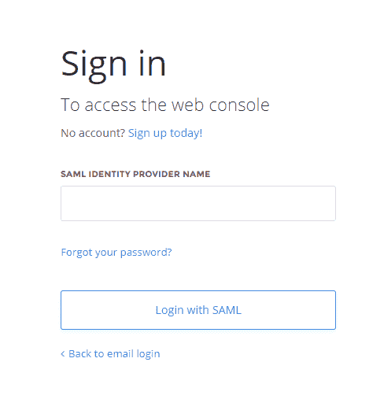

# 单点登录(SSO)简介

> 原文：<https://blog.paperspace.com/introducing-single-sign-on-sso/>

单点登录已经成为企业授权和身份管理的主流。我们很高兴地宣布，基于 SAML 的 SSO 现已在所有 Paperspace 产品中普遍提供。

单点登录的优势包括:

*   优化引入新应用程序的流程
*   最大限度减少网络钓鱼
*   简化用户入职/离职流程
*   通过集中化提高合规性
*   提供用户访问记录和报告
*   最大限度地减少内部服务台请求

参见帮助中心文档[此处](https://support.paperspace.com/hc/en-us/articles/360019020553)。

首先，请[联系销售人员](https://info.paperspace.com/contact-sales)以便在您的团队中启用 SSO。