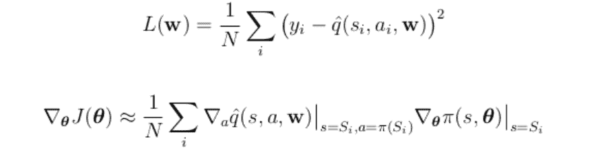
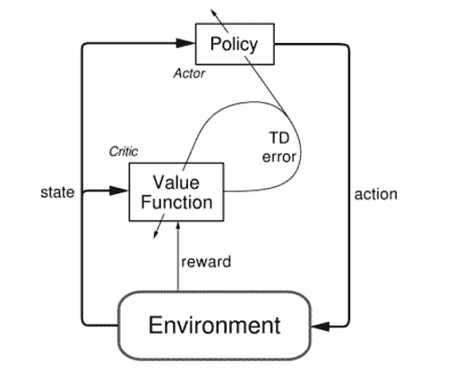
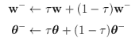
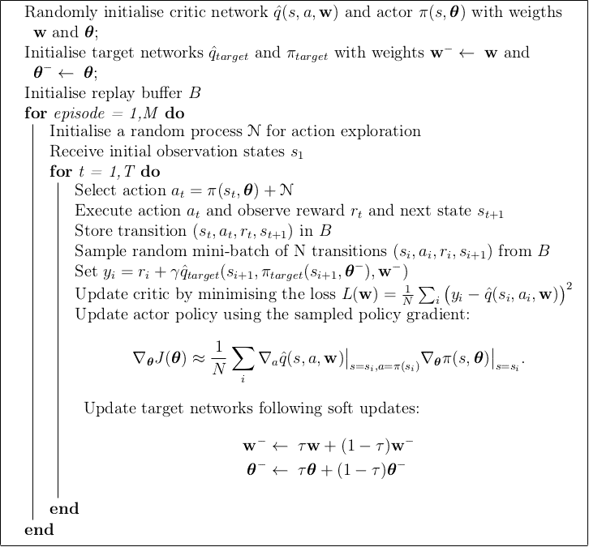
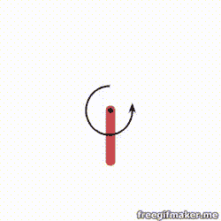
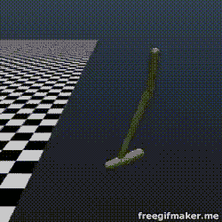
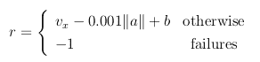
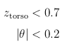
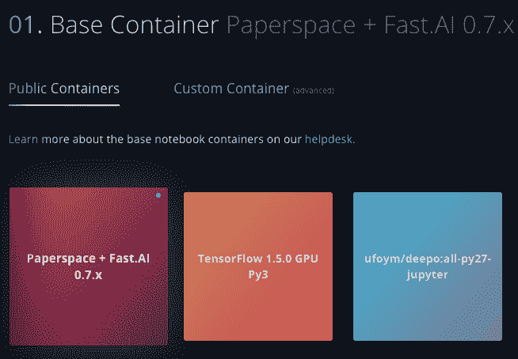
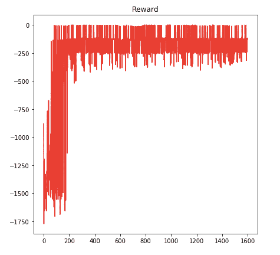

# 具有深度强化学习的物理控制任务

> 原文：<https://blog.paperspace.com/physics-control-tasks-with-deep-reinforcement-learning/>

在本教程中，我们将实现论文 ***[深度强化学习的连续控制](https://arxiv.org/pdf/1509.02971.pdf)*** ，该论文由 Google DeepMind 发布，并在 2016 年 ICRL 大会上作为会议论文提交。网络将在 [PyTorch](https://pytorch.org/) 中使用 [OpenAI gym](https://gym.openai.com/) 实现。该算法结合了深度学习和强化学习技术来处理高维度，即连续的动作空间。

Deep-Q 学习算法的成功使 Google DeepMind 在玩 Atari 游戏时[胜过人类](https://deepmind.com/research/publications/human-level-control-through-deep-reinforcement-learning/)之后，他们将同样的想法扩展到物理任务，其中的动作空间相对于前述游戏要大得多。事实上，在物理任务中，目标通常是使刚体学习某种运动，可以施加到致动器的动作是连续的，即它们可以在一个间隔内从最小值跨越到最大值。

人们可以简单地问:为什么我们不把行动空间离散化？

是的，我们可以，但考虑一个 3 自由度系统，其中每个动作，跨越其自己的区间，被离散化为，比方说，10 个值:动作空间将具有 1000 (10^3)的维度，这将导致两个大问题:维度的[诅咒](https://en.wikipedia.org/wiki/Curse_of_dimensionality#Machine_learning)和连续控制任务的棘手方法，其中每个动作的 10 个样本的离散化不会导致良好的解决方案。考虑一个机械臂:一个致动器并不只有几个可用的扭矩/力值来产生旋转/平移操作的速度和加速度。

深度 Q 学习可以很好地处理高维状态空间(图像作为输入)，但是它仍然不能处理高维动作空间(连续动作)。Deep-Q 学习的一个很好的例子就是实现了一个可以玩 Dino Run 的 [AI，其中动作空间的集合简单来说就是:{ *jump* ， *get_down，do_nothing* }。如果你想知道强化学习的基础和如何实现 Q-网络，前面提到的教程是一个很好的开始，如果你不熟悉强化学习的概念，我强烈建议你先浏览一下。](https://blog.paperspace.com/dino-run/)

## 我们将涵盖的内容

在本教程中，我们将经历以下步骤:

*   解释*政策网络*的概念
*   在所谓的*演员兼评论家*架构中结合*Q-网络*和*政策网络*
*   查看参数是如何更新的，以便最大化和最小化*性能*和*目标*功能
*   整合*内存缓冲*和*冻结目标网络*概念，了解在 DDPG 采取的探索策略是什么。
*   使用 PyTorch 实现算法:在一些为连续控制任务创建的 OpenAI gym 环境上进行训练，比如 [**摆**](https://gym.openai.com/envs/Pendulum-v0/) 和 **[山地车连续](https://gym.openai.com/envs/MountainCarContinuous-v0/)** 。更复杂的环境，如**漏斗**(使一条腿向前跳跃而不摔倒)和**双倒立摆**(通过沿水平轴施加力来保持摆的平衡)需要 [MuJoCo 许可证](https://www.roboti.us/license.html)，如果你有学术或机构联系，你必须购买或申请它。尽管如此，您可以申请 30 天的免费许可证。

## DDPG 入门

作为概述，本文介绍的算法称为深度确定性策略梯度(DDPG)。它延续了之前成功的 DeepMind 论文*使用深度强化学习*与 ***经验重放缓冲*** 的概念玩雅达利，其中通过对经验批次进行采样来偏离策略地训练网络，以及 ***冻结目标网络*** ，其中制作网络的副本，目的是在目标函数中使用，以避免复杂和非线性函数逼近器(如神经网络)的发散和不稳定性。

由于本教程的目的不是展示强化学习的基础知识，如果你不熟悉这些概念，我强烈建议你首先阅读前面提到的可以玩 Dino Run Paperspace 教程的 [AI。一旦你熟悉了 ***环境*** 、 ***代理*** 、 ***奖励*** 和 ***Q 值函数*** (这是在复杂任务中由深度神经网络近似的函数，因此称为 Q 网络)的概念，你就准备好投入到更复杂的深度强化学习架构中去了，像**行动者-批评家**架构，它涉及到了【T2](https://blog.paperspace.com/dino-run/)

## 简而言之，强化学习

强化学习是机器学习的一个子领域。它不同于经典的有监督和无监督学习范式，因为它是一种试错法。这意味着代理实际上不是在数据集上训练的，而是通过与环境交互来训练的，环境被认为是我们希望代理作用的整个系统(像游戏或机械臂)。线索点是环境必须提供一个奖励来回应代理人的行为。这种奖励是根据任务设计的，必须经过深思熟虑，因为它对整个学习过程至关重要。

试错法的基本要素是*值函数*，通过离散场景中的贝尔曼方程求解，其中我们有低维状态和动作空间。当我们处理高维状态空间或动作空间时，我们必须引入复杂的非线性函数逼近器，例如深度神经网络。为此，在文献中引入了深度强化学习的概念。

现在，让我们从简要描述 DDPG 带来的主要创新开始，这些创新用于在强化学习框架中处理连续的、因此是高维的动作空间。

## DDPG 积木

### 政策网络

除了使用神经网络来参数化 **Q 函数**，就像发生在 **DQN** 身上的那样，在更复杂的演员-评论家架构(DDPG 的核心)中，它被称为“评论家”，我们还有**政策网络**，被称为“演员”。然后引入该神经网络来参数化策略函数。

策略基本上是代理行为，是从状态到动作的映射(在 ***确定性策略*** 的情况下)或动作的分配(在 ***随机策略*** 的情况下)。这两种策略的存在是因为它们适用于某些特定的任务:确定性策略非常适用于物理控制问题，而随机策略是解决博弈问题的一个很好的选择。

在这种情况下，策略网络的输出是对应于要对环境采取的动作的值。

### 目标和损失函数

我们有两个网络，因此要更新两组参数:策略网络的参数必须被更新，以便最大化在[策略梯度定理](http://www0.cs.ucl.ac.uk/staff/d.silver/web/Teaching_files/pg.pdf)中定义的性能测量***【J】***；同时更新 critic 网络的参数，以便最小化时间差损失 ***L*** 。



基本上，我们需要改进性能度量 **J** 以便遵循 Q 值函数的最大化，同时最小化时间差异损失，就像在玩 Atari 游戏的深度 Q 网络中发生的那样。

### 演员-评论家建筑

Actor 将状态作为输入，给出动作作为输出，而 critic 将状态和动作都作为输入，给出 Q 函数的值作为输出。评论家使用梯度时间差学习，而演员的参数学习遵循政策梯度定理。这种体系结构背后的主要思想是，策略网络动作产生动作，而 Q 网络批评该动作。



### 集成体验回放和冻结目标网络

与 Q 学习一样，使用非线性函数逼近器(如神经网络)意味着不再保证收敛，而神经网络是在大的状态空间上进行推广所必需的。由于这个原因，需要使用经验重放来制作**独立且相同分布的样本**。此外，需要使用冻结的目标网络，以便在更新 critic 网络时避免发散。与每 C 步更新一次目标网络的 DQN 不同，在 DDPG 的情况下，在“软”更新之后，在每个时间步更新目标网络的参数:



其中τ << 1，w 和θ分别是目标 Q 网络和目标策略网络的权重。通过“软”更新，目标网络的权重被限制为缓慢变化，从而提高了学习和收敛结果的稳定性。然后，在时间差异损失中使用目标网络，而不是 Q 网络本身。

### 探测

像 DDPG 这样的算法中的探索问题可以用一种非常简单的方式来解决，并且独立于学习算法。然后，通过将从噪声进程 N 采样的噪声添加到行动者策略来构建探索策略。勘探政策因此变成:

$\pi/center>(S[t]) = $\pi$(S[t], $\theta$) + $\nu$

其中$\nu$是一个奥恩斯坦-乌伦贝克过程，即一个随机过程，它能产生时间相关的动作，保证物理控制问题中的顺利探索。

## DDPG 算法综述



## 连续控制问题:综述

我们现在来看看可以用来运行 DDPG 算法的一些环境。这些环境可以通过 **[gym](https://gym.openai.com/)** 包获得，正如前面提到的，其中一些环境需要 MuJoCo(这是一个物理引擎)许可才能运行。我们将看看不需要 MuJoCo 的钟摆环境，以及需要 MuJoCo 的 Hopper 环境。

### 钟摆



#### 任务概述

目的是在中央致动器上施加扭矩，以保持摆锤在垂直轴上的平衡。该问题具有三维状态空间，即角度的余弦和正弦以及角度的导数。动作空间是一维的，它是施加到关节上的力矩，被限制在$[-2，2]$。

#### 奖励函数

奖励的精确等式:

```py
-(theta^2 + 0.1*theta_dt^2 + 0.001*action^2) 
```

θ在-π和π之间归一化。所以成本最低的是`-(pi^2 + 0.1*8^2 + 0.001*2^2) = -16.2736044`，成本最高的是`0`。本质上，目标是保持零度角(垂直)，最小的旋转速度和最少的努力。

有关钟摆环境的更多细节，请查看 GitHub 或 T2 的 open ai env 页面。

### 料斗

漏斗的任务是使一个有三个关节和四个身体部分的漏斗尽可能快地向前跳跃。健身房也有，但需要 MuJoCo 许可证，所以你必须申请并安装它，健身房才能工作。



#### 任务的概述

这个问题有一个 11 维的状态向量，包括:位置(如果是旋转或棱柱关节，则以辐射或米为单位)，位置的导数以及旋转关节角度相对于其相对参考系的正弦和余弦函数。动作空间对应于一个三维空间，其中每个动作都是一个连续值，其范围在$[1，1]$。因此网络架构应该有 3 个输出神经元，具有***【tanh】***激活功能。这些扭矩施加在位于**大腿**关节、**腿**关节和**脚**关节的致动器上，这些动作的范围归一化为$[1，1]$。

#### 奖励函数

由于任务的目标是使料斗向前移动，因此定义奖励函数时考虑了活着的奖励、向前速度的正贡献(通过对每一步的位移求导来计算)以及动作控制空间中欧几里德范数的负贡献。



其中 *a* 是动作(即网络的输出)， *vx* 是前进速度， *b* 是活着的奖励。当至少一个故障条件发生时，情节终止，它们是:



其中θ是物体的前倾角。

有关 Hopper 环境的更多详细信息，请查看 [GitHub](https://github.com/openai/gym/blob/master/gym/envs/mujoco/hopper.py) 或 [OpenAI](https://gym.openai.com/envs/Hopper-v2/) env 页面。

### 其他可以玩的健身房环境

有几个健身房环境适合连续控制，因为它们有连续的行动空间。有些需要 MuJoCo，有些不需要。

其中不需要 MuJoCo 的，可以在[月球着陆器](https://github.com/openai/gym/wiki/Leaderboard#lunarlandercontinuous-v2)、[两足步行器](https://github.com/openai/gym/wiki/Leaderboard#bipedalwalker-v2)或者[推车](https://github.com/openai/gym/wiki/Leaderboard#carracing-v0)上试代码。请注意，赛车具有高维状态(图像像素)，因此您不能使用与低维状态空间环境一起使用的全连接层，但也可以使用包含卷积层的架构。

## 代码实现

### 设置

**在 Paperspace 上设置**实例:

公共容器“Paperspace + Fast。“人工智能很适合我们的实验。



**配置:**打开终端安装健身房，升级火炬版本。

```py
pip install gym 
pip install --upgrade torch 
```

实验将在“钟摆-v0”健身房环境下进行。一些环境需要 **MuJoCo** 许可证(“HalfCheetah-v1”、“Hopper-v1”、“Ant-v1”或“Humanoid-v1”)，而其他环境需要 [PyBox2d](https://anaconda.org/akode/pybox2d) 才能运行(“LunarLanderContinuous-v2”、“CarRacing-v0”或“BipedalWalker-v2”)。

一旦你为你想玩的环境安装了 MuJoCo 或者 PyBox2d(《钟摆-v0》不需要这些中的任何一个，只需要 **gym** 包)，你就可以打开一个 Jupyter 笔记本开始编码了。

### 常规设置

该配置遵循 DDPG 文件[补充信息章节](https://arxiv.org/pdf/1509.02971.pdf)中描述的设置，您可以在第 11 页找到。

如文中所述，我们必须设置缓冲区大小为***100 万个*** 条目，从内存中采样的批量大小等于 ***64*** ，演员和评论家网络的学习速率分别等于 ***0.0001*** 和 ***0.001*** ，用于软更新的 tau 参数等于 ***0.001***

```py
BUFFER_SIZE=1000000
BATCH_SIZE=64  #this can be 128 for more complex tasks such as Hopper
GAMMA=0.9
TAU=0.001       #Target Network HyperParameters
LRA=0.0001      #LEARNING RATE ACTOR
LRC=0.001       #LEARNING RATE CRITIC
H1=400   #neurons of 1st layers
H2=300   #neurons of 2nd layers

MAX_EPISODES=50000 #number of episodes of the training
MAX_STEPS=200    #max steps to finish an episode. An episode breaks early if some break conditions are met (like too much
                  #amplitude of the joints angles or if a failure occurs)
buffer_start = 100
epsilon = 1
epsilon_decay = 1./100000 #this is ok for a simple task like inverted pendulum, but maybe this would be set to zero for more
                     #complex tasks like Hopper; epsilon is a decay for the exploration and noise applied to the action is 
                     #weighted by this decay. In more complex tasks we need the exploration to not vanish so we set the decay
                     #to zero.
PRINT_EVERY = 10 #Print info about average reward every PRINT_EVERY

ENV_NAME = "Pendulum-v0" # For the hopper put "Hopper-v2" 
#check other environments to play with at https://gym.openai.com/envs/ 
```

### 体验回放缓冲区

使用[优先体验回放](https://arxiv.org/pdf/1511.05952.pdf)会很有趣。你曾经和 DDPG 一起尝试过优先体验回放吗？如果你想分享你的结果，请留下你的评论。

不管怎样，下面是一个没有优先级的简单重放缓冲区的实现。

```py
from collections import deque
import random
import numpy as np

class replayBuffer(object):
    def __init__(self, buffer_size, name_buffer=''):
        self.buffer_size=buffer_size  #choose buffer size
        self.num_exp=0
        self.buffer=deque()

    def add(self, s, a, r, t, s2):
        experience=(s, a, r, t, s2)
        if self.num_exp < self.buffer_size:
            self.buffer.append(experience)
            self.num_exp +=1
        else:
            self.buffer.popleft()
            self.buffer.append(experience)

    def size(self):
        return self.buffer_size

    def count(self):
        return self.num_exp

    def sample(self, batch_size):
        if self.num_exp < batch_size:
            batch=random.sample(self.buffer, self.num_exp)
        else:
            batch=random.sample(self.buffer, batch_size)

        s, a, r, t, s2 = map(np.stack, zip(*batch))

        return s, a, r, t, s2

    def clear(self):
        self.buffer = deque()
        self.num_exp=0 
```

### 网络架构

我们在这里定义网络。该结构遵循论文的描述:actor 由三个完全连接的层组成，并具有双曲正切作为输出激活函数，以处理[-1，1]值范围。critic 将状态和动作作为输入，并在三个完全连接的层之后输出 Q 值。

```py
def fanin_(size):
    fan_in = size[0]
    weight = 1./np.sqrt(fan_in)
    return torch.Tensor(size).uniform_(-weight, weight)

class Critic(nn.Module):
    def __init__(self, state_dim, action_dim, h1=H1, h2=H2, init_w=3e-3):
        super(Critic, self).__init__()

        self.linear1 = nn.Linear(state_dim, h1)
        self.linear1.weight.data = fanin_(self.linear1.weight.data.size())

        self.linear2 = nn.Linear(h1+action_dim, h2)
        self.linear2.weight.data = fanin_(self.linear2.weight.data.size())

        self.linear3 = nn.Linear(h2, 1)
        self.linear3.weight.data.uniform_(-init_w, init_w)

        self.relu = nn.ReLU()

    def forward(self, state, action):
        x = self.linear1(state)
        x = self.relu(x)
        x = self.linear2(torch.cat([x,action],1))

        x = self.relu(x)
        x = self.linear3(x)

        return x

class Actor(nn.Module): 
    def __init__(self, state_dim, action_dim, h1=H1, h2=H2, init_w=0.003):
        super(Actor, self).__init__()        
        self.linear1 = nn.Linear(state_dim, h1)
        self.linear1.weight.data = fanin_(self.linear1.weight.data.size())

        self.linear2 = nn.Linear(h1, h2)
        self.linear2.weight.data = fanin_(self.linear2.weight.data.size())

        self.linear3 = nn.Linear(h2, action_dim)
        self.linear3.weight.data.uniform_(-init_w, init_w)

        self.relu = nn.ReLU()
        self.tanh = nn.Tanh()

    def forward(self, state):
        x = self.linear1(state)
        x = self.relu(x)
        x = self.linear2(x)
        x = self.relu(x)
        x = self.linear3(x)
        x = self.tanh(x)
        return x

    def get_action(self, state):
        state  = torch.FloatTensor(state).unsqueeze(0).to(device)
        action = self.forward(state)
        return action.detach().cpu().numpy()[0] 
```

### **探索**

正如论文中所描述的，为了保证探索，我们必须在动作中加入噪音。选择奥恩斯坦-乌伦贝克过程是因为它以平滑的方式添加噪声，适合于连续的控制任务。关于这个随机过程的更多细节在[维基百科](https://en.wikipedia.org/wiki/Ornstein%E2%80%93Uhlenbeck_process)上有简单的描述。

```py
# Based on http://math.stackexchange.com/questions/1287634/implementing-ornstein-uhlenbeck-in-matlab
class OrnsteinUhlenbeckActionNoise:
    def __init__(self, mu=0, sigma=0.2, theta=.15, dt=1e-2, x0=None):
        self.theta = theta
        self.mu = mu
        self.sigma = sigma
        self.dt = dt
        self.x0 = x0
        self.reset()

    def __call__(self):
        x = self.x_prev + self.theta * (self.mu - self.x_prev) * self.dt + self.sigma * np.sqrt(self.dt) * np.random.normal(size=self.mu.shape)
        self.x_prev = x
        return x

    def reset(self):
        self.x_prev = self.x0 if self.x0 is not None else np.zeros_like(self.mu)

    def __repr__(self):
        return 'OrnsteinUhlenbeckActionNoise(mu={}, sigma={})'.format(self.mu, self.sigma) 
```

### 设置培训

我们通过初始化环境、网络、目标网络、重放存储器和优化器来设置训练。

```py
torch.manual_seed(-1)

env = NormalizedEnv(gym.make(ENV_NAME))

state_dim = env.observation_space.shape[0]
action_dim = env.action_space.shape[0]

print("State dim: {}, Action dim: {}".format(state_dim, action_dim))

noise = OrnsteinUhlenbeckActionNoise(mu=np.zeros(action_dim))

critic  = Critic(state_dim, action_dim).to(device)
actor = Actor(state_dim, action_dim).to(device)

target_critic  = Critic(state_dim, action_dim).to(device)
target_actor = Actor(state_dim, action_dim).to(device)

for target_param, param in zip(target_critic.parameters(), critic.parameters()):
    target_param.data.copy_(param.data)

for target_param, param in zip(target_actor.parameters(), actor.parameters()):
    target_param.data.copy_(param.data)

q_optimizer  = opt.Adam(critic.parameters(),  lr=LRC)
policy_optimizer = opt.Adam(actor.parameters(), lr=LRA)

MSE = nn.MSELoss()

memory = replayBuffer(BUFFER_SIZE)
writer = SummaryWriter() #initialise tensorboard writer 
```

### 遍历剧集

MAX _ EPISODES 和 MAX_STEPS 参数可以根据我们将要培训代理的环境类型进行调整。在单摆的情况下，我们没有每集的失败条件，所以它将总是通过每集的最大步骤；在存在失败条件的任务中，代理不会经历所有的步骤(至少在开始时，当它还没有学会如何完成任务时)。

```py
plot_reward = []
plot_policy = []
plot_q = []
plot_steps = []

best_reward = -np.inf
saved_reward = -np.inf
saved_ep = 0
average_reward = 0
global_step = 0
#s = deepcopy(env.reset())

for episode in range(MAX_EPISODES):
    #print(episode)
    s = deepcopy(env.reset())
    #noise.reset()

    ep_reward = 0.
    ep_q_value = 0.
    step=0

    for step in range(MAX_STEPS):
        #loss=0
        global_step +=1
        epsilon -= epsilon_decay
        #actor.eval()
        a = actor.get_action(s)
        #actor.train()

        a += noise()*max(0, epsilon)
        a = np.clip(a, -1., 1.)
        s2, reward, terminal, info = env.step(a)

        memory.add(s, a, reward, terminal,s2)

        #keep adding experiences to the memory until there are at least minibatch size samples

        if memory.count() > buffer_start:
            s_batch, a_batch, r_batch, t_batch, s2_batch = memory.sample(BATCH_SIZE)

            s_batch = torch.FloatTensor(s_batch).to(device)
            a_batch = torch.FloatTensor(a_batch).to(device)
            r_batch = torch.FloatTensor(r_batch).unsqueeze(1).to(device)
            t_batch = torch.FloatTensor(np.float32(t_batch)).unsqueeze(1).to(device)
            s2_batch = torch.FloatTensor(s2_batch).to(device)

            #compute loss for critic
            a2_batch = target_actor(s2_batch)
            target_q = target_critic(s2_batch, a2_batch)
            y = r_batch + (1.0 - t_batch) * GAMMA * target_q.detach() #detach to avoid backprop target
            q = critic(s_batch, a_batch)

            q_optimizer.zero_grad()
            q_loss = MSE(q, y) 
            q_loss.backward()
            q_optimizer.step()

            #compute loss for actor
            policy_optimizer.zero_grad()
            policy_loss = -critic(s_batch, actor(s_batch))
            policy_loss = policy_loss.mean()
            policy_loss.backward()
            policy_optimizer.step()

            #soft update of the frozen target networks
            for target_param, param in zip(target_critic.parameters(), critic.parameters()):
                target_param.data.copy_(
                    target_param.data * (1.0 - TAU) + param.data * TAU
                )

            for target_param, param in zip(target_actor.parameters(), actor.parameters()):
                target_param.data.copy_(
                    target_param.data * (1.0 - TAU) + param.data * TAU
                )

        s = deepcopy(s2)
        ep_reward += reward

        #if terminal:
        #    noise.reset()
        #    break

    try:
        plot_reward.append([ep_reward, episode+1])
        plot_policy.append([policy_loss.data, episode+1])
        plot_q.append([q_loss.data, episode+1])
        plot_steps.append([step+1, episode+1])
    except:
        continue
    average_reward += ep_reward

    if ep_reward > best_reward:
        torch.save(actor.state_dict(), 'best_model_pendulum.pkl') #Save the actor model for future testing
        best_reward = ep_reward
        saved_reward = ep_reward
        saved_ep = episode+1

    if (episode % PRINT_EVERY) == (PRINT_EVERY-1):    # print every print_every episodes
        subplot(plot_reward, plot_policy, plot_q, plot_steps)
        print('[%6d episode, %8d total steps] average reward for past {} iterations: %.3f'.format(PRINT_EVERY) %
              (episode + 1, global_step, average_reward / PRINT_EVERY))
        print("Last model saved with reward: {:.2f}, at episode {}.".format(saved_reward, saved_ep))
        average_reward = 0 #reset average reward 
```

### 结论



For Pendulum-v0 task, the objective is to maintain the pendulum in a vertical position, so the total cumulative reward over all the steps must be as close as possible to zero; after 200 steps the agent learned to reach and stay in that condition.

本教程中的代码片段是一个更完整的笔记本的一部分，你可以在 GitHub 的[这个链接](https://github.com/antocapp/paperspace-ddpg-tutorial/blob/master/ddpg-pendulum-250.ipynb)找到。那个笔记本用的网络适合低维状态空间；如果你想处理图像输入，你必须增加卷积层，如研究论文第 11 页所述。

请随意与其他环境或方法分享您的经验，以改进整体培训流程！