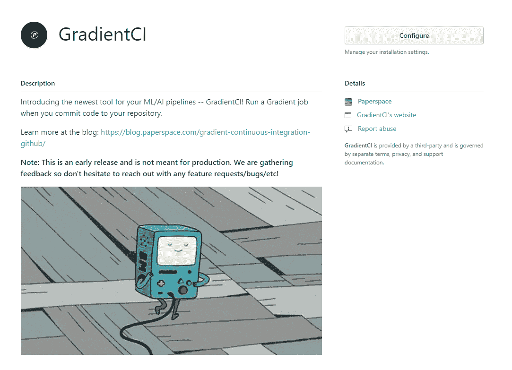
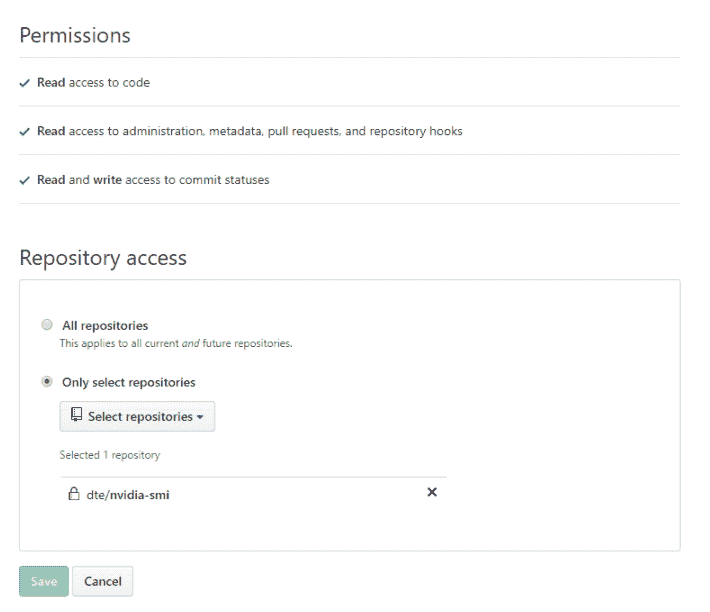
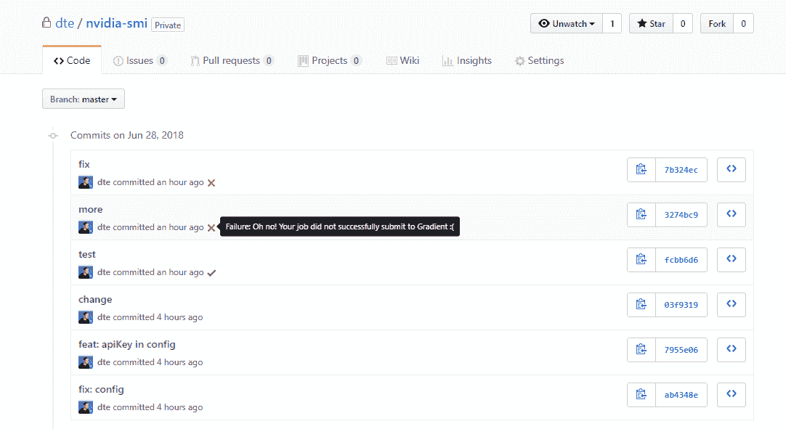

# 介绍 GradientCI 我们新的友好的 CI/CD 机器人，用于机器学习和人工智能管道

> 原文：<https://blog.paperspace.com/gradient-continuous-integration-github/>

***更新**:这个帖子过时了。我们建议查看[文档页面](https://docs.paperspace.com/gradient/projects/gradientci)，其中包含更多信息和 GradientCI 入门的分步指南。*

* * *

我们很高兴推出 GradientCI，这是我们新的 GitHub 集成，使您的 ML 工作比以往任何时候都更容易。

安装在你的私人 github repos 这里:[https://github.com/apps/gradientci](https://github.com/apps/gradientci)

## 它是如何工作的

*注意:这是一个早期版本，还没有准备好投入生产*

GradientCI 确实是新的，所以它还没有完整的功能。如果你渴望测试出血边缘，下面是你今天可以尝试的方法！

就像您可以测试和部署代码的 webapps 的持续集成构建一样，您现在可以针对 GitHub repo 中的任何变化运行渐变作业。

使用 GradientCI for GitHub，您不再需要为每次 git 提交手动运行作业。这一切都是简化和自动化的，无需添加任何额外的配置。

### 1.在您的私人回购上安装 GradientCI 应用程序

转到[https://github.com/apps/gradientci](https://github.com/apps/gradientci)并配置对私有回购的访问。


GitHub 首先会让你选择想要安装 GradientCI 的位置。如果是 GitHub 组织的成员，它会提示您选择个人帐户或组织帐户。

下一步是选择想要安装 GradientCI 应用程序的存储库。您不需要让我们访问与您的帐户相关的所有组织和存储库，您可以选择您希望 GradientCI 运行的单个存储库。



### 2.在您的 repo 中，添加一个图纸空间配置文件

如果您已经使用`paperspace project init`从 paperspace CLI 初始化了您的 repo，您的目录将已经有一个`.ps_project`文件夹。在这个文件夹中有一个名为`config.json`的文件，其中包含您的工作参数。

您的回购应该如下所示:

*   项目目录
    *   。ps _ 项目
        *   config.json
    *   main.py
    *   run.sh
    *   ...

您的`config.json`应该是这样的:

```py
{
  "project": "paperspace/nvidia-smi",
  "container": "tensorflow/tensorflow:1.8.0-gpu",
  "command": "nvidia-smi",
  "machineType": "K80",
} 
```

### 3.将 API 密钥添加到您的`config.json`

这是今天试用 GradientCI 的临时步骤。我们通常不建议将您的私有 API 密钥放入回购中，这个要求将很快被取消。 ***重要:确保你的回购是私人的！你不希望你的 Paperspace API 密匙在互联网上到处传播***

```py
{
  "project": "dte/nvidia-smi",
  "container": "tensorflow/tensorflow:1.8.0-gpu",
  "command": "nvidia-smi",
  "machineType": "K80",
  "apiKey": "abc123" <---- add your API key here
} 
```

### 4.推点代码！

配置 GradientCI bot 后，每个新的 repo 推送都将运行一个作业。在未来，我们将使其可配置，以便它只发生在拉请求，或当您手动指定它。

一旦你`git commit && git push`你的工作将开始运行！

如果作业已提交，您的提交将被标记为一条`success`消息，如果您的配置有任何问题，将被标记为`error`。



## 结论

我们即将推出一些非常令人兴奋的新工具来帮助构建生产 ML 管道。请务必订阅我们的时事通讯以获得通知！