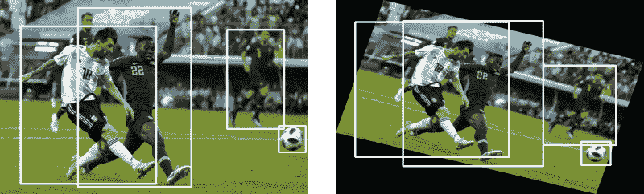
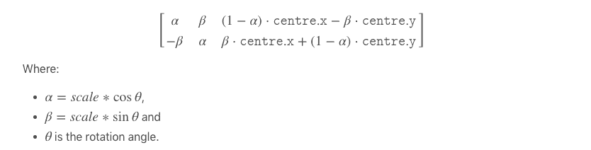
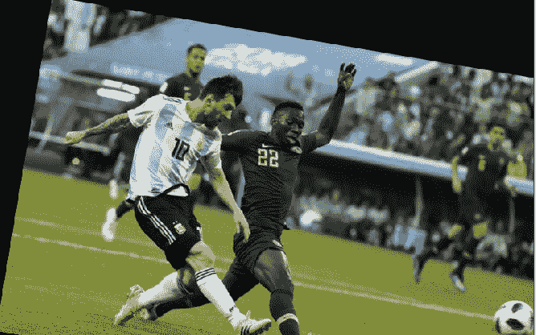
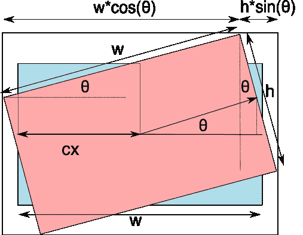
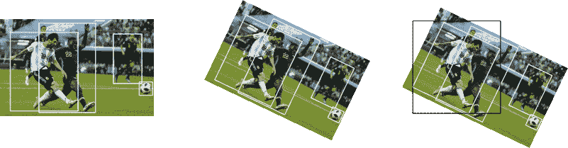
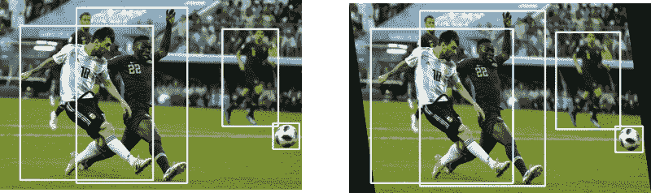
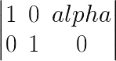
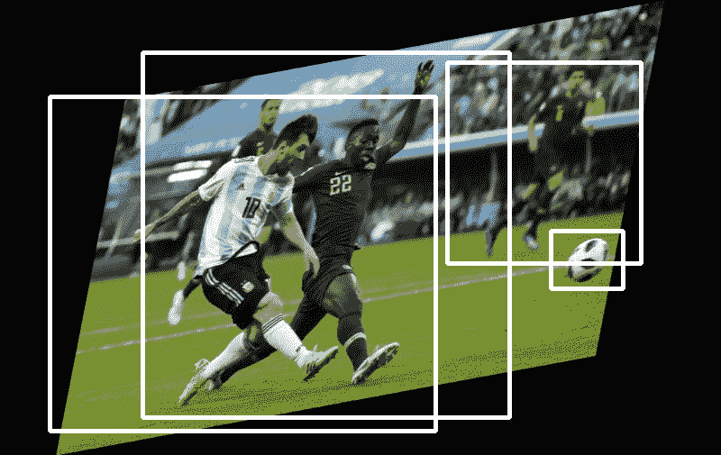

# 包围盒的数据扩充:旋转和剪切

> 原文：<https://blog.paperspace.com/data-augmentation-for-object-detection-rotation-and-shearing/>

这是该系列的第 3 部分，我们正在寻找使图像增强技术适应目标检测任务的方法。在这一部分，我们将介绍如何使用 OpenCV 的仿射变换特性来实现旋转和剪切图像以及包围盒。

在开始之前，强烈建议您阅读完本系列的最后两部分，因为它们构成了我们在这里要做的事情的基础。

## GitHub 回购

本文和整个增强库的所有内容都可以在下面的 Github Repo 中找到。

[https://github . com/paper space/dataincreasionforobjectdetection](https://github.com/Paperspace/DataAugmentationForObjectDetection)

## 证明文件

这个项目的文档可以在你的浏览器中打开`docs/build/html/index.html`或者点击[链接](https://augmentationlib.paperspace.com/)找到。

这个系列有 4 个部分。
[1。第 1 部分:基础设计和水平翻转](https://blog.paperspace.com/data-augmentation-for-bounding-boxes/)
[2。第二部分:缩放和平移](https://blog.paperspace.com/data-augmentation-bounding-boxes-scaling-translation/)
[3。第三部分:旋转和剪切](https://blog.paperspace.com/data-augmentation-for-object-detection-rotation-and-shearing/)
[4。第 4 部分:烘焙增强到输入管道](https://blog.paperspace.com/data-augmentation-for-object-detection-building-input-pipelines/)

这一部分假设您已经阅读了上面的文章，因为我们将使用在以前的文章中已经介绍过的功能。

我们走吧。

## 旋转

旋转变换的结果通常如下所示



旋转是最难处理的数据扩充之一。很快你就会知道为什么了。

在我们接触代码之前，我想在这里定义一些术语。

*   **仿射变换**。图像的一种变换，使得图像中的平行线在变换后保持平行。缩放、平移、旋转都是仿射变换的例子

在计算机图形学中，我们也使用一种叫做**变换矩阵**的东西，这是一种非常方便的工具来执行仿射变换。

详细讨论转换矩阵是不可能的，因为这会使我们偏离我们的任务。所以，我在文章的最后提供了一个链接，你可以在那里读到更多。同时，把变换矩阵想象成一个矩阵，用它乘以一个点的坐标来产生变换后的点。

$$ T_p = M * [ x\:y\:1]^T $$

变换矩阵是一个`2 x 3`矩阵，乘以`[x y 1]`，其中(x，y)是该点的坐标。有一个 1 的想法是为了方便剪切，你可以在下面的链接中了解更多。将一个`2 x 3`矩阵与一个`3 x 1`矩阵相乘，我们得到一个包含新点坐标的`2 x 1`矩阵。

变换矩阵也可以用来得到一个点绕图像中心旋转后的坐标。将点旋转$\theta$的变换矩阵如下所示。



*Image source: https://cristianpb.github.io/blog/image-rotation-opencv. Scale is 1.*

谢天谢地，我们不需要编码。OpenCV 已经提供了内置的功能来使用它的`cv2.warpAffine`函数来完成这项工作。所以，有了必备的理论知识，让我们开始吧。

我们从定义我们的`__init__`函数开始。

```py
def __init__(self, angle = 10):
    self.angle = angle

    if type(self.angle) == tuple:
        assert len(self.angle) == 2, "Invalid range"   
    else:
        self.angle = (-self.angle, self.angle)
```

### 旋转图像

现在，我们要做的第一件事是围绕中心旋转图像一个角度。为此，我们需要我们的转换矩阵。为此，我们使用 OpenCV 函数`getRotationMatrix2D`。

```py
(h, w) = image.shape[:2]
(cX, cY) = (w // 2, h // 2)
M = cv2.getRotationMatrix2D((cX, cY), angle, 1.0) 
```

现在，我们可以通过使用`warpAffine`函数简单地得到旋转图像。

```py
image = cv2.warpAffine(image, M, (w, h)) 
```

该函数的第三个参数是`(w,h)`,这是因为我们希望保持原来的分辨率。但是如果你稍微想象一下，一个旋转后的图像会有不同的维度，如果它们超过了原来的维度，OpenCV 会简单的把它们切掉。这里有一个例子。



OpenCV rotation side-effect.

我们在这里丢失了一些信息。那么，我们该如何克服这一点呢？谢天谢地，OpenCV 为我们提供了一个函数参数，帮助我们确定最终图像的尺寸。如果我们能把它从`(w,h)`改变到一个尺寸，使**正好**容纳我们旋转的图像，我们就完成了。

这个灵感来自 Adrian Rosebrock 在他的博客 PyImageSearch 上的一篇文章。

现在的问题是我们如何找到这个新的维度。一点点三角学就能帮我们完成这项工作。确切地说，如果你看下面的图表。



*Image source: https://cristianpb.github.io/blog/image-rotation-opencv*

在哪里

$ $ N _ w = h * sin(\ theta)+w * cos(\ theta)\ N _ h = h * cos(\ theta)+w * sin(\ theta)$ $

现在，我们计算新的宽度和高度。注意，我们可以从转换矩阵中获得$\sin(\theta)$和$\cos(\theta)$的值。

```py
cos = np.abs(M[0, 0])
sin = np.abs(M[0, 1])

# compute the new bounding dimensions of the image
nW = int((h * sin) + (w * cos))
nH = int((h * cos) + (w * sin))
```

还是少了点什么。有一点是肯定的，图像的中心不会移动，因为它本身就是旋转轴。然而，由于图像的宽度和高度现在是`nW, nH`，中心必须位于`nW/2, nH/2`。为了确保这一点，我们必须通过`nW/2 - cX, nH/2 - cH`来转换图像，其中`cX, cH`是先前的中心。

```py
# adjust the rotation matrix to take into account translation
M[0, 2] += (nW / 2) - cX
M[1, 2] += (nH / 2) - cY
```

综上所述，我们将负责旋转图像的代码放在函数`rotate_im`中，并将其放在`bbox_util.py`中

```py
def rotate_im(image, angle):
    """Rotate the image.

    Rotate the image such that the rotated image is enclosed inside the tightest
    rectangle. The area not occupied by the pixels of the original image is colored
    black. 

    Parameters
    ----------

    image : numpy.ndarray
        numpy image

    angle : float
        angle by which the image is to be rotated

    Returns
    -------

    numpy.ndarray
        Rotated Image

    """
    # grab the dimensions of the image and then determine the
    # centre
    (h, w) = image.shape[:2]
    (cX, cY) = (w // 2, h // 2)

    # grab the rotation matrix (applying the negative of the
    # angle to rotate clockwise), then grab the sine and cosine
    # (i.e., the rotation components of the matrix)
    M = cv2.getRotationMatrix2D((cX, cY), angle, 1.0)
    cos = np.abs(M[0, 0])
    sin = np.abs(M[0, 1])

    # compute the new bounding dimensions of the image
    nW = int((h * sin) + (w * cos))
    nH = int((h * cos) + (w * sin))

    # adjust the rotation matrix to take into account translation
    M[0, 2] += (nW / 2) - cX
    M[1, 2] += (nH / 2) - cY

    # perform the actual rotation and return the image
    image = cv2.warpAffine(image, M, (nW, nH))

#    image = cv2.resize(image, (w,h))
    return image
```

### 旋转边界框

这是此次增强中最具挑战性的部分。在这里，我们首先需要旋转边界框，这给了我们一个倾斜的矩形框。然后，我们必须找到与包含倾斜矩形框的图像的边平行的最紧密的矩形。

我的意思是。



Final Bounding Box, shown only for one image.

现在，为了得到旋转后的边界框，如中间的图片所示，我们需要一个框的四个角的所有坐标。

我们实际上可以只使用两个角来得到最终的边界框，但这需要更多的三角运算来计算出只使用两个角的最终边界框的尺寸(在上图的右边，黑色)。有了中间框的四个角在中间，计算起来就容易多了。这只是让代码更复杂的问题。

因此，首先，我们在文件`bbox_utils.py`中编写函数`get_corners`来获得所有的 4 个角。

```py
def get_corners(bboxes):

    """Get corners of bounding boxes

    Parameters
    ----------

    bboxes: numpy.ndarray
        Numpy array containing bounding boxes of shape `N X 4` where N is the 
        number of bounding boxes and the bounding boxes are represented in the
        format `x1 y1 x2 y2`

    returns
    -------

    numpy.ndarray
        Numpy array of shape `N x 8` containing N bounding boxes each described by their 
        corner co-ordinates `x1 y1 x2 y2 x3 y3 x4 y4`      

    """
    width = (bboxes[:,2] - bboxes[:,0]).reshape(-1,1)
    height = (bboxes[:,3] - bboxes[:,1]).reshape(-1,1)

    x1 = bboxes[:,0].reshape(-1,1)
    y1 = bboxes[:,1].reshape(-1,1)

    x2 = x1 + width
    y2 = y1 

    x3 = x1
    y3 = y1 + height

    x4 = bboxes[:,2].reshape(-1,1)
    y4 = bboxes[:,3].reshape(-1,1)

    corners = np.hstack((x1,y1,x2,y2,x3,y3,x4,y4))

    return corners 
```

在这之后，现在我们有了由 8 个坐标`x1,y1,x2,y2,x3,y3,x4,y4`描述的每个边界框。我们现在在文件`bbox_util.py`中定义函数`rotate_box`，它通过给我们变换后的点来为我们旋转边界框。我们使用转换矩阵。

```py
def rotate_box(corners,angle,  cx, cy, h, w):

    """Rotate the bounding box.

    Parameters
    ----------

    corners : numpy.ndarray
        Numpy array of shape `N x 8` containing N bounding boxes each described by their 
        corner co-ordinates `x1 y1 x2 y2 x3 y3 x4 y4`

    angle : float
        angle by which the image is to be rotated

    cx : int
        x coordinate of the center of image (about which the box will be rotated)

    cy : int
        y coordinate of the center of image (about which the box will be rotated)

    h : int 
        height of the image

    w : int 
        width of the image

    Returns
    -------

    numpy.ndarray
        Numpy array of shape `N x 8` containing N rotated bounding boxes each described by their 
        corner co-ordinates `x1 y1 x2 y2 x3 y3 x4 y4`
    """

    corners = corners.reshape(-1,2)
    corners = np.hstack((corners, np.ones((corners.shape[0],1), dtype = type(corners[0][0]))))

    M = cv2.getRotationMatrix2D((cx, cy), angle, 1.0)

    cos = np.abs(M[0, 0])
    sin = np.abs(M[0, 1])

    nW = int((h * sin) + (w * cos))
    nH = int((h * cos) + (w * sin))
    # adjust the rotation matrix to take into account translation
    M[0, 2] += (nW / 2) - cx
    M[1, 2] += (nH / 2) - cy
    # Prepare the vector to be transformed
    calculated = np.dot(M,corners.T).T

    calculated = calculated.reshape(-1,8)

    return calculated
```

现在，最后一件事是定义一个函数`get_enclosing_box`,它让我们得到了我们所说的最紧密的盒子。

```py
def get_enclosing_box(corners):
    """Get an enclosing box for ratated corners of a bounding box

    Parameters
    ----------

    corners : numpy.ndarray
        Numpy array of shape `N x 8` containing N bounding boxes each described by their 
        corner co-ordinates `x1 y1 x2 y2 x3 y3 x4 y4`  

    Returns 
    -------

    numpy.ndarray
        Numpy array containing enclosing bounding boxes of shape `N X 4` where N is the 
        number of bounding boxes and the bounding boxes are represented in the
        format `x1 y1 x2 y2`

    """
    x_ = corners[:,[0,2,4,6]]
    y_ = corners[:,[1,3,5,7]]

    xmin = np.min(x_,1).reshape(-1,1)
    ymin = np.min(y_,1).reshape(-1,1)
    xmax = np.max(x_,1).reshape(-1,1)
    ymax = np.max(y_,1).reshape(-1,1)

    final = np.hstack((xmin, ymin, xmax, ymax,corners[:,8:]))

    return final
```

这再次给了我们一个符号，其中每个边界框由 4 个坐标或两个角来确定。使用所有这些辅助函数，我们最终组装了我们的`__call__`函数。

```py
def __call__(self, img, bboxes):

    angle = random.uniform(*self.angle)

    w,h = img.shape[1], img.shape[0]
    cx, cy = w//2, h//2

    img = rotate_im(img, angle)

    corners = get_corners(bboxes)

    corners = np.hstack((corners, bboxes[:,4:]))

    corners[:,:8] = rotate_box(corners[:,:8], angle, cx, cy, h, w)

    new_bbox = get_enclosing_box(corners)

    scale_factor_x = img.shape[1] / w

    scale_factor_y = img.shape[0] / h

    img = cv2.resize(img, (w,h))

    new_bbox[:,:4] /= [scale_factor_x, scale_factor_y, scale_factor_x, scale_factor_y] 

    bboxes  = new_bbox

    bboxes = clip_box(bboxes, [0,0,w, h], 0.25)

    return img, bboxes
```

注意，在函数的末尾，我们重新调整了图像和边界框的尺寸，这样我们的最终尺寸是`w,h`而不是`nW, nH`。这只是为了保持图像的尺寸。我们还裁剪了一些方框，以防任何方框在变换后会从图像中消失。

## 剪羊毛

剪切是另一种边界框变换，它可以在变换矩阵的帮助下完成。剪切产生的效果看起来像。



在剪切中，我们将矩形图像变成...嗯...类似平行四边形的图像？剪切中使用的变换矩阵是。



上面是一个水平剪切的例子。在此，坐标为`x`、`y`的像素被移动到`x + alpha*y`、`y`。`alpha`是剪切因子。因此，我们将`__init__`函数定义为。

```py
class RandomShear(object):
    """Randomly shears an image in horizontal direction   

    Bounding boxes which have an area of less than 25% in the remaining in the 
    transformed image is dropped. The resolution is maintained, and the remaining
    area if any is filled by black color.

    Parameters
    ----------
    shear_factor: float or tuple(float)
        if **float**, the image is sheared horizontally by a factor drawn 
        randomly from a range (-`shear_factor`, `shear_factor`). If **tuple**,
        the `shear_factor` is drawn randomly from values specified by the 
        tuple

    Returns
    -------

    numpy.ndaaray
        Sheared image in the numpy format of shape `HxWxC`

    numpy.ndarray
        Tranformed bounding box co-ordinates of the format `n x 4` where n is 
        number of bounding boxes and 4 represents `x1,y1,x2,y2` of the box

    """

    def __init__(self, shear_factor = 0.2):
        self.shear_factor = shear_factor

        if type(self.shear_factor) == tuple:
            assert len(self.shear_factor) == 2, "Invalid range for scaling factor"   
        else:
            self.shear_factor = (-self.shear_factor, self.shear_factor)

        shear_factor = random.uniform(*self.shear_factor)
```

### 增强逻辑

因为我们只涉及水平剪切，我们只需要根据等式`x = x + alpha*y`改变盒子角的 x 坐标。我们的调用函数看起来像。

```py
def __call__(self, img, bboxes):

    shear_factor = random.uniform(*self.shear_factor)

    w,h = img.shape[1], img.shape[0]

    if shear_factor < 0:
        img, bboxes = HorizontalFlip()(img, bboxes)

    M = np.array([[1, abs(shear_factor), 0],[0,1,0]])

    nW =  img.shape[1] + abs(shear_factor*img.shape[0])

    bboxes[:,[0,2]] += ((bboxes[:,[1,3]]) * abs(shear_factor) ).astype(int) 

    img = cv2.warpAffine(img, M, (int(nW), img.shape[0]))

    if shear_factor < 0:
    	img, bboxes = HorizontalFlip()(img, bboxes)

    img = cv2.resize(img, (w,h))

    scale_factor_x = nW / w

    bboxes[:,:4] /= [scale_factor_x, 1, scale_factor_x, 1] 

    return img, bboxes
```

一个有趣的例子是负切变。负剪切需要更多一点的黑客工作。如果我们只是用正剪切的情况来剪切，我们得到的盒子一定会更小。这是因为为了让方程工作，盒子的坐标必须是格式`x1, y1, x2, y2`，其中`x2` **是我们剪切**方向的更远处的角。

这适用于正剪切的情况，因为在我们的默认设置中，x2 是右下角的 *x* 坐标，而`x1`是左上角的坐标。剪切的方向是正的，或从左向右。

当我们使用负剪切时，剪切的方向是从右向左，而`x2`在负方向上不比`x1`更远。解决这个问题的一个方法是得到另一组角(这将满足约束，你能证明吗？).应用剪切变换，然后根据我们遵循的符号改变到另一组角。

我们可以这么做，但有更好的方法。以下是如何用剪切因子`-alpha`执行负剪切。

1.  水平翻转图像和方框。
2.  使用剪切系数`alpha`应用正剪切变换
3.  再次水平翻转图像和方框。

我更希望你拿一张纸和一支笔来验证为什么上面的方法有效！由于这个原因，你会在上面的函数中看到两个处理负剪力的代码行。

```py
if shear_factor < 0:
	img, bboxes = HorizontalFlip()(img, bboxes) 
```

## 测试它

现在，我们已经完成了旋转和剪切增强，是时候测试它们了。

```py
from data_aug.bbox_utils import *
import matplotlib.pyplot as plt

rotate = RandomRotate(20)  
shear = RandomShear(0.7)

img, bboxes = rotate(img, bboxes)
img,bboxes = shear(img, bboxes)

plt.imshow(draw_rect(img, bboxes))
```



这是这一部分，我们几乎完成了我们的扩增。只剩下一点调整大小的增加，这与其说是增加，不如说是输入预处理步骤。

在下一个也是最后一个部分，我们将向您展示如何快速将这些增强纳入您的深度学习输入管道，如何无缝地将它们与多个增强相结合，以及如何生成文档。

## 练习

这里有一些你可以自己尝试的事情。

1.  实现上述扩充的确定性版本。
2.  缩放和平移也可以使用具有小得多的代码的变换矩阵来实现。试着用这种方式实现它们。
3.  实施垂直剪切

## 进一步阅读

1.  [OpenCV 中的旋转](https://cristianpb.github.io/blog/image-rotation-opencv)
2.  [变换矩阵](https://www.tutorialspoint.com/computer_graphics/2d_transformation.htm)
3.  [用 OpenCV 和 Python 旋转图像(正确地)](https://www.pyimagesearch.com/2017/01/02/rotate-images-correctly-with-opencv-and-python/)