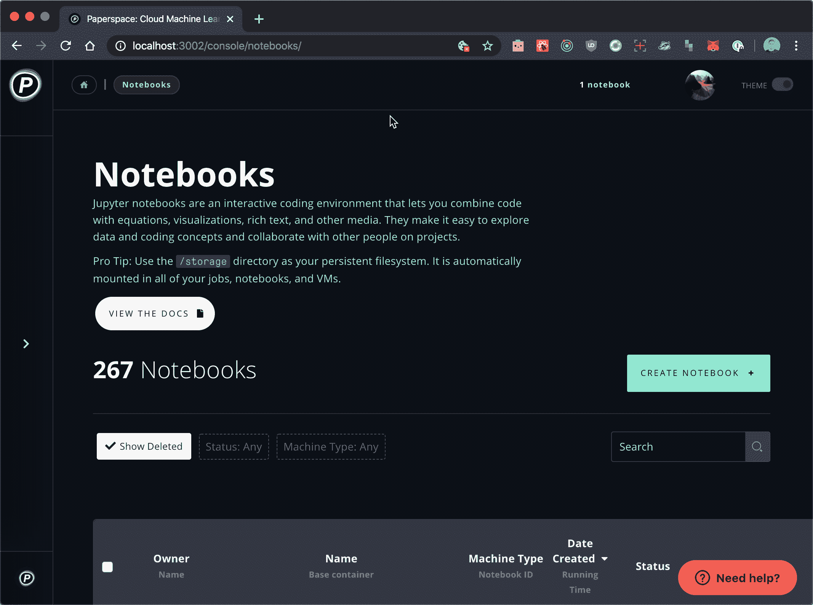
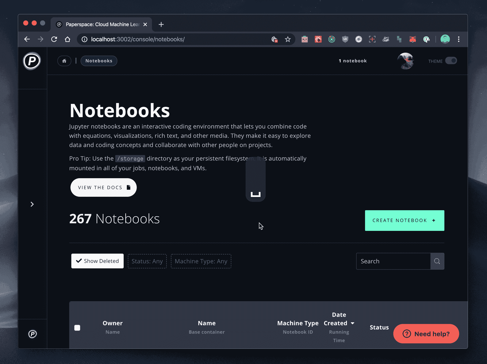

# 🎁产品更新:热键

> 原文：<https://blog.paperspace.com/product-update-hotkeys/>

我们很高兴分享热键快捷键的到来！

我们经常从用户那里听到的一件事是，他们希望在使用 Paperspace 产品时能够更快地切换上下文。

我们希望响应这一号召，简化在 Paperspace 上切换不同资源的体验。例如，如果你正在浏览你的笔记本寻找上周你正在工作的拥抱脸的[变形金刚笔记本](https://ml-showcase.paperspace.com/projects/hugging-face),你可能也想检查作业页面，看看你最后一次使用渐变作业运行器是什么时候——现在只需一次按键就可以实现！

我们邀请您使用这些新的漂亮热键在 Paperspace 控制台上操作:

*   `shift + t` -切换控制台菜单
*   `m` -切换侧边栏菜单
*   `c` -导航至核心
*   `g` -导航至梯度
*   `n` -导航至笔记本
*   `j` -导航至工作
*   `p` -导航至项目

如果您对希望实现的其他快捷方式有任何建议，请告诉我们！

一如既往，让我们知道你在 Twitter 上的想法，或者通过 hello@paperspace.com 联系我们。