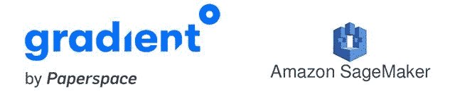
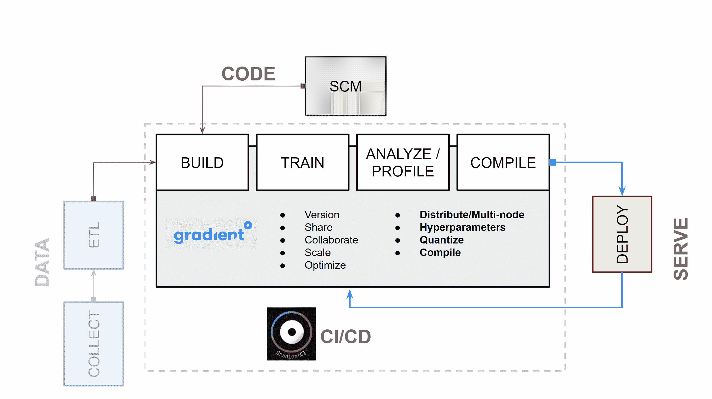
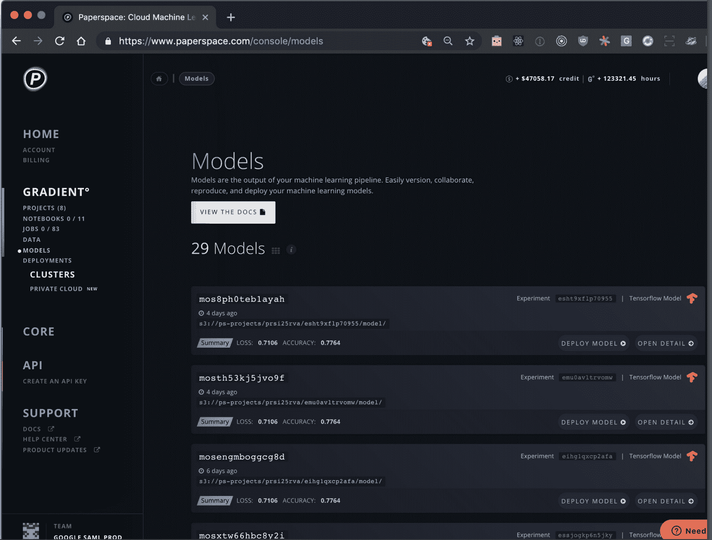
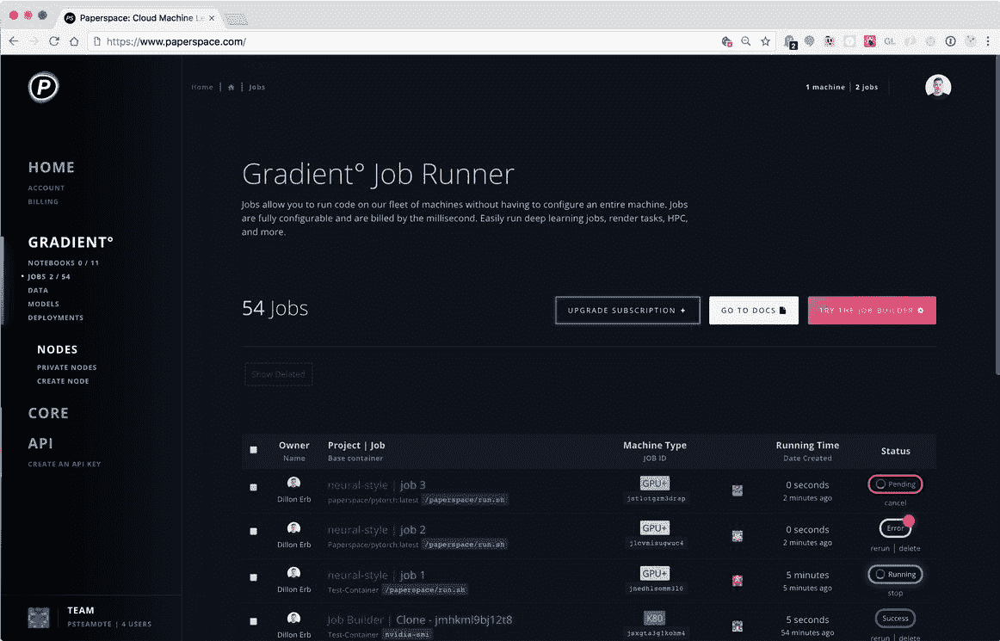
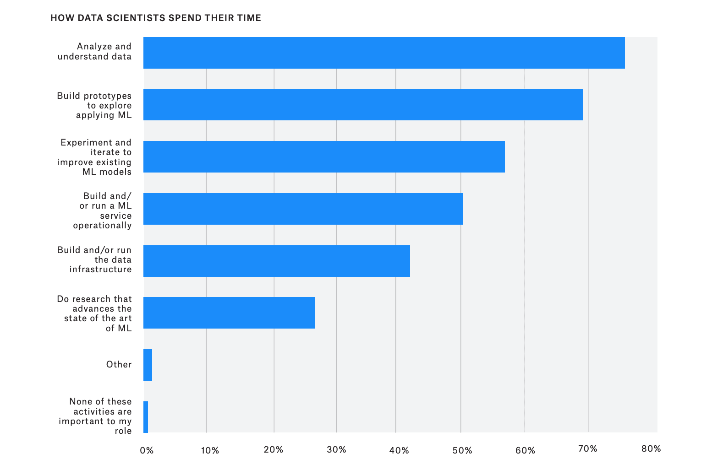

# paperspace 渐变与 amazon pagemaker

> 原文：<https://blog.paperspace.com/paperspace-gradient-vs-amazon-sagemaker/>

## 介绍

Paperspace Gradient 和 Amazon SageMaker 是两个最受欢迎的端到端机器学习平台。

*端到端机器学习平台*是指支持从研究或原型阶段到大规模部署的机器学习模型开发的工具集。

*平台*意味着存在某种程度的自动化，使得执行机器学习任务变得更加容易。

## Paperspace Gradient 和 Amazon SageMaker 之间的相似之处

Paperspace Gradient 和 Amazon SageMaker 使机器学习模型更容易从研究走向生产。

以前，需要将工具和服务组合在一起才能生产一个机器学习模型，而现在，通过您选择的框架和软件包，可以在一个平台上编写、管理和编排模型。

结果是模型开发过程比拼凑的工作流更健壮、可靠、可预测、可再现，并且随着时间的推移对大多数应用程序更有用。

使用 Gradient 或 SageMaker 等完全托管服务的优势有很多:

*   **协作**:机器学习平台包括一个云 IDE 或笔记本环境，可以轻松共享和部署代码
*   **可见性**:模型会随着时间而变化，可见的测试和训练数据和结果是确保模型持续改进的唯一方法
*   版本化:版本化是提高故障隔离和模型效率的关键
*   再现性:与团队合作需要重现实验的能力

Gradient 和 SageMaker 都具有加快机器学习模型开发周期的功能。

***而非*** 使用托管服务开发机器学习模型的缺点还包括其他几个因素:

*   拼凑起来的工具很难扩展，尤其是在与团队合作时
*   手动流程更容易引入错误
*   成本可能会失控，因为拼凑起来的工作流的每一部分都可能有相关的成本
*   兼容性成为一个复杂的问题
*   随着时间的推移，模型的改进越来越少，这代表了业务效率的对数损失

随着您的机器学习部署的规模和复杂性的增长，ML 平台将对您的团队变得更加有用。以下文档介绍了选择 ML 平台时需要考虑的一些重要因素。

## Paperspace Gradient 和 Amazon SageMaker 之间的差异

Paperspace Gradient 和亚马逊 SageMaker 的主要区别在于，Gradient 是一个易于使用的编排工具，可以大规模编写和部署机器学习模型，而 SageMaker 是一系列令人困惑的工业产品，从数据标签到预建的算法市场。

差异解释如下:

### 认知开销和设计哲学

轻松的 ML 意味着编写机器学习代码，而不是排除基础设施工具的故障。

使用 Amazon SageMaker，您需要具备丰富的 DevOps 知识。您需要使用 IAM 管理用户权限。您将需要能够执行应用程序规模的工具来设置 ML 管道。

使用 Paperspace Gradient，有一个直观的 GUI 和一个 [GradientCI](https://gradient.paperspace.com/gradientci) 命令行工具。大多数工具都是现成的。计算分配、包依赖性和模型版本化也是现成可用的。

如果你*已经拥有*丰富的 AWS 和/或 SageMaker 专业知识，你会发现 Gradient 让许多重复性的编排任务变得更加容易。

从哲学上讲，Gradient 让您可以访问整个基础架构堆栈。关于整个部署管道的信息浮出水面，例如，从作业运行器到应用层，再到底层计算硬件。

### 激励调整

Paperspace Gradient 是一种多云解决方案。Gradient 背后的动机是为每个机器学习团队提供最好的工具——不管他们住在哪里。

许多 AWS 应用程序(包括 SageMaker 中的应用程序)旨在鼓励最终用户采用其他 AWS 应用程序或托管服务。例如，SageMaker 已经有了一个托管服务，用于预建算法，部署到边缘，以及为模型预测添加人工审查。

如果你完全围绕 AWS 进行组织，你可能知道 AWS 托管服务可能是一个黑洞——使用单一云 ML 平台可能会将你推向云的昂贵托管服务。

梯度适合您的生产力。它不会通过架构锁定来限制您，不会推动您采用托管服务，也不会通过固执己见的特定于平台的设计来强行限制您的 ML 能力。

### CI/CD 方法和反馈回路

CI/CD for Machine Learning

许多高功能软件团队在他们的工作流程中使用一些 CI/CD 版本。优势是多方面的:

*   更短的开发周期
*   更大的团队可见性和协作
*   较小的代码更改改进了故障识别
*   更快的代码改进速度

机器学习过程受益于同样的原因。使用像 Paperspace Gradient 这样的 CI/CD 工具可以提高模型开发和部署周期的效率。

Amazon SageMaker 也有用于调整的工具(例如，一键超参数优化)，但你会发现这些功能在渐变中与标准功能相同。

### 基础设施管理

众所周知，AWS 应用程序很难管理，但在规模上非常强大。许多 AWS 服务非常复杂，以至于它们有独立的认证程序！

为了大规模部署机器学习模型，Amazon SageMaker 需要了解权限(例如 IAM)、计算资源的分配(例如 EC2)，以及对通过 AWS 属性的数据流的深入了解。

基于 Gradient 的工具基础设施要简单得多。Gradient 具有集成的作业运行器，能够以最经济高效的方式自动调配计算资源。

### 部署速度

借助 Paperspace Gradient，您可以在 5 分钟或更短时间内从 Jupyter 笔记本进入生产阶段。

Gradient Model view

以基础设施性能著称的亚马逊 SageMaker 需要付出更多努力才能获得洞察力——无论是第一次还是每次。Paperspace 更加直观，尤其是对于不习惯编排计算负载的数据科学家来说。

Gradient 和 SageMaker 都提供“一键式部署”，但在 Gradient 中，这包括计算资源的供应(使用无服务器作业运行器)，而在 SageMaker 中，供应仍然是一个工具挑战。

换句话说，尽管 SageMaker 可以被微调以达到最大性能，但是如果部署一个模型要花费很长时间，那么基础设施性能是没有意义的。

### 成本(按使用付费)

Paperspace Gradient 和 Amazon SageMaker 都有某种形式的按实例计费。

SageMaker 将其服务称为 *[托管现场培训](https://docs.aws.amazon.com/sagemaker/latest/dg/model-managed-spot-training.html)、*，使用 EC2 现场实例。这些实例来自共享实例池，这些实例在 AWS 云上的给定时间和给定的实时供应和需求下可用。然后，AWS 从这一桶可用资源中满足 ML 作业的计算需求，并执行您的计算操作。

spot 实例的问题是，你的工作可能会被另一个客户抢占，这大大延长了给定实验的培训时间。而且如果真的使用 EC2 机器学习实例，成本是很难控制的。

另一方面，Gradient 使您可以轻松地为您需要的实例付费——无论是本地、AWS 还是 GCP。这种按需计费被称为 [*无服务器 ML*](https://www.forbes.com/sites/janakirammsv/2018/03/21/paperspace-launches-gradient-a-serverless-artificial-intelligence-platform/#324df8b72ad8) 。这意味着有一个集成的作业运行器可以为给定的作业自动配置计算资源。你是 ***总是*** 只对你实际使用的资源计费。这防止了由于用户错误或糟糕的系统设计导致的大量成本超支。

The Gradient Job Runner eliminates the need to provision an entire machine for model training or deployment. 

### 拓扑学

许多机器学习和深度学习应用需要在边缘部署或与物联网框架集成的训练模型。模型通常为推理而优化。执行修剪或量化。模型会缩小以符合部署标准。

因为 Gradient 是一个 Kubernetes 应用程序，所以很容易将训练分布到处理中心，处理中心可以很容易地上下旋转。可以按照适合业务需求的方式设置集群，并且有一个单一平台来管理多云计算工作负载。

相比之下，SageMaker 在默认情况下将您限制在特定的数据中心区域，并使其难以分发。

### 供应商锁定和可扩展性

亚马逊 SageMaker 只在 AWS 上运行。如果你在 AWS 上运营业务或者对 AWS 生态系统非常熟悉，这就不是问题。然而，一个额外的问题出现了，不是因为供应商锁定，而是因为可扩展性。

Paperspace Gradient 是安装在任何云或本地基础设施之上的软件层[。该应用程序本身是一个 Kubernetes 应用程序。梯度可以跨多个云环境进行编排，这意味着模型可以在单一控制台下进行管理。](https://gradient.paperspace.com/clusters)

有了 SageMaker，机器学习工作流就受制于 AWS 生态系统。如果新产品或工具在其他公共云上提供，就没有办法访问它们。

相比之下，Gradient 将允许您将任何云上的任何新功能连接到您的机器学习工作流。最终，锁定的缺乏和可扩展性保护了关键的商业知识产权和竞争优势。

### 深度学习的灵活性和兼容性

随着你的机器学习越来越复杂，你的算法工作也可能越来越复杂。

同样，经典的机器学习技术可能不足以满足您的应用——尤其是如果您的应用涉及音频或视频，或者如果某个特定的经典算法限制了您的结果的准确性。

当需要深度学习时，Paperspace Gradient 可以更轻松地将模型部署到 GPU。

原因是多方面的:

*   通过 Gradient job runner，在 GPU 加速的机器上进行分布式培训非常简单
*   GPU 定价在 Gradient 上比在 AWS EC2 上更有吸引力
*   Gradient 与 PyTorch 和 TensorFlow 等最流行的深度学习框架具有开箱即用的兼容性
*   从单节点部署到大规模分布式培训都很容易
*   易于搭载、易于开发、易于扩展

Gradient 通常能够更快地从研究到生产开发深度学习模型，从而随着时间的推移加快深度学习模型的训练、部署和改进速度。

至关重要的是，Gradient 还使得将模型扩展到大规模分布式训练变得异常容易。

### 最后一点:花在工具上的时间

正如 2019 年 ka ggle State of Data Science and Machine Learning 的数据所揭示的那样，数据科学家的大部分时间都花在了数据基础设施和服务运营上。

一流的数据科学团队通常还包括开发人员和/或基础架构工程师。

因为任何数据科学团队的目标都应该是在单位时间内返回更多的洞察力，所以数据科学家仍然在工具上花费如此多的时间是没有意义的。

渐变让我们更容易忘记工具，回到真正的工作中。

From Kaggle's [State of Data Science and Machine Learning 2019](https://www.docdroid.net/qzyxCr4/kaggle-state-of-data-science-and-machine-learning-2019.pdf#page=13)

### 结论:机器学习的统一平台

轻松的机器学习意味着编写 ML 代码，而不是排除基础设施工具的故障。CI/CD 平台提供对整个体系的访问——从计算层到管理层——同时抽象出不可扩展的任务。

最终，用于机器学习的 CI/CD 工作流的成功实施将意味着更好的可靠性、稳定性、确定性和更快的创新步伐。