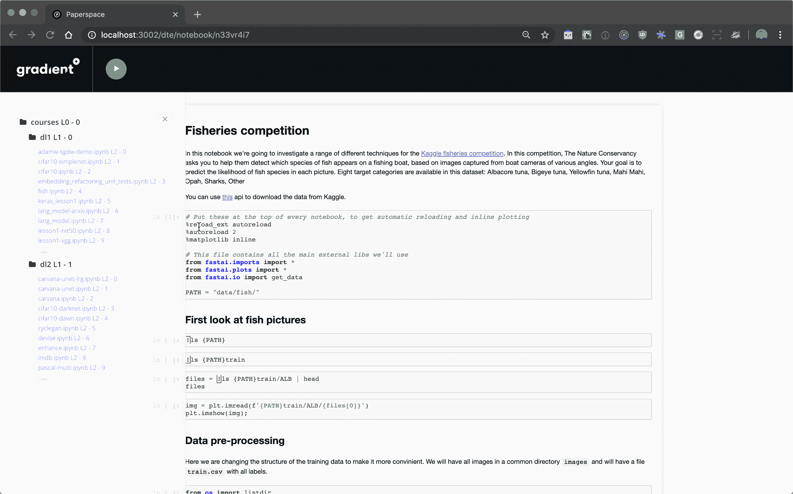

# 在免费云 gpus 上训练 ML 模型

> 原文：<https://blog.paperspace.com/free-cloud-gpu/>

当我们在 2014 年创建 Paperspace 时，我们的使命是让云 GPU 资源对每个人来说都更容易访问，更便宜。自成立以来，我们一直在提供各种各样的低成本 GPU 实例，价格往往是其他云提供商的零头。

今天，我们很高兴地宣布，我们已经将这一使命向前推进了一步。

## 介绍我们新的自由渐变 GPU 计划

我们想向您介绍我们在云中运行支持 GPU 的 Jupyter 笔记本电脑的新方法——完全免费！

* * *

### 为什么要在免费的 GPU 上运行 jupiter 笔记本

**在免费的专用云 GPU 上运行:**如果您没有经验，从任何主要提供商那里设置和运行云 GPU 都可能是一个复杂的过程。即使您是，不仅设置一个实例是不必要的时间浪费，而且可用的机器通常非常昂贵。

有了 Gradient 笔记本，您不仅不必担心设置和维护自己的实例，现在还可以在免费的专用云 GPU 实例上运行您的笔记本。

* * *

### 开始使用您的第一台免费 GPU 笔记本电脑

推出你的第一个渐变公共笔记本很简单:首先， [**注册一个免费的渐变订阅！**](https://use.paperspace.com/jupyter-notebooks) 注意:自由层中的所有笔记本默认设置为公共。

接下来，选择 M400 云 GPU 实例(运行在 NVIDIA Quadro M4000 上)或我们的高性能 C2 云 CPU 实例(英特尔至强 E5-2630 v3)。

点击“创建笔记本”，就可以了！

您可以在一个免费的专用 GPU/CPU 实例上一次运行一个渐变公共笔记本，最多 6 个小时。不要担心，您的笔记本将保持完整的版本，并且您可以重新启动您的实例来运行另外 6 个小时，次数不限。

要运行多个公共笔记本实例并访问私有笔记本，只需升级到我们的按秒付费云实例之一。

* * *

### 注册使用免费的渐变 GPU 计划

我们期待着帮助您与世界分享您的 ML 和深度学习模型。注册提前访问，让我们知道你的想法！