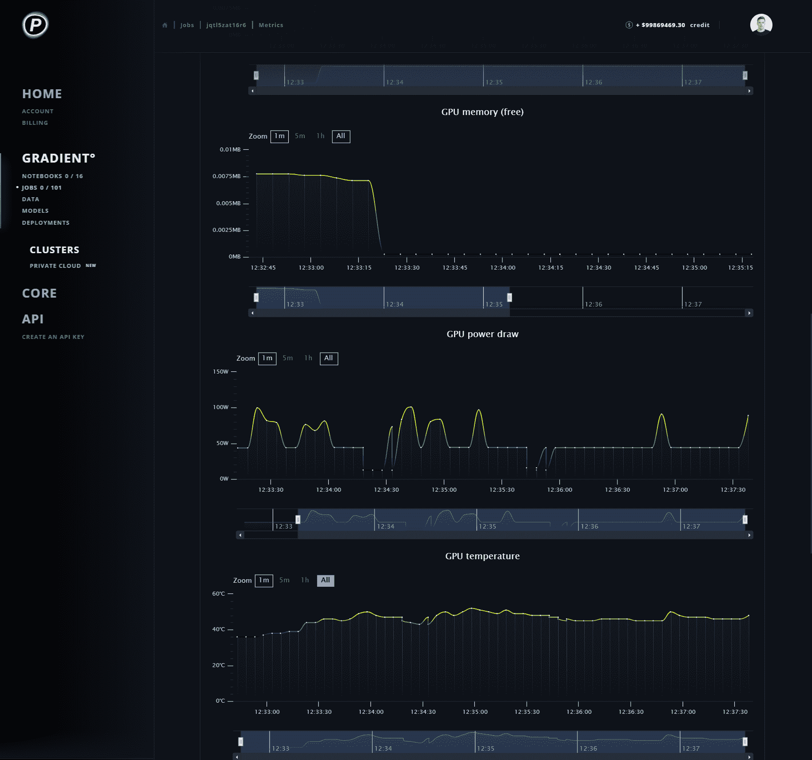
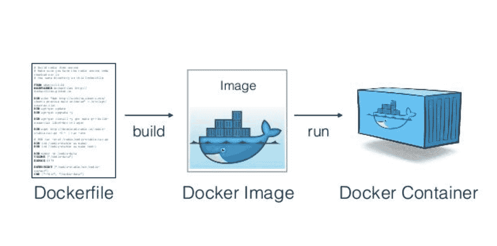
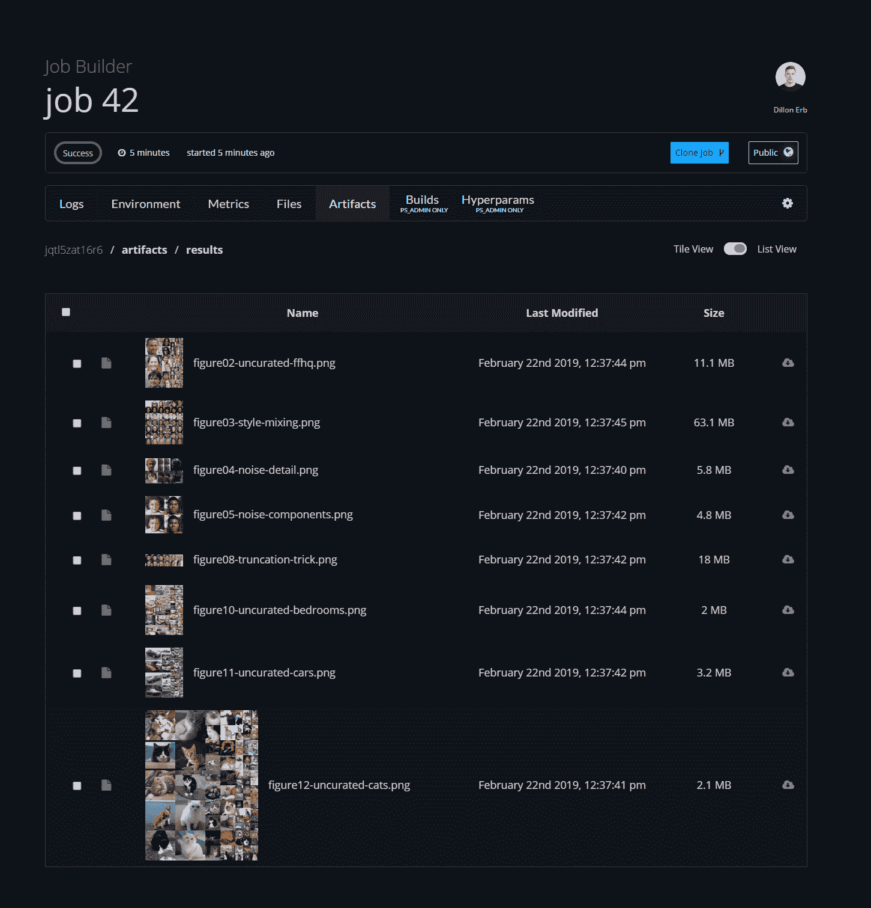
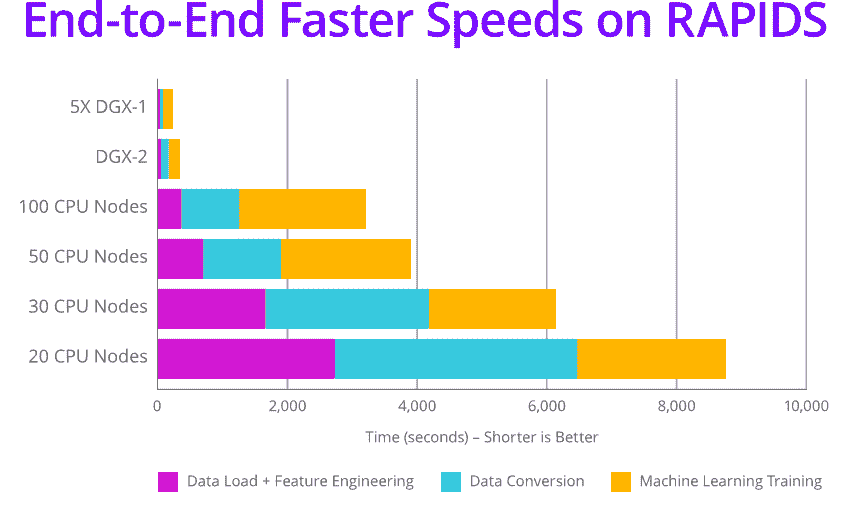

# 渐变更新(2019 年 2 月 22 日)

> 原文：<https://blog.paperspace.com/gradient-update-2-22-2019/>

[Gradient](http://paperspace.com/gradient) 已经更新，以回应来自社区的大量反馈。以下是我们最近添加的一些内容的综述:

# 新的系统和定制指标！

现在，无论何时运行作业，您都可以实时观察主机指标，包括 GPU 利用率(%)、使用的 GPU 内存、温度和负载。您还可以查看 CPU 和 RAM 利用率，以确保渐变作业按预期执行。

此外，您可以创建自己的自定义指标。在[文档](https://docs.paperspace.com/gradient/jobs/graphing-custom-metrics)中了解更多信息。

# 动态构建 docker 文件

给我们一个 Dockerfile 文件并将`--useDockerfile`命令传递给 CLI，我们将在运行它之前构建映像！也可以选择推送到公共或私有 docker 注册表。

在[文档](https://docs.paperspace.com/gradient/jobs/create-a-job#new-run-jobs-from-dockerfiles)中了解更多信息。或者克隆一个[样本任务](https://github.com/Paperspace/tf-dockerfile?utm_source=newsletter_charts-docker-stylegan&utm_medium=email&utm_campaign=build-dockerfiles-btn)到你自己的账户中！

# 新的示例项目- StyleGAN 人脸生成器！

你可能已经看到了 https://thispersondoesnotexist.com 周围的流言蜚语。在幕后，它是建立在 NVIDIA 的革命性的新风格。

只需点击一下鼠标，即可使用作业构建器和 StyleGAN 示例项目测试渐变作业。

StyleGAN in Gradient

下面是一个显示 GAN 输出的公共作业:[https://www . paper space . com/console/jobs/jqtl 5 zat 16 r 6/metrics](https://www.paperspace.com/console/jobs/jqtl5zat16r6/metrics)

# SAML 单一登录(SSO)

现在，将 Gradient 与您现有的企业部署集成在一起比以往任何时候都容易。点击了解更多[。](https://blog.paperspace.com/introducing-single-sign-on-sso/)

# 新急流笔记本容器

[www.rapids.ai](www.rapids.ai) 是一个令人兴奋的新项目，旨在将 GPU 的强大功能引入传统(非深度学习)机器学习和数据科学世界。借助 NVIDIA Rapids，您可以在 GPU 上执行数据科学和分析管道。

