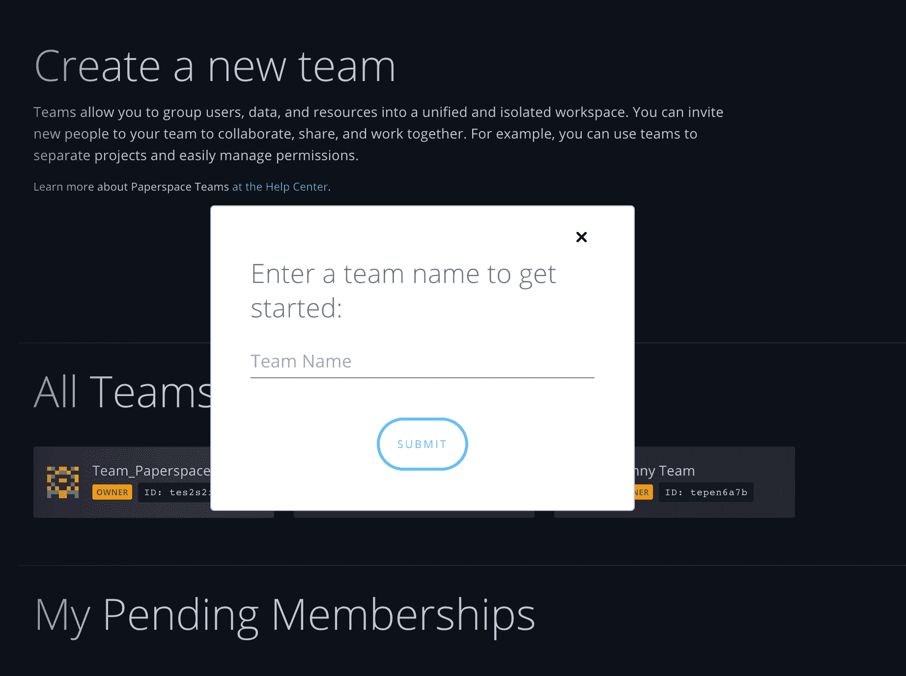

# 团队！

> 原文：<https://blog.paperspace.com/teams/>

我们的许多用户在团队(在公司、大学等)中使用 Paperspace。)在项目上合作。一个被高度要求的功能是能够在 Paperspace 中构建这些团队，现在只需几次点击就可以实现。

如果您曾经不得不管理多个 Paperspace 帐户，或者需要成为不同团队的成员，您将会喜欢这个新功能。

使用团队的一些主要原因包括:

*   立即邀请朋友和同事加入您的 Paperspace
*   共享机器、笔记本电脑、工作和存储等资源
*   整合您团队的帐单，并在一个位置管理您的订阅

### 几个音符

过去被称为“团队办公空间”的东西，现在变成了企业办公空间。业务团队将维护他们现有的所有基础设施(专用网络、共享驱动器、VPN 等),对团队的更改不会出现在他们或他们的用户帐户中。用户仍然可以从控制台中请求业务功能。

该功能目前在技术上仍处于测试阶段，但它是稳定的(当我们添加更多的铃铛和哨子时，我们会删除测试标志)。

您可以在这里探索我们的帮助中心[的团队部分。](https://support.paperspace.com/hc/en-us/categories/202541767-Teams)

💗PS 工程团队