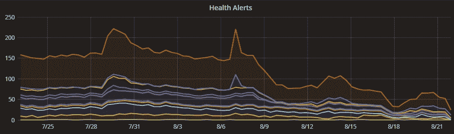

# 云可靠性和性能改进💪

> 原文：<https://blog.paperspace.com/cloud-reliability-performance-improvements/>

作为 GPU 云，我们已经走过了漫长的道路，支持超过 10 万用户，并继续快速扩展。有时，我们的增长给我们的系统带来了负担，有时是以我们无法预料的方式。在某些情况下，这种负载会对我们产品的整体性能产生影响，我们对此非常重视。

在过去的几个版本中，我们一直在进行更改，以提高事件调度程序的成功率和速度，事件调度程序是处理在 web 界面和 CLI 中触发的所有操作的核心机制。更广泛地说，我们已经做出了一致的努力，在堆栈上上下下引入更多的弹性和稳定性。这包括更严密的监控、更智能的警报、对事件和运行状况的更好洞察，以及在出现问题时投资内部工具来解决问题。目标是增加正常运行时间，更加主动，并对出现的任何情况做出更快的响应。

这种努力已经开始得到回报:我们看到我们的调度程序性能提高了 2 倍，健康警报的数量急剧下降。我们的目标是加倍努力，并在我们继续扩展时解决任何遗留问题。最重要的是，我们相信我们现有的架构是支持我们下一阶段发展的坚实基础。

谢谢你对我们的容忍。我们非常感谢我们平台的每一位用户。

💗PS 工程团队