# 深度学习中的优化介绍:Momentum、RMSProp 和 Adam

> 原文：<https://blog.paperspace.com/intro-to-optimization-momentum-rmsprop-adam/>

在另一篇文章[中，我们讨论了随机梯度下降的基本原理，以及如何解决陷入局部极小值或鞍点等问题。在这篇文章中，我们来看看另一个困扰神经网络训练的问题，**病理弯曲**。](https://blog.paperspace.com/intro-to-optimization-in-deep-learning-gradient-descent/)

虽然局部最小值和鞍点会拖延我们的训练，但病态曲率会在某种程度上减慢训练，以至于机器学习从业者可能会认为搜索已经收敛到次优马敏。让我们深入了解一下什么是病理性弯曲。

## 病理弯曲

考虑下面的损失轮廓。

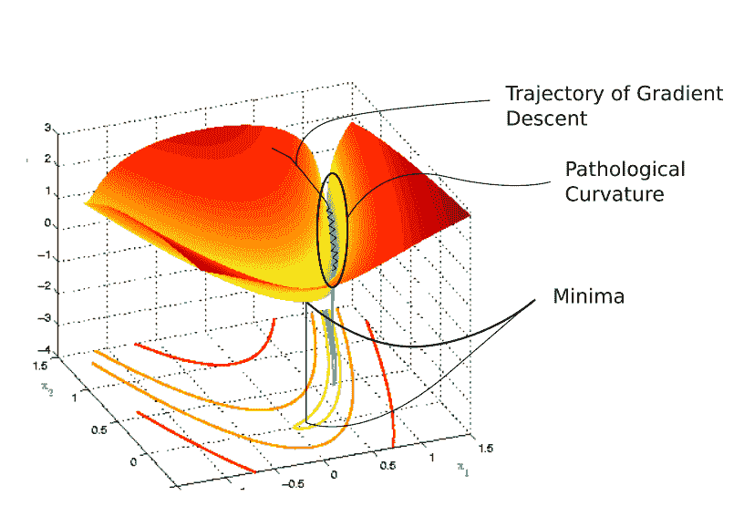

**病理弯曲* *

你看，在进入用蓝色标记的峡谷状区域之前，我们随机开始。颜色实际上代表损失函数在特定点的值有多高，红色代表最高值，蓝色代表最低值。

我们想达到最低限度，但为此我们已经走过了峡谷。这个区域就是所谓的病理弯曲。为了理解为什么称之为*病理性*，让我们深入探究一下。这是病理弯曲放大后的样子..

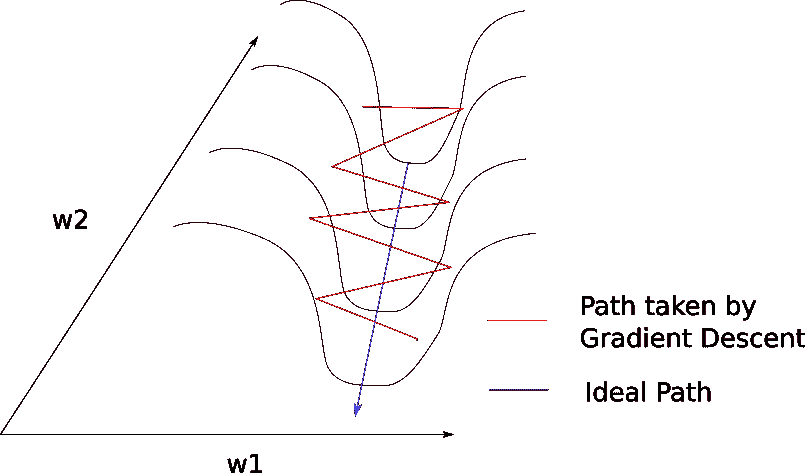

**病理弯曲* *

掌握这里发生的事情并不困难。梯度下降是沿着峡谷的山脊反弹，并向最小值缓慢移动。这是因为脊部的表面在 *w1* 的方向上弯曲得更加陡峭。

考虑山脊表面上的点 A。我们看到，该点的梯度可以分解成两个分量，一个沿方向 *w1* ，另一个沿 *w2* 。由于损失函数的曲率，梯度在 *w1* 方向上的分量要大得多，因此梯度的方向更多地朝向 *w1* ，而不是朝向 *w2* (最小值所在的方向)。

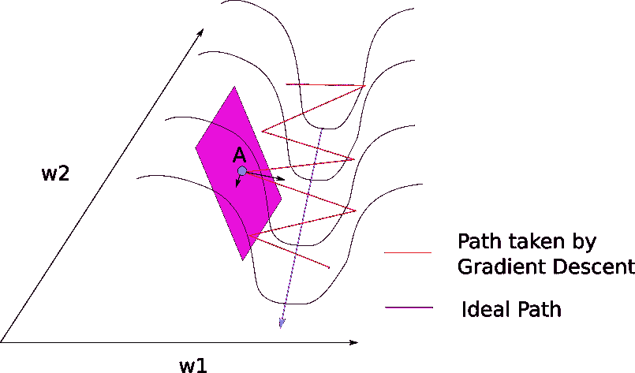

正常情况下，我们可以使用一个缓慢的学习速率来处理脊之间的反弹问题，就像我们在上一篇关于梯度下降的文章中提到的那样。然而，这意味着麻烦。

当我们接近最小值时，放慢速度是有意义的，我们希望收敛到最小值。但是考虑一下梯度下降进入病态曲率区域的点，以及到达最小值的绝对距离。如果我们使用一个较慢的学习速率，可能要花太多时间才能达到最小值。事实上，一篇[论文](http://www.cs.toronto.edu/~jmartens/docs/Deep_HessianFree.pdf)报告称，学习率小到足以防止在山脊附近反弹可能会导致练习者认为损失根本没有改善，并放弃所有训练。

> 并且如果 f 中显著减小的唯一方向是低曲率的方向，则优化可能变得太慢而不实际，甚至看起来完全停止，产生局部最小值的假象

大概我们想要的是能让我们先慢慢进入病态曲率底部的平坦区域，然后向极小值方向加速。二阶导数可以帮助我们做到这一点。

## 牛顿方法

梯度下降是一种一阶优化方法。它只考虑损失函数的一阶导数，而不考虑高阶导数。这基本上意味着它对损失函数的曲率没有任何线索。**它可以判断损失是否在下降，下降速度有多快，但不能区分曲线是平面，向上弯曲还是向下弯曲。**

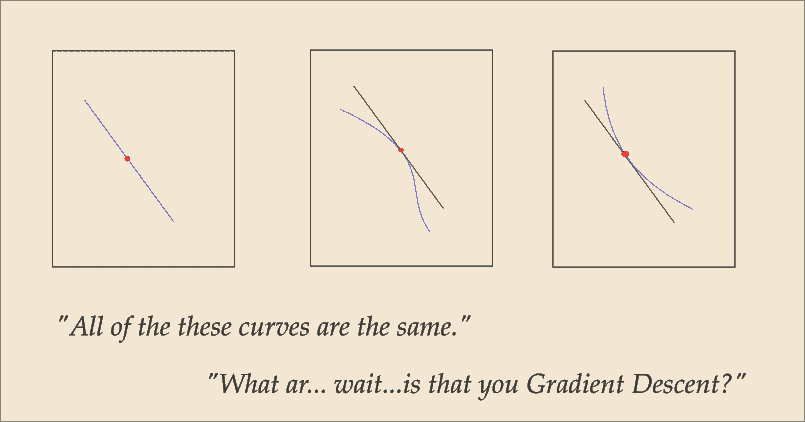

发生这种情况是因为梯度下降只关心梯度，对于上面的所有三条曲线，在红色点是相同的。解决办法？考虑二重导数，或者梯度变化的速度。

一种非常流行的技术可以使用二阶导数来解决我们的问题，这种技术叫做**牛顿法**。为了不偏离 post 的主题，我不会深入研究牛顿法的数学。我要做的是，试着建立一个直觉，牛顿方法是做什么的。

牛顿的方法可以给我们一个理想的步长向梯度方向移动。因为我们现在已经有了关于损失表面曲率的信息，所以可以相应地选择步长，以不超过具有病理曲率的区域的底部。

牛顿的方法通过计算海森矩阵来实现，海森矩阵是损失函数相对于所有权重组合的双导数的矩阵。我所说的重量组合，大概是这样的。

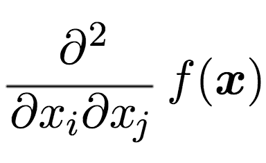

然后，一个 Hessian 矩阵将所有这些梯度累积在一个大矩阵中。
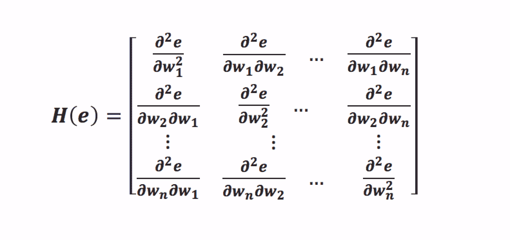

Hessian 给出了损失曲面在某一点的曲率估计。损失曲面可以有正曲率，这意味着曲面，这意味着随着我们的移动，曲面会迅速变得不那么陡峭。如果我们有一个负曲率，这意味着随着我们的移动，表面变得越来越陡。

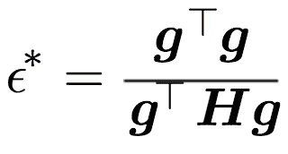

注意，如果这一步是负的，这意味着我们可以使用任意一步。换句话说，我们可以切换回原来的算法。这对应于梯度变得更陡的以下情况。

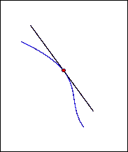

然而，如果梯度变得不那么陡，我们可能会走向病理弯曲底部的区域。在这里，牛顿的算法给了我们一个修正的学习步骤，正如你所看到的，它与曲率成反比，或者与表面变得不那么陡峭的速度成反比。

如果表面变得不太陡，则学习步骤减少。

## 那么我们为什么不更多的使用牛顿的算法呢？

你看到公式中的海森矩阵了吗？hessian 要求你计算损失函数相对于每个权重组合的梯度。如果你知道你的组合，这个值是神经网络中存在的权值的平方的**数量级。**

对于现代架构，参数的数量可能是数十亿，并且计算十亿平方梯度使得我们难以使用高阶优化方法进行计算。

然而，这里有一个想法。二阶优化是关于整合梯度如何改变自身的信息。虽然我们不能精确地计算这些信息，但我们可以根据梯度的过去行为，选择遵循引导我们寻找最优解的试探法。

## 动力

与 SGD 一起使用的一个非常流行的技术叫做**动量**。动量不是只使用当前步骤的梯度来引导搜索，而是累积过去步骤的梯度来确定前进的方向。梯度下降方程修正如下。

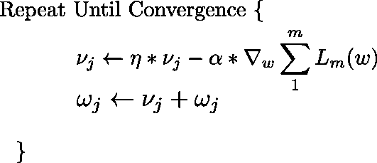

第一个方程有两部分。第一项是从以前的迭代中保留的梯度。这个保留的梯度乘以一个叫做“动量系数”的值，动量系数是每次迭代保留的梯度的百分比。

如果我们将 *v* 的初始值设置为 0，并将我们的系数选择为 0.9，则后续的更新等式将如下所示。

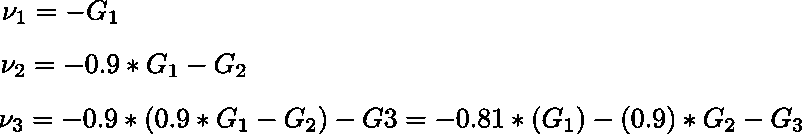

我们看到先前的梯度也被包括在随后的更新中，但是最近的先前梯度的权重大于不太近的梯度。(对于数学上的倾斜，我们取梯度步长的指数平均值)

这对我们的案子有什么帮助？考虑图像，注意大多数渐变更新是在一个*之字形*方向。还要注意，每个梯度更新已经被分解成沿着 *w1* 和 *w2* 方向的分量。如果我们将这些向量单独求和，它们沿着方向 *w1* 的分量被抵消，而沿着方向 *w2* 的分量被增强。

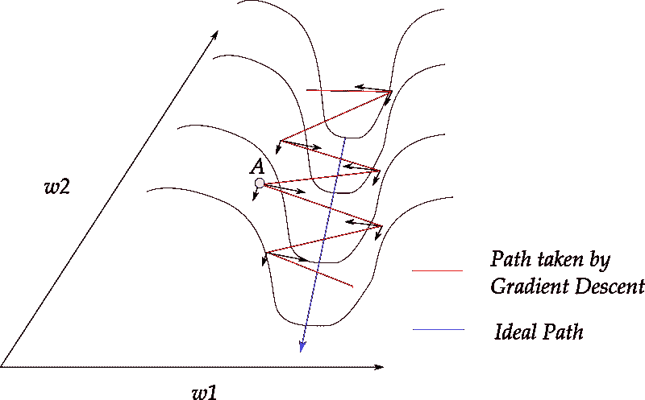

对于更新，这将增加沿 *w2* 的分量，同时将沿 *w1* 方向的分量清零。这有助于我们更快地走向最小值。由于这个原因，在我们的研究中，动量也被认为是一种抑制振荡的技术。

它也建立速度，并加快收敛，但你可能要使用模拟退火的情况下，你过了最小值。

在实践中，动量系数初始化为 0.5，并在多个时期内逐渐退火至 0.9。

## RMSProp

RMSprop 或均方根传播有一段有趣的历史。这是传奇人物杰弗里·辛顿在 Coursera 课堂上提出的一个随机想法。

RMSProp 也试图抑制振荡，但方式与动量不同。RMS prop 还消除了调整学习率的需要，并且是自动进行的。更重要的是，RMSProp 为每个参数选择不同的学习速率。

在 RMS prop 中，每次更新都是根据下述公式完成的。对每个参数分别进行更新。

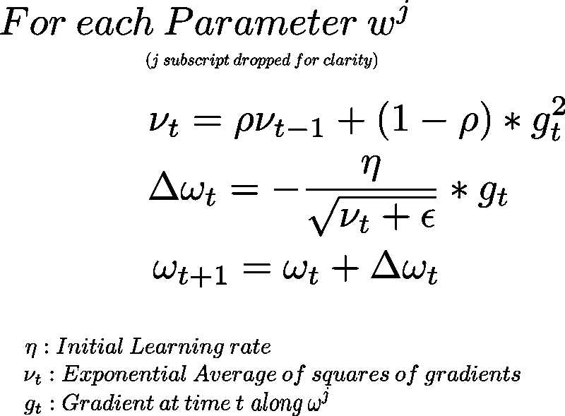

那么，让我们来分析一下这里发生了什么。

在第一个等式中，我们计算梯度平方的指数平均值。**因为我们对每个参数分别进行处理，所以这里的梯度 *Gt* 对应于投影，或者沿着我们正在更新的参数所表示的方向的梯度分量。**

为此，我们将计算出的指数平均值乘以一个超参数，用希腊符号 *nu* 表示。然后我们将当前梯度的平方乘以 *(1 - nu)* 。然后我们将它们相加，得到当前时间点的指数平均值。

我们之所以使用指数平均，是因为正如我们在动量例子中看到的，它有助于我们更多地权衡最近的梯度更新。事实上，“指数”这个名字来源于前面几项的权重呈指数下降(最近一项的权重为 *p* ，下一项为 *p* 的平方，然后是 *p* 的立方，以此类推。)

注意我们表示病理弯曲的图，沿着 *w1* 的梯度分量比沿着 *w2* 的梯度分量大得多。因为我们将它们平方并相加，所以它们不会抵消，并且对于 *w2* 更新，指数平均值很大。

然后在第二个等式中，我们决定了步长。我们沿着梯度的方向移动，但是我们的步长受到指数平均值的影响。我们选择一个初始学习率 *eta* ，然后除以平均值。在我们的例子中，由于 *w1* 的平均值比 *w2* 大得多，因此 *w1* 的学习步长比 *w2* 的学习步长小得多。因此，这将帮助我们避免在脊线之间跳跃，并向最小值移动。

第三个等式只是更新步骤。超参数 *p* 通常选择为 0.9，但是您可能需要对其进行调整。ε是等式 2，是为了确保我们最终不会被零除，一般选择为 1e-10。

还需要注意的是，RMSProp 隐式执行模拟退火。假设我们正朝着最小值前进，我们想放慢速度以免超过最小值。当步长太大时，RMSProp 会自动向最小值减小梯度步长(大的步长会使我们容易过冲)

## 圣经》和《古兰经》传统中）亚当（人类第一人的名字

到目前为止，我们已经看到 RMSProp 和 Momentum 采用了截然不同的方法。动量加速了我们在极小值方向的搜索，而 RMSProp 阻碍了我们在振荡方向的搜索。

**亚当**或**自适应力矩优化**算法结合了动量和 RMSProp 的启发式算法。这是更新方程式。

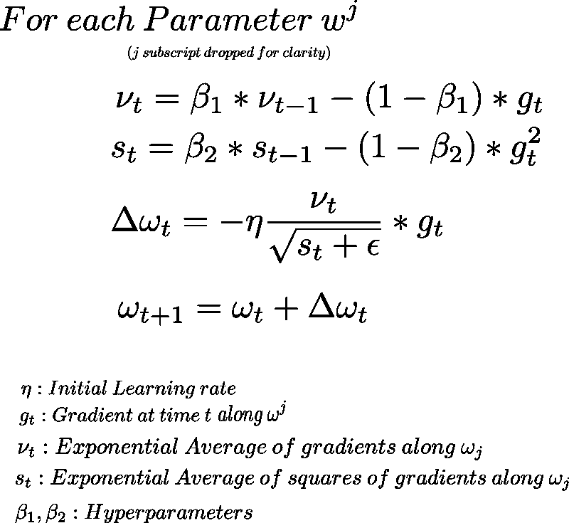

这里，我们计算梯度的指数平均值以及每个参数的梯度平方(等式 1 和等式 2)。为了决定我们的学习步骤，我们将我们的学习速率乘以梯度的平均值(动量的情况也是如此)并除以等式 3 中梯度平方的指数平均值的均方根(动量的情况也是如此)。然后，我们添加更新。

超参数*β1*一般保持在 0.9 左右，而*β2*保持在 0.99。ε一般选择为 1e-10。

## 结论

在这篇文章中，我们看到了 3 种方法来建立梯度下降，以解决病理弯曲的问题，同时加快搜索速度。这些方法通常被称为“自适应方法”，因为学习步骤是根据轮廓的拓扑来调整的。

在以上三个因素中，你可能会发现动力是最普遍的，尽管亚当在理论上看起来最有希望。实验结果表明，在损失相同的情况下，所有这些算法都能收敛到不同的最优局部极小值。然而，具有动量的 SGD 似乎比 Adam 找到更多平坦的最小值，而自适应方法倾向于快速收敛到更尖锐的最小值。平坦的最小值比尖锐的最小值概括得更好。

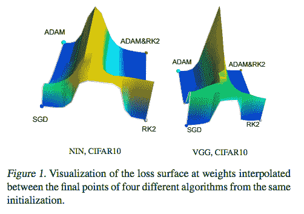

尽管自适应方法有助于我们驯服深层网络的损失函数的不规则轮廓，但它们还不够，尤其是随着网络每天变得越来越深。在选择更好的优化方法的同时，大量的研究正在进行，以提出能够产生更平滑损失函数的架构。批量规范化和剩余连接是这一努力的一部分，我们将很快在博客上详细讨论它们。但是这篇文章就说到这里。欢迎在评论中提问。

## 进一步阅读

1.  [指数加权平均值视频](https://www.youtube.com/watch?v=wJBcz7FyLzg&index=59&t=0s&list=PLBAGcD3siRDguyYYzhVwZ3tLvOyyG5k6K)
2.  [从数学角度来看，动量的精彩解释](https://distill.pub/2017/momentum/)
3.  [关于病理曲率和二阶优化的更多信息](http://www.cs.toronto.edu/~jmartens/docs/Deep_HessianFree.pdf)
4.  [论牛顿法和一般最优化](http://www.deeplearningbook.org/contents/numerical.html)