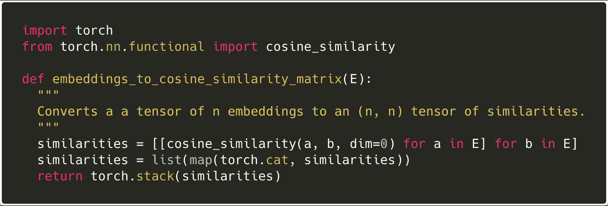
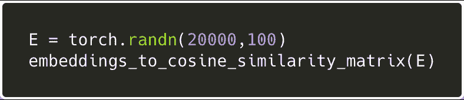
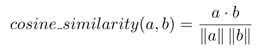
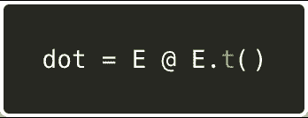
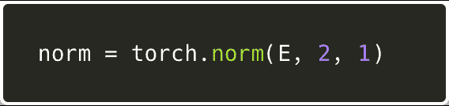
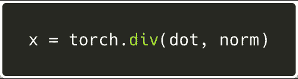
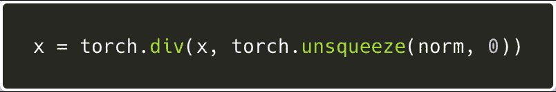

# 用 Pytorch 进行矢量化和广播

> 原文：<https://blog.paperspace.com/pytorch-vectorization-and-broadcasting/>

在 GPU 上运行机器学习代码可以获得巨大的性能提升。但是 GPU 针对需要并行执行数千次相同操作的代码进行了优化。因此，我们以这种方式编写代码也很重要。

本周早些时候，我在训练一些单词嵌入。回想一下，单词嵌入是密集向量，其被认为捕获单词含义，并且如果单词在含义上相似，则两个单词嵌入之间的距离(余弦距离或欧几里德距离)应该更小。

我想通过对单词相似度数据集(如斯坦福稀有单词相似度数据集)进行评估来评估我训练的单词嵌入的质量。单词相似度数据集收集人类对单词之间距离的判断。词汇的词语相似度数据集 *V* 可以表示为 *|V|* x *|V|* 矩阵 *S* ，其中 *S[i][j]* 表示词语 *V[i]* 和 *V[j]* 之间的相似度。

我需要写一些 Pytorch 代码来计算每对嵌入之间的余弦相似度**，从而产生一个单词嵌入相似度矩阵，我可以将它与*的*进行比较。**

下面是我的第一次尝试:

[来源](https://gist.github.com/dte/e600bb76e72854379f4a306c1873f2c2#file-loopy_cosine_similarities-py)

我们遍历嵌入矩阵`E`，并计算每对嵌入的余弦相似度`a`和`b`。这给了我们一个浮点数列表。然后我们使用`torch.cat`将每个子列表转换成一个张量，然后我们`torch.stack`将整个列表转换成一个单一的 2D(n×n)张量。

好吧，让我们看看这个愚蠢的代码是如何执行的！我们将生成 20，000 个一维单词嵌入的随机矩阵，并计算余弦相似度矩阵。

我们正在 PaperSpace 的一台强大的 P6000 机器上运行该基准测试，但是快速浏览一下`nvidia-smi`的输出显示 GPU 利用率为 0%，而`top`显示 CPU 正在努力工作。离节目结束还有 5 个小时。

现在，我们用矢量化的形式重写函数:

[来源](https://gist.github.com/dte/e600bb76e72854379f4a306c1873f2c2#file-vectorized_cosine_similarities-py)

在 P6000 上的快速性能测试表明，该函数从 20，000 个 100 维嵌入中计算相似性矩阵仅需 3.779 秒！

让我们浏览一下代码。关键的想法是，我们将余弦相似度函数分解成它的分量运算，这样我们就可以并行处理 10，000 次计算，而不是按顺序进行。

两个向量的余弦相似度就是它们之间夹角的余弦值:

1.  首先，我们将 E 与其转置矩阵相乘。
    
    这产生一个(嵌入数，嵌入数)矩阵`dot`。如果你想一想矩阵乘法是如何工作的(先相乘再求和)，你会发现每个`dot[i][j]`现在存储的是`E[i]`和`E[j]`的点积。

2.  然后，我们计算每个嵌入向量的大小。
    
    `2`表示我们正在计算每个向量的 L-2(欧氏)范数。`1`告诉 Pytorch 我们的嵌入矩阵的布局是(num _ embedding，vector_dimension)而不是(vector_dimension，num _ embedding)。
    `norm`现在是一个行矢，那里`norm[i] = ||E[i]||`。

3.  我们将每个(E[i] dot E[j])除以||E[j]||。
    
    在这里，我们正在开发一种叫做**的广播**。请注意，我们将一个矩阵(num _ embedding，num _ embedding)除以一个行向量(num _ embedding，)。在不分配更多内存的情况下，Pytorch 将*向下广播*行向量，这样我们可以想象我们被一个由 num_embeddings 行组成的矩阵分割，每个行包含原始的行向量。结果是，我们的原始矩阵中的每个单元现在都被除以||E[j]||，嵌入的幅度对应于它的列数。

4.  最后，我们除以||E[i]||:
    
    再次，我们使用广播，但这次我们先将`norm`转换成列向量，这样广播将复制列而不是行。结果是每个单元格 x[i][j]除以||E[i]||，即第 I 次嵌入的幅度。

**就是这样！**我们已经计算了包含每对嵌入之间的成对余弦相似性的矩阵，并从矢量化和广播中获得了巨大的性能提升！

**结论**
下次当你想知道为什么你的机器学习代码运行缓慢时，即使是在 GPU 上，也要考虑对任何有圈圈的代码进行矢量化！

如果你想了解更多我们在这篇博文中提到的东西，请点击以下链接:

*   [Pytorch 广播语义](https://pytorch.org/docs/master/notes/broadcasting.html)
*   [用 Word2Vec 学习单词嵌入](http://mccormickml.com/2016/04/19/word2vec-tutorial-the-skip-gram-model/)
*   [使用单词相似性任务评估单词嵌入的问题](https://arxiv.org/abs/1605.02276)