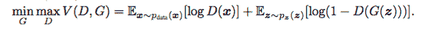
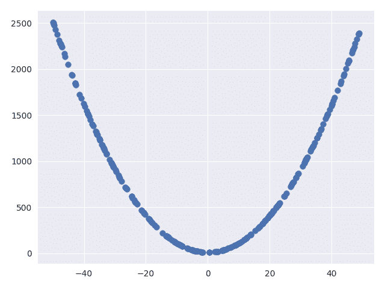
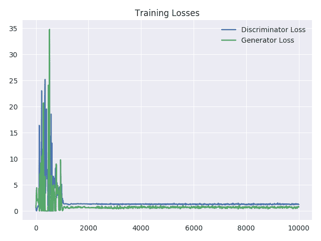
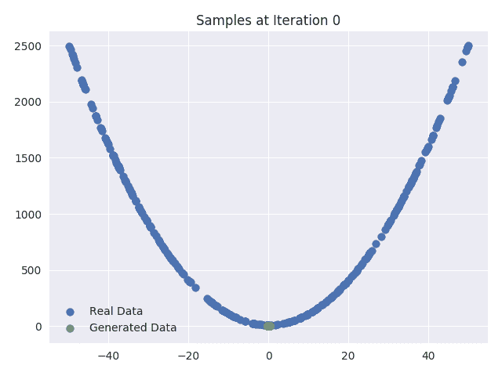
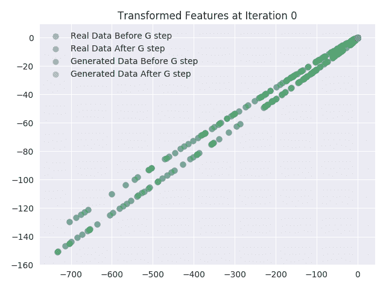
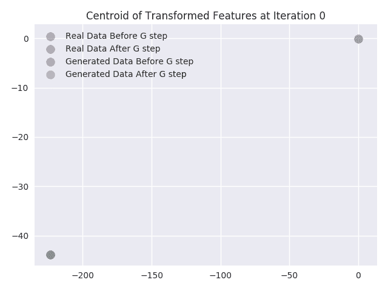

# 用张量流构建一个简单的生成式对抗网络

> 原文：<https://blog.paperspace.com/implementing-gans-in-tensorflow/>

生成对抗网络(GANs)是深度学习研究和发展中最活跃的领域之一，因为它们具有生成合成结果的惊人能力。在这篇博客中，我们将通过一个具体的例子来建立 GANs 的基本直觉。这篇文章按以下方式分类:

*   生成性对抗网络工作背后的基本思想和直觉
*   实施基于 GAN 的模型，从简单分布中生成数据
*   可视化和分析 GAN 的不同方面，以更好地了解幕后发生的事情。

这个博客的代码可以在这里找到。

## 生成对抗网络

GANs 背后的基本思想其实很简单。在它的核心，一个甘包括两个代理人与竞争的目标，通过对立的目标工作。这种相对简单的设置导致两个代理都想出越来越复杂的方法来欺骗对方。这种情况在博弈论中可以建模为**极小极大**博弈。

我们来举一个货币伪造过程的理论例子。在这个过程中，我们可以想象两种类型的特工:一个**罪犯**和一个**警察**。让我们看看他们的竞争目标:

*   **罪犯的目标:**罪犯的主要目标是想出复杂的伪造货币的方法，让**的警察**无法区分假币和真币。
*   Cop 的目标:Cop 的主要目标是想出复杂的方法来区分假币和真币。

随着这一过程的进行，警察开发出越来越复杂的技术来检测假币，而 T2 罪犯开发出越来越复杂的技术来伪造假币。这就是所谓的**对抗过程**的基础

生成对抗网络利用对抗过程来训练两个相互竞争的神经网络，直到达到理想的平衡。在这种情况下，我们有一个**生成器网络 G(Z)** ，它接受输入随机噪声，并试图生成非常接近我们数据集的数据。另一个网络被称为**鉴别器网络 D(X)** ，它接收输入的生成数据，并尝试区分生成数据和真实数据。该网络的核心实现了二元分类，并输出输入数据实际上来自真实数据集(与合成或虚假数据相对)的概率。

在形式意义上，整个过程的目标函数可以写成:



对于上述定义的 GANs，通常理想的平衡点是生成器应模拟真实数据，鉴别器应输出 0.5 的概率，因为生成的数据与真实数据相同，也就是说，不确定来自生成器的新数据是真实的还是假的，概率相等。

你可能想知道为什么需要这么复杂的学习过程？学习这样的模式有什么好处？这背后的直觉和所有的生成方法都遵循理查德·费曼的一句名言:

*T2`What I cannot create, I do not understand.`*

这是相关的，因为如果我们能够从一个模型中生成真实的数据分布，那么这意味着我们知道关于该模型的一切。很多时候，这些真实分布包括数百万张图像，我们可以使用具有数千个参数的模型来生成它们，然后这些参数捕捉到给定图像的本质。

gan 还有许多其他现实生活中的短期应用，我们将在后面的章节中讨论。

## 实施 GANs

在本节中，我们将生成一个非常简单的数据分布，并尝试学习一个使用上述 GANs 模型从该分布生成数据的生成器函数。本节大致分为三个部分。首先，我们将编写一个基本函数来生成二次分布(真实数据分布)。其次，我们为**发生器**和**鉴别器**网络编写代码。然后，我们将使用数据和网络来编写代码，以对抗的方式训练这两个网络。

这个实现的目标是学习一个新函数，它可以从与训练数据相同的分布中生成数据。来自训练的期望是我们的**生成器**网络应该开始产生遵循二次分布的数据。这将在下一节详细解释和演示。虽然我们从非常简单的数据分布开始，但是这种方法可以很容易地扩展到从更复杂的数据集生成数据。很少有示例 GANs 成功地生成手写数字、名人、动物等的图像。

### 生成训练数据

我们通过使用`numpy`库生成随机样本，然后使用某种函数生成第二个坐标，来实现我们的真实数据集。出于演示的目的，为了简单起见，我们将该函数保持为二次函数。您可以使用该代码生成一个数据集，该数据集具有更多维度和/或其特征之间更复杂的关系，例如高次多项式、正弦、余弦等。

```py
import numpy as np

def get_y(x):
    return 10 + x*x

def sample_data(n=10000, scale=100):
    data = []

    x = scale*(np.random.random_sample((n,))-0.5)

    for i in range(n):
        yi = get_y(x[i])
        data.append([x[i], yi])

    return np.array(data) 
```

生成的数据非常简单，可以绘制成图，如下所示:



### 发生器和鉴别器网络实现

我们现在将使用 tensorflow 层实现**生成器**和**鉴别器**网络。我们使用以下函数实现发电机网络:

```py
def generator(Z,hsize=[16, 16],reuse=False):
    with tf.variable_scope("GAN/Generator",reuse=reuse):
        h1 = tf.layers.dense(Z,hsize[0],activation=tf.nn.leaky_relu)
        h2 = tf.layers.dense(h1,hsize[1],activation=tf.nn.leaky_relu)
        out = tf.layers.dense(h2,2)

    return out 
```

该函数接受随机样本(Z)的`placeholder`，2 个隐藏层中单元数量的数组`hsize`，以及用于重用相同层的`reuse`变量。使用这些输入，它创建了一个具有给定节点数的 2 个隐藏层的完全连接的神经网络。这个函数的输出是一个二维向量，它对应于我们试图学习的真实数据集的维度。可以容易地修改上述函数，以包括更多的隐藏层、不同类型的层、不同的激活和不同的输出映射。

我们使用以下函数实现鉴频器网络:

```py
def discriminator(X,hsize=[16, 16],reuse=False):
    with tf.variable_scope("GAN/Discriminator",reuse=reuse):
        h1 = tf.layers.dense(X,hsize[0],activation=tf.nn.leaky_relu)
        h2 = tf.layers.dense(h1,hsize[1],activation=tf.nn.leaky_relu)
        h3 = tf.layers.dense(h2,2)
        out = tf.layers.dense(h3,1)

    return out, h3 
```

该函数从真实数据集的向量空间获取样本的输入`placeholder`。样本可以是真实样本，也可以是从发生器网络生成的样本。类似于上面的发电机网络，它也接受输入`hsize`和`reuse`。我们使用 3 个隐藏层作为鉴别器，其中前 2 层的尺寸作为输入。我们将第三个隐藏层的大小固定为 2，以便我们可以在 2D 平面中可视化转换后的特征空间，如后面的部分所述。该函数的输出是给定`X`的`logit`预测和最后一层的输出，该输出是鉴别器学习的`X`的特征变换。`logit`函数是 sigmoid 函数的逆函数，用于表示赔率的对数(变量为 1 的概率与变量为 0 的概率之比)。

### 对抗训练

出于训练的目的，我们分别为真实样本和随机噪声样本定义了以下占位符`X`和`Z`:

```py
X = tf.placeholder(tf.float32,[None,2])
Z = tf.placeholder(tf.float32,[None,2]) 
```

我们还需要创建图形，以便从生成器网络生成样本，并将真实样本和生成的样本馈送到鉴别器网络。这是通过使用上面定义的函数和占位符来完成的:

```py
G_sample = generator(Z)
r_logits, r_rep = discriminator(X)
f_logits, g_rep = discriminator(G_sample,reuse=True) 
```

使用生成数据和真实数据的逻辑，我们定义发生器和鉴别器网络的损失函数如下:

```py
disc_loss = tf.reduce_mean(tf.nn.sigmoid_cross_entropy_with_logits(logits=r_logits,labels=tf.ones_like(r_logits)) + tf.nn.sigmoid_cross_entropy_with_logits(logits=f_logits,labels=tf.zeros_like(f_logits)))
gen_loss = tf.reduce_mean(tf.nn.sigmoid_cross_entropy_with_logits(logits=f_logits,labels=tf.ones_like(f_logits))) 
```

这些损耗是基于`sigmoid cross entropy`的损耗，使用我们上面定义的公式。这是通常用于所谓的离散分类的损失函数。它将每个样本的`logit`(由我们的`discriminator`网络给出)和真实标签作为输入。然后计算每个样本的误差。我们使用 TensorFlow 实现的优化版本，它比直接计算交叉熵更稳定。更多细节，可以查看相关的 TensorFlow API [这里](https://www.tensorflow.org/api_docs/python/tf/nn/sigmoid_cross_entropy_with_logits)。

接下来，我们使用上面定义的损失函数和在`generator`和`discriminator`函数中定义的层的范围来定义两个网络的优化器。我们对两个网络都使用 RMSProp 优化器，学习率为`0.001`。使用范围，我们只获取给定网络的权重/变量。

```py
gen_vars = tf.get_collection(tf.GraphKeys.GLOBAL_VARIABLES,scope="GAN/Generator")
disc_vars = tf.get_collection(tf.GraphKeys.GLOBAL_VARIABLES,scope="GAN/Discriminator")

gen_step = tf.train.RMSPropOptimizer(learning_rate=0.001).minimize(gen_loss,var_list = gen_vars) # G Train step
disc_step = tf.train.RMSPropOptimizer(learning_rate=0.001).minimize(disc_loss,var_list = disc_vars) # D Train step 
```

然后，我们以交替的方式训练两个网络所需的步骤数:

```py
for i in range(100001):
    X_batch = sample_data(n=batch_size)
    Z_batch = sample_Z(batch_size, 2)
    _, dloss = sess.run([disc_step, disc_loss], feed_dict={X: X_batch, Z: Z_batch})
    _, gloss = sess.run([gen_step, gen_loss], feed_dict={Z: Z_batch})

    print "Iterations: %d\t Discriminator loss: %.4f\t Generator loss: %.4f"%(i,dloss,gloss) 
```

上述代码可以被修改以包括更复杂的训练过程，例如运行鉴别器和/或生成器更新的多个步骤，获取真实样本和生成样本的特征并绘制生成样本。请参考代码库了解这些修改。

## 分析 gan

### 可视化培训损失

为了更好地理解这个过程中发生了什么，我们可以在每一次`10`迭代后绘制训练损失图。从下面的图中，我们可以看到损耗的变化是如何逐渐减少的，并且在训练结束时损耗几乎保持不变。**鉴别器**
和**发生器**的损耗的这种可忽略的变化表示平衡。



### 培训期间可视化样本

我们还可以在每`1000`次迭代训练后绘制真实样本和生成样本。这些图显示了**生成器**网络如何从输入和数据集向量空间之间的随机初始映射开始，然后逐渐发展到类似真实数据集样本。正如你所看到的，“假”样本开始看起来越来越像“真实”的数据分布。



### 可视化生成器更新

在这一节中，我们设想在对抗训练过程中更新**生成器**网络权重的效果。我们通过绘制**鉴别器**网络的最后一个隐藏层的激活来做到这一点。我们选择最后一个隐藏层的大小为 2，这样就很容易绘制，不需要[降维](https://blog.paperspace.com/dimension-reduction-with-principal-component-analysis/)(即将输入样本转换到不同的向量空间)。我们对可视化由**鉴别器**网络学习的特征变换函数感兴趣。这个函数是我们的网络所学习的，这样真实和虚假的数据是可分的。

在我们更新**生成器**网络的权重之前和之后，我们绘制由**鉴别器**网络的最后一层学习的真实样本和生成样本的特征变换。我们还绘制了在输入样本的特征变换之后获得的点的质心。最后，在生成器更新之前和之后，我们分别计算真实和虚假数据的点的质心。从这些图中我们可以推断出以下事情:

*   正如所料，真实数据样本的变换特征没有变化。从图中，我们可以看到它们完全一致。
*   从质心可以看出，生成的数据样本的特征质心几乎总是向真实数据样本的特征质心移动。
*   我们还可以看到，随着迭代次数的增加，真实样本的变换特征越来越多地与生成样本的变换特征混合在一起。这也是意料之中的，因为在训练结束时，**鉴别器**网络不应该能够区分真实样本和生成样本。因此，在训练结束时，两个样本的变换特征应该一致。

 

## 讨论和未来工作

我们实施了一个概念验证 GAN 模型，用于从非常简单的数据分布中生成数据。作为对好奇读者的一个练习，我们建议修改上述代码以完成以下任务:

*   直观显示鉴别器更新前后的情况。
*   更改层的激活函数，并查看训练样本和生成样本的差异。
*   添加更多层和不同类型的层，并查看对训练时间和训练稳定性的影响。
*   修改用于生成数据的代码，以包含来自两条不同曲线的数据
*   修改上述代码以处理更复杂的数据，如 MNIST、CIFAR-10 等。

在未来的工作中，我们将讨论 GANs 的局限性以及解决这些局限性所需的修改。