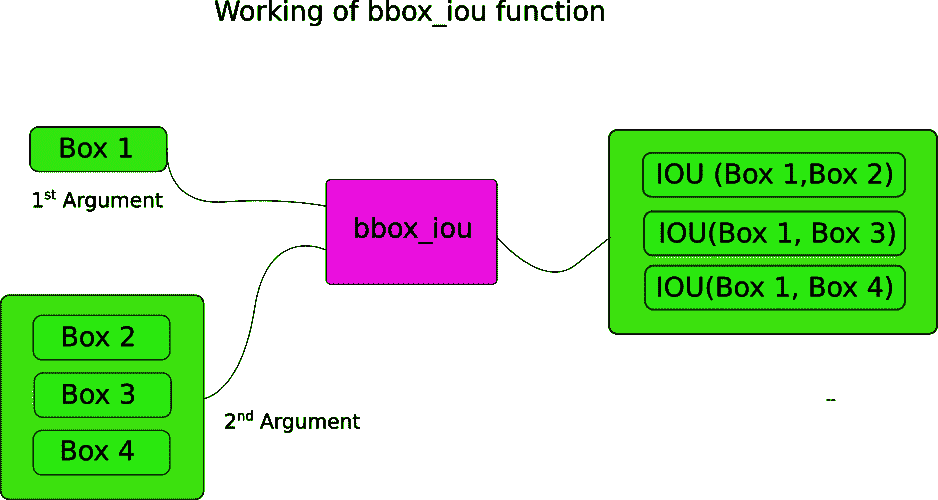

# 如何在 PyTorch 中从头开始实现 YOLO (v3)对象检测器:第 4 部分

> 原文：<https://blog.paperspace.com/how-to-implement-a-yolo-v3-object-detector-from-scratch-in-pytorch-part-4/>

图片来源:凯罗尔·马杰克。查看他的 YOLO v3 实时检测视频[这里](https://www.youtube.com/watch?v=8jfscFuP9k)

这是从头开始实现 YOLO v3 检测器教程的第 4 部分。在最后一部分，我们实现了网络的前向传递。在这一部分中，我们通过对象置信度以及随后的非最大抑制来设定检测阈值。

本教程的代码旨在运行在 Python 3.5 和 PyTorch **0.4** 上。在这个 [Github repo](https://github.com/ayooshkathuria/YOLO_v3_tutorial_from_scratch) 可以找到它的全部内容。

本教程分为 5 个部分:

1.  第一部分:了解 YOLO 是如何运作的

2.  [第 2 部分:创建网络架构的各层](https://blog.paperspace.com/how-to-implement-a-yolo-v3-object-detector-from-scratch-in-pytorch-part-2/)

3.  [第三部分:实现网络的前向传递](https://blog.paperspace.com/how-to-implement-a-yolo-v3-object-detector-from-scratch-in-pytorch-part-3/)

4.  第 4 部分(这一部分):置信阈值和非最大值抑制

5.  [第五部分:设计输入和输出管道](https://blog.paperspace.com/how-to-implement-a-yolo-v3-object-detector-from-scratch-in-pytorch-part-5/)

#### 先决条件

1.  教程的第 1-3 部分。
2.  PyTorch 的基本工作知识，包括如何使用 nn 创建定制架构。模块，nn。Sequential 和 torch.nn.parameter 类。
3.  NumPy 的基础知识

如果你在任何方面有所欠缺，这篇文章下面有一些链接供你参考。

在前面的部分中，我们已经建立了一个模型，该模型在给定输入图像的情况下输出几个对象检测。准确地说，我们的输出是一个形状为`B x 10647 x 85`的张量。b 是一批图像的数量，10647 是每个图像预测的边界框的数量，85 是边界框属性的数量。

然而，如第 1 部分所述，我们必须对我们的输出进行客观分数阈值处理和非最大抑制，以获得我在本文剩余部分称为*真*检测的结果。为此，我们将在文件`util.py`中创建一个名为`write_results`的函数

```py
def write_results(prediction, confidence, num_classes, nms_conf = 0.4): 
```

这些函数将`prediction`、`confidence`(客观分数阈值)、`num_classes`(在我们的例子中是 80)和`nms_conf`(NMS IoU 阈值)作为输入。

#### 目标置信度阈值

我们的预测张量包含关于`B x 10647`包围盒的信息。对于每个具有低于阈值的对象性分数的边界框，我们将它的每个属性(代表边界框的整行)的值设置为零。

```py
 conf_mask = (prediction[:,:,4] > confidence).float().unsqueeze(2)
    prediction = prediction*conf_mask 
```

#### 执行非最大抑制

> 注意:我假设你理解什么是 IoU(交集/并集),什么是非最大抑制。如果不是这样，请参考文章末尾的链接)。

我们现在拥有的边界框属性由中心坐标以及边界框的高度和宽度来描述。然而，使用每个盒子的一对对角的坐标，更容易计算两个盒子的 IoU。因此，我们将盒子的**(中心 x，中心 y，高度，宽度)属性转换为(左上角 x，左上角 y，右下角 x，右下角 y)。**

```py
 box_corner = prediction.new(prediction.shape)
    box_corner[:,:,0] = (prediction[:,:,0] - prediction[:,:,2]/2)
    box_corner[:,:,1] = (prediction[:,:,1] - prediction[:,:,3]/2)
    box_corner[:,:,2] = (prediction[:,:,0] + prediction[:,:,2]/2) 
    box_corner[:,:,3] = (prediction[:,:,1] + prediction[:,:,3]/2)
    prediction[:,:,:4] = box_corner[:,:,:4] 
```

每个图像中的*真*检测的数量可能不同。例如，一批大小为 3 的图像 1、2 和 3 分别具有 5、2、4 个*真*检测。因此，必须一次对一幅图像进行置信阈值处理和 NMS。这意味着，我们不能对所涉及的操作进行矢量化，必须循环遍历第一维度的`prediction`(包含一批图像的索引)。

```py
 batch_size = prediction.size(0)

    write = False

    for ind in range(batch_size):
        image_pred = prediction[ind]          #image Tensor
           #confidence threshholding 
           #NMS 
```

如前所述，`write`标志用于指示我们还没有初始化`output`，我们将使用这个张量来收集整个批次的*真*检测。

一旦进入循环，让我们稍微清理一下。注意每个边界框行有 85 个属性，其中 80 个是类分数。此时，我们只关心具有最大值的类分数。因此，我们从每一行中删除了 80 个类分数，取而代之的是添加具有最大值的类的索引，以及该类的类分数。

```py
 max_conf, max_conf_score = torch.max(image_pred[:,5:5+ num_classes], 1)
        max_conf = max_conf.float().unsqueeze(1)
        max_conf_score = max_conf_score.float().unsqueeze(1)
        seq = (image_pred[:,:5], max_conf, max_conf_score)
        image_pred = torch.cat(seq, 1) 
```

还记得我们已经将对象置信度小于阈值的边界框行设置为零吗？让我们摆脱他们。

```py
 non_zero_ind =  (torch.nonzero(image_pred[:,4]))
        try:
            image_pred_ = image_pred[non_zero_ind.squeeze(),:].view(-1,7)
        except:
            continue

        #For PyTorch 0.4 compatibility
        #Since the above code with not raise exception for no detection 
        #as scalars are supported in PyTorch 0.4
        if image_pred_.shape[0] == 0:
            continue 
```

try-except 块用于处理没有检测到的情况。在这种情况下，我们使用`continue`来跳过这个图像的其余循环体。

现在，让我们在图像中检测类别。

```py
 #Get the various classes detected in the image
        img_classes = unique(image_pred_[:,-1]) # -1 index holds the class index 
```

由于同一个类可能有多个*真*检测，我们使用一个名为`unique`的函数来获取任何给定图像中存在的类。

```py
def unique(tensor):
    tensor_np = tensor.cpu().numpy()
    unique_np = np.unique(tensor_np)
    unique_tensor = torch.from_numpy(unique_np)

    tensor_res = tensor.new(unique_tensor.shape)
    tensor_res.copy_(unique_tensor)
    return tensor_res 
```

然后，我们按班级表演 NMS。

```py
 for cls in img_classes:
            #perform NMS 
```

一旦我们进入循环，我们做的第一件事就是提取特定类的检测(用变量`cls`表示)。

> 下面的代码在原始代码文件中缩进了三个块，但是我没有在这里缩进，因为这一页的空间有限。

```py
#get the detections with one particular class
cls_mask = image_pred_*(image_pred_[:,-1] == cls).float().unsqueeze(1)
class_mask_ind = torch.nonzero(cls_mask[:,-2]).squeeze()
image_pred_class = image_pred_[class_mask_ind].view(-1,7)

#sort the detections such that the entry with the maximum objectness
s#confidence is at the top
conf_sort_index = torch.sort(image_pred_class[:,4], descending = True )[1]
image_pred_class = image_pred_class[conf_sort_index]
idx = image_pred_class.size(0)   #Number of detections 
```

现在，我们表演 NMS。

```py
for i in range(idx):
    #Get the IOUs of all boxes that come after the one we are looking at 
    #in the loop
    try:
        ious = bbox_iou(image_pred_class[i].unsqueeze(0), image_pred_class[i+1:])
    except ValueError:
        break

    except IndexError:
        break

    #Zero out all the detections that have IoU > treshhold
    iou_mask = (ious < nms_conf).float().unsqueeze(1)
    image_pred_class[i+1:] *= iou_mask       

    #Remove the non-zero entries
    non_zero_ind = torch.nonzero(image_pred_class[:,4]).squeeze()
    image_pred_class = image_pred_class[non_zero_ind].view(-1,7) 
```

这里，我们使用一个函数`bbox_iou`。第一个输入是由循环中的变量`i`索引的边界框行。

`bbox_iou`的第二个输入是多行边界框的张量。函数`bbox_iou`的输出是包含由第一输入表示的边界框的 IoUs 的张量，每个边界框出现在第二输入中。


如果我们有两个相同类别的边界框，其 IoU 大于阈值，那么具有较低类别置信度的边界框被消除。我们已经挑选出了包围盒，具有较高置信度的包围盒位于顶部。

在循环体中，下面几行给出了框的 IoU，由`i`索引，所有边界框的索引都高于`i`。

```py
ious = bbox_iou(image_pred_class[i].unsqueeze(0), image_pred_class[i+1:]) 
```

每次迭代，如果索引大于`i`的任何边界框具有大于阈值`nms_thresh`的 IoU(由`i`索引的框)，则该特定框被消除。

```py
#Zero out all the detections that have IoU > treshhold
iou_mask = (ious < nms_conf).float().unsqueeze(1)
image_pred_class[i+1:] *= iou_mask       

#Remove the non-zero entries
non_zero_ind = torch.nonzero(image_pred_class[:,4]).squeeze()
image_pred_class = image_pred_class[non_zero_ind] 
```

还要注意，我们将计算`ious`的代码行放在了一个 try-catch 块中。这是因为循环被设计成运行`idx`次迭代(T2 中的行数)。然而，随着循环的进行，一些边界框可能会从`image_pred_class`中移除。这意味着，即使从`image_pred_class`中移除一个值，我们也不能进行`idx`次迭代。因此，我们可能会尝试索引一个越界的值(`IndexError`)，或者切片`image_pred_class[i+1:]`可能会返回一个空张量，指定哪个触发了`ValueError`。在这一点上，我们可以确定 NMS 不能删除更多的边界框，我们打破了循环。

###### 计算欠条

下面是函数`bbox_iou`。

```py
def bbox_iou(box1, box2):
    """
    Returns the IoU of two bounding boxes 

    """
    #Get the coordinates of bounding boxes
    b1_x1, b1_y1, b1_x2, b1_y2 = box1[:,0], box1[:,1], box1[:,2], box1[:,3]
    b2_x1, b2_y1, b2_x2, b2_y2 = box2[:,0], box2[:,1], box2[:,2], box2[:,3]

    #get the corrdinates of the intersection rectangle
    inter_rect_x1 =  torch.max(b1_x1, b2_x1)
    inter_rect_y1 =  torch.max(b1_y1, b2_y1)
    inter_rect_x2 =  torch.min(b1_x2, b2_x2)
    inter_rect_y2 =  torch.min(b1_y2, b2_y2)

    #Intersection area
    inter_area = torch.clamp(inter_rect_x2 - inter_rect_x1 + 1, min=0) * torch.clamp(inter_rect_y2 - inter_rect_y1 + 1, min=0)

    #Union Area
    b1_area = (b1_x2 - b1_x1 + 1)*(b1_y2 - b1_y1 + 1)
    b2_area = (b2_x2 - b2_x1 + 1)*(b2_y2 - b2_y1 + 1)

    iou = inter_area / (b1_area + b2_area - inter_area)

    return iou 
```

#### 写预测

函数`write_results`输出形状为 D×8 的张量。这里 D 是所有图像中的*真*检测，每一个由一行表示。每个检测有 8 个属性，即检测所属批次中图像的**索引、 **4 个角坐标、客观分数、最大置信度类的分数以及该类的索引。****

就像以前一样，我们不初始化我们的输出张量，除非我们有一个检测分配给它。一旦它被初始化，我们就将后续的检测连接到它。我们使用`write`标志来表示张量是否已经初始化。**在遍历类**的循环结束时，我们将得到的检测结果添加到张量`output`中。

```py
 batch_ind = image_pred_class.new(image_pred_class.size(0), 1).fill_(ind)      
            #Repeat the batch_id for as many detections of the class cls in the image
            seq = batch_ind, image_pred_class

            if not write:
                output = torch.cat(seq,1)
                write = True
            else:
                out = torch.cat(seq,1)
                output = torch.cat((output,out)) 
```

在函数结束时，我们检查`output`是否已经初始化。如果没有，意味着在该批次的任何图像中没有一个检测到。在这种情况下，我们返回 0。

```py
 try:
        return output
    except:
        return 0 
```

这就是这篇文章的内容。在这篇文章的最后，我们终于有了一个张量形式的预测，它以行的形式列出了每个预测。现在唯一剩下的就是创建一个输入管道来从磁盘读取图像，计算预测，在图像上绘制边界框，然后显示/写入这些图像。这是我们在下一个[部分](https://blog.paperspace.com/how-to-implement-a-yolo-v3-object-detector-from-scratch-in-pytorch-part-5/)要做的事情。

#### 进一步阅读

1.  [PyTorch 教程](http://pytorch.org/tutorials/beginner/deep_learning_60min_blitz.html)
2.  [借据](https://www.youtube.com/watch?v=DNEm4fJ-rto)
3.  [非最大抑制](https://www.youtube.com/watch?v=A46HZGR5fMw)
4.  [非最大抑制](https://www.google.co.in/search?q=NMS+python&oq=NMS+python+&aqs=chrome..69i57j35i39.2657j0j7&sourceid=chrome&ie=UTF-8)

Ayoosh Kathuria 目前是印度国防研究与发展组织的实习生，他致力于改进粒状视频中的物体检测。当他不工作的时候，他不是在睡觉就是在用吉他弹奏平克·弗洛伊德。你可以在 [LinkedIn](https://www.linkedin.com/in/ayoosh-kathuria-44a319132/) 上和他联系，或者在[GitHub](https://github.com/ayooshkathuria)T5 上看看他做了些什么