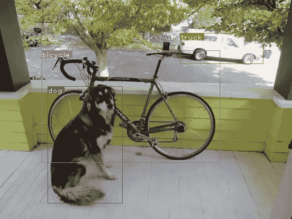

# 如何在 PyTorch 中从头开始实现 YOLO (v3)对象检测器:第 5 部分

> 原文：<https://blog.paperspace.com/how-to-implement-a-yolo-v3-object-detector-from-scratch-in-pytorch-part-5/>

图片来源:凯罗尔·马杰克。查看他的 YOLO v3 实时检测视频[这里](https://www.youtube.com/watch?v=8jfscFuP9k)

这是从头开始实现 YOLO v3 检测器教程的第 5 部分。在最后一部分中，我们实现了一个函数来将网络的输出转换成检测预测。有了可用的检测器，剩下的工作就是创建输入和输出管道。

本教程的代码旨在运行在 Python 3.5 和 PyTorch **0.4** 上。在这个 [Github repo](https://github.com/ayooshkathuria/YOLO_v3_tutorial_from_scratch) 可以找到它的全部内容。

本教程分为 5 个部分:

1.  第一部分:了解 YOLO 是如何运作的

2.  [第 2 部分:创建网络架构的各层](https://blog.paperspace.com/how-to-implement-a-yolo-v3-object-detector-from-scratch-in-pytorch-part-2/)

3.  [第三部分:实现网络的前向传递](https://blog.paperspace.com/how-to-implement-a-yolo-v3-object-detector-from-scratch-in-pytorch-part-3/)

4.  [第 4 部分:置信阈值和非最大值抑制](https://blog.paperspace.com/how-to-implement-a-yolo-v3-object-detector-from-scratch-in-pytorch-part-4/)

5.  第 5 部分(这一部分):设计输入和输出管道

#### 先决条件

1.  教程的第 1-4 部分。
2.  PyTorch 的基本工作知识，包括如何使用 nn 创建定制架构。模块，nn。Sequential 和 torch.nn.parameter 类。
3.  OpenCV 的基础知识

***编辑**:如果你在 2018 年 3 月 30 日之前访问过这篇文章，我们将任意大小的图像调整到 Darknet 的输入大小的方法就是简单地重新调整尺寸。然而，在最初的实现中，图像被调整大小，保持纵横比不变，并填充被省略的部分。例如，如果我们要将一个 1900 x 1280 的图像调整为 416 x 415，调整后的图像将如下所示。*


准备输入的这种差异导致早期实现的性能比最初的稍差。不过，帖子已经更新，加入了最初实现中的调整大小方法

在这一部分中，我们将构建检测器的输入和输出管道。这包括从磁盘上读取图像，进行预测，使用预测在图像上绘制边界框，然后将它们保存到磁盘上。我们还将介绍如何让检测机在摄像头或视频上实时工作。我们将引入一些命令行标志，以允许对网络的各种超参数进行一些实验。让我们开始吧。

> 注意:你需要为这部分安装 OpenCV 3。

在巡回检测器文件中创建一个文件`detector.py`。在它的顶部添加必要的进口商品。

```py
from __future__ import division
import time
import torch 
import torch.nn as nn
from torch.autograd import Variable
import numpy as np
import cv2 
from util import *
import argparse
import os 
import os.path as osp
from darknet import Darknet
import pickle as pkl
import pandas as pd
import random 
```

#### 创建命令行参数

因为`detector.py`是我们将执行来运行我们的检测器的文件，所以最好有我们可以传递给它的命令行参数。我已经用 python 的`ArgParse`模块做到了。

```py
def arg_parse():
    """
    Parse arguements to the detect module

    """

    parser = argparse.ArgumentParser(description='YOLO v3 Detection Module')

    parser.add_argument("--images", dest = 'images', help = 
                        "Image / Directory containing images to perform detection upon",
                        default = "imgs", type = str)
    parser.add_argument("--det", dest = 'det', help = 
                        "Image / Directory to store detections to",
                        default = "det", type = str)
    parser.add_argument("--bs", dest = "bs", help = "Batch size", default = 1)
    parser.add_argument("--confidence", dest = "confidence", help = "Object Confidence to filter predictions", default = 0.5)
    parser.add_argument("--nms_thresh", dest = "nms_thresh", help = "NMS Threshhold", default = 0.4)
    parser.add_argument("--cfg", dest = 'cfgfile', help = 
                        "Config file",
                        default = "cfg/yolov3.cfg", type = str)
    parser.add_argument("--weights", dest = 'weightsfile', help = 
                        "weightsfile",
                        default = "yolov3.weights", type = str)
    parser.add_argument("--reso", dest = 'reso', help = 
                        "Input resolution of the network. Increase to increase accuracy. Decrease to increase speed",
                        default = "416", type = str)

    return parser.parse_args()

args = arg_parse()
images = args.images
batch_size = int(args.bs)
confidence = float(args.confidence)
nms_thesh = float(args.nms_thresh)
start = 0
CUDA = torch.cuda.is_available() 
```

其中重要的标志有`images`(用于指定输入图像或图像目录)`det`(保存检测的目录)`reso`(输入图像的分辨率，可用于速度-精度的权衡)`cfg`(备选配置文件)`weightfile`。

#### 加载网络

从[这里](https://raw.githubusercontent.com/ayooshkathuria/YOLO_v3_tutorial_from_scratch/master/data/coco.names)下载文件`coco.names`，这个文件包含 COCO 数据集中对象的名称。在探测器目录下创建一个文件夹`data`。同样，如果你在 linux 上，你可以输入。

```py
mkdir data
cd data
wget https://raw.githubusercontent.com/ayooshkathuria/YOLO_v3_tutorial_from_scratch/master/data/coco.names 
```

然后，我们在程序中加载类文件。

```py
num_classes = 80    #For COCO
classes = load_classes("data/coco.names") 
```

`load_classes`是在`util.py`中定义的一个函数，它返回一个字典，该字典将每个类的索引映射到它的名称字符串。

```py
def load_classes(namesfile):
    fp = open(namesfile, "r")
    names = fp.read().split("\n")[:-1]
    return names 
```

初始化网络并加载权重。

```py
#Set up the neural network
print("Loading network.....")
model = Darknet(args.cfgfile)
model.load_weights(args.weightsfile)
print("Network successfully loaded")

model.net_info["height"] = args.reso
inp_dim = int(model.net_info["height"])
assert inp_dim % 32 == 0 
assert inp_dim > 32

#If there's a GPU availible, put the model on GPU
if CUDA:
    model.cuda()

#Set the model in evaluation mode
model.eval() 
```

#### 读取输入图像

从磁盘或目录中读取图像。图像的路径存储在一个名为`imlist`的列表中。

```py
read_dir = time.time()
#Detection phase
try:
    imlist = [osp.join(osp.realpath('.'), images, img) for img in os.listdir(images)]
except NotADirectoryError:
    imlist = []
    imlist.append(osp.join(osp.realpath('.'), images))
except FileNotFoundError:
    print ("No file or directory with the name {}".format(images))
    exit() 
```

`read_dir`是用来测量时间的检查点。(我们会遇到几个这样的例子)

如果由`det`标志定义的保存检测的目录不存在，则创建它。

```py
if not os.path.exists(args.det):
    os.makedirs(args.det) 
```

我们将使用 OpenCV 来加载图像。

```py
load_batch = time.time()
loaded_ims = [cv2.imread(x) for x in imlist] 
```

又是一个检查站。

OpenCV 将图像作为 numpy 数组加载，BGR 作为颜色通道的顺序。PyTorch 的图像输入格式为(批次 x 通道 x 高度 x 宽度)，通道顺序为 RGB。因此，我们在`util.py`中编写函数`prep_image`，将 numpy 数组转换成 PyTorch 的输入格式。

在我们写这个函数之前，我们必须写一个函数`letterbox_image`来调整我们的图像，保持长宽比一致，并用颜色(128，128，128)填充剩下的区域

```py
def letterbox_image(img, inp_dim):
    '''resize image with unchanged aspect ratio using padding'''
    img_w, img_h = img.shape[1], img.shape[0]
    w, h = inp_dim
    new_w = int(img_w * min(w/img_w, h/img_h))
    new_h = int(img_h * min(w/img_w, h/img_h))
    resized_image = cv2.resize(img, (new_w,new_h), interpolation = cv2.INTER_CUBIC)

    canvas = np.full((inp_dim[1], inp_dim[0], 3), 128)

    canvas[(h-new_h)//2:(h-new_h)//2 + new_h,(w-new_w)//2:(w-new_w)//2 + new_w,  :] = resized_image

    return canvas 
```

现在，我们编写一个获取 OpenCV 图像并将其转换为网络输入的函数。

```py
def prep_image(img, inp_dim):
    """
    Prepare image for inputting to the neural network. 

    Returns a Variable 
    """

    img = cv2.resize(img, (inp_dim, inp_dim))
    img = img[:,:,::-1].transpose((2,0,1)).copy()
    img = torch.from_numpy(img).float().div(255.0).unsqueeze(0)
    return img 
```

除了转换后的图像之外，我们还维护一个原始图像列表和一个包含原始图像尺寸的列表`im_dim_list`。

```py
#PyTorch Variables for images
im_batches = list(map(prep_image, loaded_ims, [inp_dim for x in range(len(imlist))]))

#List containing dimensions of original images
im_dim_list = [(x.shape[1], x.shape[0]) for x in loaded_ims]
im_dim_list = torch.FloatTensor(im_dim_list).repeat(1,2)

if CUDA:
    im_dim_list = im_dim_list.cuda() 
```

#### 创建批处理

```py
leftover = 0
if (len(im_dim_list) % batch_size):
   leftover = 1

if batch_size != 1:
   num_batches = len(imlist) // batch_size + leftover            
   im_batches = [torch.cat((im_batches[i*batch_size : min((i +  1)*batch_size,
                       len(im_batches))]))  for i in range(num_batches)] 
```

#### 检测回路

我们迭代批次，生成预测，并连接我们必须对其执行检测的所有图像的预测张量(形状为 D×8，是`write_results`函数的输出)。

对于每一批，我们测量检测所需的时间，即从获取输入到产生`write_results`函数的输出所花费的时间。在`write_prediction`返回的输出中，其中一个属性是批量图像的索引。我们以这样一种方式转换这个特定的属性，它现在表示图像在`imlist`中的索引，这个列表包含所有图像的地址。

之后，我们打印每次检测所用的时间以及每幅图像中检测到的对象。

如果批处理的`write_results`函数的输出是一个`int` (0)，意味着没有检测，我们使用`continue`来跳过剩余的循环。

```py
write = 0
start_det_loop = time.time()
for i, batch in enumerate(im_batches):
    #load the image 
    start = time.time()
    if CUDA:
        batch = batch.cuda()

    prediction = model(Variable(batch, volatile = True), CUDA)

    prediction = write_results(prediction, confidence, num_classes, nms_conf = nms_thesh)

    end = time.time()

    if type(prediction) == int:

        for im_num, image in enumerate(imlist[i*batch_size: min((i +  1)*batch_size, len(imlist))]):
            im_id = i*batch_size + im_num
            print("{0:20s} predicted in {1:6.3f} seconds".format(image.split("/")[-1], (end - start)/batch_size))
            print("{0:20s} {1:s}".format("Objects Detected:", ""))
            print("----------------------------------------------------------")
        continue

    prediction[:,0] += i*batch_size    #transform the atribute from index in batch to index in imlist 

    if not write:                      #If we have't initialised output
        output = prediction  
        write = 1
    else:
        output = torch.cat((output,prediction))

    for im_num, image in enumerate(imlist[i*batch_size: min((i +  1)*batch_size, len(imlist))]):
        im_id = i*batch_size + im_num
        objs = [classes[int(x[-1])] for x in output if int(x[0]) == im_id]
        print("{0:20s} predicted in {1:6.3f} seconds".format(image.split("/")[-1], (end - start)/batch_size))
        print("{0:20s} {1:s}".format("Objects Detected:", " ".join(objs)))
        print("----------------------------------------------------------")

    if CUDA:
        torch.cuda.synchronize() 
```

第`torch.cuda.synchronize`行确保 CUDA 内核与 CPU 同步。否则，一旦 GPU 作业排队，CUDA 内核就会在 GPU 作业完成之前将控制权返回给 CPU(异步调用)。如果`end = time.time()`在 GPU 作业实际结束之前被打印，这可能会导致误导时间。

现在，我们有了张量输出中所有图像的检测。让我们在图像上画出边界框。

#### 在图像上绘制边界框

我们使用一个 try-catch 块来检查是否进行了单次检测。如果不是这样，退出程序。

```py
try:
    output
except NameError:
    print ("No detections were made")
    exit() 
```

在我们绘制边界框之前，包含在输出张量中的预测符合网络的输入大小，而不是图像的原始大小。因此，在我们绘制边界框之前，让我们将每个边界框的角属性转换为图像的原始尺寸。

在我们绘制边界框之前，输出张量中包含的预测是对填充图像的预测，而不是对原始图像的预测。仅仅将它们重新缩放到输入图像的尺寸在这里是行不通的。我们首先需要根据包含原始图像的填充图像上的区域边界来转换要测量的框的坐标。

```py
im_dim_list = torch.index_select(im_dim_list, 0, output[:,0].long())

scaling_factor = torch.min(inp_dim/im_dim_list,1)[0].view(-1,1)

output[:,[1,3]] -= (inp_dim - scaling_factor*im_dim_list[:,0].view(-1,1))/2
output[:,[2,4]] -= (inp_dim - scaling_factor*im_dim_list[:,1].view(-1,1))/2 
```

现在，我们的坐标与填充区域的图像尺寸一致。然而，在函数`letterbox_image`中，我们用一个比例因子调整了图像的两个维度(记住两个维度都用一个公共因子划分以保持纵横比)。我们现在取消这种重新缩放，以获得原始图像上边界框的坐标。

```py
output[:,1:5] /= scaling_factor 
```

现在，让我们将任何可能具有图像外部边界的边界框裁剪到图像的边缘。

```py
for i in range(output.shape[0]):
    output[i, [1,3]] = torch.clamp(output[i, [1,3]], 0.0, im_dim_list[i,0])
    output[i, [2,4]] = torch.clamp(output[i, [2,4]], 0.0, im_dim_list[i,1]) 
```

如果图像中有太多的边界框，用一种颜色绘制它们可能不是一个好主意。将此[文件](https://github.com/ayooshkathuria/YOLO_v3_tutorial_from_scratch/raw/master/pallete)下载到您的探测器文件夹中。这是一个腌制的文件，包含许多颜色可以随机选择。

```py
class_load = time.time()
colors = pkl.load(open("pallete", "rb")) 
```

现在让我们写一个画方框的函数。

```py
draw = time.time()

def write(x, results, color):
    c1 = tuple(x[1:3].int())
    c2 = tuple(x[3:5].int())
    img = results[int(x[0])]
    cls = int(x[-1])
    label = "{0}".format(classes[cls])
    cv2.rectangle(img, c1, c2,color, 1)
    t_size = cv2.getTextSize(label, cv2.FONT_HERSHEY_PLAIN, 1 , 1)[0]
    c2 = c1[0] + t_size[0] + 3, c1[1] + t_size[1] + 4
    cv2.rectangle(img, c1, c2,color, -1)
    cv2.putText(img, label, (c1[0], c1[1] + t_size[1] + 4), cv2.FONT_HERSHEY_PLAIN, 1, [225,255,255], 1);
    return img 
```

上面的函数用从`colors`中随机选择的颜色绘制了一个矩形。它还在边界框的左上角创建一个填充矩形，并在填充矩形上写入检测到的对象的类。`cv2.rectangle`函数的`-1`参数用于创建填充矩形。

我们在本地定义了`write`函数，这样它就可以访问`colors`列表。我们也可以把`colors`作为一个参数，但是那会让我们每张图片只使用一种颜色，这违背了我们想要做的目的。

一旦我们定义了这个函数，现在让我们在图像上绘制边界框。

```py
list(map(lambda x: write(x, loaded_ims), output)) 
```

上面的代码片段在中修改了`loaded_ims` **中的图像。**

通过在图像名称前加上前缀“det_”来保存每个图像。我们创建一个地址列表，用于保存我们的检测图像。

```py
det_names = pd.Series(imlist).apply(lambda x: "{}/det_{}".format(args.det,x.split("/")[-1])) 
```

最后，将检测到的图像写入`det_names`中的地址。

```py
list(map(cv2.imwrite, det_names, loaded_ims))
end = time.time() 
```

#### 打印时间摘要

在检测器的最后，我们将打印一份摘要，其中包含代码的哪一部分执行了多长时间。当我们必须比较不同的超参数如何影响检测机的速度时，这是很有用的。当在命令行上执行脚本`detection.py`时，可以设置超参数，如批量大小、对象置信度和 NMS 阈值(分别用`bs`、`confidence`、`nms_thresh`标志传递)。

```py
print("SUMMARY")
print("----------------------------------------------------------")
print("{:25s}: {}".format("Task", "Time Taken (in seconds)"))
print()
print("{:25s}: {:2.3f}".format("Reading addresses", load_batch - read_dir))
print("{:25s}: {:2.3f}".format("Loading batch", start_det_loop - load_batch))
print("{:25s}: {:2.3f}".format("Detection (" + str(len(imlist)) +  " images)", output_recast - start_det_loop))
print("{:25s}: {:2.3f}".format("Output Processing", class_load - output_recast))
print("{:25s}: {:2.3f}".format("Drawing Boxes", end - draw))
print("{:25s}: {:2.3f}".format("Average time_per_img", (end - load_batch)/len(imlist)))
print("----------------------------------------------------------")

torch.cuda.empty_cache() 
```

#### 测试对象检测器

例如，在终端上运行，

```py
python detect.py --images dog-cycle-car.png --det det 
```

产生输出

> 下面的代码在 CPU 上运行。预计 GPU 上的检测时间要快得多。在特斯拉 K80 上大约是 0.1 秒/图像。

```py
Loading network.....
Network successfully loaded
dog-cycle-car.png    predicted in  2.456 seconds
Objects Detected:    bicycle truck dog
----------------------------------------------------------
SUMMARY
----------------------------------------------------------
Task                     : Time Taken (in seconds)

Reading addresses        : 0.002
Loading batch            : 0.120
Detection (1 images)     : 2.457
Output Processing        : 0.002
Drawing Boxes            : 0.076
Average time_per_img     : 2.657
---------------------------------------------------------- 
```

名为`det_dog-cycle-car.png`的图像保存在`det`目录中。



#### 在视频/网络摄像头上运行检测机

为了在视频或网络摄像头上运行检测器，代码几乎保持不变，只是我们不需要迭代批次，而是视频的帧。

在视频上运行检测器的代码可以在 github 存储库中的文件`video.py`中找到。代码与`detect.py`非常相似，除了一些变化。

首先，我们在 OpenCV 中打开视频/摄像机提要。

```py
videofile = "video.avi" #or path to the video file. 

cap = cv2.VideoCapture(videofile)  

#cap = cv2.VideoCapture(0)  for webcam

assert cap.isOpened(), 'Cannot capture source'

frames = 0 
```

我们以类似于迭代图像的方式迭代帧。

许多代码在许多地方都得到了简化，因为我们不再需要处理批处理，而是一次只处理一个图像。这是因为一次只能出现一帧。这包括用一个元组代替张量用于`im_dim_list`和在`write`函数中的微小变化。

每次迭代，我们都在一个名为`frames`的变量中记录捕获的帧数。然后，我们将这个数字除以从第一帧开始打印视频的 FPS 所经过的时间。

代替使用`cv2.imwrite`将检测图像写入磁盘，我们使用`cv2.imshow`显示其上绘制有边界框的帧。如果用户按下`Q`按钮，就会导致代码中断循环，视频结束。

```py
frames = 0  
start = time.time()

while cap.isOpened():
    ret, frame = cap.read()

    if ret:   
        img = prep_image(frame, inp_dim)
#        cv2.imshow("a", frame)
        im_dim = frame.shape[1], frame.shape[0]
        im_dim = torch.FloatTensor(im_dim).repeat(1,2)   

        if CUDA:
            im_dim = im_dim.cuda()
            img = img.cuda()

        output = model(Variable(img, volatile = True), CUDA)
        output = write_results(output, confidence, num_classes, nms_conf = nms_thesh)

        if type(output) == int:
            frames += 1
            print("FPS of the video is {:5.4f}".format( frames / (time.time() - start)))
            cv2.imshow("frame", frame)
            key = cv2.waitKey(1)
            if key & 0xFF == ord('q'):
                break
            continue
        output[:,1:5] = torch.clamp(output[:,1:5], 0.0, float(inp_dim))

        im_dim = im_dim.repeat(output.size(0), 1)/inp_dim
        output[:,1:5] *= im_dim

        classes = load_classes('data/coco.names')
        colors = pkl.load(open("pallete", "rb"))

        list(map(lambda x: write(x, frame), output))

        cv2.imshow("frame", frame)
        key = cv2.waitKey(1)
        if key & 0xFF == ord('q'):
            break
        frames += 1
        print(time.time() - start)
        print("FPS of the video is {:5.2f}".format( frames / (time.time() - start)))
    else:
        break 
```

#### 结论

在这一系列教程中，我们已经从头实现了一个对象检测器，并为达到这一步而欢呼。我仍然认为，能够生成高效代码是深度学习实践者可能拥有的最被低估的技能之一。无论你的想法多么具有革命性，除非你能检验它，否则毫无用处。为此，你需要有很强的编码技能。

我还了解到，了解深度学习中任何主题的最佳方式是实现代码。它迫使你浏览一个你在阅读论文时可能会错过的主题的细微但基本的微妙之处。我希望这一系列教程能够锻炼你作为深度学习实践者的技能。

#### 进一步阅读

1.  [PyTorch 教程](http://pytorch.org/tutorials/beginner/deep_learning_60min_blitz.html)
2.  [OpenCV 基础知识](https://pythonprogramming.net/loading-images-python-opencv-tutorial/)
3.  [Python ArgParse](www.pythonforbeginners.com/argparse/argparse-tutorial)

Ayoosh Kathuria 目前是印度国防研究与发展组织的实习生，他致力于改进粒状视频中的物体检测。当他不工作的时候，他不是在睡觉就是在用吉他弹奏平克·弗洛伊德。你可以在 [LinkedIn](https://www.linkedin.com/in/ayoosh-kathuria-44a319132/) 上和他联系，或者在[GitHub](https://github.com/ayooshkathuria)T5 上看看他做了些什么