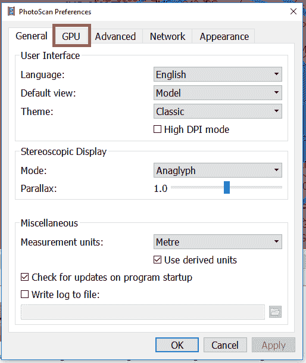
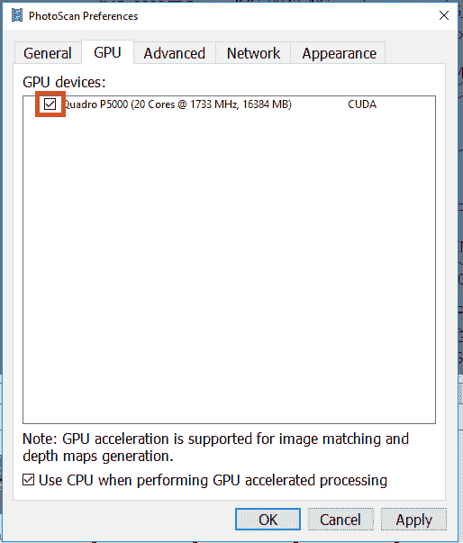
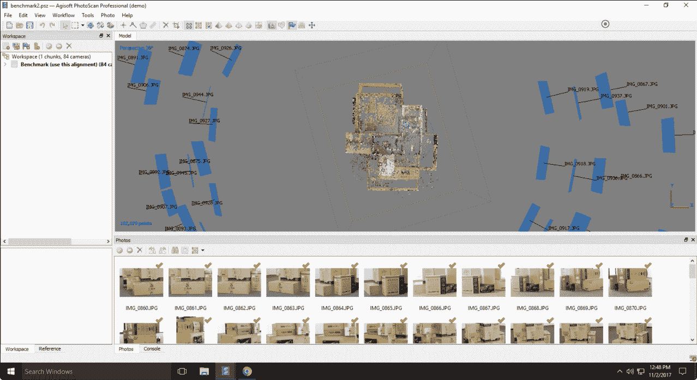
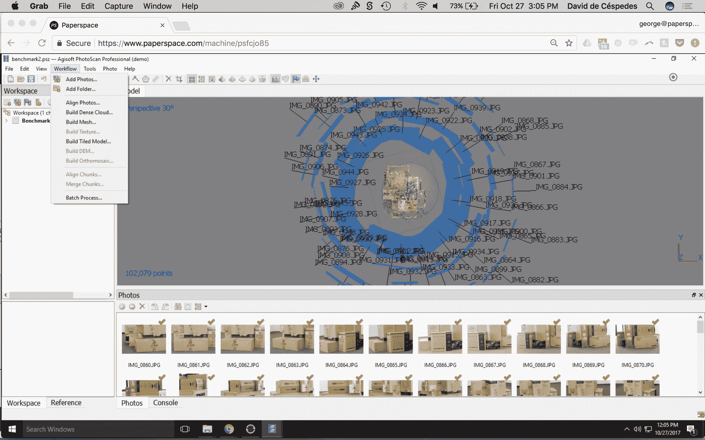
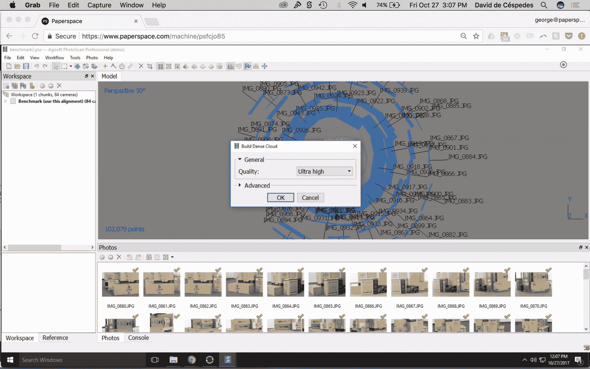
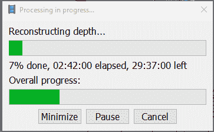
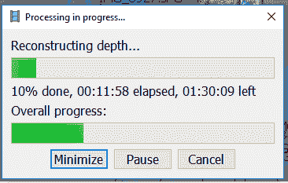

# Agisoft Photoscan 中的 GPU 加速

> 原文：<https://blog.paperspace.com/gpu-acceleration-in-agisoft-photoscan/>

## 如何在 Photoscan 中启用 GPU 加速

借助 Paperspace 强大的 GPU 和 Photoscan 的 GPU 加速工作流，大型图像数据集的处理可以在几小时内完成，而不是几天。本演练将介绍使用 Photoscan 和 Paperspace 进行 GPU 加速的强大功能。

想要更多曝光？

如果您希望您的摄影测量工作流程以 Paperspace 为特色，请给我们发电子邮件至 hello@paperspace.com，或发推特给我们，包括标签#PoweredByPaperspace

## **教程大纲**

*   [GPU 加速](#gpu)
    1.  观察
*   [启用和禁用](#enable)
    1.  偏好；喜好；优先；参数选择
*   [CPU vs GPU](#benchmark)

    1.  中央处理器
*   [结论](#conclusion)

### **1。** GPU 加速

Agisoft Photoscan 能够在处理图像数据集时利用机器的 CPU 或 GPU。借助他们的 GPU 加速功能，通常需要近几天才能完成的工作现在只需几个小时。

这种速度的提高在很大程度上取决于项目、图像数量、图像大小和图像内容。根据经验，具有高重叠、高图像内容以及大量关键点的项目从加速中获益更多。

那么，我们如何在图纸空间中实现这一点呢？

### **2。**启用和禁用 GPU 处理

可以在处理选项中启用或禁用 GPU 的使用:

1.  在菜单栏中，点击*首选项*
2.  选择 *GPU* 。
3.  在 GPU 部分，选择或取消选择 GPU 设备。

### **3。** CPU vs GPU

我们在 Paperspace 的 P5000 上收集了一些有用的 CPU 和 GPU 性能指标评测。

我们使用 Agisoft 提供的基准文件，以便在超高设置上构建密集云模型。

**基准模型统计数据**

*   84 台摄像机(图像)
*   图像尺寸:5184 x 3456

**基准测试步骤**

1.  在菜单栏中，点击*工作流>构建密云* 

2.  选择超高质量。

3.  选择确定。

**P5000 - CPU**

注:为了测试 CPU - GPU 应该被禁用。

这个模型估计需要 32 个小时来完成处理。

**P5000 - GPU + CPU**
注意:确保在 GPU 选项卡中也启用了 CPU。

这个模型估计需要 1.75 小时来完成处理。

### **4。**结论

Photoscan 的 GPU 加速是一个强大的功能，可以利用 Paperspace 的 NVIDIA GPU 基础设施。在 CPU 和 GPU 之间的简单基准测试中，我们展示了 Paperspace 的基础设施可以为 Photoscan 中的 GPU 加速摄影测量带来的巨大收益。我们希望您能在[hello@paperspace.com](mailto:hello@paperspace.com)与我们分享自己的成果和经验。

您可以从他们的[用户手册中了解更多关于 Agisoft Photoscan 和图像捕捉最佳实践的信息。](http://www.agisoft.com/downloads/user-manuals/)

尽情享受吧！

要用 Photoscan 建立自己的摄影测量工作室，请在此注册。

我们需要你的帮助！

我们正在寻找专注于 IT 工作流和机器学习的内容作家、爱好者和研究人员，以帮助建立我们的社区。给 hello@paperspace.com 发电子邮件，附上写作范例和教学想法