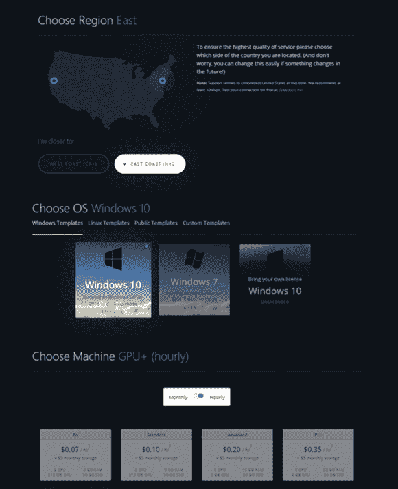
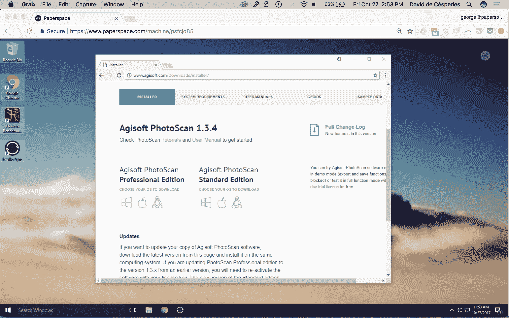
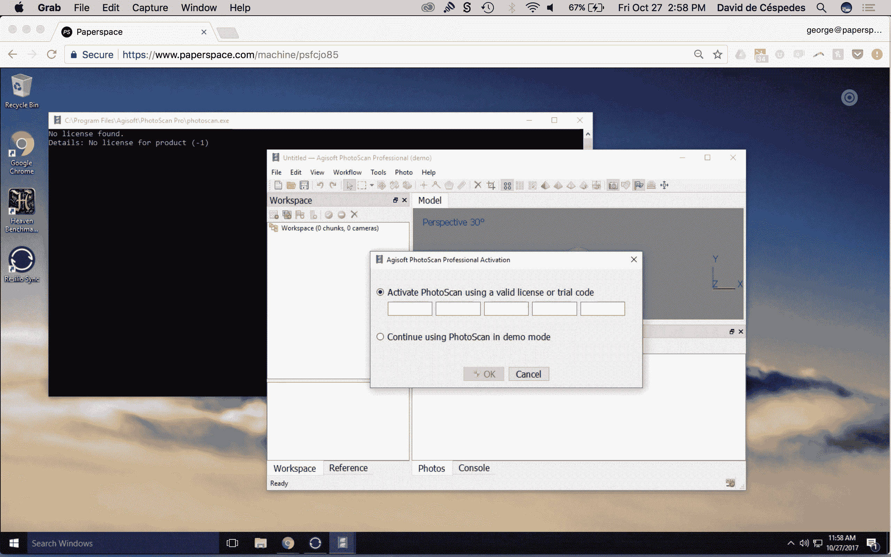

# 如何开始使用 Agisoft Photoscan

> 原文：<https://blog.paperspace.com/how-to-get-started-with-agisoft-photoscan/>

## 什么是 Photoscan？

Agisoft Photoscan 是一种摄影测量解决方案，广泛应用于建筑行业，用于从现有场地、建筑内部和外部生成 3D 模型。借助 Paperspace 强大的 GPU 和 Photoscan 的 GPU 加速工作流，大型图像数据集的处理可以在几小时内完成，而不是几天。本演练将涵盖安装和许可证转移。

想要更多曝光？

如果您希望您的摄影测量工作流程以 Paperspace 为特色，请给我们发电子邮件至 hello@paperspace.com，或发推特给我们，包括标签#PoweredByPaperspace

## **教程大纲**

*   [发动机器](#launch)

    1.  机器建议
*   [安装照片扫描仪](#install)
    1.  下载并安装 Photoscan
*   [转让现有许可](#transfer)
    *   激活
    1.  钝化作用
*   [结论](#conclusion)

### **1。**创造一种新的纸张空间机器

登录到 Paperspace 后，创建一台新机器。

*   选择最近的*区域*

*   选择 Windows 或 Linux *模板*

*   选择*每月*或*每小时*，这取决于您希望如何使用 Photoscan。然而，摄影测量工作流可能在每小时的基础上更具成本效益。

*   选择你的*计划*:

    *   **摄影测量(高性能):**为了利用 Photoscan 的 GPU 加速，需要一台*专用的 GPU* 机器( *GPU+* 、 *P5000* 、 *P6000* )。 *GPU+* 非常适用于较小的对象或图像集，而 *P5000* 和 *P6000* 则专为最大性能而设计，即大型图像数据集。
*   选择您的*存储* —您可以在未来随时增加存储，但我们强烈建议您使用 1TB 或更大容量来管理大型数据集。

*   点击*创建*

### **2。**安装 Agisoft Photoscan

**步骤 1 -下载安装程序**

[下载链接](http://www.agisoft.com/downloads/installer/)

**步骤 2 -运行安装程序**

**步骤 3 -打开 Photoscan 并激活许可证**

**第 4 步-照片扫描现在可以处理了！**

Photoscan 提供了示例数据，您可以使用这些数据开始工作。你可以在这里下载。

[样本数据链接](http://www.agisoft.com/downloads/sample-data/)

### **3。**将 Agisoft Photoscan 的本地许可证转移到 Paperspace

如果您已经拥有 Photoscan 的许可证，并希望将其转移到 Paperspace，您的节点锁定许可证(单机版或教育版)可以通过 Photoscan 的停用/激活过程从本地计算机移动到 Paperspace。

要在初始机器上停用 Agisoft PhotoScan，请导航至:

*   帮助菜单->激活产品命令->停用按钮。

停用许可证后，请登录到您的 Paperspace 计算机，并从以下位置运行激活过程:

*   帮助菜单->激活产品命令->输入许可证密钥->按激活产品按钮

也可以从命令行(终端)使用- activate 或- deactivate 参数来激活和停用，例如(在 Windows 上):

`photoscan.exe --activate 11111-22222-33333-44444-55555`

相同的许可证对 Windows 或 Linux 有效。

注意:卸载 Agisoft PhotoScan 不会自动停用许可证。如果您在停用之前卸载了软件，请重新安装 Agisoft PhotoScan 并运行停用程序，如上所述。

### **4。**结论

仅在几分钟内，我们就能够启动并运行 Photoscan。摄影测量是各行各业的重要工作流程，我们很高兴为强大的基础设施提供一个简单的界面，可以为更多人开启这些工作流程。

您可以从他们的[用户手册中了解更多关于 Agisoft Photoscan 和图像捕捉最佳实践的信息。](http://www.agisoft.com/downloads/user-manuals/)

对于 GPU 加速，请参考我们的帖子，其中包括关于 Paperspace 硬件的基准测试。

尽情享受吧！

要用 Photoscan 建立自己的摄影测量工作室，请在此注册。

我们需要你的帮助！

我们正在寻找专注于 IT 工作流和机器学习的内容作家、爱好者和研究人员，以帮助建立我们的社区。给 hello@paperspace.com 发电子邮件，附上写作范例和教学想法