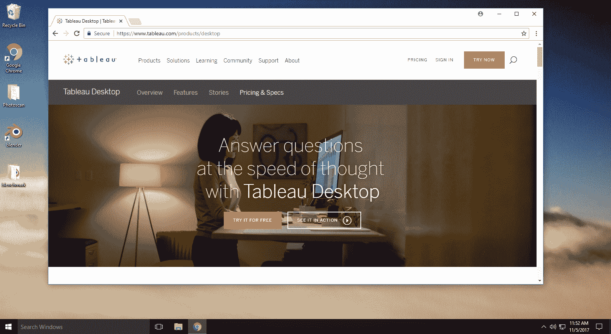
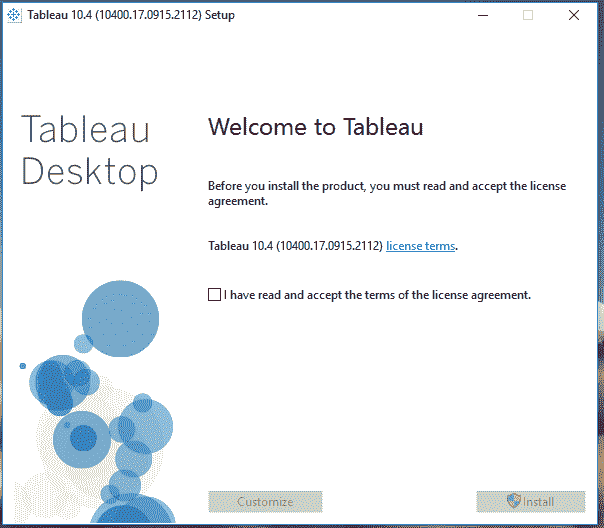
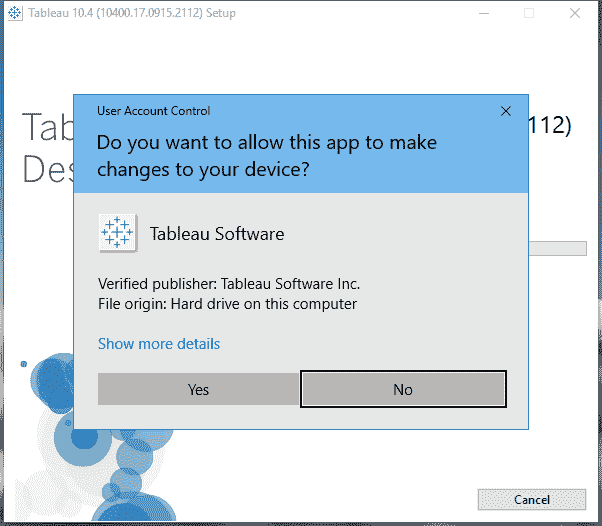
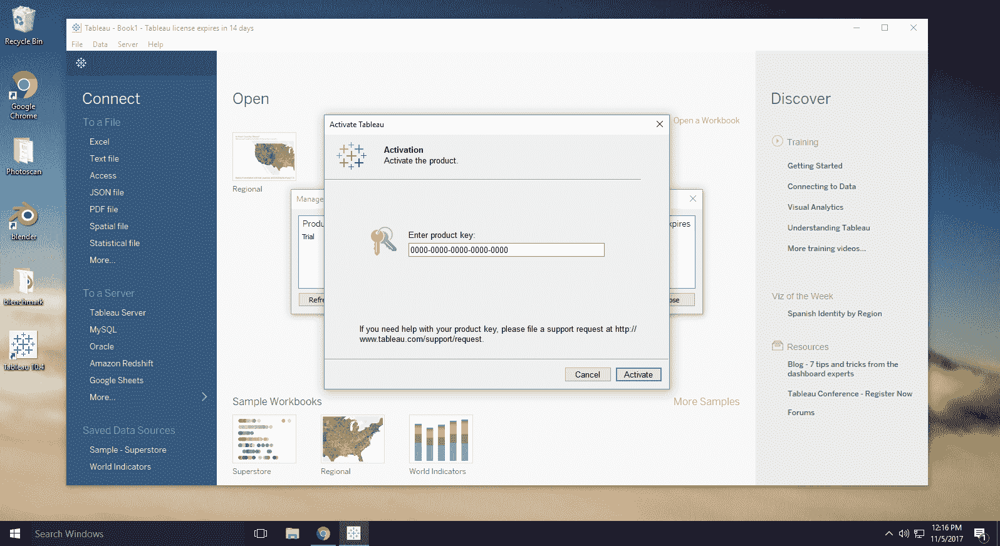
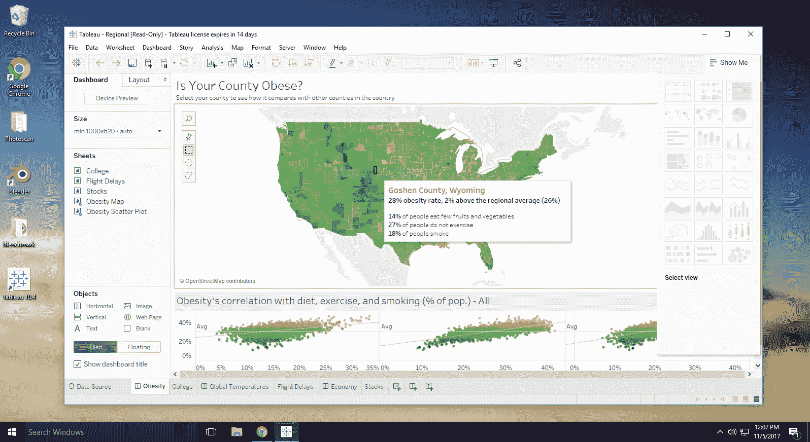

# 如何在 Chromebook 上运行 Tableau

> 原文：<https://blog.paperspace.com/how-to-run-tableau-on-chromebook/>

## 什么是 Tableau 桌面？

Tableau Desktop 是一个商业分析解决方案，可以可视化数据并提供来自几乎任何数据源的见解。它是为协作而构建的，可以处理大量数据。Chromebooks 和其他瘦客户端为团队提供了廉价的硬件来支持协作，但不能满足 Tableau 桌面的要求。借助 Paperspace，数据分析师团队可以在 Chromebooks(和任何其他设备)上的安全云环境中轻松地进行远程协作。

想要更多曝光？

如果您希望您的数据科学工作流以 Paperspace 为特色，请给我们发送电子邮件至 hello@paperspace.com，或发推特给我们，包括标签#PoweredByPaperspace

## **教程大纲**

*   [发动机器](#launch)

    1.  机器建议
*   [Tableau 桌面需求](#requirements)
    1.  推荐的纸张空间机器
*   [找到您的产品密钥](#locate)
    1.  客户门户
*   [下载并安装 Tableau 桌面](#install)
    1.  注册
*   [GPU 加速用 Tableau 桌面](#gpu)

    1.  运动能力
*   [结论](#conclusion)

### **1。**创造一种新的纸张空间机器

登录到 Paperspace 后，创建一台新机器。

*   选择最近的*区域*

*   选择一个 Windows *模板*

*   根据您的需要选择*每月*或*每小时*。

*   选择你的*计划*:

    *   **数据分析:**由于 Tableau Desktop 不像其他平台那样利用 GPU 加速，我们建议至少采用*标准计划*。也可以参考下面的 [GPU 加速数据库](#gpu)。
*   选择您的*存储* —您可以在未来的任何时候增加您的存储，但我们强烈建议您使用 500GB 或更大的容量来管理大型数据集。

*   点击*创建*

### **2。** Tableau 桌面需求

要安装 Tableau Desktop，您需要:

*   [**安装程序**](https://www.tableau.com/products/desktop)

*   **您的产品密钥。**

    该字符串将您标识为 Tableau 客户，并且是激活产品所必需的。下面我们将讨论如何找到您的产品密钥。

    注意:如果您是学生或教师，您可以访问他们的学术计划页面申请许可证，并获得有关如何下载您自己的 Tableau Desktop 副本的说明。你也可以尝试 14 天的免费试用。

### **3。**找到您的产品密钥

在您购买 Tableau Desktop 后，Tableau 会向您发送一封欢迎电子邮件，其中包含您登录其客户门户所需的信息。您的产品密钥位于客户门户网站中。安装过程完成后，您需要产品密钥来激活 Tableau Desktop。如果您在登录客户入口网站页面时遇到问题，或者如果您在检索产品密钥时需要帮助，请联系客户服务并提供您的姓名、公司、电话号码和电子邮件地址。

按照以下步骤找到您的产品密钥，以便您在进入激活步骤时做好准备。

**查找您的产品密钥**

*   使用您的电子邮件地址和 Tableau 提供的密码登录 Tableau 网站上的客户门户页面。

*   点击**我的钥匙。**

*   从表中的“密钥名称”列复制您的产品密钥。把这把钥匙准备好并保管好。

*   安装并激活 Tableau Desktop 后，您还可以从工具栏菜单的*帮助>管理产品密钥下查看电脑上使用的产品密钥。*

### **4。**下载并安装 Tableau 桌面

要安装 Tableau Desktop:

1.  将安装程序下载到您的 Paperspace 计算机中。

    有关 Tableau Desktop 的最新版本，请访问客户门户网站页面。在“产品下载”部分，单击下载用于 Windows 64 位的 Tableau 桌面安装程序。
    

2.  运行安装程序。
    

3.  允许更改设备。
    

4.  Tableau 桌面安装过程完成后，打开 Tableau。这将启动 Tableau 注册表单，您可以在其中注册并激活您的产品。

5.  填写注册表上的字段，然后单击激活 Tableau。

6.  删除激活面板中的任何现有文本，复制您的产品密钥(从您在查找产品密钥过程中保存它的位置)并将其粘贴到文本框中，然后单击激活。

6.  将出现第二个屏幕来完成激活过程。单击继续完成该过程。

### **5。【Tableau 桌面的 GPU 加速**

虽然 Tableau Desktop 本身没有利用 GPU，但有 GPU 加速的数据库为 Tableau 提供集成和支持。我们在下面列出了几个例子。

*   [**Kinetica**](https://www.kinetica.com/)

*   [**MapD**](https://www.mapd.com/)

### **6。**结论

Tableau 提供强大的数据分析工具，可以利用 Paperspace 的同类最佳云桌面实现轻松协作。我们希望你能在[hello@paperspace.com](mailto:hello@paperspace.com)与我们分享你自己的经历。

尽情享受吧！

要使用 Tableau 和 Paperspace 构建您自己的数据科学实验室，[请在此注册。](https://www.paperspace.com/account/signup?utm-campaign=tableaublog)

我们需要你的帮助！

我们正在寻找专注于 IT 工作流和机器学习的内容作家、爱好者和研究人员，以帮助建立我们的社区。给 hello@paperspace.com 发电子邮件，附上写作范例和教学想法