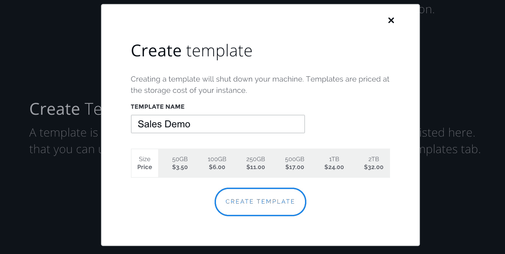
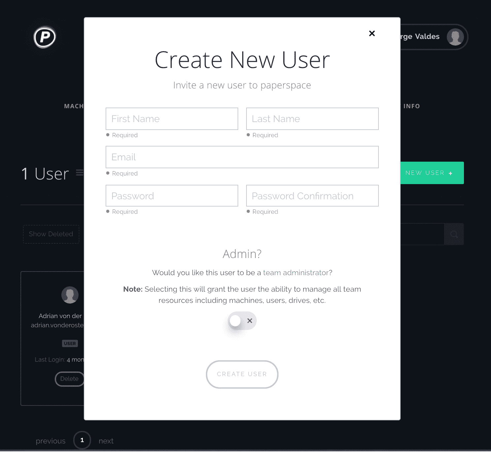

# 通过 Paperspace 向您的客户分发您的产品

> 原文：<https://blog.paperspace.com/how_to_setup_sales_trials_on_paperspace/>

Paperspace 是一种强大的分发工具，以简单易管理的方式展示您产品的功能。您的潜在客户将能够在几分钟内用任何样本或真实世界的数据来测试您的软件。只需要一封电子邮件邀请。

## 它是如何工作的？

拥有需要基于桌面安装的产品的公司面临着特殊的挑战。

*   演示产品通常是必要的
*   安装过程中的摩擦搅动了销售漏斗中的潜在客户。这可能是由于许多不可控的因素造成的，包括不良的硬件要求、不良的操作系统要求等。
*   预装的云桌面，准备了产品和演示材料，提高了从潜在客户到合格销售线索的转化率。
*   带着昂贵(通常很重)的设备去贸易展会可能会很麻烦。借助 Paperspace 的云桌面，可以在轻量级 Chromebooks 上进行演示。

下面是通过 Paperspace 的云桌面向潜在客户部署您自己的软件的入门指南。

想要更多曝光？

如果您希望您的销售支持工作流以 Paperspace 为特色，请给我们发送电子邮件至 hello@paperspace.com，或发推特给我们，包括标签#PoweredByPaperspace

## **指南大纲**

当计划使用 Paperspace 向潜在客户试用您的软件时，本实用指南将确保说明以下内容:

*   [账户管理](#account)

    1.  机器建议
*   [机器管理](#machine)
    *   创建机器
    *   设置您的试用机器
    *   测试您的产品
    *   创建模板
    *   创建新机器
    1.  考虑
*   [用户管理](#user)
    *   添加新用户
    *   分配用户到机器
    *   设置明确试用日期
    1.  考虑
*   [部署和计费](#payments)

    1.  部署注意事项
*   [伙伴关系](#partnerships)
    1.  联系我们
*   [结论](#conclusion)

### **1。**账户管理

```py
1\. Sign Up
2\. Provide Billing Info
3\. Request Team Access from Support@paperspace.com 
```

### **2。**机器管理

Paperspace 提供了一个简单的用户界面来创建、删除和管理机器。在我们的在向潜在客户分发产品试用版时，您应该考虑以下问题。

**考虑:**
*你需要多少台机器？*

*Windows/Linux？*

由于试用中利用率的不确定性，我们建议按月计费。

**创建一台机器**

*   选择最近的*区域*

*   选择 Windows 或 Linux *模板*

*   根据您的需要选择*每月*或*每小时*。

*   选择你的*计划*:

    *   **高性能**如果您的产品利用了我们的 GPU，请务必选择 *GPU+* 、 *P5000* 或 *P6000* 。
*   选择您的*存储空间* —您可以在未来随时增加存储空间，但我们强烈建议您的产品演示至少要有 100GB 或以上的存储空间。

*   点击*创建*


**设置您的试用机器**

安装您的软件及其所有依赖项。如果您的软件尚未包含样本数据或文件，我们建议您包含样本数据或文件。

保存在桌面上的简单文本文件(即常见问题解答、自述文件等)。)为您的潜在客户的试用体验提供指导，也会证明是有用的。

**测试您的产品**

在创建模板以方便分发之前，请确保您的产品按预期工作。

**创建模板**


在控制台中，从该机器创建一个模板
注意:
模板当前仅限于最初创建它们的数据中心。例如，从 NY1 中的机器生成的模板将不能用于在西海岸或欧洲创建机器。



**创建新机器**

根据需要从模板创建新机器

### **3。**用户管理

试用期需要围绕访问进行仔细规划。在开始分发试用产品之前，您应该能够回答以下问题。很重要的一点是，要想清楚产品试用将如何成为有凝聚力的销售流程和剧本的一部分。虽然您可以让多个团队成员成为团队管理员，但请考虑确保最佳销售体验所需的工作流程。

**考虑:**

这些用户可以访问多长时间？几天？几个月？

我们将如何管理这些试验的部署？

**添加新用户**

通过“用户”选项卡，您可以查看和管理所有现有用户，并创建新用户。



添加用户后，他们会收到一封电子邮件，通知他们可以访问。创建新用户时，您可以选择将他们标记为团队管理员。

将用户分配到特定的机器。

我们不允许多人同时使用同一台机器。因此，请确保将额外的机器作为试验计算的一部分。如上所述，只有团队管理员可以将用户分配给机器。虽然您可以有几个团队管理员，但请仔细考虑这可能会对您的销售行动手册的设计产生什么影响。

设定明确的审判日期。

设置这些日期将有助于确保您可以在试用期到期后从用户的计算机上停用用户。我们目前正在构建一个允许编程控制的 API。在那之前，大部分都是手动的。

### **4。**部署和计费

**部署**

对于您的潜在客户来说，登录您的销售演示机器将会非常简单。他们只需要自己的电子邮件和密码就可以通过浏览器访问。不需要安装。对于键盘快捷键，我们建议您的潜在客户将我们的专用应用下载到他们基于 Windows 或 MacOS 的笔记本电脑/台式机上。

**计费**

每月的纸张空间账单。我们建议您将 Paperspace 的成本纳入您的销售支持预算，以了解是免费试用还是付费试用最适合您的产品。

### **5。**伙伴关系

我们一直有兴趣与那些希望通过 Paperspace 发布软件的公司建立合作伙伴关系。我们已经与 Fast.ai、H2O.ai 和 Parsec 等公司和组织合作，为用户提供定制模板，预配置所有必要的软件和依赖项，让他们的客户获得出色的体验。如果这是你有兴趣讨论的事情，请在[hello@paperspace.com](mailto:hello@paperspace.com)告诉我们！

### **6。**结论

Paperspace 强大的云桌面正在推动营销和销售组织内部协作的未来。我们轻松的用户体验使销售团队能够通过向潜在客户轻松分发台式机产品的销售演示来提高销售速度，从而消除传统试用期的瓶颈。

对 Paperspace 如何为您的销售团队提供动力有什么想法？我们希望你能在[hello@paperspace.com](mailto:hello@paperspace.com)与我们分享你自己的经历。

尽情享受吧！

要让您的销售组织加入 Paperspace，[请在此注册。](https://www.paperspace.com/account/signup?utm-campaign=distributeblog)

我们需要你的帮助！

我们正在寻找专注于销售和营销工作流的内容作家，以帮助建立我们的社区。给 hello@paperspace.com 发电子邮件，附上写作范例和教学想法