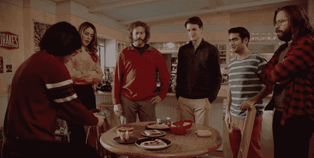

# 硅谷的非热狗应用中的逻辑回归

> 原文：<https://blog.paperspace.com/ml_behind_nothotdog_app/>



## 分类:逻辑回归

在 HBO 热播电视剧《硅谷》中看到的大胆项目背后，有相当一部分真正的数学和科学。在这些项目中，可能最现实和有些大胆的项目出现在第四季的第四集。这个项目的目标是建立一个人工智能应用程序，它可以根据图片识别食物——如果你可以的话，是“食物的 Shazam”。但是，当应用程序最终只能识别热狗时，事情就滑稽地破裂了，其他一切都不是热狗。事实上，为该节目工作的工程师蒂姆·安格拉德制作了一个真实生活而不是热狗的应用程序，你可以在 Andriod 和 iOS 上找到它。他还在 Medium 上写了一篇博客，解释他是如何做到的，其中涉及到一些严肃的独创性。有趣的事实:他使用 Paperspace 在 Ubuntu 上的 P5000 实例来加速一些实验。

那么，Not Hotdog app 背后的 ML 是什么？让我们从基础开始。

## 分类

分类是给观察分配标签的任务。分类算法将一组标记的观察值作为输入，并输出一个分类器。这是一种监督学习技术，因为它需要训练数据形式的监督来学习分类器。

Not Hotdog 应用程序将图像分为两类，因此它是二进制分类器的一个实例。为了识别热狗，它用由几千张热狗和其他食物的图像组成的数据集进行了训练。

开始接触一点数学，

设$Dn = {(xi，y_i): i \in [n]}$是$n$个标记观测值的数据集。

在这里，$ \mathbb{r}^k$的$xi 是特征，$伊的{0，1}$是标注。

分类器$l:\mathbb{R}^k \to {0，1}$，是预测新观察$x$的标签$\hat{y}$使得$l(x) = \hat{y}$的函数。

二元分类算法$A:\mathcal{D}\to\mathcal{L}$是从数据集集$\mathcal{D}$到二元分类器集$\mathcal{L}$的函数。

简单地说，给定一个$Dn \in \mathcal{D}$算法$A$输出一个二元分类器$l \in \mathcal{L}$使得$A(Dn) = l$。但是它用什么标准来选择$l$呢？

通常，$A$在一组参数化分类器$\mathcal{L}w$中搜索一个最小化损失函数$L(Dn，l)$的分类器。对于参数化分类器，我们指的是$\mathcal{L}{w} = {l(x，w):L \ in \ mathcal { L } \ text { and } w \ in \ mathcal { C } } $，其中$\mathcal{C}$是一组参数。
$ $ A(Dn)= \ arg \ min { L \ in \ mathcal { L } w } L(D _ n，l)$$

为了理解这是如何工作的，让我们研究一种叫做逻辑回归的二进制分类算法。

## 逻辑回归

逻辑回归可能是最简单的二元分类算法之一。它由一个单一的逻辑单元组成，可以称之为神经元。事实上，把几个这样的逻辑单元放在一起，你就有了一层神经元。将这些神经元层层堆叠起来，你就有了一个神经网络，这就是深度学习的全部内容。

回来，后勤单位使用后勤功能，其定义为:

$ $ \西格玛(z) = \frac{1}{1+e^{-z}}$$

在此输入图像描述

图形$\sigma(z)$看起来像一个拉长且压扁的“S”。由于$\sigma(z)$的值总是在 0 和 1 之间，所以可以解释为一个概率。

如果观察值$x$是$k$维的，那么分类器具有$k+1$个实值参数，这些参数由\mathbb{R}^{k}$中的向量$ w \和 mathbb{R}$中的标量$ w _ 0 \组成。这里考虑的分类器集是:

$$\mathcal{L}{w，b } = { \ sigma(w \ cdot x+w0):w \ in \mathbb{r}^{k}，w_0 \in \mathbb{R}}$$

这里$\cdot$是矢量点积。这些分类器不提供$x$的硬标签(0 或 1)。相反，它们提供了如下解释的概率。

$ $ \ sigma(w \ cdot x+w _ 0)= \ Pr(y = 1 | x)$ $

$\sigma(w \cdot x + w0 )$是$x$属于类别 1 的概率。$x$属于类 0 的概率自然是$1-\sigma(w \cdot x + w0 )$。

通常用于分类的损失函数是交叉熵。在二进制分类的情况下，如果真实标签是$yi$并且预测是$\sigma(w \cdot xi + w0 ) = \hat yi$，则交叉熵损失被定义为:

$$L(Dn，w，w0)= \frac{-1}{n}\sum{i=1}^n(yi \ log(\ hat yi)+(1-yi)\ log(1-\ hat y _ I))$ $

设$w^$和$w0^$是使$L(Dn，w，w0)$最小的参数。逻辑回归的输出必须是分类器$\sigma(w^\cdot x+w0^)$.但是逻辑回归如何找到$w^$和$w0^$呢？

## 梯度下降

梯度下降是一个简单的迭代过程，用于寻找函数的局部最小值。在每次迭代中，它在梯度的负方向上前进一步。凸函数总是有一个局部极小值，这也是全局极小值。在这种情况下，梯度下降将找到全局最小值。

如果函数$L(Dn，w，w0)$在$w$和$w0$中是凸的，我们可以用梯度下降法求出使$L$最小的参数$w^$和$w0^$。

观察$w \cdot x + w0 = [w0，w]\cdot [1，x]$。这里$[w0，w]$和$[1，x]$是通过分别在$w$之前附加$w0$和在$x$之前附加$1$而获得的$k+1$维向量。为了简化数学，从现在开始让$x$是$[1，x]$和$w$是$[w_0，w]$吧。

我们可以证明＄l(dn，w)＄是凸的一种方法是证明它的 Hessian 在每一点都是半正定的(PSD ),即$\nabla^2wL(D_n,w)\succeq0$.对于\mathbb{R}^{k+1}$.的所有$ w \人

让我们开始区分$L$。

$ $ \ nab la l = \frac{-1}{n}\sum{i=1}^n(\ frac { yi }-\ frac { 1-yi } { 1-\ hat yi })\ nab la \ hat yi $ $

这里$\hat yi = \sigma(w\cdot xi)$。让$zi = w\cdot xi$。按链式法则，$ \ nab la \ hat yi = \ frac { d hat yi } { dzi } \ nab la zi $。首先让我们找到$ \ frac { d \ hat yi } { dzi } $。

$ $ \帽子易= \frac{1}{1+e^{-zi}} = \frac{e^{zi}}{1+e^{zi}}$$

重新排列术语，我们得到

$ \ hat yi+\ hat =□

区分 wrt $z_i$，

$ $ \ begin { align } \ frac { d \ hat yi } { dzi }+\ frac { d \ hat yi}{dzi}e^{zi}+\ hat yie^{zi} & = e^{zi}\ { d \ hat yi}{dzi}(1+e^{zi})& = e^{zi}(1-\hat yi)\ \ frac { d \ hat yi } { dzi } & = \frac{e^{zi}}{(1+e^{zi})}(1-\hat yi)= \ hat yi(1-\ hat yi)\ end { align } $ $

现在，$ \ nab la zi = \nabla^2w(w\cdot·Xi)= x _ I $。

代入原始方程，我们得到:

$ $ \ nab la l = \frac{-1}{n}\sum{i=1}^n \ frac { yi-\ hat yi } { \ hat yi(1-\ hat yi)} \ hat yi(1-\ hat yi)xi=\frac{1}{n}\sum{i=1}^n(\hat yi-yi)x _ I $ $

$$\nabla^2 l = \frac{1}{n}\sum{i=1}^n xi^t \ nab la \ hat yi = \frac{1}{n}\sum{i=1}^n \frac{xixi^t} { yi(1-yi)} $ $

$yi(1-yi) >0 $，因为$yi \in (0，1)$。每个矩阵$xi^Txi$都是 PSD。因此，$\nabla^2 L\succeq0$，$L$是一个凸函数，梯度下降可用于寻找$w^*$.

梯度下降$(L，D_n，\alpha):$

将$w$初始化为随机向量。
While $|\nabla L(Dn，w)|>\ epsilon $:
$ w = w-\ alpha \ nabla L(Dn，w)$

这里$\alpha$是一个常数，称为学习率或步长。梯度下降是一阶方法，因为它只使用一阶导数。也可以使用像牛顿法这样的二阶方法。在牛顿的方法中，$\alpha$被替换为黑森:$(\nabla^2wL(Dn,w))^{-1}$.的倒数尽管二阶方法收敛所需的迭代次数较少，但由于涉及矩阵求逆，每次迭代都变得更加昂贵。

在神经网络的情况下，梯度下降过程推广到反向传播算法。

## 玩具而不是蟒蛇皮热狗

real Not Hotdog 应用程序使用最先进的 CNN 架构在移动设备上运行神经网络。仅仅通过简单的逻辑回归，我们无法做任何有意义的事情。然而，我们可以通过巧妙的方式使用 MNIST 数据集来接近它。

MNIST 数据集由 70，000 个 28x28 的手写数字图像组成。数字“1”是最像热狗的数字。所以对于这个玩具问题，假设“1”是热狗，其余的数字不是热狗。这也有点类似于热狗而不是热狗食品的不平衡，因为“1”只占数字的十分之一(假设每个数字出现的概率相等)。

首先，让我们加载 MNIST 数据集。

```py
from sklearn.datasets import fetch_mldata  
import numpy as np  
mnist = fetch_mldata('MNIST original') 
```

让我们使用前 60，000 张图片对剩下的 10，000 张图片进行训练和测试。由于像素值的范围在$[0，255]$，我们除以 255 将其缩放到$[0，1]$。我们修改标签，使“1”标记为 1，其他数字标记为 0。

```py
X_train = mnist.data[:60000]/255.0  
Y_train = mnist.target[:60000]

X_test = mnist.data[60000:]/255.0  
Y_test = mnist.target[60000:]

Y_train[Y_train > 1.0] = 0.0  
Y_test[Y_test > 1.0] = 0.0  
Lets do logistic regression using Sci-kit Learn.

from sklearn import linear_model  
clf = linear_model.LogisticRegression()  
clf.fit(X_train,Y_train)

Y_pred = clf.predict(X_test) 
```

现在让我们在 numpy 的帮助下实现梯度下降。

```py
def logistic(x):  
    return 1.0/(1.0+np.exp(-x))

# The loss function
def cross_entropy_loss(X,Y,w,N):  
    Z = np.dot(X,w)
    Y_hat = logistic(Z)

    L = (Y*np.log(Y_hat)+(1-Y)*np.log(1-Y_hat))
    return (-1.0*np.sum(L))/N

# Gradient of the loss function
def D_cross_entropy_loss(X,Y,w,N):  
    Z = np.dot(X,w)
    Y_hat = logistic(Z)

    DL = X*((Y_hat-Y).reshape((N,1)))
    DL = np.sum(DL,0)/N
    return DL

def gradient_descent(X_train,Y_train,alpha,epsilon):  
    # Append "1" before the vectors
    N,K = X_train.shape
    X = np.ones((N,K+1))
    X[:,1:] = X_train
    Y = Y_train

    w = np.random.randn(K+1)
    DL = D_cross_entropy_loss(X,Y,w,N)

    while np.linalg.norm(DL)>epsilon:
        L = cross_entropy_loss(X,Y,w,N)
        #Gradient Descent step
        w = w - alpha*DL
        print "Loss:",L,"\t Gradient norm:", np.linalg.norm(DL)
        DL = D_cross_entropy_loss(X,Y,w,N)

    L = cross_entropy_loss(X,Y,w,N)
    DL = D_cross_entropy_loss(X,Y,w,N)
    print "Loss:",L,"\t Gradient norm:", np.linalg.norm(DL)

    return w

# After playing around with different values, I found these to be satisfactory 
alpha = 1  
epsilon = 0.01

w_star = gradient_descent(X_train,Y_train,alpha,epsilon)

N,K = X_test.shape  
X = np.ones((N,K+1))  
X[:,1:] = X_test  
Y = Y_test  
Z = np.dot(X,w_star)  
Y_pred = logistic(Z)

Y_pred[Y_pred>=0.5] = 1.0  
Y_pred[Y_pred<0.5] = 0.0 
```

在非热狗的例子和我们的玩具例子中，有严重的阶级不平衡。1 与非 1 的比例约为 1:9。这意味着我们只要一直预测非 1 就能获得 90%的准确率。因此，准确度不是分类器性能的稳健度量。较小班级的 f1 分数是更好的绩效指标。

```py
from sklearn.metrics import classification_report  
print classification_report(Y_test,Y_pred) 
```

对于 Sci-kit 的逻辑回归:

```py
 precision    recall  f1-score   support

    0.0       1.00      1.00      1.00      8865
    1.0       0.97      0.98      0.97      1135
    avg/total 0.99      0.99      0.99      10000 
```

对于我们的实施:

```py
 precision    recall  f1-score   support

    0.0       0.99      0.99      0.99      8865
    1.0       0.94      0.93      0.94      1135
    avg/total 0.99      0.99      0.99      1000 
```

两个分类器具有相同的平均精度、召回率和 f1 值。但是 Sci-kit 的版本对 1s 有更好的 f1。

附注:最初的“Shazam for food”应用程序的目标是构建一个多类分类器(尽管有大量的类)，但它最终做了二进制分类。我不确定这怎么可能，训练程序和损失函数有很大的不同。然而，真实生活而不是热狗应用程序被训练成二进制分类器。