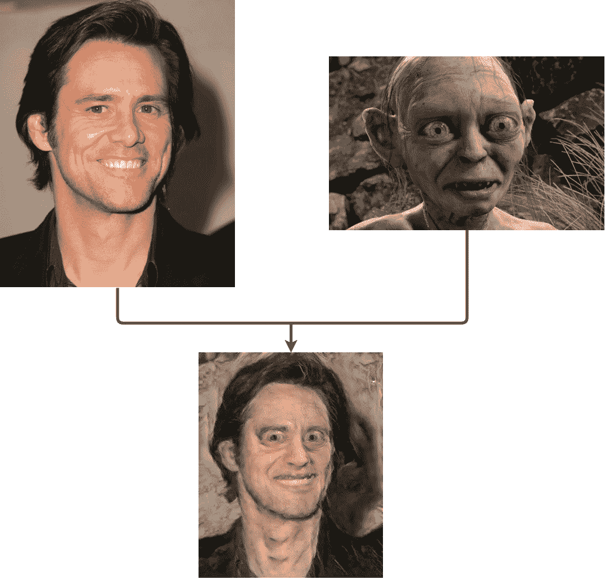
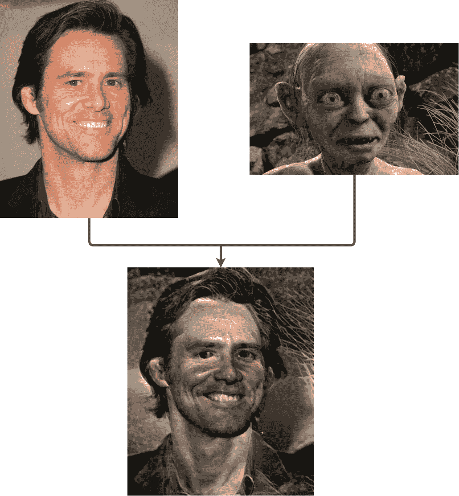
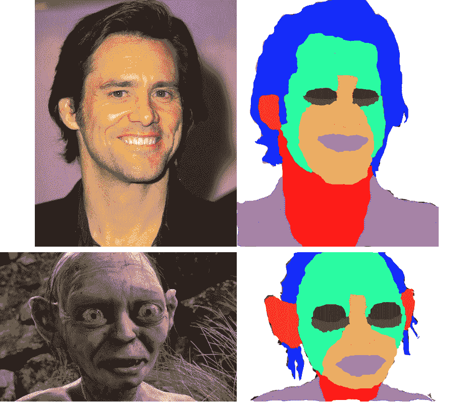
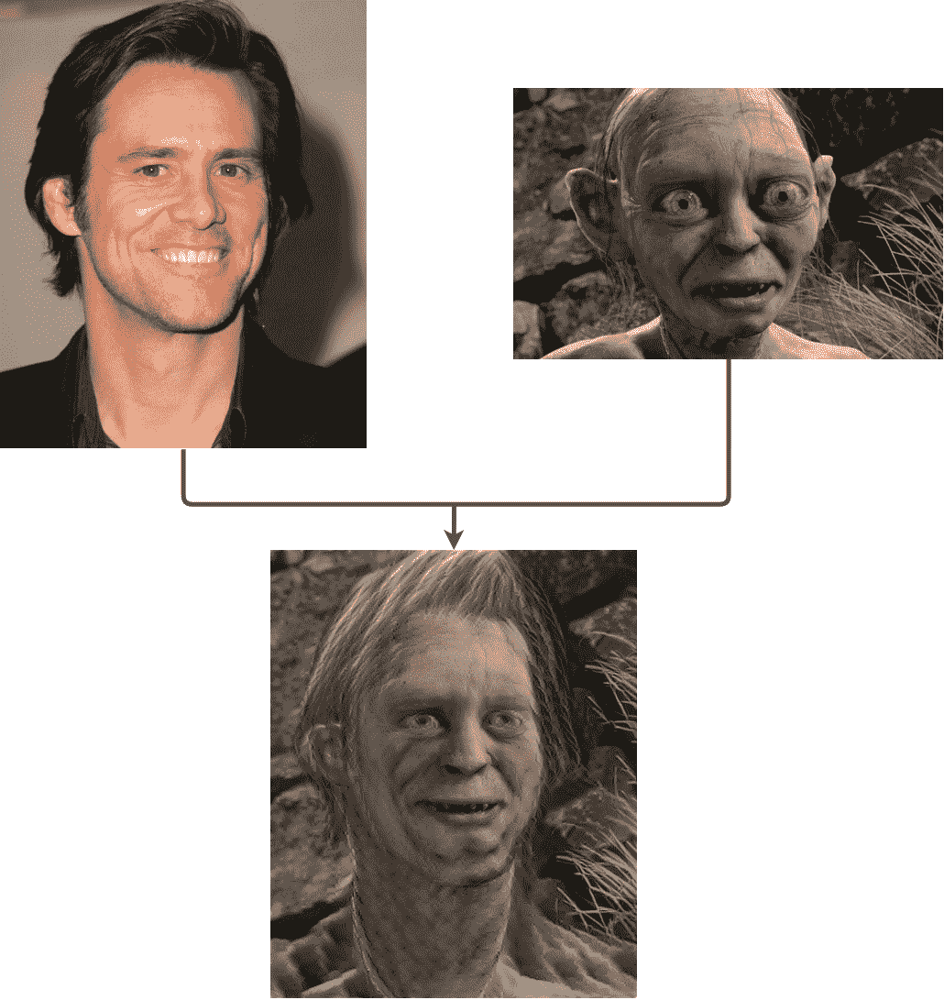

# 风格转移第二部:换脸！

> 原文：<https://blog.paperspace.com/style-transfer-part-2/>

# 使用深度神经网络的人脸转移

## 介绍

在之前的[文章](https://blog.paperspace.com/art-with-neural-networks/)中，我们讨论了什么是风格转移以及如何使用它来创建自己的艺术。现在，我们将重点讨论如何将风格转移的功能扩展到艺术领域之外。请跳转到本帖的[资源](https://blog.paperspace.com/p/ad786a9f-0060-487a-b4ca-f83babc949d7/#readinglist)部分，了解用于生成示例的代码。

假设你对金凯瑞在《指环王》中的角色有多适合感到好奇。此外，我们将尝试把金凯瑞的脸转移到咕鲁身上。一个有趣的方法是使用 [Gatys 等人的](https://arxiv.org/pdf/1508.06576.pdf)风格转移法。但是这能正常工作吗？亲自看看结果:

Figure 1\. Face swap using Gatys et al. method.

如你所见，结果是一场灾难。输出看起来一点也不像从吉姆到咕鲁的面部转换。相反，它只是吉姆的脸，有令人讨厌的白色纹理和棕色和灰色的阴影。

看到这个结果，两个问题出现了。首先，为什么会这样？第二，怎么修？

在本文中，我们将引导您回答这两个问题。我们将指出 Gatys 等人工作中的局限性，并发现新的技术来提高面部转移等任务的性能。

## Gatys 等人的风格转移方法的局限性

不可否认，Gatys 等人使用深度神经网络进行风格转换的工作是一个先驱。而且，像所有的先锋作品一样，它充满了改进的空间。我们可以改进原始作品的一个方面是纹理估计器。回想一下第一篇文章，作者建议它基于 Gram 矩阵。

Figure 2\. Gram matrix approach.

Gram matrix 方法对于艺术目的来说是很棒的，但是当我们想要对哪些纹理被传递到结果的每个部分进行一些控制时，它就会受到影响。背后的原因是它**破坏了风格图像的语义**，只保留了基本的纹理成分。因此，我们不能，例如，转移咕噜的鼻子风格凯瑞的，因为纹理估计器已经破坏了头发的信息。我们只能访问摩根图片的**全局**纹理。

所以让我们回到面部转移的例子，试着解释发生了什么:

1.  金·凯瑞被用作内容
2.  咕鲁被用作风格
3.  结果的语义内容和凯瑞的形象非常接近
4.  结果的**全局**纹理也接近咕鲁图像的全局纹理。毕竟，最终的脸比原始的吉姆照片更像咕噜的肤色。

所以我们能够准确定位纹理提取器的问题。现在我们需要知道如何改进它，才能使面部转移成为可能。我们将进行两项改进。第一篇是基于李和 Wand [结合马尔可夫随机场和卷积神经网络进行图像合成的](https://arxiv.org/pdf/1601.04589.pdf)论文。第二个改进是基于 Alex Champandard 的[语义风格转移，将两位涂鸦变成精美的艺术品](https://arxiv.org/pdf/1603.01768.pdf)纸。

## 李与魔杖改良

李和 Wand 的主要贡献是针对原有纹理提取方法的局限性，提出了一种新的基于马尔可夫随机场的纹理提取方法。对于那些不熟悉这个术语的人来说，MRF 是一个在图像问题中非常常用的概率图形模型。事实上，它被认为是图像合成问题中的经典框架。

在这一点上，一个自然的问题是:MRF 能做什么，而格拉姆矩阵不能？事实证明，MRF 并没有破坏风格的语义信息，以转移其纹理到最终的图像。新的纹理提取器执行以下步骤:

1.  获取样式图像和结果图像的更高级特征(使用 dCNN 的输出)
2.  将特征分割成小的“神经”片(记住高级特征也是图像)
3.  将结果图像的每个补丁与样式图像的所有**补丁进行比较**
4.  对于生成的图像的每个补丁，选择最接近的样式补丁，并在生成的补丁上使用其纹理

在我们的面转移问题中，MRF 方法将做如下工作:

*   对生成的图像进行切片(合成面的位置)
*   选择一个贴片(例如贴片上有下巴的一部分)
*   在咕鲁的图片中找到更接近我们当前“结果补丁”的补丁(**希望是**咕鲁的下巴)
*   在生成的面片上使用该样式面片的纹理。

观察纹理传递正在局部发生，逐块进行，直到结果完成。我们从全局 Gram 矩阵纹理转换到局部面片 MRF 纹理转换。关于问题的数学公式，内容提取器和通过优化的合并过程保持不变。唯一的区别是样式提取器的变化和一个不太重要的术语。

在我们的面子转移问题中使用这种新方法，我们得到以下结果:

Figure 3\. Results obtained using Li and Wand proposed technique.

如你所见，结果比我们之前的尝试好得多。由于新的局部纹理提取器，现在我们有了一个合适的面部转换。然而，结果还不是很好。这幅画有几个人工制品，它们中的大部分以咕鲁的图像背景的形式进入金凯瑞的头发。
这背后的主要原因是补丁不匹配，这在当前的方法中很难控制。还记得我们在寻找匹配最终图像下巴的最佳补丁吗？很可能是咕鲁的下巴。然而，由于图像视角的差异，该算法可以选择图像的另一部分作为最佳匹配块。

为了改善我们的结果，我们可以微调优化参数和补丁的大小。这绝对是一条路要走。另一个选择，对于面部转移来说更有趣，是使用 Champandard 论文中提出的方法。正如我们将在下一节中看到的，这种新方法以一种对我们的目的理想的方式改进了李和王的建议。

## 标准改进

我们最后的改进是基于标准纸。作者的主要贡献是增加了 Li 和 Wand 方法，使用户能够控制每种风格的转换。事实证明，这足以解决补丁不匹配的问题。

为了让用户对风格转换过程有更多的控制，Champandard 神经网络不仅接收内容和风格图像，还接收它们的语义图。语义图是突出原始图像特征的图像。看看下面的例子:

Figure 4\. Manually created semantic maps for the source images.

在这个例子中，我们可以看到几个手工着色的语义图，其中十个特征用不同的颜色编码。

语义图背后的思想是缩小算法寻找补丁匹配的空间。例如，如果它正在搜索最佳的嘴部补丁，它将在样式图像的嘴部补丁中放置更多的权重。这样，就不太可能出现补丁不匹配的情况。

如果我们在我们的面部转移问题中运行 Champandard 方法，我们得到以下结果:

Figure X

毫无疑问，这是我们迄今为止看到的最好结果。输出的人脸看起来像是从金凯瑞到咕鲁的人脸转移。现在我们有了一个很好的方法来进行面部转移，让我们看看它在实践中是如何工作的。

## 面部转移的运行标准方法

幸运的是，尚标准在 github 上分享了他论文的代码。只需克隆 repo，遵循安装指南或使用 docker 容器，您就可以开始了。请记住上一篇文章，您必须有一个好的 GPU 才能在合理的时间内运行它。还有，**确保**你用的是推荐的茶餐厅和千层面。最后，我强烈建议不要使用 CuDNN v5。推荐的方法是使用 GitHub repo 中提供的虚拟环境。
你需要输入这两幅图像以及它们的语义图。如果我们使用默认配置运行，**确保**将语义图命名为" original_image_name" + "_sem.png "。您可以通过选择颜色数量和绘制相关区域来控制样式转换。此外，对于面部转移的特殊情况，您应该小心一些参数，以便获得良好的结果。关于这个方面，我和几个朋友做了一些关于参数如何影响结果的调查，我们发现了一些有趣的准则:

*   最重要的参数是:**内容权重、风格权重和迭代次数**
*   如果迭代次数很少，输出将有很多神经噪声(卷积神经网络的典型噪声)
*   为了得到一个真正好的图像，你应该有很多次迭代。图像收敛得非常快，但需要相当长的时间来消除部分神经噪声。我建议设置迭代次数= 1000。在 GTX 1080 上拍摄每幅图像大约需要 40 - 50 分钟。所以，只有当你已经知道自己想要什么，并且已经做了一些测试的时候，才使用它
*   为获得最佳转印面，请确保内容重量/样式重量比在区间[0.6，1]内。

例如，运行本文所示示例的命令是:

```py
python3 doodle.py --style samples/gollum.png --content samples/jim_carrey.png --output face_transfer.png --device=gpu0 --phases=4 --iterations=1000 --content-weight=10 --style-weight=10 
```

## 结论

神经类型转移仍然是一个新的研究领域。因此，有很大的改进和创新空间。在本文中，您接触了该方法的一个新应用(面部转移)。你学到了:

*   Gatys 和 al 的传统方法。面部转移不能正常工作
*   与 Gatys 等人的方法相比，我们进行了两项改进，以获得一种适用于面部转移的方法
*   要运行您自己的 face transfer 项目，请克隆 Champandard repo GitHub，遵循安装指南或打开 docker 容器，创建您的语义映射并确保参数设置正确。

作为一个改进的建议，可以尝试在标准方法中添加一个算法，从原始图像中自动生成语义图。

#### 资源

下面是一些进一步的资源和用于创建示例的源代码。特别感谢引用代码的作者，他们清晰的实现和非常详细的自述文件，这使得它非常容易复制。

*   [用深度神经网络创造艺术](https://blog.paperspace.com/art-with-neural-networks/)。该系列的第一篇文章。
*   Gatys 等人的方法，[神经风格转移 GitHub repo](https://github.com/jcjohnson/neural-style)
*   李与权杖法， [CNNMRF GitHub repo](https://github.com/chuanli11/CNNMRF)
*   标准方法，[神经涂鸦 GitHub repo](https://github.com/alexjc/neural-doodle)

要开始使用您自己的 ML-in-a-box 设置，[在此注册。](https://www.paperspace.com/account/signup?utm-campaign=pytorchblog)