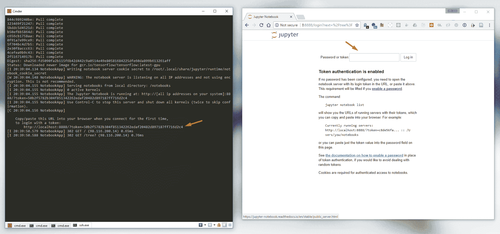
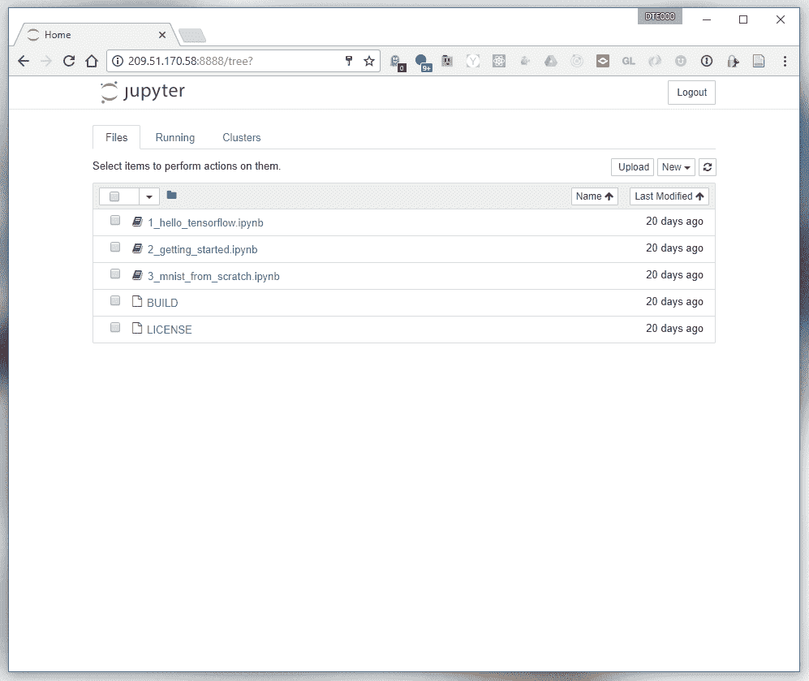

# Jupyter 笔记本简单易用！(有 GPU 支持)

> 原文：<https://blog.paperspace.com/jupyter-notebook-with-a-gpu-the-easy-way/>

## 1.创建一台图纸空间 GPU 计算机

您可以选择我们的任何 GPU 类型(GPU+/P5000/P6000)。在本教程中，我们将选择默认的 Ubuntu 16.04 基础模板。

不习惯命令行？

试试已经安装了 Jupyter(和许多其他软件)的 Paperspace 机器学习模板吧！使用促销代码 **MLIIB2** 购买价值 5 美元的新机！

*重要提示:您需要添加一个公共 IP 地址才能访问我们正在创建的 Jupyter 笔记本。请确保选择该选项。如果您忘记了，您可以随时通过控制台*添加它

## 2.安装 cuda/dock/NVIDIA dock

这是一个非常简单的脚本。一旦您通过 SSH 登录到您的新机器，只需通过将以下内容粘贴到您的终端来运行脚本:

```py
wget -O - -q 'https://gist.githubusercontent.com/dte/8954e405590a360614dcc6acdb7baa74/raw/d1b5a01ed0b9252654016d2a9a435dc8b4c045e7/install-CUDA-docker-nvidia-docker.sh' | sudo bash 
```

*出于好奇:你可以在这里找到脚本[https://gist . github . com/DTE/8954 e 405590 a 360614 DCC 6 acdb 7 baa 74](https://gist.github.com/dte/8954e405590a360614dcc6acdb7baa74)*

完成后，您需要通过键入以下命令来重新启动机器:

```py
sudo shutdown -r now 
```

## 3\. Run jupyter

当机器重新启动时，你就可以开始工作了！键入以下命令来运行包含 Jupyter 的 docker 容器。它将在你机器的端口 **`8888`** 上运行一个服务器。

```py
sudo nvidia-docker run --rm --name tf-notebook -p 8888:8888 -p 6006:6006 gcr.io/tensorflow/tensorflow:latest-gpu jupyter notebook --allow-root 
```

您的笔记本可以从任何计算机上访问，但需要进入网络浏览器并输入您机器的公共 IP 地址和端口:`http://PUBLIC_IP:8888/`





您可以通过打开笔记本并键入以下内容来确认 GPU 正在工作:

```py
from tensorflow.python.client import device_lib

def get_available_devices():
    local_device_protos = device_lib.list_local_devices()
    return [x.name for x in local_device_protos]

print(get_available_devices()) 
```


通过[立即注册，立即开始使用您自己的 Paperspace 桌面！](https://www.paperspace.com/account/signup?utm_campaign=jupyterblog)