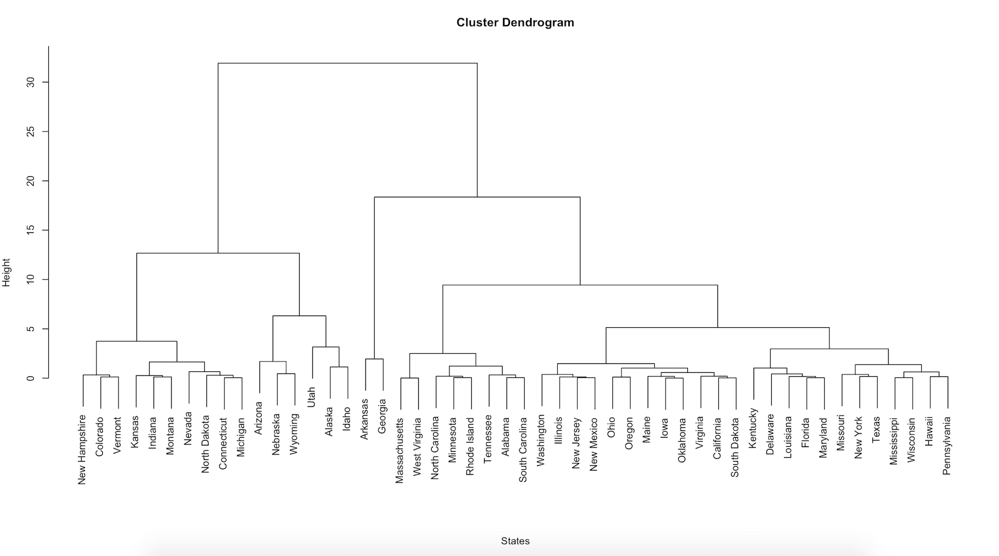
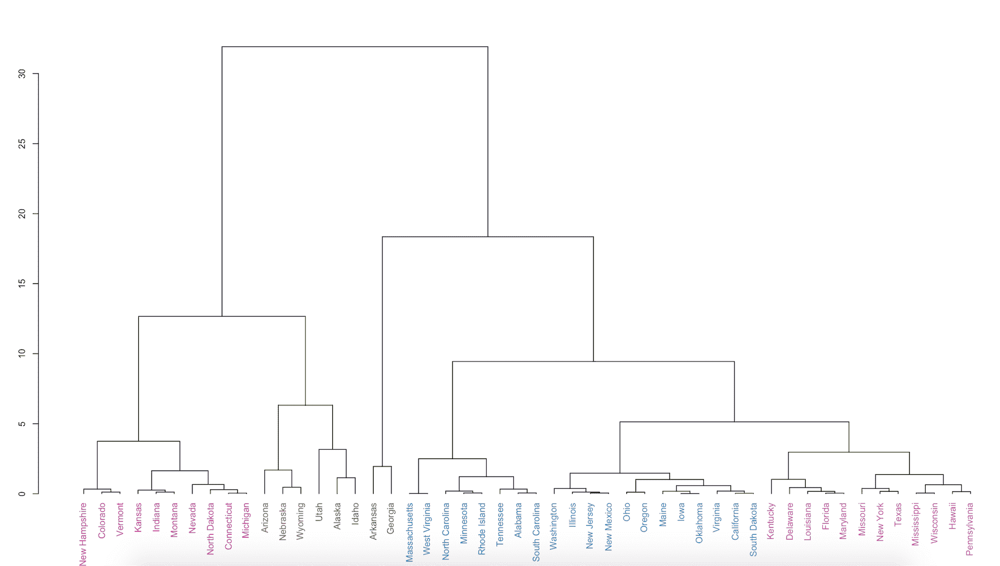

# 无监督政治:机器学习中的聚类

> 原文：<https://blog.paperspace.com/unsupervised-politics-clustering-in-machine-learning/>

当面对大量需要理解的数据时，可能很难知道从哪里开始寻找有趣的趋势。不要试图用数据做出具体的预测，您可能想从简单地探索数据开始，看看有什么。对于这个任务，我们转向无监督的机器学习。与监督学习相比，无监督模型只接受输入数据，并自行搜索感兴趣的模式，无需人工干预。

探索性数据挖掘中最常见的无监督方法之一称为聚类，它试图根据相似性将观察结果分组到子组中。这方面的例子包括:根据相似的特征对客户进行分组，根据相似的内容对文本进行分组，对脸书上的“朋友”进行分组，对癌性肿瘤进行聚类，等等。我们只需输入模型数据，模型将数据分成相似的组。

本文使用一个适时的例子:政治，引导读者完成 K-means 和层次聚类的任务。尽管巴拉克·奥巴马(Barack Obama)在 2012 年的竞选中巧妙地运用了数据科学技术，但许多分析师也因错误预测 2016 年大选结果而受到批评。本文提供了一个这样的模型，它可能对分析政治有用，并为您提供了一个自己尝试实现无监督机器学习模型的机会。

#### 入门指南

让我们首先加载我们的数据和一些对集群任务有帮助的包。本文使用在 R Studio 中实现的统计语言 R。如果你还没有 R 的话，一定要[安装它。](https://www.r-project.org/)

让我们装载三个包裹。 [`cluster`](https://cran.r-project.org/web/packages/cluster/index.html) 包承载了各种聚类函数，以及我们将使用的数据。 [`dendextend`](https://cran.r-project.org/web/packages/dendextend/index.html) 和 [`circlize`](https://cran.r-project.org/web/packages/circlize/index.html) 包将用于可视化我们的集群。如果您以前没有使用过这些包，首先使用`install.packages("")`命令获取这些包。然后，您可以从您的库中加载它们，如下所示。

```py
library(cluster)
library(dendextend)
library(circlize) 
```

加载完包后，让我们直接从`cluster`包中导入数据。我们将使用的数据集被称为`votes.repub`，它包含了从 1856 年到 1976 年各州在总统选举中给予共和党候选人的选票百分比。该数据可以使用`cluster::`命令直接从`cluster`包中导入。我们将把它命名为`raw.data`。

```py
raw.data <- cluster::votes.repub 
```

您可以使用`View()`功能查看原始数据。你会看到左边列出的州，列名为选举年份，每个单元格中共和党候选人获得的州选票百分比。

让我们对数据集中最近的一年进行分析:1976 年。这意味着我们只需要通过子集化我们的数据来提取 1976 年的数据。我们定义想要保留的变量——“x 1976”——并用方括号将它从原始数据中提取出来。

```py
keep <- c("X1976")
votes.1976 <- raw.data[keep] 
```

既然我们已经加载了包并对数据进行了子集化，我们就可以开始建模了。

#### R 中的聚类

聚类是无监督机器学习的一种方法——在这种情况下，您只有观察值，并且您希望模型搜索有趣的模式，而不需要您确切指定您在寻找什么。集群是一套广泛的技术，可以帮助您完成这项任务。

聚类将您的数据划分到不同的组中，以便每个组中的观察结果相对相似。例如，您可能有来自 Twitter 的数据，并希望根据内容的相似性对推文进行分组。然后，聚类算法会将推文分类成组。你可能会注意到一些模式，比如聚集在一起谈论政治和名人八卦的推文。或者，也许你有一个推文子集，都提到了一部新上映的电影。然后，你可以对这些推文进行聚类，看看是否会出现子群，也许是基于推文中使用的正面或负面语言。这有助于揭示数据中有趣的模式，并可能引导您进一步分析结果模式。

我们将尝试两种不同的聚类方法:K-means 和层次聚类。使用 K-means，您可以指定要对数据进行排序的聚类数(K)。该算法搜索数据的最佳排序，以使类内变化尽可能小，即尽可能最相似的分组。

但是，有时你不知道你要找的子群的数量。因此，我们也将使用层次聚类。分层聚类算法获取观测值之间的距离或差异，并根据最相似或最不相似的观测值对观测值进行分组。它以类似树的方式完成这项工作，并生成一个非常容易理解的图，称为**树状图**。

我们可以将这些模型应用于我们想要分组的任何类型的数据，但我们将把这两种方法都应用于我们的投票数据，以说明差异。我们的目标是找到在总统选举中投票相似或不同的州组。这对于政治顾问和分析师来说可能是有用的信息，但这类信息也用于行业的市场研究或学术界的政治学研究。

让我们从 K 均值聚类开始。为了在 R 中实现这一点，我们使用了`kmeans`函数。在括号中，我们将告诉函数对我们 1976 年的投票数据执行 K-means。因为我们必须指定我们想要的组的数量，我们将使用 K=2，因为我们知道每个州的多数票肯定都流向了民主党候选人吉米·卡特或共和党候选人杰拉尔德·福特。

```py
set.seed(1912)
votes.km <- kmeans(votes.1976, 2, nstart=50) 
```

然后，我们可以将模型的结果可视化。圆形树状图提供了一个有用的可视化。我们还可以将州涂成红色或蓝色，以与他们投票支持的候选人的政党联系起来。

```py
dist.km <- dist(votes.km$cluster)

colors <- c("blue3", "red3")
clust.km <- hclust(dist.km)
circle.km <- color_labels(clust.km, k=2, col = colors)
par(cex =.75)
circlize_dendrogram(circle.km) 
```

这提供了一个很好的、整理过的状态投票模式的表示。

但是也许你想要一张更细致的图片来了解正在发生的事情。例如，你可能有两个州分别有 30%和 49%的人投票给共和党，而另外两个州分别有 51%和 65%的人投票给共和党。在 K-means 聚类中(以及在总统选举中)，50%以下的观察值将被分类为投票给民主党，而 50%以上的观察值将被分类为投票给共和党。但实际上，投票给 49%和 51%的州比投票给 30%和 65%的州更相似。

为此，我们求助于层次聚类。首先，我们需要测量各州选票之间的距离(或差异)。其逻辑是，我们希望将人口投票比其他州更相似的州聚集在一起。

我们将使用一种常见的度量方法——欧几里得距离——但是在统计学和数学中有许多度量方法，并且很大程度上取决于您使用的数据类型和您试图完成的任务。关于选择距离/相异度度量的更多信息，请查看这篇 [StackExchange 帖子](http://stats.stackexchange.com/questions/3713/choosing-clustering-method)。

我们可以使用`dist()`函数测量距离，并将距离方法设置为“欧几里得”

```py
data.dist <- dist(votes.1976, method = "euclidean") 
```

然后，我们使用`hclust`函数对我们的距离集执行层次聚类，并绘制结果。

```py
clust.h <- hclust(data.dist)
par(cex =.8)
plot(clust.h, xlab = "States", sub="") 
```


注意，我们的数据中有更多的变化。每个叶子(或状态)通过相似性定位在一起，并通过分支连接。左侧轴上分支的高度让您了解每个状态的相似或不同之处。我们可以在感兴趣的不同高度“切割”这棵树。看起来分层算法在高度切割为 6 时找到了大约七个分组(与 K-means 的两个集合相比)。为了更清楚，我们可以使用`dendextend`包中的`color_labels`函数给树叶着色，并指定我们希望看到这七组被着色。

```py
clust.h.color <- color_labels(clust.h, k=7)
par(cex =.7)
plot(clust.h.color) 
```

这更准确地展示了各州人口投票方式的相似性。这意味着选举地图可能不会告诉完整的故事:即使一些州在技术上投票给民主党或共和党，他们的选民人口在偏好上可能相当多样化。



#### 结束语

在本教程中，我们讨论了聚类的无监督机器学习方法，并使用 1976 年总统选举期间各州的投票数据说明了 K-means 和层次聚类。我们能够根据各州对民主党或共和党候选人的投票情况，以及各州投票习惯的相似程度，对各州进行分类。

如果你对这个主题的更技术性的处理感兴趣，请查看第十章[](http://www-bcf.usc.edu/~gareth/ISL/)*的统计学习介绍。或者，尝试在 r 中直接使用一些其他数据集。你可以尝试对任何东西进行聚类，从用于分类和诊断癌症的[鸢尾花](https://stat.ethz.ch/R-manual/R-devel/library/datasets/html/iris.html)到[微阵列基因表达](http://bioinf.ucd.ie/people/aedin/R/pages/made4/html/khan.html)。*

 *然而，当您可以访问大量数据时，这些方法尤其有用。尝试寻找你感兴趣的数据，无论是脸书或推特这样的来源，还是购买你产品的顾客的属性。通过聚类技术，您可能会发现分组和理解数据的新方法。*