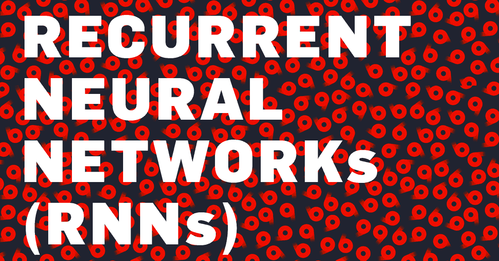
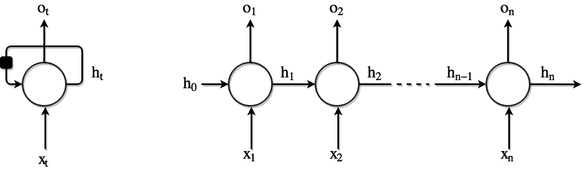
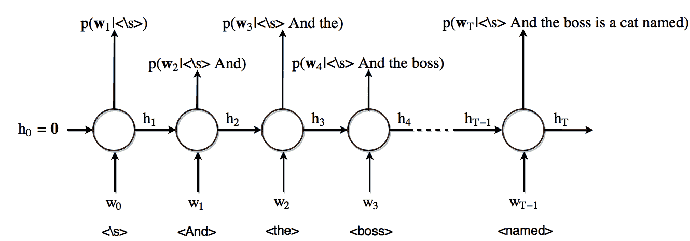

# 基于递归神经网络的递归语言模型

> 原文：<https://blog.paperspace.com/recurrent-neural-networks-part-1-2/>

## 建立直觉

有大量的数据本质上是有序的，例如语音、时间序列(天气、金融等)。)、传感器数据、视频和文本，仅举几个例子。递归神经网络(RNNs)是专门为顺序数据处理设计的神经网络家族。在本文中，我们将通过探索文本理解、表示和生成的特殊性来了解 RNNs。

机器理解自然语言意味着什么？有许多不同的方法试图回答这个问题。我们期望从这种机器中得到的一种能力是告诉我们一个给定句子的可能性有多大的能力。在这种方法中，我们假设一个句子的可能性可以从语言的日常使用中确定。

神经语言模型试图解决确定一个句子在现实世界中的可能性的问题。尽管从表面上看，这似乎不是世界上最令人兴奋的任务，但这种类型的建模是理解自然语言的基本构件，也是自然语言处理(NLP)中的基本任务。一旦我们有了这样的系统，我们就可以用它来生成新的文本，产生一些奇妙的结果。一旦我们用这个模型武装起来，我们也可以在其他任务中获得重要的洞察力，比如机器翻译和对话生成。

***关于语言单位的说明**:我们大概可以认同一个事实，一个句子可以理解为一个序列，但是序列是什么呢？人物？文字？中间的东西？这是一个活跃的研究领域，对于什么是书面语的基本单位还没有达成共识。现在，我们将简单地使用单词作为我们的语言单位。*

在本文中，我们将首先尝试了解语言模型的[基础知识](https://blog.paperspace.com/p/ce038988-8b53-4a62-a627-527f748f50ea/#langauge_modeling)、[什么是递归神经网络](https://blog.paperspace.com/p/ce038988-8b53-4a62-a627-527f748f50ea/#rnn)和[我们如何使用它们](https://blog.paperspace.com/p/ce038988-8b53-4a62-a627-527f748f50ea/#rnn)来解决语言建模的问题。有了这些，我们将试着理解为什么[这种方法会起作用以及如何起作用，并加以推广](https://blog.paperspace.com/p/ce038988-8b53-4a62-a627-527f748f50ea/#generalization)。最后，我们描述了如何将所有这些工具放在一起，以便[自动生成文本](https://blog.paperspace.com/p/ce038988-8b53-4a62-a627-527f748f50ea/#generation)。

由于这篇文章旨在介绍自然语言理解和文本生成，我们将大部分实用和实现细节放在下一篇文章中，在下一篇文章中，我们将采取更实际的方法以不同的形式生成文本。

 <link rel="stylesheet" href="//cdnjs.cloudflare.com/ajax/libs/highlight.js/8.9.1/styles/github.min.css">   

## 单词级语言模型

我们现在可以开始形式化我们的想法，让我们考虑一个由$T$个单词组成的句子$S$，这样

$$S = (w_1，w _2，...，w _T)$$

同时，每个符号$w_i$是包含所有可能单词的*词汇表* $V$的一部分，

$$V = \{ v_1，v _2，...，v _{|V|} \}$$

其中$|V|$表示词汇表的大小。

如果我们想计算一个句子的概率，我们可以使用[链规则](https://en.wikipedia.org/wiki/Chain_rule_(probability))来得到

$$p(S) = p(w_1，w _2，...，w _ T)= p(w _ 1)\ cdot p(w _ 2 | w _ 1)\ cdot p(w _ 3 | w _ 2，w _ 1)\ cdot \ cdot \ cdot p(w _ T | w _ { T-1 }，w _{T-2}，...，w _1 )$$

或者，更明智地说，

$ $ p(s)= \prod_{t=1}^t p(w _ t | w _ { \ lt t })$ $

其中$w _{\lt t}$是指时间$t$之前的所有单词。

单词在时间$t$的概率取决于句子的前面的单词。为了计算一个句子的概率，我们只需要计算单个项$p(w _t | w _{\lt t})$并将它们相乘。

一般来说，语言模型试图在每个时间步长$t$上预测下一个单词$w_{t+1}$给定前面的单词$w _{\lt t}。

## 递归神经网络

人类的大部分理解都基于上下文。我们来考虑以下顺序——*巴黎是 _ _ _ _ _ _ _ _*最大的城市。用*法*填空很容易。这意味着在序列的前面的元素中有关于编码的最后一个字的信息。

这种架构背后的想法是利用数据的这种顺序结构。这种神经网络的名字来源于它们以循环方式运行的事实。这意味着对序列的每个元素执行相同的操作，其输出取决于当前的输入和前面的操作。

这是通过将网络在时间$t$的输出与网络在时间$t+1$的输入进行循环来实现的。这些循环允许信息从一个时间步持续到下一个时间步。

Figure 1\. Left: Circuit diagram. The black square represents a time delay of a single time step. Right: Same network as an unfolded computational graph, each node is associated with a particular time.

这种带有循环的结构可能有点令人困惑，但当我们看到展开计算图时形成的链时，它就变得直观了。现在我们有了一个体系结构，它可以在每个时间步长$x_t$接收不同的输入，具有在每个时间步长$o_t$产生输出的能力，并保持一个存储状态$h_t$包含关于直到时间$t$网络中所发生的信息。

重要的是要注意，我们可以像输入序列中的元素一样多次展开这个网络。此外，RNN 单元的每个“实现”的参数是相同的，使得模型的参数数量与序列的长度无关。

这种模式的成功关键在于我们在 RNN 单位内部执行的操作。在本系列的下一篇文章中，我们将研究这个细胞，特别是我们将介绍门控循环单位(GRU ),一种特殊类型的 RNN。现在，我们可以把 RNN 单元想象成一种计算，在这种计算中，我们更新存储向量$h$来决定，在每一个时间步，哪些信息我们想要保留，哪些信息不再相关，哪些信息我们想要忘记，以及哪些信息要从新输入中添加。RNN 单元还创建与当前隐藏状态(或记忆向量)紧密相关的输出向量。

值得注意的是，递归神经网络可以用于各种场景，这取决于如何输入和解释输出。这些场景可以分为三个主要的不同类别:

*   顺序输入到顺序输出。机器翻译/词性标注和语言建模任务属于这一类。
*   顺序输入到单输出。这个属性的一个任务是情感分析，在这个任务中，我们输入一个句子，我们想把它分为积极的、中性的或消极的。
*   单输入到顺序输出。例如，图像标题的情况就是这样:我们向 RNN 提供了一张图片，并希望生成对它的描述。

## 递归语言模型

在这一节中，我们来看看如何使用这个架构来完成前面定义的语言建模任务。假设我们要计算句子*的可能性，老板是一只叫 Joe 的猫*。为此，我们需要估计以下概率，

$$ p(\text{And})，p(\text{the}| \text{And})，p(\ text { boss } | \ text { And })...，p(\ text { Joe } | \ text {和老板是一只名叫})的猫$$

## 单词嵌入

我们首先要考虑的是如何定义语言建模函数的输入。很明显，输入是$T - 1$个单词的序列，但是，这些单词中的每一个应该如何表示呢？正如在大多数深度学习系统中一样，我们希望尽可能少地用先验知识来约束模型。满足该标准的一种编码方案是 1-of-K 编码(one-hot-encoding)。

在这种方案下，词汇表$V$中的每个单词$i$都表示为一个二进制向量$\mathbf{w} _i$。为了用向量$\mathbf{w} _i$表示第$i$，我们将它的第$ I $-个元素设置为 1，所有其他元素设置为 0。

$$ w _i = [0，0，...，1 (i\text{-th element})，0，...,0]^t \在\{ 0，1\}^{|V|} $$

在任何两个字向量之间的距离在两个字不同的情况下等于 1，而在两个字是同一个字的情况下等于 0 的意义上，嵌入在这种编码方案中的先验知识是最小的。

现在，我们模型的输入是一个$ T-1 $ one-hot vectors $(\ mathbf { w } _ 1，\mathbf{w} _2，...，\mathbf{w} _{T-1})$。然后，将这些向量中的每一个乘以权重矩阵$\mathbf{E}$，以获得一系列的*个连续的*个向量$(\mathbf{x} _1，\mathbf{x} _2，...，\mathbf{x} _{T-1})$这样，

$$ \mathbf{x} _j = \mathbf{E}^T \mathbf{w} _j $$

***性能提示**:实际上不执行这个矩阵向量乘法。由于 vector $\mathbf{w} _j$只有一个元素等于 1(第 I $-个元素)，其余的都是零，所以乘法运算相当于只取$\mathbf{E}$的第 I $-行。因为对矩阵进行切片比执行乘法要快，所以这就是实际操作的方式。*

### 正向通路

图 2 说明了我们如何处理这个问题。首先，我们将内存向量$h$初始化为零。在第一时间步(用零表示)中，RNN 单元的输入是特殊标记,它表示句子的开始。作为输出，我们得到词汇表中每个可能单词的概率，给出句子标记的开始。内存向量在相同的操作中得到更新，并被发送到下一个时间步。现在我们重复时间步骤 1 的过程，其中*和*是单元的输入，$h_1$是包含过去信息的存储状态，$p(w_2|\text{ < \s >和})$是输出。

Figure 2\. RNN for language modelling.

一般来说，在每一个时间步，我们试图估计词汇表$V$中所有可能的下一个单词的概率分布。然后，RNN 的输出层是 softmax 层，它返回大小为$|V|$的向量，其第$ I $-个元素指示单词$V_i$成为句子中出现的下一个单词的预测概率。

对于时间$t$处的输出是所计算的存储器状态$h_t$的仿射变换的情况，我们有

$ $ p(w _ t = k | w _ { \ lt t })= \ frac { exp(\ mathbf { v } _k^t h _ t+b _ k)} { \ sum _ { k ' } exp(\ mathbf { v } _{k'}^t h _ t+b _ { k ' })} $ $

### 偶数道次

我们已经有了一个架构，可以潜在地学习利用递归神经网络对序列进行评分。唯一缺少的部分是为网络定义一个适当的损失函数，以实际学习我们期望它学习的东西。

给定序列的损失是模型分配给正确输出的负对数概率。这是$L = - log(p(w _1，w _2，...，w _T))$。使用链式法则和乘积的对数等于对数之和的事实，对于句子$\mathbf{x}$，我们得到，

$ $ L(\ mathbf { x })=-\ sum _ t log \ p _ { model }(w _ t = x _ { t+1 })=-\ sum _ t log \ \ mathbf { o } _ t[x _ { t+1 }]$ $

其中$\mathbf{o} _t [x _{t+1}]$是对应于真实单词$x _{t+1}$的输出 softmax 的元素。

定义了损失，并假定整个系统是可微的，我们可以通过所有先前的 RNN 单元和嵌入矩阵反向传播损失，并相应地更新其权重。

##### 推广到看不见的 n-grams

既然我们已经描述了我们的语言模型，让我们看看内部发生了什么，以便更好地理解为什么这种方法如此强大。特别是，我们关注模型如何推广到*看不见的* $n$-grams(由$n$个连续单词组成的序列)。这是神经语言模型与经典的 NLP 方法(如$n$-gram 语言模型)相比的主要优势之一。

我们的模型可以被认为是两个函数($f \circ g$)的组合。第一个函数$f$将前面的单词序列(在$n-1$个单词之前)映射到一个连续的向量空间。结果向量$\mathbf{h}$是内存状态或*上下文向量*。
$ $ f:\{0,1\}^{|v| \次(n-1)} \右箭头\mathbb R^d $$

由$g$表征的第二阶段通过应用仿射变换(与矩阵相乘并与偏置向量相加),然后是 softmax 归一化(将输出转换成有效的概率分布),将连续向量$h$映射到目标词概率。

$$ g(\mathbf{h}) = softmax(\mathbf{U}^T \mathbf{h} + \mathbf{c}) $$

让我们更仔细地看看$g$执行的操作。我们可以忽略偏差项的影响。我们可以将矩阵向量乘法表示如下，

其中输出向量的每个元素是$\mathbf{h}$与$\mathbf{U}^T$.的相应行的向量乘积你可以用这个[形象化](http://matrixmultiplication.xyz/)来说服自己这个事实。

这意味着字典的第$i$个单词的模型的预测概率与$\mathbf{U}^T$的第$i$列与上下文向量$\mathbf{h}$的对齐程度成比例。

现在，如果我们有两个上下文单词序列，后面通常跟有一组相似的单词，那么上下文向量$\mathbf{h} _1$和$\mathbf{h} _2$必须相似。为什么？因为一旦我们把它们乘以$\mathbf{U}^T$，我们需要相同的一组单词来获得高概率。

这最终意味着，神经语言模型**必须**将后面跟有相同单词的$n$-grams 投射到*上下文向量空间*中的附近点。如果不满足该属性，并且两个$ n $-gram 被映射到完全不同的向量，那么当将每个向量乘以$\mathbf{U}^T$时，我们将获得下一个单词的非常不同的概率，从而导致糟糕的语言模型。

让我们试着用一个例子来说明这一点，在不失一般性的情况下，我们将假设每个单词**只有**依赖于出现在句子中的前一个单词。换句话说，我们考虑一个上下文长度为 1 的二元模型语言模型。我们的训练语料由以下三个句子组成 [1](#myfootnote1) :

*   资格赛还剩三支队伍。
*   四支队伍已经通过了第一轮。
*   **四组**正在场地上比赛。

我们将把重点放在粗体短语上。每个二元模型的第一个单词是上下文单词，语言模型必须预测下一个单词的概率。

从我们之前的分析中，我们注意到模型必须将上下文单词“three”和“four”映射到上下文空间中的附近点。这是因为我们需要它们给单词“teams”(训练集的第一句和第二句)一个相似的概率。

目标单词向量$\mathbf{u} _{teams}$和$\mathbf{u} _{groups}$也必然彼此接近，因为否则“teams”给定“four”($ p(\ text { teams } | \ text { four })\ propto \ mathbf { u } _ { teams } \ mathbf { h } _ { four } $)的概率和“groups”给定“four”($ p(\ text { groups } | \ text { four })\ propto \ mathbf { 1

现在，假设我们用这个微小的语料库训练我们的语言模型，我们可以要求模型从未见过的二元组“三个组”的概率。我们的语言模型会将上下文词“三”投射到上下文空间中一个接近“四”的点上。根据该上下文向量，模型将必须向单词“groups”分配高概率，因为上下文向量$\mathbf{h} _{three}$和目标单词向量$\mathbf{u} _{gropus}$被很好地对齐。所以，**即使没有见过**二元模型“三组”，这种方法也能分配一个合理的概率。

这种方法的强大之处就在于此。这里的**关键**属性是使用单词和上下文的分布式表示，即我们使用单词和上下文的连续矢量表示。该方法基于语言的分布假设:

> 分布假说认为，出现在相同上下文中的单词往往有相似的意思。潜在的含义是“一个词的特点是由它所保持的公司”。 [ACLWeb](https://www.aclweb.org/aclwiki/index.php?title=Distributional_Hypothesis)

这种方法不仅在两个主要方面利用了语言的概率性质。一方面，它学习给定上下文的一个单词的概率，另一方面，它在上下文空间中用相似向量表示相似上下文，在单词空间中用相似向量表示相似单词。

##### 文本生成

我们现在如何使用这种语言模型来生成新的文本呢？它是相对直接的。如果我们想要生成一个新的句子，我们只需要随机初始化上下文向量$\mathbf{h} _0$，然后在每个时间步长从输出单词概率分布中展开 RNN 采样一个单词，并将这个单词反馈到下一个时间 RNN 单元的输入。

我们来举个具体的例子。假设不只是想生成通用文本，但我们希望它有某些特征。例如，我们希望生成的句子就像是谢尔顿·库珀写的一样。一种方法是获取《生活大爆炸》的所有脚本，经谢尔顿过滤，然后根据这些数据训练我们的语言模型。

这种方法的问题是，观察的数量可能不足以训练我们的系统。我们的替代方案是使用**预训练**，即我们首先用通用文本训练我们的语言模型(例如，我们可以使用[古腾堡语料库](https://web.eecs.umich.edu/~lahiri/gutenberg_dataset.html))。然后，一旦我们的模型对单词、上下文和文本结构有了一定的理解，我们就可以继续使用谢尔顿的台词来学习他说话的特定方式。

在本系列的下一篇文章中，我们将进一步研究这类模型的实现，并做一些实验。现在，如果你对这种技术的能力感兴趣，我会推荐你看看硅谷的自动脚本生成，在[深度写作博客](https://medium.com/deep-writing/silicon-valley-a-new-episode-written-by-ai-a8f832645bc2)中。

##### 后续步骤

在下一篇文章中，我们将更进一步。我们将更深入地研究这些模型的实现细节，并提及一些常见问题以及它们在实践中是如何解决的。我们还将建议一些开放数据集，并就我们可以使用哪种训练数据给出一些想法。最后，我们还将尝试使用 PyTorch 从头实现我们的第一个文本生成软件，并运行一些实验。保持联系！

###### 进一步阅读

*   试验文本生成。[深写博客](https://medium.com/deep-writing)
*   分布式表示的自然语言理解。京铉町。纽约大学，2015 年。[DS-GA 3001 讲座笔记](https://github.com/nyu-dl/NLP_DL_Lecture_Note/blob/master/lecture_note.pdf)
*   递归神经网络的不合理有效性。[链接](https://karpathy.github.io/2015/05/21/rnn-effectiveness/)
*   了解 LSTM 网络。[链接](https://colah.github.io/posts/2015-08-Understanding-LSTMs/)

从 Kyunghyun Cho 教授关于分布式表示的自然语言理解的讲义中借用的例子。纽约大学，2015 年。[链接](https://github.com/nyu-dl/NLP_DL_Lecture_Note/blob/master/lecture_note.pdf)。

要开始使用您自己的 ML-in-a-box 设置，[在此注册。](https://www.paperspace.com/account/signup?utm-campaign=rnnblog)