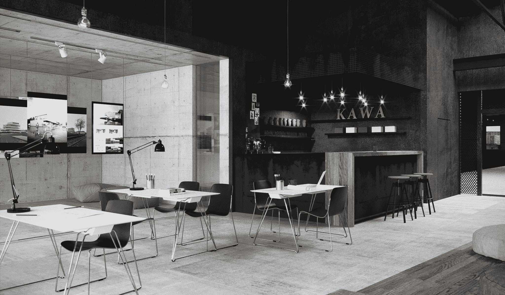
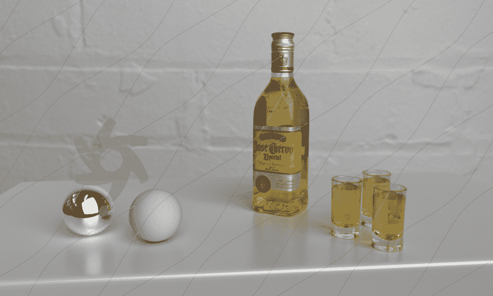
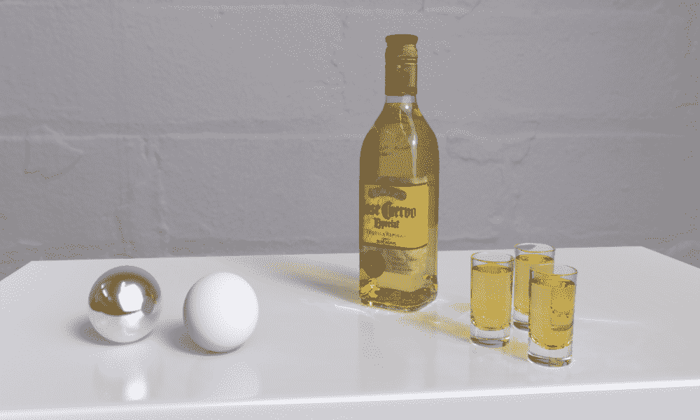
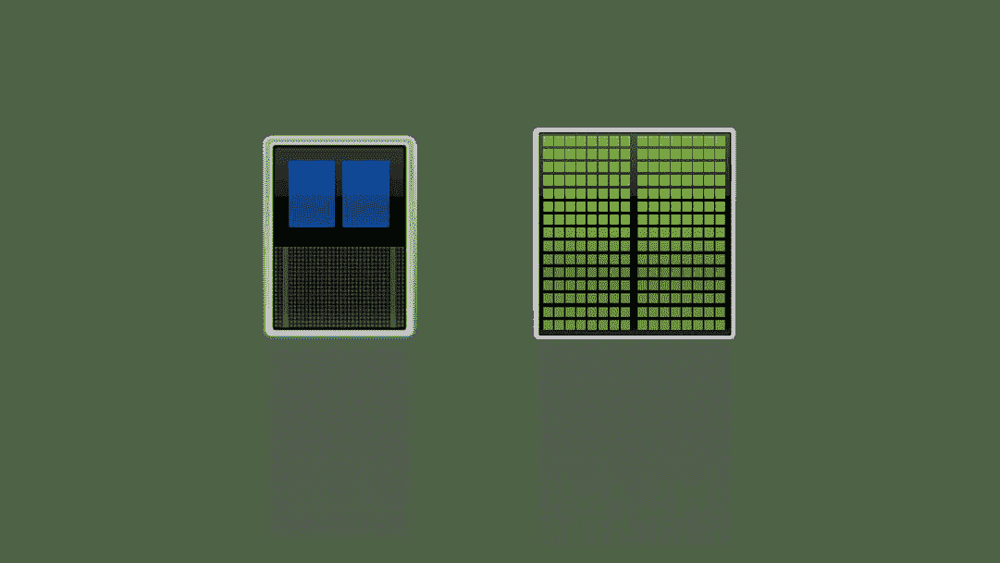
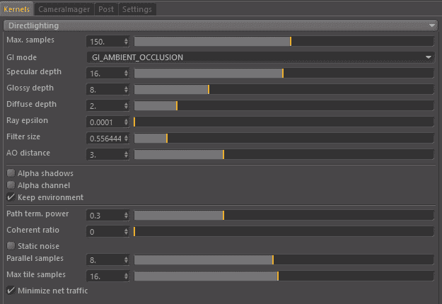
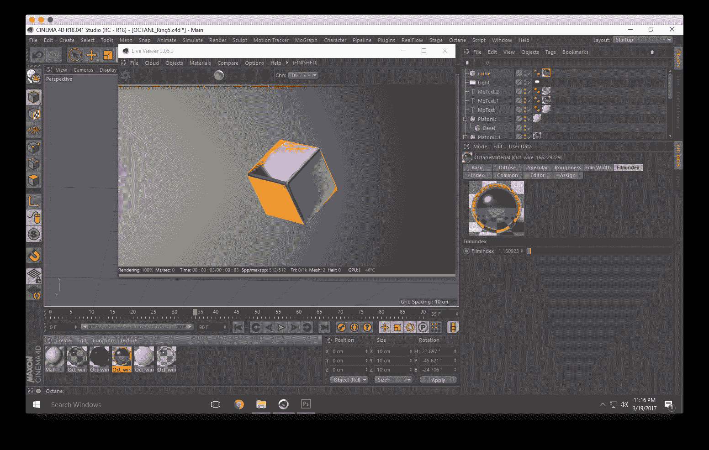

# 在云中使用 Octane 进行 GPU 渲染

> 原文：<https://blog.paperspace.com/gpu-rendering-with-octane-in-the-cloud/>

GPU 渲染正在成为视觉效果、动画和广告领域的行业标准。通过利用当今的高端图形卡，计算机可以看到使用针对 GPU 优化的渲染系统的性能提高了几个数量级。

Alek Pluta 设计的卡尔马艺术博物馆

GPU 渲染正在成为视觉效果、动画和广告领域的行业标准。通过利用当今的高端图形卡，计算机可以看到使用针对 GPU 优化的渲染系统的性能提高了几个数量级。OctaneRender 是最受欢迎的系统之一，因为它集成了多种软件和材料库。在本文中，我们将讨论 GPU 渲染的一些优势和历史。

想要突出你的作品吗？

如果你想在 Paperspace 上展示你的作品，请给我们发一封电子邮件到 hello@paperspace.com，或者给我们发一张图片，并附上#MadeOnPaperspace 的标签

**教程大纲**

*   [辛烷是什么？](#what)
*   [无偏与有偏渲染器](#UvsB)
*   [Gpu vs Cpu](#GPUvsCPU)
*   [优点&缺点](#Advantages)
*   [辛烷渲染](#Rendering)
*   [独立版 vs 插件版](#PluginVsStandalone)
*   [渲染模式](#RenderModes)
*   [采样选项](#Sampling)
*   [材料设置](#Material)
*   [Paperspace 的 GPU 选项](#Gpus)
*   Gpu+
*   P500(测试版)

* * *

## 辛烷是什么？

Octane 是世界上第一个也是最快的 GPU 加速、无偏见、物理正确的渲染器。Octane 是由一家名为 Refractive Software，Ltd .的新西兰公司开发的，后来在 2012 年被 OTOY 公司收购。现在它正被用于故事片、商业广告，甚至建筑渲染。由于能够在云端运行 Octane，它可能会更加融入这些行业的创意流程。

## 无偏与有偏渲染

*   **偏向渲染**是视觉效果和动画世界的中流砥柱。因为偏向渲染会提前执行某些计算，所以在实际渲染过程中会节省大量处理能力。偏向渲染本质上是“欺骗”,通过做出允许更少计算的假设来加速渲染过程。换句话说，“偏见”是为了提高效率而故意引入的。就在 5 年前，有偏见的渲染引擎，如 Mental Ray、Vray 和 Renderman，成为了行业标准，因为它们看起来像照片一样真实，但渲染时间只占“物理精确”的一小部分。然而，这些有偏差的引擎通常会导致奇怪的伪像(称为偏差误差)，需要优化和微调以确保最终的图像正确无误。

*   **无偏渲染**尽可能接近物理精度，因为每个像素都被推过现实生活中光线粒子在场景中传播的路径。这种严格的过程会在无偏渲染的初始阶段导致大量的混乱(想想噪音)。经过几次处理后，图像开始变得平滑，误差率(噪声)随着时间的推移而降低。当开发有偏差的渲染时，无偏差的渲染通常是有偏差的渲染与之比较的标准，以确保图像计算是正确的。

> 有趣的事实: *虽然一个无偏见的渲染引擎会产生卓越的质量和真实感，远远优于一个有偏见的渲染引擎，但一个无偏见的渲染永远不会“完成”。它将永远呈现，直到你简单地保存它并调用它完成。*

*辛烷渲染[RunHarry.com](http://www.runharry.com/2013/07/10/octane-render-vs-mental-ray/)*

*精神射线渲染[RunHarry.com](http://www.runharry.com/2013/07/10/octane-render-vs-mental-ray/)*

* * *

## GPU vs CPU

TL；CPU 可以非常快速地进行一次计算，但只能同时进行几次计算。CPU 上的并行处理受到内核数量的限制，在现代机器上通常是 4 到 16 个。GPU 拥有大量低功耗内核，允许并行进行大量小型计算。一个典型的 GPU 有几百到几千个内核。

由于偏向渲染器的速度优势(在 VFX 和 Mograph 世界中，时间=金钱)，偏向渲染器已经统治了相当一段时间。但是随着 CUDA 和多处理器显卡的出现，图形世界中的许多人清楚地认识到，可能有更好的方法来进行无偏见的渲染。尽管图形处理器中的内核比传统 CPU 内核的带宽低得多，但在并行工作时(由于渲染器与图形处理器的集成)，图形卡处理像素信息的速度比 CPU 高得多。

BOXX 做了一篇关于 GPU 和 CPU 渲染差异的[大对比文章](http://blog.boxx.com/2014/10/02/gpu-rendering-vs-cpu-rendering-a-method-to-compare-render-times-with-empirical-benchmarks/)。发现使用 CPU 和 GPU 来产生相似质量的图像需要截然不同的渲染时间。

> 在使用标准硬件(如 3.4 Ghz 英特尔至强处理器和具有 2，688 个 CUDA 内核的 NVIDIA GPU)运行的测试中，他们发现 GPU 的性能比 CPU 快 6.2 倍。

### GPU 的优势和劣势

### **优点**

###### 1.GPU 拥有比 CPU 多得多的核心处理器

When utilized correctly by software, GPU rendering can be much faster than CPU rendering.

###### 2.GPU 比 CPU 消耗更少的能量

It is expected that soon a 14 nm fabrication technology will be used in manufacturing GPU and that will make the cost of power consumption even smaller. In the future, you can expect to see many GPUs coming equipped with larger sized memories which will enable larger resolution sized images to get rendered faster.

###### 3.降低硬件成本

Put simply, the power of a GPU can be equivalent to anywhere from five to twenty CPUs. This means it would take only one machine to do the job of five or twenty CPU machines put together. This is the reason GPUs produce results faster.

###### 4.潜在增长的未来

The future of GPU processing is bright. As CPUs near the limit for growth due to size limitations, GPUs may be the next logical step in continuing computing power growth.
**

### 不足之处

**

###### 1.GPU 内存限制

Because a user's 3D file will have to be loaded into the graphics card's memory, there is a limitation on how big your file can be, although this limitation seems to be slowly becoming irrelevant as the memory on graphics cards is always expanding. The software developers also seem to be working on ways to circumvent this limitation as the new version of Octane may not have any memory limitations beyond your system's ram.

###### 2.每个内核的带宽限制

Due to the fact that Graphics cards have so many cores, the actual bandwidth of each core is much lower than that of a traditional CPU core.

###### 3.严重依赖软件效率

The ability to utilize GPU cores is fairly new, and the development side is still in flux, however, the potential for growth here is tremendous.

* * *

## 辛烷渲染

Octane 易于安装，学习曲线低。对于本教程，我们将使用 4D 电影院辛烷插件。

##### 独立版本与插件版本

在 Paperspace 上使用 Octane 有两种方式。有一个[独立应用](https://home.otoy.com/render/octane-render/purchase/)和[插件支持多种软件](https://home.otoy.com/render/octane-render/purchase/)。你需要决定哪个版本最适合你。
单机版要求你在 Alembic(.abc)格式或将单个几何图形导出为。obj 文件。

##### 渲染模式

There are 4 different render modes that octane has. 

### 信息渠道

Info Channels mode allows you to see certain passes that are used for compositing. 

### 直接照明

Direct Lighting is very useful for working quickly and realtime manipulation of materials. While it is not unbiased, it is useful when creating quick animations or renders. 

### 路径跟踪

Path Tracing is used when a photorealistic render is required. It can have some difficulties with small light sources and proper caustics (for which pmc is better suited). 

### 先天性肌强直病

PMC is a unbiased render kernel written specifically for GPUs. It allows for complex caustics and lighting to be resolved but often has the longest render times. 

##### 采样选项

Each render kernal has similar settings but some settings are specific to that kernal.

*   最大样本数(Max Samples)-此设置控制最终图像的噪点。采样越高，噪波越低，但渲染时间越长。

*   **胃肠模式** -胃肠取样有两种选择。

*   环境遮挡:标准环境遮挡。这种模式通常可以提供逼真的图像，但没有渗色。

*   漫射:间接漫射，配置为设置要包括的间接漫射反弹的数量。这提供了介于环境遮挡和路径跟踪之间的 GI 质量，没有焦散和相当真实的质量(比 AO 好)，但比路径跟踪/PMC 快得多。非常适合快速的决赛和动画。它在某些方面类似于其他发动机中的间接 GI。

*   镜面/光泽/漫射深度 -这控制了光线在终止前会经过多少次反弹。设置越高，高光材质越亮，但是渲染时间会随着设置的增加而增加。

*   **射线ε**-这是偏移新射线的距离，这样它们就不会与原始几何体相交。在渲染中出现同心圆的情况下，增加光线ε可以使这些伪像消失。

*   **过滤尺寸** -该设置决定了过滤的半径。通过增加此值，图像会变得柔和，噪点会减少，但如果设置过高，图像的清晰度会降低。对渲染时间的影响很小，因为该设置通常不应高于 4。

*   **AO 距离** -通过增加或减少该值，相交表面之间的暗度会相应增加或减少。对于小对象，该值可以减小，而对于较大的场景，该值可以增大。

*   **阿尔法阴影** -该设置允许任何具有透明度的物体(镜面材质、具有不透明设置和阿尔法通道的材质)投射出合适的阴影，而不是表现为实体。

*   阿尔法通道(Alpha Channel)-该选项移除背景并将其渲染为透明。如果用户希望在另一个图像上合成渲染，并且不希望出现背景，这将非常有用。

*   **保持环境** -该选项与 Alpha 通道设置结合使用。它允许背景以零 alpha 进行渲染，但在最终渲染中仍然可见。这使得合成图像更加灵活。

*   **路径终止功率** -该值调整渲染速度与收敛(噪声消失的速度)。增加它将导致内核保持路径更短，在黑暗区域花费的时间更少(这意味着它们保持噪声的时间更长)，但可能会增加每秒采样数很多。减小该值将导致内核平均跟踪更长的路径，并在黑暗区域花费更多的时间。当前的默认值 0.3 在大多数场景下都很好，但是调整它，看看它是否能加速你的渲染。

*   **相干比率** -这可以提高渲染速度，但可能会在第一个样本/像素期间导致一些“闪烁”,应该主要用于最终渲染，如果你计划渲染 500 个样本/像素或更多的话。

* * *

## 材料设置

###### 材料类型

*   漫射材料在表面上传播反射，就像混凝土、砖块和粘土一样。这是粗糙表面的理想选择。

*   有光泽的 -有光泽的材料是金属、车漆和闪亮的塑料。

*   **镜面** -镜面材质用于透明表面，如玻璃或水。

##### 材料选项

### 传播

The diffuse channel is where you can define a base surface color. 

### 镜子的

Specular highlights represent a form of reflectivity that is affected by the surface roughness.

### 粗糙

Roughness is useful when trying to create surfaces like Brushed Steel or matte plastic. 

### 反射

The Reflection value determines the glossiness of the mesh.

### 胶片宽度

This controls the thickness of a optical, thin film on the material. This is useful in creating rainbow or oil slick effects.

### 电影索引

This controls the Index of Refraction of the thin film.

### 凹凸/法线凹凸和法线通道都可以加载图像来控制凹凸贴图和法线贴图的数量。)凹凸通道应该设置为 floatimage 来加载凹凸贴图。法线通道应设置为图像数据类型，以加载全色法线贴图。！

### 位移

位移贴图是一种应用于纹理的技术，目的是为了在三维空间中为二维对象提供一定的深度。与凹凸贴图和法线贴图相反，置换贴图会影响对象的轮廓，并且实际上会扭曲曲面。！【位移】(https://docs . otoy . com/manuals/WP-content/uploads/2016/05/resim 69 . png)

### 不透明度

决定一个表面的透明程度。

### 折射率

这里控制[折射率](https://en.wikipedia.org/wiki/Refractive_index)。这会影响光线通过曲面的曲率。这里有一个方便的折射率列表。

* * *

## Paperspace 的 GPU 选项

Paperspace 为高性能 GPU 计算机提供了几个可以被 Octane 利用的选项。

###### GPU+

paper space 提供的 GPU+机器包括一台 NVIDIA Quadro M4000，配备 8gb 专用内存，使用 1，664 个 CUDA 内核可以达到 192 GB/s。这是 Octane 的理想设置，还包括 30GB 的 RAM 和 8 个 vCPUs。

###### P5000

*Beta*

P5000 机器拥有 2，560 个并行 CUDA 内核和 16GB 的 GPU 内存，让您可以推动高达 288 GB/s 和惊人的 9 TeraFLOPs。

* * *

## 结论

We hope this overview has shown you some of the ways to utilize A GPU renderer like Octane in the cloud. In future tutorials, we will be going over ways to optimize your renders, how to get the best image possible, and how to use some special features like hair and volumetrics! 

要开始使用你自己的渲染管道，[在这里注册。](https://www.paperspace.com/account/signup?utm-campaign=octaneblog)