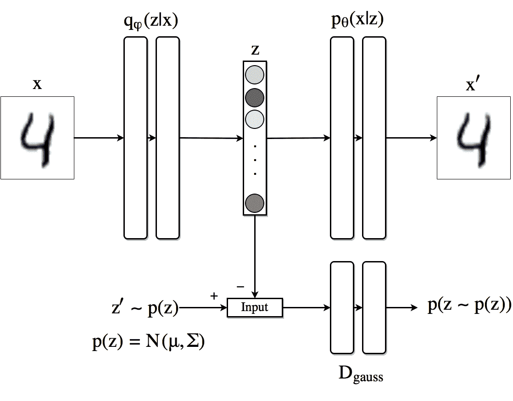
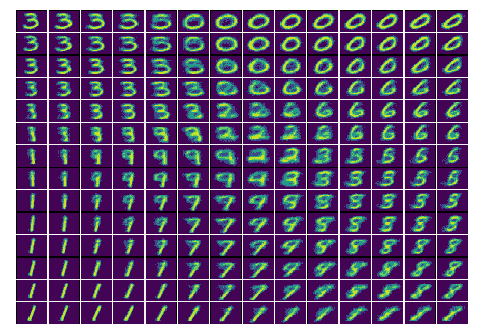
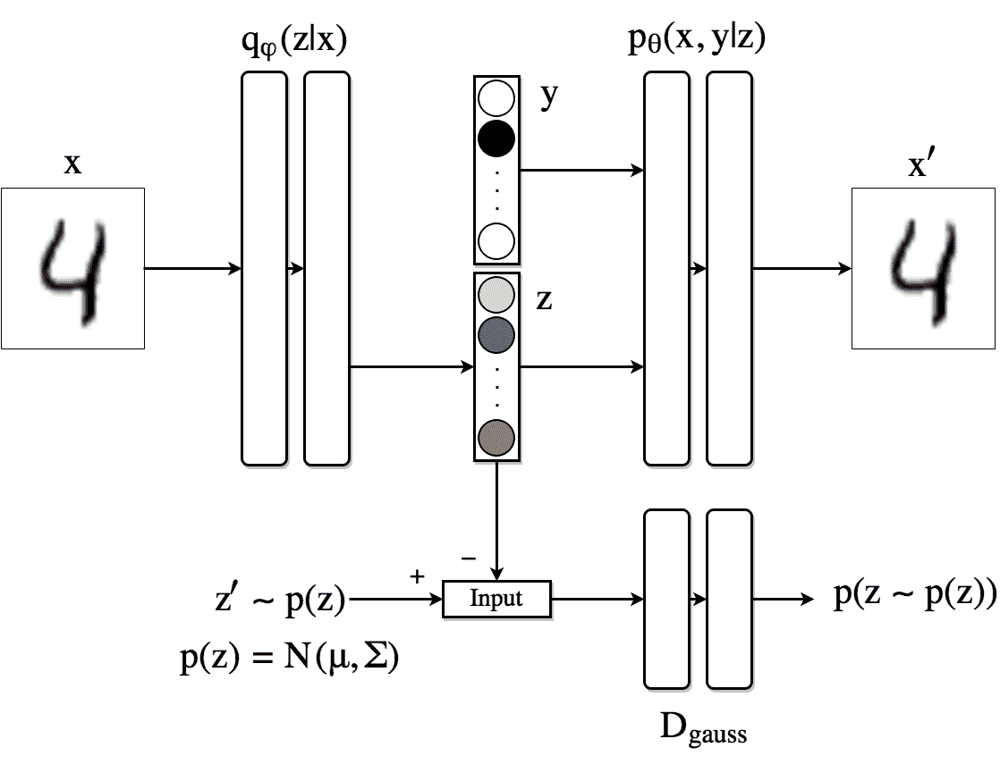
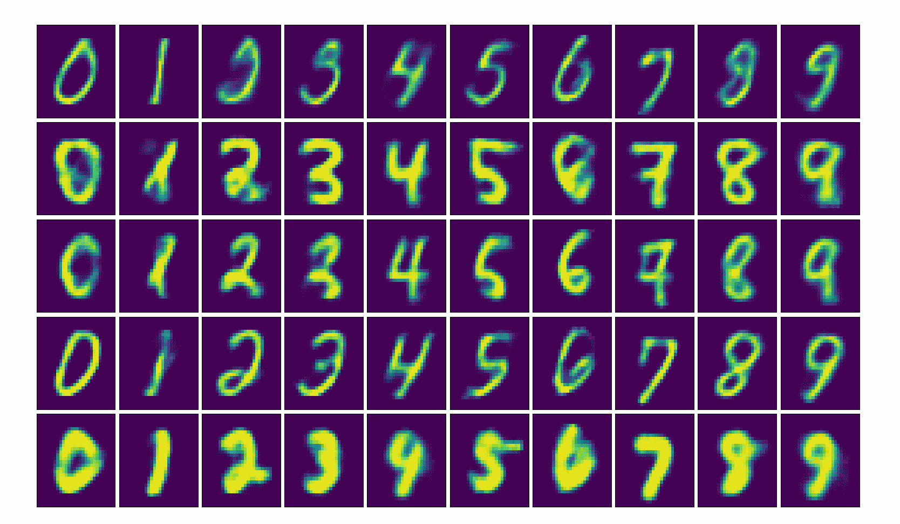
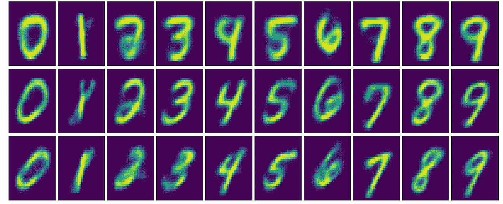
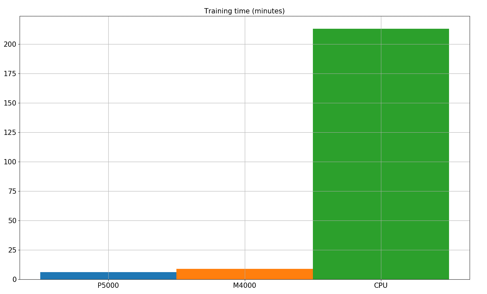

# 对抗性自动编码器(带 Pytorch)

> 原文：<https://blog.paperspace.com/adversarial-autoencoders-with-pytorch/>

> “人类和动物的大部分学习都是无监督学习。如果智能是一块蛋糕，无监督学习将是蛋糕[基础]，监督学习将是蛋糕上的糖衣，强化学习将是蛋糕上的樱桃。我们知道如何制作糖衣和樱桃，但我们不知道如何制作蛋糕。”

 <link rel="stylesheet" href="//cdnjs.cloudflare.com/ajax/libs/highlight.js/8.9.1/styles/github.min.css">   

脸书人工智能研究所所长 Yann LeCunn 教授在他的演讲中多次提到这个类比。对于无监督学习，他指的是*“机器通过观察和行动来模拟环境、预测可能的未来以及理解世界如何运转的能力。”*

深度生成模型是试图解决机器学习中无监督学习问题的技术之一。在这个框架中，机器学习系统需要发现未标记数据中的隐藏结构。深度生成模型有许多广泛的应用，密度估计、图像/音频去噪、压缩、场景理解、表示学习和半监督分类等等。

变分自动编码器(VAEs)允许我们在概率图形模型的框架中形式化这个问题，其中我们最大化数据的对数似然的下限。在这篇文章中，我们将看看最近开发的架构，对抗性自动编码器，它受 VAEs 的启发，但在如何将我们的数据映射到潜在维度方面给了我们更多的灵活性(如果现在这还不清楚，不要担心，我们将在文章中再次讨论这个想法)。关于对抗性自动编码器的最有趣的想法之一是如何通过使用对抗性学习将先验分布强加给神经网络的输出。

如果你想接触 Pytorch 代码，请随意访问 GitHub repo。在这篇文章中，我们将首先介绍一些关于去噪自动编码器和变型自动编码器的[背景](https://blog.paperspace.com/p/0862093d-f77a-42f4-8dc5-0b790d74fb38/#background)，然后跳转到[对抗自动编码器](https://blog.paperspace.com/p/0862093d-f77a-42f4-8dc5-0b790d74fb38/#aae)，Pytorch [实现](https://blog.paperspace.com/p/0862093d-f77a-42f4-8dc5-0b790d74fb38/#implementation)，随后的[训练过程](https://blog.paperspace.com/p/0862093d-f77a-42f4-8dc5-0b790d74fb38/#training)，以及一些关于使用 MNIST 数据集的解纠缠和半监督学习的[实验](https://blog.paperspace.com/p/0862093d-f77a-42f4-8dc5-0b790d74fb38/#generation)。

#### 背景

##### 去噪自动编码器(dAE)

自动编码器最简单的版本是我们训练一个网络来重建它的输入。换句话说，我们希望网络以某种方式学习身份函数$f(x) = x$。为了使这个问题不是微不足道的，我们将条件强加给网络以通过中间层(*潜在空间*)，该中间层的维度远低于输入的维度。在这种瓶颈条件下，网络必须压缩输入信息。因此，网络被分成两部分，*编码器*接收输入并创建其*潜在*或*隐藏*表示，而*解码器*获取该中间表示并尝试重建输入。自动编码器的损耗称为*重建损耗*，可以简单地定义为输入和生成样本之间的平方误差:

$$L_R (x，x') = ||x - x'||^2$$

当输入被归一化到$[0,1]^N$范围内时，另一个广泛使用的重建损失是交叉熵损失。

##### 可变自动编码器(VAE)

变分自动编码器对如何构造隐藏表示施加了第二个约束。现在，潜在代码具有由设计$p(x)$定义的先验分布。换句话说，编码器不能自由地使用整个潜在空间，而是必须限制在这个先验分布$p(x)$下可能产生的隐藏代码。例如，如果潜在代码上的先验分布是均值为 0 且标准偏差为 1 的高斯分布，那么生成值为 1000 的潜在代码应该是不太可能的。

这可以被看作是对可以存储在潜在代码中的信息量的第二种正则化。这样做的好处在于，现在我们可以将该系统用作生成模型。为了创建来自数据分布$p(x)$的新样本，我们只需从$p(z)$进行采样，并通过*解码器*运行该样本，以*重建*新图像。如果不施加这个条件，则潜在代码可以自由地分布在潜在空间中，因此不可能以直接的方式对有效的潜在代码进行采样以产生输出。

为了加强这一特性，以编码器创建的分布和先前分布之间的 Kullback-Liebler (KL)散度的形式将第二项添加到损失函数中。因为 VAE 是基于概率解释的，所以使用的重建损失是前面提到的交叉熵损失。把这些放在一起，

$$L(x，x') = L_R (x，x') + KL(q(z|x)||p(z))$$
或
$$L(x，x ')=-\ sum _ { k = 1 } ^{n} x _ k \ log(x ' _ k)+(1-x _ k)\ log(1-x ' _ k)+KL(q(z | x)| | p(z))$ $

其中$q(z|x)$是我们网络的编码器，而$p(z)$是强加于潜在代码的先验分布。现在，这种架构可以使用反向传播进行联合训练。

#### 对抗性自动编码器(AAE)

##### 作为生成模型的 AAE

变分自动编码器的主要缺点之一是 KL 散度项的积分除了少数分布外没有封闭形式的解析解。此外，对潜在代码$z$使用离散分布并不简单。这是因为通过离散变量的反向传播通常是不可能的，这使得模型难以有效地训练。这里介绍了一种在 VAE 背景下实现这一点的方法[。](https://arxiv.org/abs/1609.02200)

对抗性自动编码器通过使用对抗性学习来避免使用 KL 散度。在这种架构中，训练一个新的网络来有区别地预测样本是来自自动编码器的隐藏代码还是来自用户确定的先验分布$p(z)$的。编码器的损耗现在由重建损耗加上鉴频器网络给出的损耗组成。

该图像示意性地示出了当我们对潜在代码使用高斯先验时 AAEs 是如何工作的(尽管该方法是通用的并且可以使用任何分布)。顶行相当于自动编码器。首先，根据生成器网络$q(z|x)$抽取一个样本$z$，然后将该样本发送到解码器，该解码器从$z$生成$ x′$的。在$x$和$x'$之间计算重建损失，并相应地通过$p$和$q$反向传播梯度，并更新其权重。

Figure 1\. Basic architecture of an AAE. Top row is an autoencoder while the bottom row is an adversarial network which forces the output to the encoder to follow the distribution $p(z)$.

在对抗正则化部分，鉴别器接收从真实先验$p(z)$中采样的分布为$q(z|x)$和$z'$的$z$并为来自$p(z)$的每一个分配概率。发生的损失通过鉴别器反向传播以更新其权重。然后重复该过程，发生器更新其参数。

我们现在可以使用敌对网络的生成器(它是自动编码器的编码器)而不是 KL 散度所导致的损失，来学习如何根据分布$p(z)$产生样本。这种修改允许我们使用更广泛的分布集作为潜在代码的先验。

鉴频器的损耗为

$ $ l _ d =-\ frac { 1 } { m } \ sum _ { k = 1 }∞log(d(z)+\ log(1-d(z))$({ t0]出图)

其中$m$是小批量大小，$z$是由编码器生成的，$z'$是来自真实先验的样本。

对于我们的敌对发电机

$$L_G = - \frac{1}{m} \sum _{k=1} ^m 对数(D(z))$$ ( [Plot](https://raw.githubusercontent.com/fducau/AAE_pytorch/master/img/gloss.png)

通过查看等式和图，你应该说服自己，这种方式定义的损失将迫使鉴别器能够识别假样本，同时将推动发生器欺骗鉴别器。

##### 网络定义

在进入用于该模型的训练过程之前，我们先看看如何在 Pytorch 中实现我们到目前为止所拥有的。对于编码器、解码器和鉴别器网络，我们将使用简单的前馈神经网络，其具有三个 1000 个隐藏状态层，具有 ReLU 非线性函数和概率为 0.2 的丢失。

```py
#Encoder
class Q_net(nn.Module):
    def __init__(self):
        super(Q_net, self).__init__()
        self.lin1 = nn.Linear(X_dim, N)
        self.lin2 = nn.Linear(N, N)
        self.lin3gauss = nn.Linear(N, z_dim)
    def forward(self, x):
        x = F.droppout(self.lin1(x), p=0.25, training=self.training)
        x = F.relu(x)
        x = F.droppout(self.lin2(x), p=0.25, training=self.training)
        x = F.relu(x)
        xgauss = self.lin3gauss(x)
        return xgauss 
```

```py
# Decoder
class P_net(nn.Module):
    def __init__(self):
        super(P_net, self).__init__()
        self.lin1 = nn.Linear(z_dim, N)
        self.lin2 = nn.Linear(N, N)
        self.lin3 = nn.Linear(N, X_dim)
    def forward(self, x):
        x = self.lin1(x)
        x = F.dropout(x, p=0.25, training=self.training)
        x = F.relu(x)
        x = self.lin2(x)
        x = F.dropout(x, p=0.25, training=self.training)
        x = self.lin3(x)
        return F.sigmoid(x) 
```

```py
# Discriminator
class D_net_gauss(nn.Module):
    def __init__(self):
        super(D_net_gauss, self).__init__()
        self.lin1 = nn.Linear(z_dim, N)
        self.lin2 = nn.Linear(N, N)
        self.lin3 = nn.Linear(N, 1)
    def forward(self, x):
        x = F.dropout(self.lin1(x), p=0.2, training=self.training)
        x = F.relu(x)
        x = F.dropout(self.lin2(x), p=0.2, training=self.training)
        x = F.relu(x)
        return F.sigmoid(self.lin3(x)) 
```

从这个定义中需要注意一些事情。首先，由于编码器的输出必须遵循高斯分布，我们**在其最后一层不使用**任何非线性。解码器的输出具有 sigmoid 非线性，这是因为我们使用的输入经过归一化处理，其值在 0 和 1 之间。鉴别器网络的输出只是 0 和 1 之间的一个数字，代表输入来自真实先验分布的概率。

一旦定义了网络类，我们就为每个类创建一个实例，并定义要使用的优化器。为了在编码器(也是对抗网络的生成器)的优化过程中具有独立性，我们为网络的这一部分定义了两个优化器如下:

```py
torch.manual_seed(10)
Q, P = Q_net() = Q_net(), P_net(0)     # Encoder/Decoder
D_gauss = D_net_gauss()                # Discriminator adversarial
if torch.cuda.is_available():
    Q = Q.cuda()
    P = P.cuda()
    D_cat = D_gauss.cuda()
    D_gauss = D_net_gauss().cuda()
# Set learning rates
gen_lr, reg_lr = 0.0006, 0.0008
# Set optimizators
P_decoder = optim.Adam(P.parameters(), lr=gen_lr)
Q_encoder = optim.Adam(Q.parameters(), lr=gen_lr)
Q_generator = optim.Adam(Q.parameters(), lr=reg_lr)
D_gauss_solver = optim.Adam(D_gauss.parameters(), lr=reg_lr) 
```

##### 培训程序

每个迷你批次的该架构的培训程序如下:

**1)** 通过编码器/解码器部分执行前向路径，计算重建损耗并更新编码器 Q 和解码器 P 网络的参数。

```py
 z_sample = Q(X)
    X_sample = P(z_sample)
    recon_loss = F.binary_cross_entropy(X_sample + TINY, 
                                        X.resize(train_batch_size, X_dim) + TINY)
    recon_loss.backward()
    P_decoder.step()
    Q_encoder.step() 
```

**2)** 创建一个潜在表示 z = Q(x)并从前一个 p(z)中取出一个样本 z’，通过鉴别器运行每个样本，并计算分配给每个样本的分数(D(z)和 D(z’)。

```py
 Q.eval()    
    z_real_gauss = Variable(torch.randn(train_batch_size, z_dim) * 5)   # Sample from N(0,5)
    if torch.cuda.is_available():
        z_real_gauss = z_real_gauss.cuda()
    z_fake_gauss = Q(X) 
```

**3)** 计算鉴别器中的损耗，并通过鉴别器网络反向传播，以更新其权重。在代码中，

```py
 # Compute discriminator outputs and loss
    D_real_gauss, D_fake_gauss = D_gauss(z_real_gauss), D_gauss(z_fake_gauss)
    D_loss_gauss = -torch.mean(torch.log(D_real_gauss + TINY) + torch.log(1 - D_fake_gauss + TINY))
    D_loss.backward()       # Backpropagate loss
    D_gauss_solver.step()   # Apply optimization step 
```

**4)** 计算发电机网络损耗，并相应更新 Q 网络。

```py
# Generator
Q.train()   # Back to use dropout
z_fake_gauss = Q(X)
D_fake_gauss = D_gauss(z_fake_gauss)

G_loss = -torch.mean(torch.log(D_fake_gauss + TINY))
G_loss.backward()
Q_generator.step() 
```

##### 生成图像

现在，我们尝试观察 AAE 如何将图像编码成标准偏差为 5 的二维高斯潜像。为此，我们首先用二维隐藏状态训练模型。然后，我们在这个潜在空间上从(-10，-10)(左上角)到(10，10)(右下角)生成均匀点，并通过解码器网络运行它们。

Latent space. Image reconstructions while exploring the 2D latent space uniformly from -10 to 10 in both the $x$ and $y$ axes.

#### AAE 将学习解开表象

理想的数据中间表示应该能够捕捉到生成观察数据的变化的潜在因果因素。Yoshua Bengio 和他的同事在[的这篇论文](http://www.cl.uni-heidelberg.de/courses/ws14/deepl/BengioETAL12.pdf)中提到*“我们希望我们的陈述能够理清变异的因素。在输入分布“*”中，数据的不同解释因素倾向于彼此独立地变化。他们还提到*“最稳健的特征学习方法是理清尽可能多的因素，丢弃尽可能少的数据信息”*。

在 [MNIST](http://yann.lecun.com/exdb/mnist/) 数据(这是一个手写数字的大型数据集)的情况下，我们可以定义两个潜在的因果因素，一方面，我们有正在生成的数字，另一方面，书写它的风格或方式。

###### 监督方法

在这一部分，我们比前面的架构更进一步，尝试在潜在代码$z$中加入某种结构。特别是，我们希望该架构能够在完全监控的情况下将类信息与跟踪风格分离开来。为此，我们将之前的架构扩展到下图中的架构。我们将潜在维度分为两部分:第一部分$z$类似于我们在上一个例子中的维度；隐藏代码的第二部分现在是一个 [one-hot vector](https://www.quora.com/What-is-one-hot-encoding-and-when-is-it-used-in-data-science) $y$表示输入到自动编码器的数字的身份。

Supervised Adversarial Autoencoder architecture.

在此设置中，解码器使用一键向量$y$和隐藏代码$z$来重建原始图像。编码器的任务是将样式信息编码到$z$中。在下图中，我们可以看到用 10，000 个带标签的 MNIST 样本训练该架构的结果。该图示出了重建的图像，其中，对于每一行，隐藏代码$z$被固定为特定值，并且类标签$y$的范围从 0 到 9。有效地跨列保持样式。

Image reconstruction by exploring the latent code $y$ while keeping $z$ fixed from left to right.

##### Semi-supervised approach As our last experiment we look an alternative to obtain similar disentanglement results for the case in which we have only few samples of labeled information. We can modify the previous architecture so that the AAE produces a latent code composed by the concatenation of a vector $y$ indicating the class or label (using a Softmax) and a continuous latent variable $z$ (using a linear layer). Since we want the vector $y$ to behave as a one-hot vector, we impose it to follow a Categorical distribution by using a second adversarial network with discriminator $D_{cat}$. The encoder now is $q(z, y|x)$. The decoder uses both the class label and the continuous hidden code to reconstruct the image.

Semi-supervised Adeversarial Autoencoder architecture.

未标记数据通过改进编码器基于重构损失创建隐藏代码的方式以及改进不需要标记信息的发生器和鉴别器网络，对训练过程有所贡献。

Disentanglement with semi supervised approach.

值得注意的是，现在，我们不仅可以生成具有较少标记信息的图像，而且还可以通过查看潜在代码$y$并挑选具有最高值的图像来对没有标记的图像进行分类。在当前设置下，使用 100 个标记样本和 47，000 个未标记样本，分类损失约为 3%。

#### 关于 GPU 培训

最后，我们在 Paperspace 平台的两个不同的 GPU 和 CPU 上对最后一个算法的训练时间做了一个简短的比较。尽管这种架构并不十分复杂，并且由几个线性层组成，但当利用 GPU 加速时，训练时间的改进是巨大的。使用 Nvidia Quadro M4000，500 epochs 训练时间从 CPU 的近 4 小时减少到约 9 分钟，在 Nvidia Quadro P5000 中进一步减少到 6 分钟。

Training time with and without GPU acceleration

#### 更多材料

*   [什么是可变自动编码器](https://jaan.io/what-is-variational-autoencoder-vae-tutorial)(教程)
*   [自动编码变分贝叶斯](https://arxiv.org/abs/1312.6114)(原文)
*   [对抗性自动编码器](https://arxiv.org/abs/1511.05644)(原文)
*   [建造能想象和推理的机器:深度生成模型的原理和应用](http://videolectures.net/deeplearning2016_mohamed_generative_models/)(视频讲座)

要开始使用您自己的 ML-in-a-box 设置，[在此注册。](https://www.paperspace.com/account/signup?utm-campaign=pytorchblog)