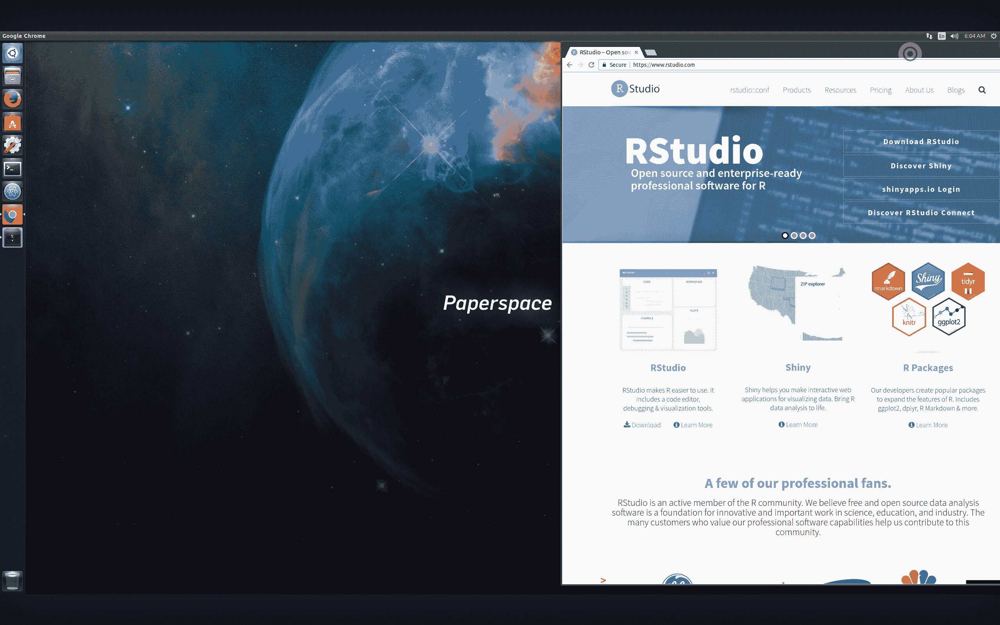
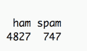
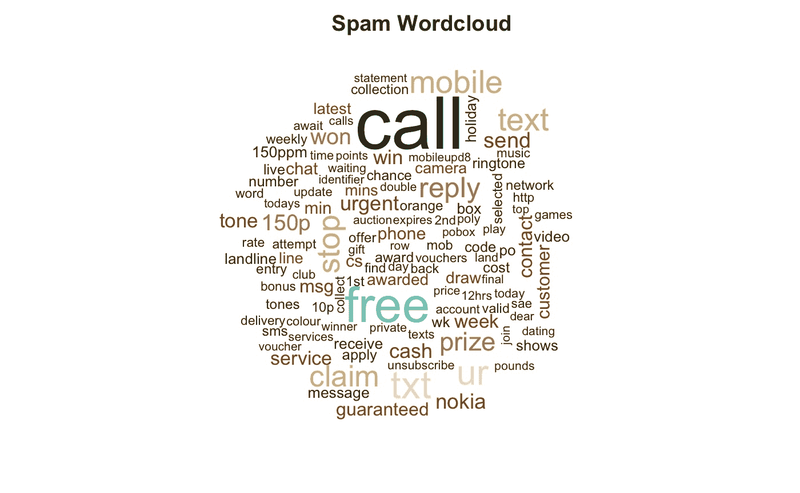
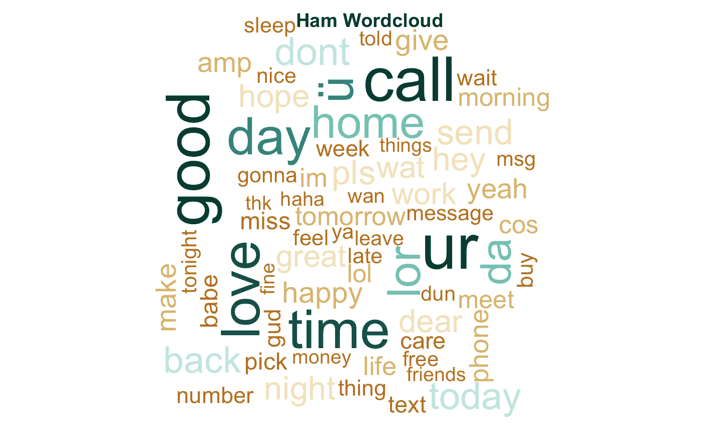
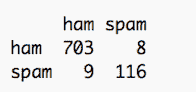

# 用 R 对数据分类的简单介绍

> 原文：<https://blog.paperspace.com/intro-to-datascience/>

## 垃圾邮件还是火腿？



我们生成的大部分数据都是非结构化的。这包括算法可能无法立即理解的文本、音频、视频和图像等来源。然而，想象一下，如果一个人必须单独地将每一封电子邮件分类到你的收件箱或垃圾邮件文件夹中！幸运的是，数据科学最令人兴奋的领域之一，尤其是机器学习，是处理这些数据源并找到对这些数据进行有意义分析的方法的任务。

在本文中，我们将构建一个垃圾邮件过滤器，我们可以用它来将文本消息分类为垃圾邮件，即合法邮件和垃圾邮件。这个例子将介绍文本作为数据源，以及帮助说明一些常见的机器学习概念。虽然本教程是为初学者设计的，但是对 R 统计语言不太熟悉但感兴趣的更有经验的用户可能会发现这个实现很有帮助。请随意编码！

#### R 中文本数据的一些基础知识

要构建垃圾邮件过滤器，我们首先需要将纯文本消息转换成我们的模型可以理解的格式。具体来说，我们需要用字数或频率来表示我们的文本信息。一旦以这种格式表示，就可以使用各种统计模型和程序来理解这些数据。这被称为自然语言处理。

我们可以通过首先将文本文件加载到统计软件包中来做到这一点。本教程将使用强大且广泛使用的统计语言 R，并通过 R Studio 来实现。有关在您的机器上安装和设置 R 的更多信息，请查看此[链接](https://www.r-project.org/)。你需要的软件和软件包都是开源的。

让我们加载两个包: [`quanteda`](https://cran.r-project.org/web/packages/quanteda/index.html) 和 [`RColorBrewer`](https://cran.r-project.org/web/packages/RColorBrewer/index.html) 。前者是一个流行的文本数据统计分析包，后者为我们将要生成的图形提供了一套颜色选项。`library()`命令指示 R 加载这些已经安装的包。如果您不熟悉 R(或这些包)，那么在从您的库中访问它们之前，用`install.packages("")`替换这个命令来安装这些包。

```py
library(quanteda) 
library(RColorBrewer) 
```

加载我们的包后，让我们从[这里](http://www.dt.fee.unicamp.br/~tiago/smsspamcollection/)导入一个公开可用的垃圾短信/垃圾邮件数据集，这是在 [Almeida 等人](http://www.dt.fee.unicamp.br/~tiago/smsspamcollection/doceng11.pdf)中介绍的。


我们从自述文件中了解到，该数据集表示为一个纯文本文件，其中列出了带有相关联的垃圾邮件标签的 SMS 消息内容。短信 5574 条，其中垃圾短信占 13.4%，合法短信占 86.6%。我们的挑战是构建一个监督机器学习分类器，它可以完全独立地分离这两种类型。

首先从上面的 URL 下载数据，然后将您的 R 工作目录设置为您下载文件的文件夹。这告诉 R 在你的计算机上哪里寻找数据。最后，使用`read.table`命令将数据读入 R，并用引号指定文件名。括号中的其他参数告诉 R 如何读取纯文本文件。我们将使用`<-`将这个 SMS 消息集合命名为“raw.data”。

```py
setwd("~/Your Folder Path")
raw.data <- read.table("SMSSpamCollection", header=FALSE, sep="\t", quote="", stringsAsFactors=FALSE) 
```

如果您在尝试导入数据时遇到任何错误消息，请查看 [StackExchange](http://stats.stackexchange.com/) 或 [StackOverflow](http://stackoverflow.com/) 以获得有用的建议。实际上，数据导入可能是比较繁琐的任务之一！

让我们给这两列信息添加标题。我们将第一列称为“标签”，第二列称为“文本”。这将使我们在以后的分析中容易记住和调用这些变量。最后，我们可以检查垃圾邮件的数量，以再次检查我们的数据是否正确导入。

```py
names(raw.data) <- c("Label", "Text")
table(raw.data$Label) 
```



看起来我们正在处理 4，827 条垃圾邮件和 747 条垃圾邮件。这与数据集的自述文件中的数据描述相符，所以我们应该可以开始了。

我们在数据导入阶段要做的最后一件事是使用`sample()`命令随机化我们的数据。以防数据不是以随机分布存储的，这将有助于确保我们处理的是从数据中随机抽取的数据。`set.seed()`命令只是为了确保更加一致的复制，这样您的结果应该反映本教程中的结果。

```py
set.seed(1912)
raw.data <- raw.data[sample(nrow(raw.data)),] 
```

您可以使用`View()`命令查看数据的样子。您会注意到，我们已经将一个纯文本文件变成了一个存储良好的数据帧，其中包含带标签的标题和随机观察。

在我们开始构建分类模型之前，让我们用一种直观的可视化方式来感受一下我们的数据:单词 cloud。然后，我们可以从视觉上检查图像，以查看 ham 和垃圾邮件之间的语言是否有所不同。

在自然语言处理中，我们喜欢处理语料库对象。语料库可以被认为是我们的数据集的主副本，我们可以根据需要从中提取子集或观察值。我们将使用`quanteda`的`corpus()`命令从原始数据的文本字段构建一个语料库，我们可以将其命名为`sms.corpus`。然后，使用`docvars()`命令将标签字段作为文档变量附加到语料库。我们将 Label 作为一个变量直接附加到我们的语料库，以便我们可以在稍后的分析中将 SMS 消息与其各自的 ham/spam 标签相关联。

```py
sms.corpus <- corpus(raw.data$Text) 
docvars(sms.corpus) <- raw.data$Label 
```

随着我们的主语料库的建立，我们现在可以将其分为垃圾邮件和业余邮件，以构建单词云，并查看它们使用的语言的差异。单词显示得越大，该单词在我们的数据中出现的频率就越高。

首先，将语料库分成垃圾邮件子集。请记住，我们需要将这些单词转换成计算机可以计数的东西。因此，使用`dfm()`命令构建一个文档术语频率矩阵(DFM ),并删除一些杂乱的内容，比如标点符号、数字和经常出现的单词，它们可能没有什么有意义的信息。这就是所谓的词汇袋方法。

```py
spam.plot <- corpus_subset(sms.corpus, docvar1 == "spam")
spam.plot <- dfm(spam.plot, tolower = TRUE, removePunct = TRUE, removeTwitter = TRUE, removeNumbers = TRUE, remove=stopwords("SMART")) 
```

构建了 DFM 之后，让我们绘制垃圾邮件词云。我们将使用`RColorBrewer`包中的`brewer.pal`命令根据词频给单词图着色。我们也可以给情节加个标题。

```py
spam.col <- brewer.pal(10, "BrBG")
spam.cloud <- textplot_wordcloud(spam.plot, min.freq = 16, color = spam.col)
title("Spam Wordcloud", col.main = "grey14") 
```



注意像“免费”、“紧急”和“客户”这样的词。当想到垃圾邮件时，这些词可能会直观地出现在脑海中，因此我们可能会有所发现。我们现在可以对 ham 消息重复这个编码过程，并比较两个云。

```py
ham.plot <- corpus_subset(sms.corpus, docvar1 == "ham")
ham.plot <- dfm(ham.plot, tolower = TRUE, removePunct = TRUE, removeTwitter = TRUE, removeNumbers = TRUE, remove=c("gt", "lt", stopwords("SMART")))
ham.col <- brewer.pal(10, "BrBG")
textplot_wordcloud(ham.plot, min.freq = 50, colors = ham.col, fixed.asp = TRUE)
title("Ham Wordcloud", col.main = "grey14") 
```



注意像“家”、“时间”和“爱”这样的词。这似乎比垃圾邮件中出现的词语更具个人色彩。我们的直觉——这些信息中使用的词语应该不同——似乎得到了验证。现在，让我们继续构建一个机器学习模型，该模型可用于自动将消息分类为垃圾邮件或垃圾邮件类别。

#### DIY:构建垃圾邮件过滤器

想象你正在阅读一部新电影的评论。你会注意到一些五星评论包括“优秀”或“极好”这样的词。也许一些一星评论包括“可怕”或“糟糕”这样的词。事实上，你会变得非常擅长阅读电影评论，以至于你可以根据评论者使用的单词类型准确预测与给定评论相关的星级。

这是我们任务背后的直觉。在机器学习中，这被称为“有监督的”学习问题。更具体地说，它也被称为“分类”任务。它是受监督的，因为您提供了模型监督:您对标记为垃圾邮件或 ham 的数据训练模型，以便它可以学习垃圾邮件或 ham 消息的样子。这是一个分类问题，因为该模型试图根据新文本消息的内容将新文本消息分类为垃圾邮件或垃圾邮件。

我们可以使用一个简单的朴素贝叶斯分类器来完成这项任务。关于贝叶斯分类器的更多信息，请看这篇 [StackOverflow 帖子](http://stackoverflow.com/questions/10059594/a-simple-explanation-of-naive-bayes-classification)。简而言之，贝叶斯分类器是基于贝叶斯定理的简单概率分类器，具有强特征独立性假设。

我们已经将我们的文本消息作为语料库(数据的主副本)导入，所以下一步是以 DFM 的形式将文本消息表示为字数。通常，我们会想要丢弃标点符号、数字和常用词，因为这些通常没有什么预测能力。然而，在对短信进行分类的情况下，研究人员发现，包含这样的信息可以提高性能。因此，我们将只对这些数据进行最低限度的预处理，并对字数进行加权。

```py
sms.dfm <- dfm(sms.corpus, tolower = TRUE)
sms.dfm <- dfm_trim(sms.dfm, min_count = 5, min_docfreq = 3)
sms.dfm <- dfm_weight(sms.dfm, type = "tfidf") 
```

现在，我们需要将数据分成训练样本和测试样本。训练样本训练我们的模型，即帮助它学习火腿和垃圾邮件的样子。然后，可以使用测试样本来测试模型，看它的表现如何。让我们使用 85%的数据来训练我们的模型，看看它能在多大程度上预测剩余 15%数据的垃圾邮件或火腿标签。

在 R 中，我们可以通过调用数据名来对数据进行子集化，并使用方括号对其进行修改。我们数据的前 85%大约对应于第 4738 次观察。剩余的 15%将是最后一行的第 4，739 号(即数据集的`nrow()`)。我们将对原始数据和我们的 DFM 都这样做，这样我们就有了模型所需的一切。

```py
sms.raw.train <- raw.data[1:4738,]
sms.raw.test <- raw.data[4739:nrow(raw.data),]

sms.dfm.train <- sms.dfm[1:4738,]
sms.dfm.test <- sms.dfm[4739:nrow(raw.data),] 
```

通过将我们的数据分为训练和测试数据集，我们将训练我们的朴素贝叶斯模型，并告诉模型注意文本消息的内容以及消息的垃圾邮件标签。然后，我们将使用经过训练的模型来预测新的测试观察结果本身是垃圾邮件还是有害邮件。最后，我们将制作一个列联表，看看它的执行有多准确。

`quanteda`包允许我们使用`textmodel_NB`命令直接访问朴素贝叶斯分类模型。我们插入我们的训练 DFM，我们将其命名为`sms.dfm.train`，并使用`sms.raw.train$Label`插入与训练文档相关联的标签向量。我们称之为我们的`sms.classifier`。

```py
sms.classifier <- textmodel_NB(sms.dfm.train, sms.raw.train$Label) 
```

这产生了一个合适的模型，即一个经过训练的分类器。现在让我们使用这个模型来预测我们的测试数据的垃圾邮件/火腿标签。这意味着我们只给这个模型提供没有标签的文本信息。我们可以通过`predict()`命令传递我们拟合的模型`sms.classifier`，指定我们的`sms.dfm.test`数据作为进行预测的新数据。最后，`table`命令允许我们查看模型预测的结果。

```py
sms.predictions <- predict(sms.classifier, newdata = sms.dfm.test)
table(sms.predictions$nb.predicted, sms.raw.test$Label) 
```



应该从左到右阅读该表:该模型将 703 条 ham 消息正确地分类为 ham，将 8 条 ham 消息错误地分类为垃圾邮件。该模型错误地将 9 条垃圾邮件分类为 ham，但是将 116 条垃圾邮件正确地分类为 spam。

通过将正确的分类数除以尝试的分类总数，我们发现我们的模型正确地分类了 98.9%的垃圾邮件和 92.8%的垃圾邮件。因此，每收到 100 封邮件，就有一封合法邮件可能会意外地出现在您的垃圾邮件文件夹中。如果你收到 100 封垃圾邮件，其中 7 封可能会偷偷通过垃圾邮件过滤器，最终进入你的收件箱。对于一个简单的分类器来说，这是非常令人印象深刻的！有关评估该模型的更多信息，请查看[这篇 StackExchange 帖子](http://stats.stackexchange.com/questions/82101/what-are-the-metrics-to-evaluate-a-machine-learning-algorithm)。

#### 结束语

在本教程中，我们简要讨论了如何将文本作为数据处理，并在 r 中完成了导入和可视化该数据的过程。我们还概述了机器学习中监督分类问题的逻辑，并通过构建一个简单的垃圾邮件过滤器来说明这些概念。

这个例子只是文本数据分析的众多应用之一。如果您对这个主题感兴趣，请阅读 R 的`quanteda`包，以及用于文本挖掘的 [`tm`](https://cran.r-project.org/web/packages/tm/index.html) 包和用于文本机器学习分类的 [`RTextTools`](https://cran.r-project.org/web/packages/RTextTools/index.html) 包。对实现统计过程更感兴趣的读者可能会发现流行的 [`e1071`](https://cran.r-project.org/web/packages/e1071/index.html) 包很有帮助。关于数据集和相关研究的更多信息可以从这篇[论文](http://www.dt.fee.unicamp.br/~tiago/smsspamcollection/icmla12.pdf)和这篇[论文](http://www.dt.fee.unicamp.br/~tiago/smsspamcollection/IJISS13.pdf)中找到。

希望看到这些机器学习概念的运行有助于使它们的直觉和应用更加具体。也许这也说明了这些模型的潜力——我们建立了一个相对准确的模型，能够在不到一秒钟的时间内对数百条短信进行排序。感谢阅读和快乐编码！

要开始设置自己的简历，请在此注册。