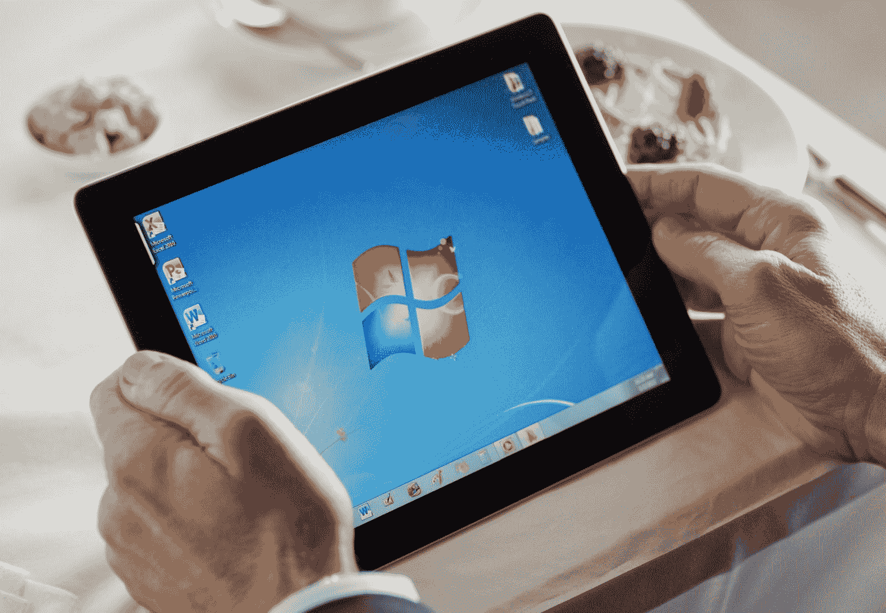

# 纸空间+ RDP

> 原文：<https://blog.paperspace.com/paperspace-and-rdp/>

几十年来，微软的同名远程桌面协议(RDP)一直是访问远程桌面的支柱，我们很高兴地宣布， [RDP 现已集成到 Paperspace 平台中。](https://paperspace.zendesk.com/hc/en-us/articles/236361248-Does-Paperspace-support-RDP-or-VNC-)

虽然不像 Paperspace 原生协议那样“简洁”,但 RDP 是稳定的、功能齐全的，并且为大多数 IT 专业人员所熟悉。RDP 通过第三方应用和微软自己提供的版本在 Windows、Mac 和 Linux 上得到支持。

### 为什么这很重要

RDP 提供的最重要的好处之一是能够从目前市场上的大多数瘦客户机上访问纸张空间。另一个好处是，RDP 是作为安卓和苹果智能手机/平板电脑上的移动应用程序提供的。

**RDP 的主要特色:**

*   多显示器支持
*   音频和视频重定向
*   打印机转发
*   USB 和本地磁盘重定向
*   复制/粘贴同步

要开始设置您自己的瘦客户机，[请在此注册。](https://www.paperspace.com/account/signup?utm-campaign=rdpblog)