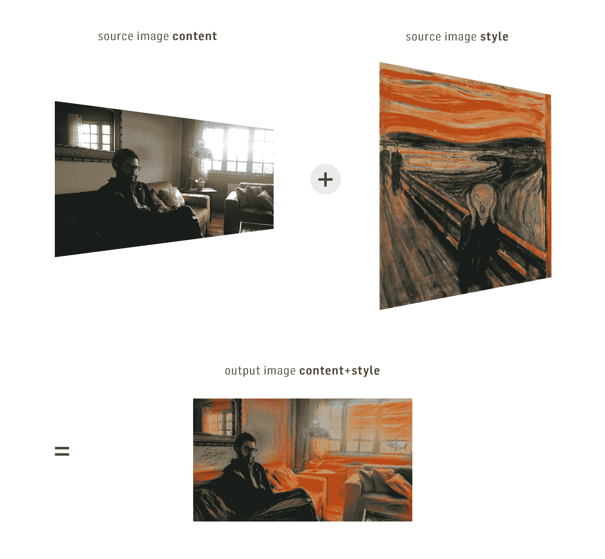

# 用深度神经网络创造艺术

> 原文：<https://blog.paperspace.com/art-style-transfer-neural-networks/>

## 使用深度学习的图像风格转移介绍

今天围绕机器学习的最有趣的讨论之一是它可能如何影响和塑造我们未来几十年的文化和艺术作品。这个讨论的中心是最近使用深度学习进行图像风格转移的进展。风格转换背后的主要思想是拍摄两个图像，比如一个人的照片和一幅画，并使用它们来创建第三个图像，该图像将前者的内容与后者的风格相结合。下图显示了一个例子，使用了作者的一张照片和爱德华·蒙克的名画《呐喊》。



正如我们所想象的，这项技术有着巨大的潜力——它让任何人都有能力创作出美丽的艺术品，灵感来自他们喜爱的绘画、纹理等。从技术的角度来看，生成这些图像的技术也相当了不起，值得理解。在这篇文章中，我们将深入研究风格转移是如何工作的，然后使用深度学习风格转移的力量来生成我们自己的图像。更具体地说，我们将涵盖:

*   什么是图像风格转移
*   在这个领域使用深度学习的独到见解
*   如何在纸张空间机器上运行它

## 图像风格转移

根据学术文献，图像风格转移被定义如下:给定输入上的两幅图像，合成具有第一幅图像的**语义内容**和第二幅图像的**纹理/风格**的第三幅图像。为了正常工作，我们需要一种方法来(1)确定任何图像的内容和样式(内容/样式提取器)，然后(2)将一些任意内容与另一个任意样式合并(合并)。


这种风格转移的定义可能看起来有点不精确。换句话说，风格转换的核心问题在于我们是否有能力提出一种清晰的方式来计算图像的“内容”,以区别于计算图像的“风格”。在深度学习到达现场之前，研究人员一直在手工制作方法，提取图像的内容和纹理，合并它们，看看结果是有趣还是垃圾。即使在今天使用深度学习的风格转移研究中，也有高影响力的论文提出了使用神经网络来提取内容、提取风格或组合它们的新方法。

尽管对什么是内容和风格/质地没有一个确切的概念，我们可以发展出一个我们应该期待什么样的好结果的一般概念，以帮助缩小我们对问题的理解。为了帮助我们完成这项任务，请看下图。我们看到一只狼的原始图像，然后是一些合成的图像，这些图像只使用了狼图像的“内容”,然后与一些众所周知的绘画风格融合在一起。我们可以看到，所有图像都具有相同的**高级属性**。它们都包含了狼和由一些树组成的风景，有一些云的天空和远处美丽的冰冻的山脉。
即使颜色和纹理发生变化，图片仍然承载着相同的**语义内容**。


现在，看下一系列的图片。这里我们有相反的情况。我们已经固定了一种风格(尖叫画)，并使用几个不同的图像作为内容。正如你所看到的，最终的结果总是保持我们风格的颜色和纹理。


上面开发的这种直觉和本节开始时解释的工作流是你开始学习转移风格所需要知道的一切。恭喜你！你离用电脑作为画笔开始自己的前卫运动又近了一步。既然我们已经知道迁移风格是什么，并且在深度学习出现之前就已经进行了研究，那么问自己一个问题是很重要的:为什么这个主题最近得到了这么多的关注，当深度学习出现在场景中时？两个主要原因是，在深度学习之前，纹理传递方法至少具有这两个缺点中的一个:

*   没有足够好地保留内容图像的语义内容
*   不适用于一小部分研究案例之外的图像

## 深度学习到来

那么深度学习能为我们提供什么来改善风格转移呢？事实证明，深度学习技术领域确实擅长于自动提取高级“特征”。让我们将 ML 社区中发生的事情和纹理传输社区中发生的事情进行比较。想象一下这个场景:全世界的人都在没有深度神经网络的情况下训练他们的 ML 算法。**手工制作的**特征工程在算法的最终表现中起到了**大**的作用。然后，深度学习到来，突然你不再需要提取功能了。神经网络的隐藏层为你做所有的工作，并且结果比以前更好！

现在，让我们看看纹理传输社区。人们手工提取图像的内容和纹理，以获得更好的结果。然后，由 Gatys 领导的一组研究人员提出了一个问题:我们为什么不让深度神经网络来为我们做这项工作，就像 ML 社区所做的那样？于是他们测试了这个假设，写了一篇文章叫做 [*一种艺术风格的神经算法*](https://arxiv.org/pdf/1508.06576.pdf) 。其余的，就像他们说的，都是历史了。

但是坚持一会儿。Gatys 等人的论文充满了方程、偏导数、相关性估计和非线性优化，阅读它或使用它来生成新图像似乎不是那么简单。专门针对数学功底不强的人。幸运的是，你不需要担心。尽管有大量的数学支持，论文的想法归结为我们之前看到的相同的工作流程:提取内容，提取风格，合并它们并创建一个新的图像。

## Gatys 等人的论文解释说

为了全面解释 Gatys 等人的论文，我们必须详细说明工作流程的三个部分:内容提取器、样式提取器和合并器。让我们从内容提取器开始。

### 内容提取器

我们需要一种方法来分离图像的语义内容。幸运的是，已经有一种特殊的深度神经网络适合这项工作，称为卷积神经网络(CNN)。这种神经网络的架构受到了我们视觉系统中一些机制的启发，它主要用于计算机视觉问题。

众所周知，卷积神经网络的隐藏层提取图像的高级特征(层越深，该层识别的属性级别越高)。了解到这一点，研究人员采用了一个预先训练好的 [VGG 19 神经网络](http://www.robots.ox.ac.uk/~vgg/research/very_deep/)，对权重进行了一些细微的调整以适应他们的问题，然后使用其中一个隐藏层的输出作为内容提取器。


样式提取器使用与内容提取器相同的思想(即使用隐藏层的输出)，但是它增加了一个步骤。它使用基于给定隐藏层的滤波器的 Gram 矩阵的相关估计器。这只是一个复杂的句子，意思是:它破坏了图像的语义，但保留了它的基本成分，是一个很好的纹理提取器。


### 合并

最后一步，我们需要一种方法将一幅图像的内容与另一幅图像的风格融合在一起。这是在优化问题的帮助下完成的。优化问题是一个数学问题，其中我们定义了一个**成本函数**，我们希望最小化它。通常，假设成本函数没有达到最小值，则它在优化的每次迭代中都减小。因此，我们可以预期，优化的每次迭代都会使我们的成本函数更接近我们的目标。

现在，我们如何使用优化来合并任意内容和任意样式呢？Gatys 等人的方法是创建一个代价函数，如果合成图像的内容不等于期望的内容，并且其风格不等于期望的风格，则该代价函数惩罚合成图像。
为了帮助我们更详细地理解优化背后的算法，让我们创建一些命名约定:

*   内容图片: **`content_image`**
*   风格形象: **`style_image`**
*   最终合成图像: **`our_image`**

优化的步骤如下:

1.  合成一个白噪声图像
2.  **`our_image`** 摘录内容和样式
3.  计算 **`our_image`** 的内容与 **`content_image`** 的内容之间的距离
4.  计算 **`our_image`** 的样式和 **`style_image`** 的样式之间的距离
5.  计算成本函数和梯度
6.  如果梯度为零，则结束优化
7.  如果梯度不为零，再运行一次优化迭代。这将生成一个新的 **`our_image`** ，在内容上更接近于 **`content_image`** ，在风格上更接近于 **`style_image`** 。
8.  如果达到预设的迭代次数，则结束。否则，返回`step 2`。


就是这样！你还不具备理解导致深度学习风格转移的惊人想法的能力。有几个细节你也应该知道。该方法允许您自由选择要用作提取器的隐藏层。我会推荐使用研究人员建议的层，因为他们在写文章之前可能会测试很多选项。此外，在优化问题中，你可以设置内容和风格之间的相对权重。如果你赋予内容更多的重要性，最终的结果会有更多的 **`content_image`** 的语义，而代价是 **`style_image`** 的纹理更少。如果你更重视风格，就会发生相反的情况。

## 在纸张空间机器上运行样式转移

好了，现在让我们自己创造一些艺术，找点乐子。在本节中，我们将下载一个包含 Gatys el al 实现的存储库。纸，并用它来制作一些很酷的图像。

假设你运行的是一台装有 Ubuntu 和所有必备深度学习包的机器，我们可以克隆这个库并使用它。这个特殊的实现建立在 [**Keras**](https://keras.io/) (一个包装了更多低级库的高级库)之上，除了 Gatys 等人的原始想法之外，还有许多额外的功能。对于那些对实现细节更感兴趣的人来说，值得注意的是，代码并没有遵循 Gatys 等人方法的确切建议。尽管如此，它仍然忠实于最初的观点，同时加入了其他最近的论文。要克隆存储库，只需打开终端并键入:

```py
git clone https://github.com/titu1994/Neural-Style-Transfer.git 
```

下载完成后，您已经拥有了开始创作所需的一切。让我们看看如何运行程序。首先，进入项目的文件夹:

```py
cd Neural-Style-Transfer 
```

在这个文件夹中，我们有 INetwork.py 程序。最简单的运行方式是:

```py
python INetwork "/path/to/content_image" "path/to/style_image" "/path/to/result" 
```

让我们看一个例子，使用存储库中已经可用的图像:

```py
python INetworimg/inputs/content/winter-wolf.jpimg/inputs/style/the_scream.jpg my_first_artwork 
```

最后的结果将是熟悉的冬狼与“尖叫”的风格。

> **关于性能的说明**:关于性能，使用默认设置和大小等于几百 KB 的图像，该算法在现代 8 GB Nvidia GPU 上只需 6 分钟即可完成。在英特尔 i7 上运行相同的模型需要一个半小时！只使用 CPU 速度太慢，而且会剥夺尝试新图像或新算法的乐趣，因此我们建议尽可能使用 GPU。此外，使用更大的图像将需要更多的 GPU 内存，并且需要更长的时间来产生最终结果。

程序`INetwork.py`有很多参数来使用额外的功能，控制优化的某些方面等等。这里值得一提的两个是内容的权重和风格的权重。这些参数分别具有默认值`0.025`和`1.0`。如果您想更改它们，只需遵循下面的示例:

```py
python INetworimg/inputs/content/winter-wolf.jpimg/inputs/style/the_scream.jpg my_second_artwork --style_weight="some_value" --content_weight="some_value" 
```

你会看到最终的图像可能会改变，因为你更重视内容或风格。

## 结论

希望你现在理解了引起迁移学习的一些观点。

当然，最好的学习方法是自己运行这些程序，所以我推荐使用 INetwork 程序并测试它的一些参数。GitHub 上还有其他很棒的开源风格的传输项目，包括 Python 和 Torch (Lua)两种。仅举几个例子:alexjc (Python)的[neural-doodle](https://github.com/alexjc/neural-doodle)和 jcjohnson (Lua)的[fast-neural-style](https://github.com/jcjohnson/fast-neural-style)。

对于那些对其他技术细节感兴趣的人，我推荐阅读使用卷积神经网络 的 *[图像风格转移，这是*艺术风格的神经算法*的后续文章，并给出了关于原始技术的更多细节。此外，在实时风格转换的](http://www.cv-foundation.org/openaccess/content_cvpr_2016/papers/Gatys_Image_Style_Transfer_CVPR_2016_paper.pdf)*[感知损失和超分辨率的](https://arxiv.org/pdf/1603.08155.pdf)* 和 [*语义风格转换以及将两位涂鸦变成精美的艺术品*](https://arxiv.org/pdf/1603.01768.pdf) 上可以找到一些关于转换风格的新想法。前者处理实时执行风格转换，而后者处理通过使用涂鸦添加语义注释。*

要开始使用您自己的 ML-in-a-box 设置，[在此注册。](https://www.paperspace.com/account/signup?utm-campaign=deepneuralblog)