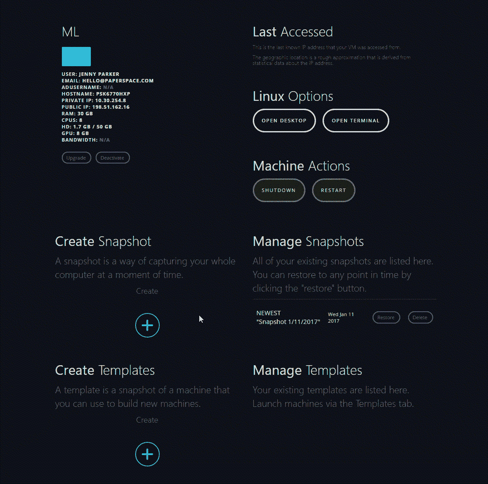

# 自动化快照简介

> 原文：<https://blog.paperspace.com/automated-snapshots/>

Paperspace 必须提供的最强大的功能之一是为您的机器创建即时备份的能力。快照是一种非常简单且无风险的测试软件或机器上其他更改的方法，只需点击一个按钮，您就可以及时回滚。我们收到了无数的电子邮件，解释快照如何帮助救援损坏的机器，找回丢失的文件，抵御恶意软件，并且通常只是提供一种安全感和内心的平静。

到目前为止，拍摄快照是一个手动过程。它们很快——只需要一秒钟左右就能完成——但这是你必须记住要做的事情。

从今天开始，您可以设置自动快照周期，该周期将按照设定的计划自动拍摄快照。该计划包括每小时、每天、每周或每月的选项。您还可以选择想要保存的快照数量。

自动快照功能在创建计算机时可用，也可以通过单击控制台中的快照按钮添加到任何现有计算机中。当然，手动拍摄快照仍然是可能的。另一方面，自动快照意味着你再也不用考虑备份你的机器了。