# 在云中托管 QuickBooks

> 原文：<https://blog.paperspace.com/hosting-quickbooks-in-the-cloud/>

QuickBooks 是超过 3000 万小型企业的首选会计软件。这仅仅发生在美国。最明显的趋势是越来越多的企业在云端托管 QuickBooks。在本教程中，我们将配置 QuickBooks Desktop 和一个在 Paperspace 上运行的公司数据文件，这一切只需几分钟。

# 为什么要在云端运行？

首先，你可能想知道在云中运行与在办公室或使用 QuickBooks Online 相比有什么好处。以下是公司转向托管解决方案的几个原因(请随意跳到教程):

## 随时随地访问

在云中运行应用程序的主要好处之一是，您不会被单一设备或复杂的 VPN 所束缚。Paperspace 提供了一个从任何配备 web 浏览器的设备进入 QuickbBooks 环境的门户。

## 多用户协作

与客户、合作伙伴和您的团队协作至关重要，在基于云的环境中添加或删除用户只需点击一下鼠标。QuickBooks Online 一次只允许一个人访问。增加更多的人需要升级，因此成本更高。使用托管解决方案，多达 30 人可以同时访问同一文档，无需额外费用。

## 降低 IT 成本

如果你在办公室运行 QuickBooks，你要支付昂贵的 IT 支持和服务器维护费用。Paperspace 为您处理基础设施的正常运行，完全消除了对本地 IT 成本的需求。此外，您只需为您使用的内容付费。

## 自动备份

Paperspace 提供连续的自动化备份。在界面中，您可以轻松设置备份计划和备份数量。只需单击一下，您就可以回滚到任何时间点。再也不用担心误删了。

## 可量测性

在云环境中运行的主要优势之一是，您只需为您需要的东西付费，并且只需点击一个按钮，就可以随时扩展您的资源。您可以轻松地动态扩展存储或 RAM 和 CPU。

## 安全性

最常见的数据泄露是针对内部网络的攻击。在 Paperspace，您的信息安全地存放在我们配备了最高安全标准的一流数据中心。安全措施包括 256 位数据加密、24/7 网络监控和自动威胁检测。

## 功能齐全的 QuickBooks 桌面

QuickBooks Desktop 比 Quickbooks Online 功能更加全面。更重要的是，您熟悉界面和功能。迁移到托管解决方案不需要学习新软件。

## 超高速固态硬盘存储

在我们经过微调的固态硬盘支持的存储上运行，将会大大提高办公室设置和在线 QuickBooks 的性能。

* * *

# 装置

## 先决条件

*   最少两台机器
*   一个[专用网络](https://paperspace.zendesk.com/hc/en-us/articles/216115938-Dedicated-Private-Networks)这样他们就可以互相交流了

让我们直接开始吧。在本次演示中，我们将使用多用户模式，这样您就可以大致了解我们如何设置公司数据文件以及将通过您的网络访问该数据文件的计算机。我首先创建了两台机器，分别叫做 QB1 和 QB2。QB1 将托管公司数据文件，我网络上的每个人都可以访问，QB2 将成为 QuickBooks 桌面应用程序机器。您可以根据需要添加任意数量的 QuickBooks 桌面计算机。

## 下载 QuickBooks

***5 分钟***

在本教程中，我们将使用 QuickBooks Desktop Pro 2016，并在 Window Server 2016 上运行。在 Intuit [支持](https://community.intuit.com/articles/1364927-system-requirements-for-quickbooks-desktop-2017-and-enterprise-solutions-17-0)的许多平台上，体验是非常相似的，所以如果您运行的是不同的版本，也不用担心。你可以通过[登录](https://camps.intuit.com/app/selfservice/index.html)到你的账户[下载](https://support.quickbooks.intuit.com/Support/ProductUpdates.aspx)并注册你的副本。
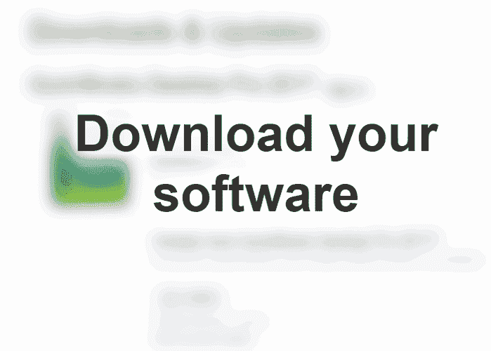

## 准备公司数据文件和网络共享

***4 分钟***

我们将从在 QB1 上运行 QuickBooks 安装程序开始。

小费

如果您担心出错，可以在安装过程中拍摄快照，以便回滚。

选择*自定义和网络选项*
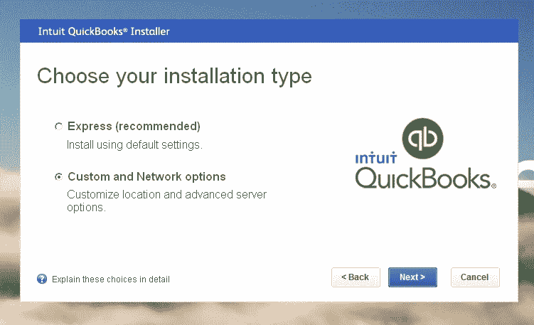

选择*我不会在这台电脑上使用 QuickBooks...*
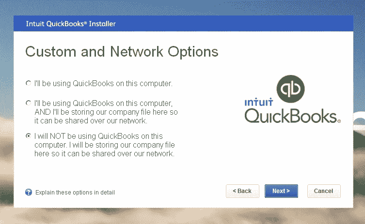

完成安装
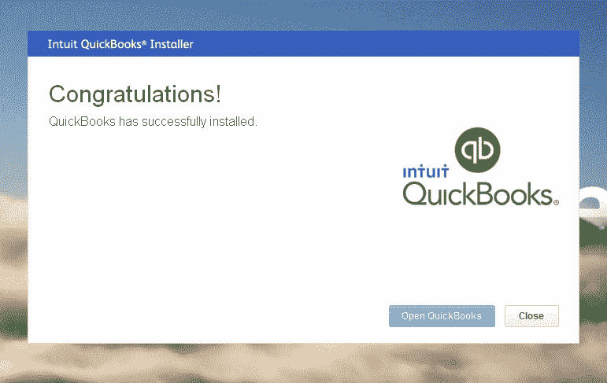

接下来，我们将设置公司数据文件。我将使用 QuickBooks 安装中提供的一个示例。该文件名为*sample _ service-based business . qbw*，尽管您很可能会带来一个现有的公司数据文件或创建一个新文件。

在 c:\下为数据文件创建一个名为 *QB* 的文件夹。确保数据文件被添加到 QB 文件夹。

右键单击 QB 文件夹，然后单击属性>共享给>特定的人
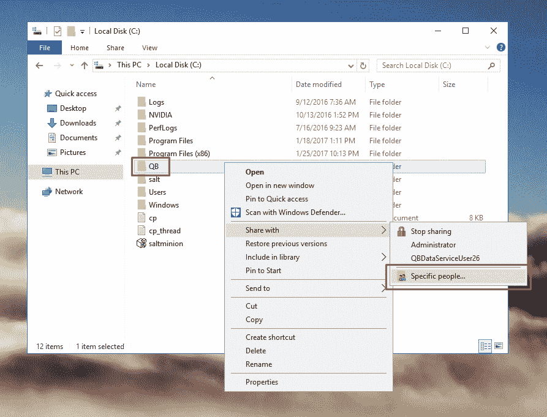

在这个例子中，为了简单起见，我将选择每个人。在这一步，您可以随意设置更细粒度的权限。点击*添加*。

然后设置*读/写*权限，点击*分享*

我将通过右键单击 QB 文件夹，选择*共享*选项卡，找到该公司文件的网络路径。在*网络文件和文件夹共享*部分你会看到网络路径。在本例中，它使用我的主机名后跟文件夹名。注意:我们也可以使用在 Paperspace 控制台中可见的 IP 地址。
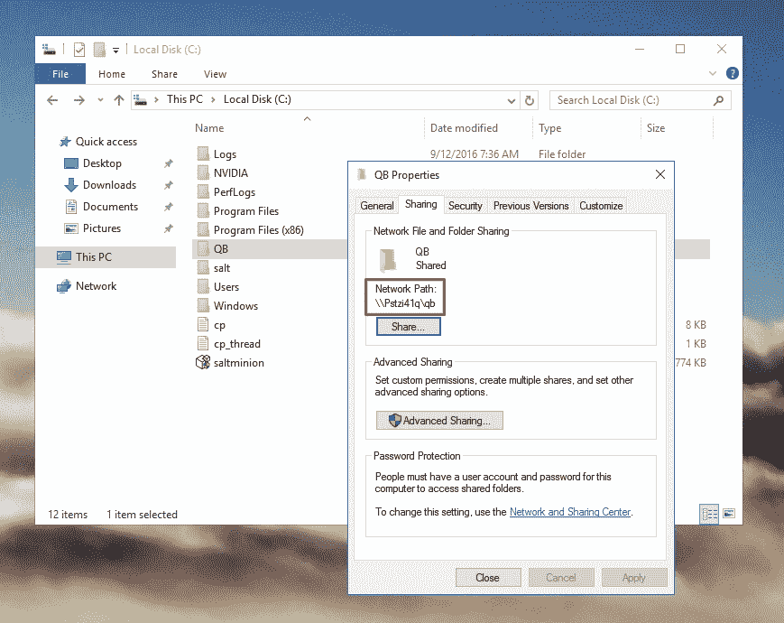

此时，我们可以跳转到 QB2，以确认我们可以从其他机器访问该公司数据文件。我们将把 QB 文件夹作为网络驱动器挂载到 QB2 上。
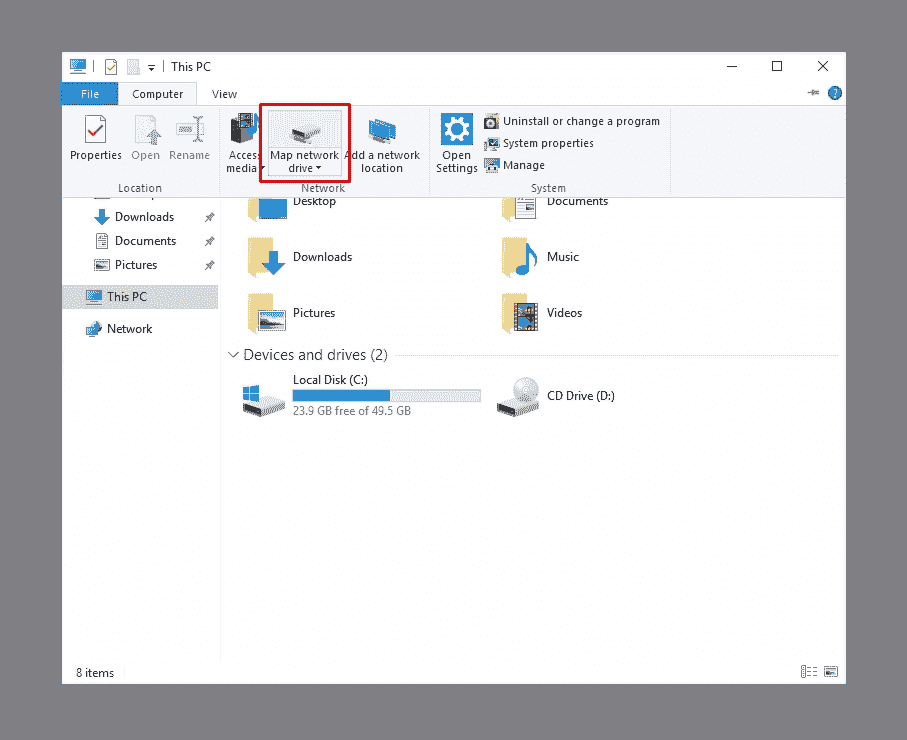

它会提示您输入凭证。
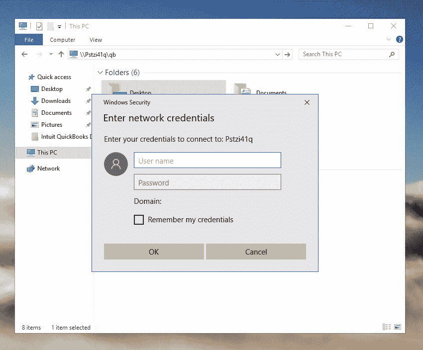

看起来我能够成功地与 QB1 沟通。

## 安装 QuickBooks 桌面

***4 分钟***

下一步是在 QB2 上安装 QuickBooks Desktop。再次运行安装程序，只需选择快速安装选项或选择*我将在这台计算机上使用 QuickBooks*。

因为这是桌面版，我可以在最后一步直接进入 QuickBooks。
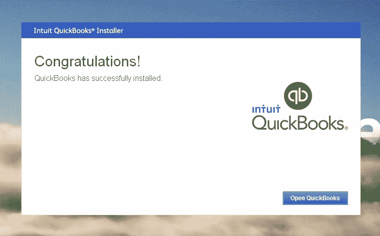

最后，我们将在 QB2 上激活 QuickBooks(QB1 上不需要激活，因为它只存放公司文件)。

## 完成设置

我们需要验证公司数据文件可以从其他机器上打开。

在 QB2 上打开 QuickBooks 时，选择*打开或恢复现有公司*，点击*打开*。
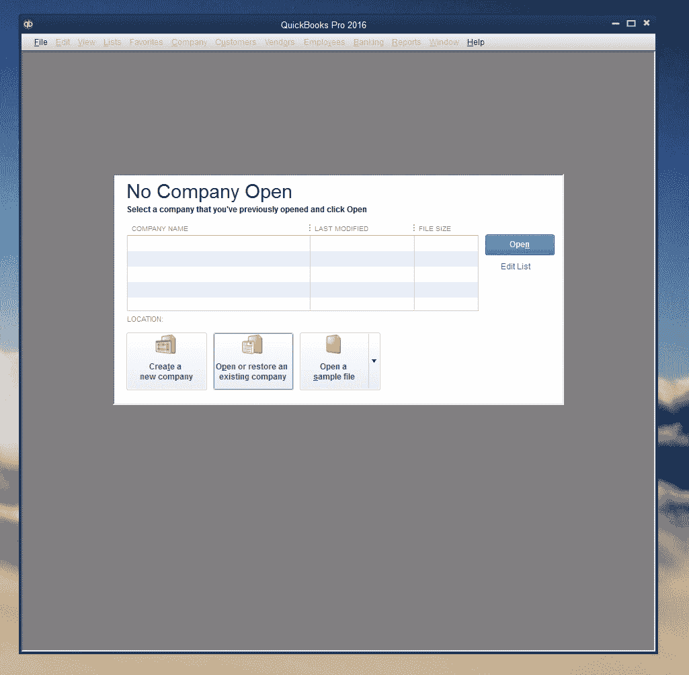

选择网络共享文件夹下的公司数据文件。
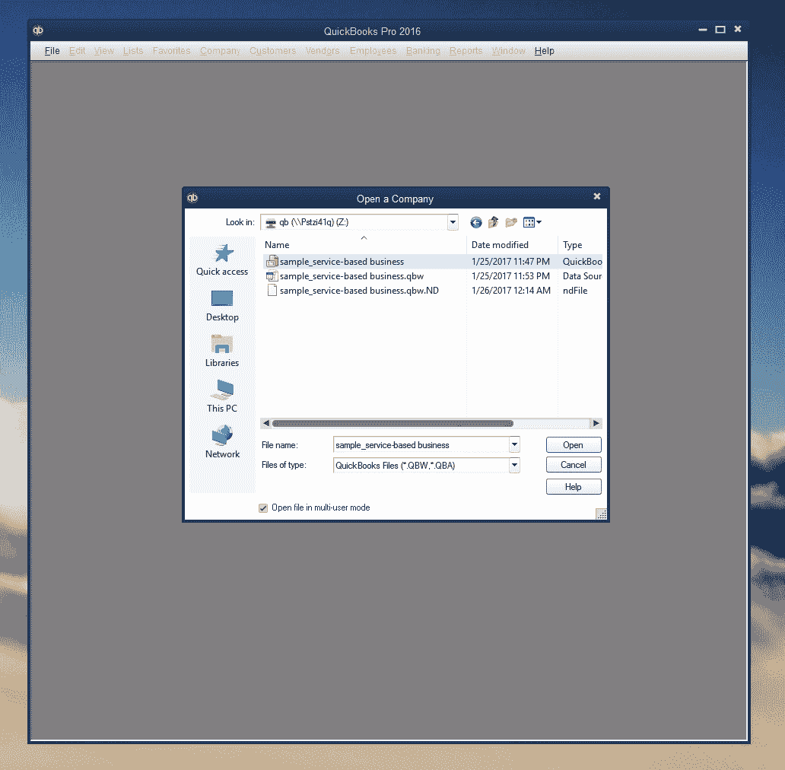

好了，文件打开了！
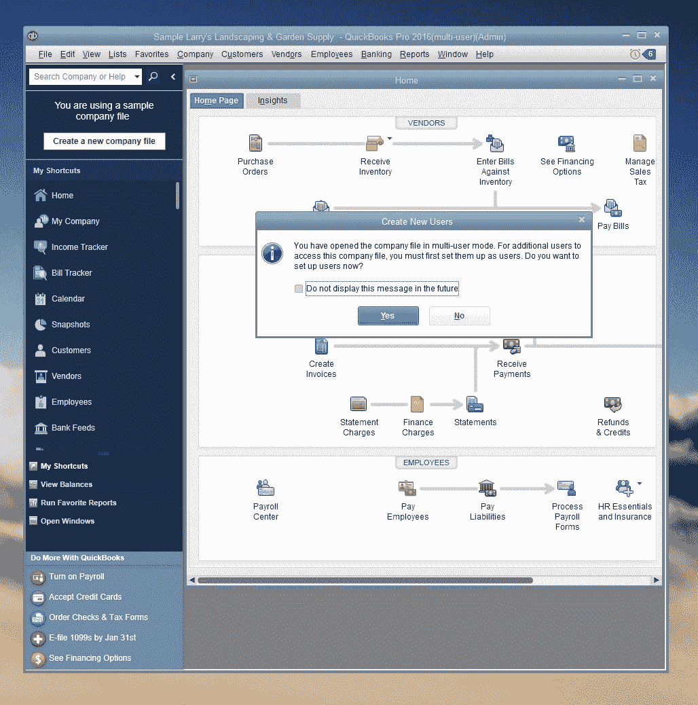

若要开始设置您自己的 Quickbooks，[请在此注册。](https://www.paperspace.com/account/signup?utm-campaign=quickbooksblog)