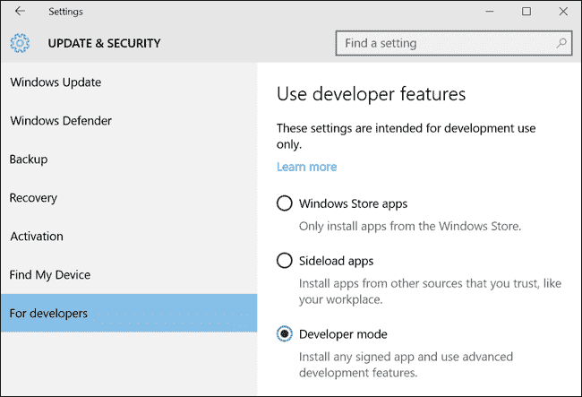
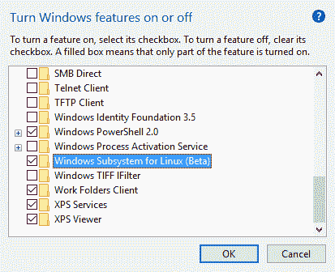
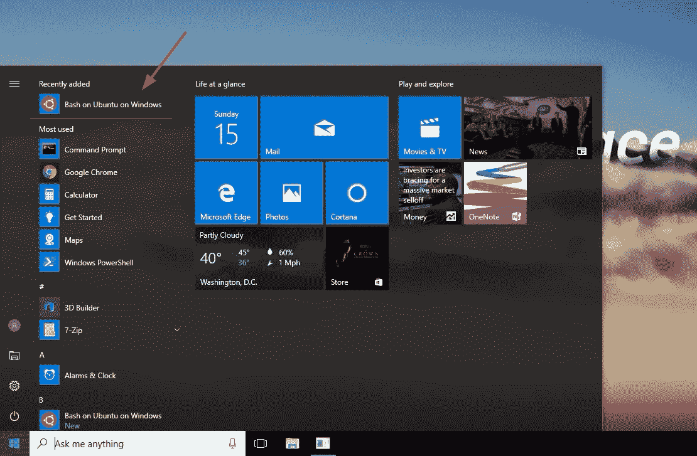
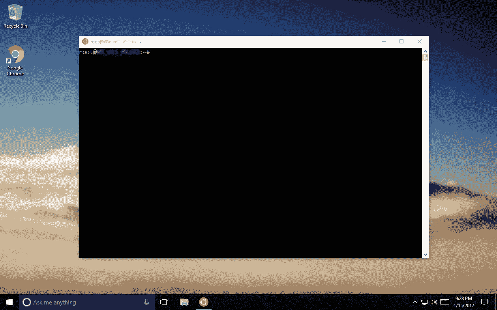
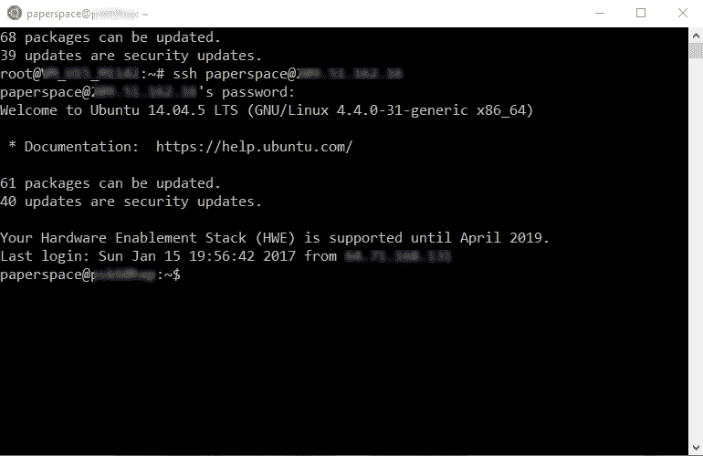
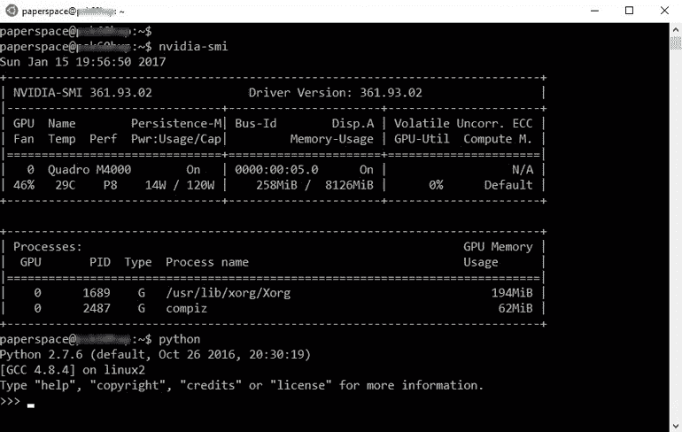
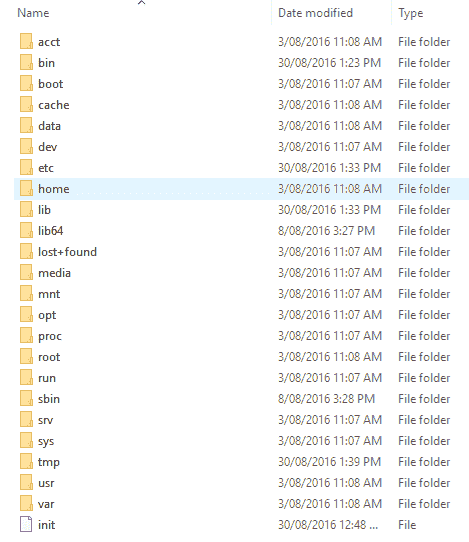

# Windows 10 上的狂欢

> 原文：<https://blog.paperspace.com/bash-on-windows-10/>

#### 敲打窗户？

自从塞特亚·纳德拉接管后，微软对开发者变得友好多了。这种转变从来没有比 Windows 10 增加 Bash shell 更明显的了。这不是一个半生不熟、交叉编译的端口，甚至不是一个虚拟机。它是在 Windows 中运行的完全原生的 Bash。这意味着您不再局限于基本命令，如 PowerShell 中内置的 [SSH，或者像 Cygwin 这样的第三方工具的大杂烩。第一次，在 Windows 上开发软件是一流的体验，在许多方面与 Mac 和 Linux 不相上下。](https://blogs.msdn.microsoft.com/powershell/2015/06/03/looking-forward-microsoft-support-for-secure-shell-ssh/)

#### 如何在 Windows 10 上安装 Bash

在不到五分钟的时间里，我们将运行 Bash shell。

**激活开发者模式**

第一步是导航到*设置*并激活*开发者模式*。


**添加 Linux 的 Windows 子系统**

接下来，在*开始菜单*中输入*功能*，点击“打开或关闭 Windows 功能”。选中“Windows Subsystem for Linux (Beta)”选项，然后单击“确定”。出现提示时，重新启动计算机以完成安装。


这就是安装过程的全部内容。

#### 试驾终端

重启后，在*开始菜单*中输入 Bash，你会看到一个选项，这个选项有点笨拙地命名为 *Bash on Ubuntu on Windows* 。


就是这样！



第一次打开终端时，会提示您为 Linux 环境创建用户名和密码。仅此而已。现在我们已经有了所有伟大的命令，像 *vi* 、 *grep* 、 *wget* 和 *ssh* 在我们的指尖。

**运行一些命令**

我将从使用 SSH 连接到我的一台 Linux 机器开始。



这是我的机器学习平台(GPU+ machine)，所以我将通过运行`nvidia-smi`来检查 GPU。因为我们在一个真正的 Ubuntu shell 中，Python 是默认安装的。



**文件系统**

最后，Ubuntu 用户与默认的 Windows 用户共享文件系统。它位于这里:

```py
C:\Users\Paperspace\AppData\Local\lxss\rootfs 
```



眼熟吗？

暂时就这样了。看看吧，让我们知道你的想法！

* * *

*请注意:该功能仍处于测试阶段，因此目前仅在 Windows 10 上可用，而不是 Server 2016。*