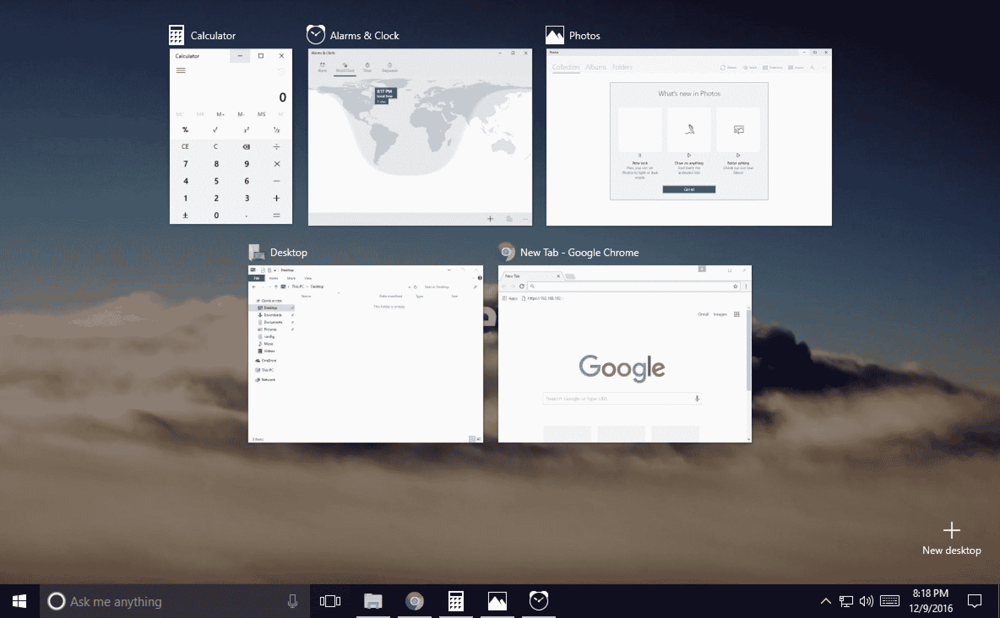
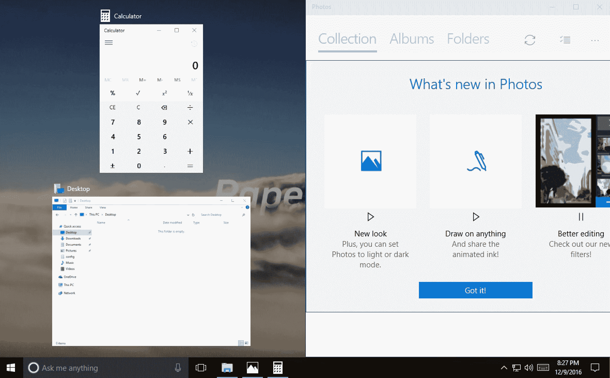
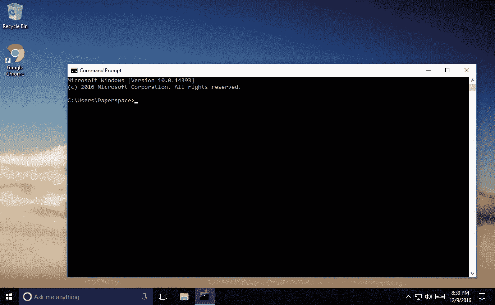
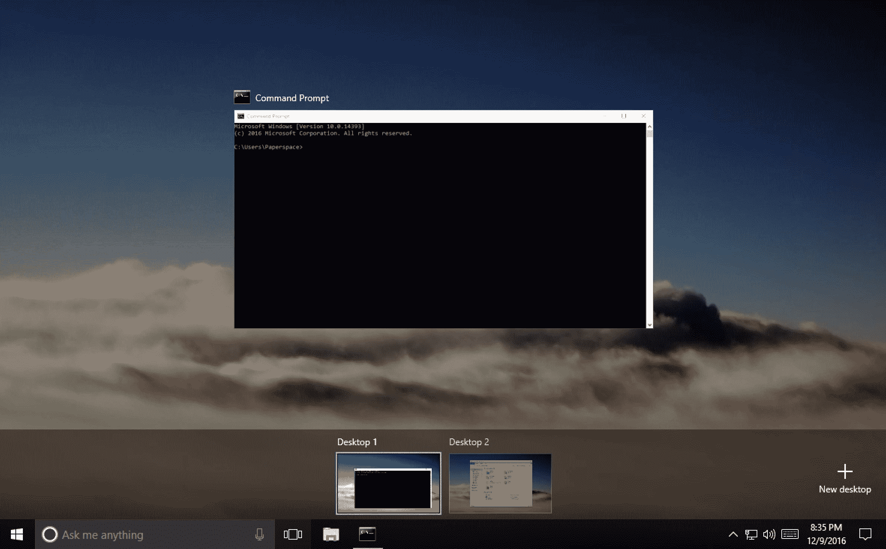
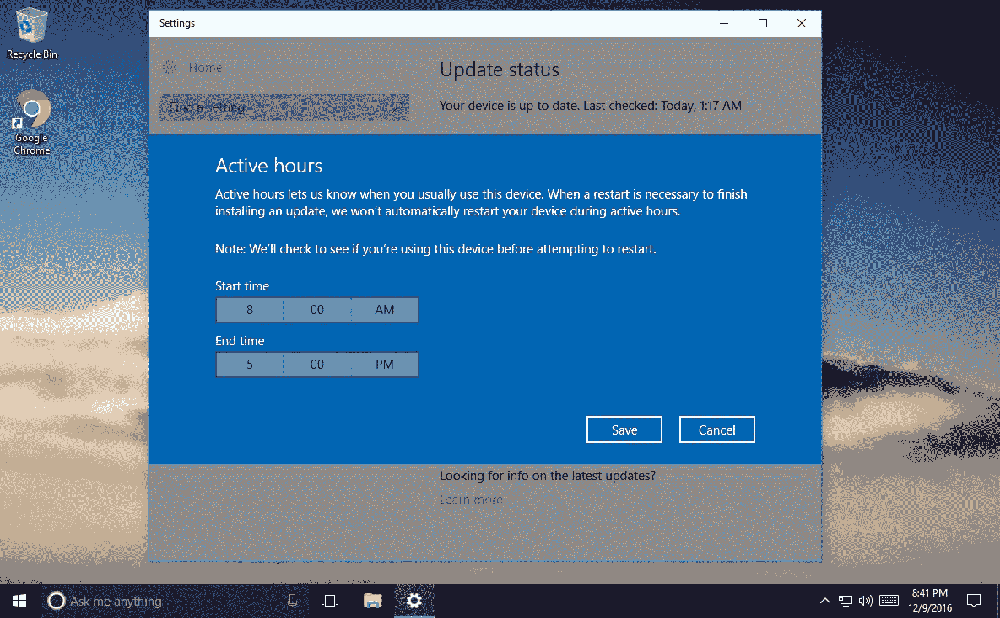
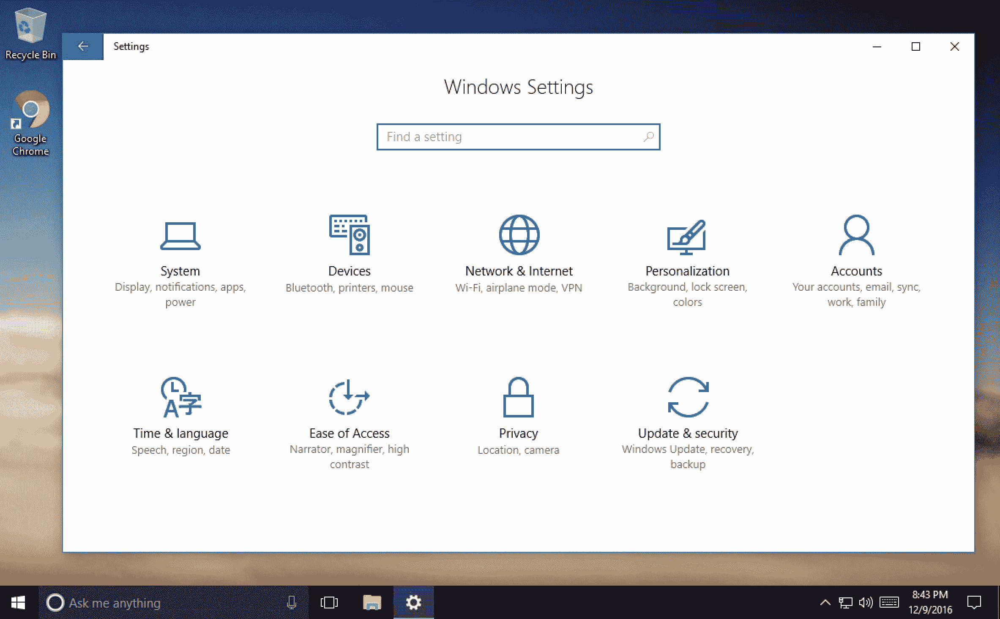
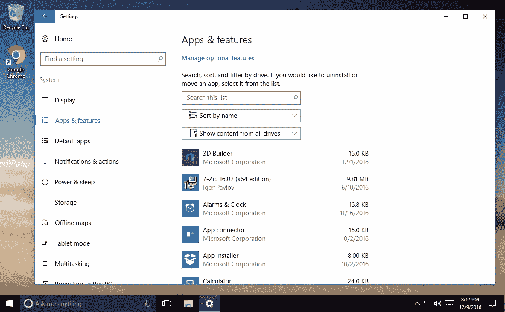

# Windows 10

> 原文：<https://blog.paperspace.com/windows-10-launches-on-paperspace/>

Windows 10 现已在 Paperspace 上发布。这里有一些你可能会喜欢这个操作系统的东西:

## 1.新开始菜单

Windows 8 的开始菜单是一个非常不受欢迎的项目。Windows 10 带回了传统的开始菜单，增加了一些新功能，但没有让事情变得混乱。

## 2.改进的任务切换器

按 Windows 键+ Tab 调出这个新设计的任务切换器，也可以通过单击开始菜单旁边的图标来访问。更大的缩略图使一切更容易阅读。

## 3.快照辅助

将一个应用程序拖到显示器的一侧可让您将它吸附到屏幕的一半，并提示您点按另一个应用程序(如果您想要它们并排的话)。如果您希望每个窗口占据屏幕的四分之一而不是一半，您也可以使用屏幕的所有四个角。

## 4.命令提示符走出了 20 世纪

复制并粘贴。可扩展窗口。说够了。

## 5.多个桌面

您可以创建多个桌面来组织您的工作。滑动浏览就像 Ctrl+Alt+箭头键或单击开始菜单旁边的按钮一样简单。

## 6.计划 Windows Update 重新启动

几乎每个人对 Windows 最大的烦恼就是突然需要微软更新你的电脑。现在，很容易安排一个更新“窗口”,这样更新就可以在你没有工作的时候发生(你甚至可以在你睡觉的时候安排它们)。

## 7.设置面板被完全重新设计

Windows 设置面板感觉很现代，一切都很容易找到。你可以使用关键字搜索任何东西，这是一个游戏规则的改变。

## 8.轻松找出哪些应用程序占用了空间

这在以前是可能的，但从未如此直观和容易找到。
