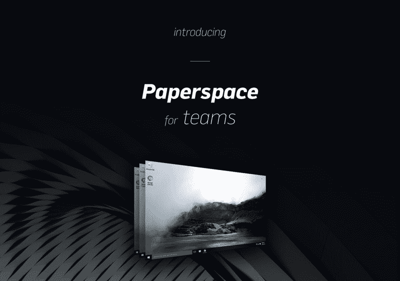

# Paperspace 公开发布&面向团队的 Paperspace！

> 原文：<https://blog.paperspace.com/enterpriselaunch/>

我们很高兴最终宣布 Paperspace 正式上市。从今天开始，任何人都可以去 www.paperspace.com 注册一台云电脑，并创建一个账户。

当我们第一次宣布 Paperspace 时，我们并不知道会触动多大的神经。第一天我们就有超过 12，000 人注册。今天，个人使用 Paperspace 做几乎所有你能想到的事情，从基因组学到游戏，到用 CAD 设计 3D 世界。

我们的愿景是重新发明台式电脑，我们已经不间断地工作了一年多，以完善我们的流算法，设计我们的网络界面，最重要的是，增加服务器容量，以支持越来越多的观众。

**为团队介绍 Paperspace】**

随着我们的不断发展，纸面空间也必须不断发展，以适应越来越大的部署。今天，我们很高兴地宣布，我们正式推出 Paperspace for Teams，这是 Paperspace 的下一个主要版本！

早期我们意识到团队和个人使用 Paperspace 的方式不同。他们是重度协作者，他们需要将办公室相互连接起来，并且需要工具来管理大型部署。很简单，人越多=越复杂。

因此，我们坐下来，花了几个月的时间收集来自用户的反馈，并专门为团队开发了一个产品。有了这一新产品，Paperspace 可以进行从 5 人办公室到 50，000 人企业的任何规模的部署。

这仅仅是开始，我们在接下来的几个月里还有很多(从游戏到 ML 等等)。订阅我们的博客，获取所有最新公告。

- PS 团队