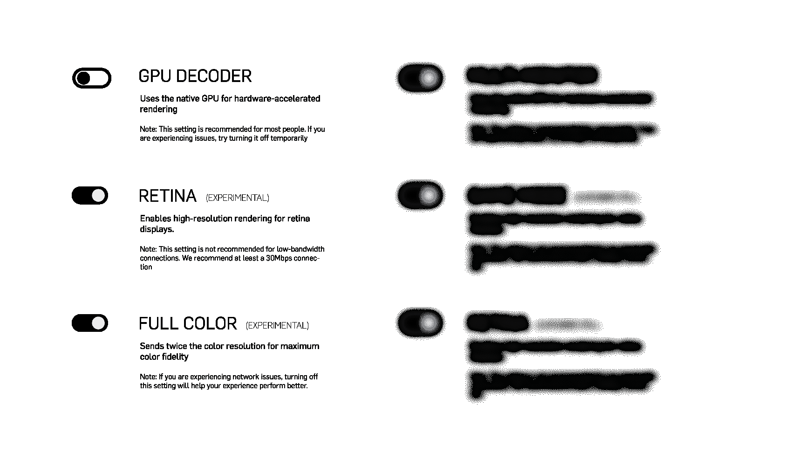

# 新功能:高级设置面板

> 原文：<https://blog.paperspace.com/new-feature-advanced-settings-panel/>

从今天开始，所有 Paperspace 用户都可以访问高级菜单，并对其流性能拥有更大的控制权。从今天开始，有两个可用的设置(全彩色和多显示器)，我们打算在新功能可用时添加到此列表中。下一版本将启用可选的基于 GPU 的解码器、视网膜显示支持等等。如果有您想要的功能，请告诉我们！我们不断改进，努力让 Paperspace 成为云中最好的计算机。

