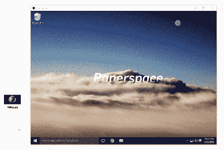

# 新功能:拖放上传

> 原文：<https://blog.paperspace.com/introducing-drag-and-drop/>

把东西放到你的 Paperspace 机器上应该很容易。

这就是我们创建拖放上传的原因:文件、图像、pdf、文档、电子表格等。甚至可以把文件夹放到你的电脑上，瞧，你的东西马上就上传到你的云电脑上了。

这项功能在网络浏览器和我们的本地应用中都可以使用。