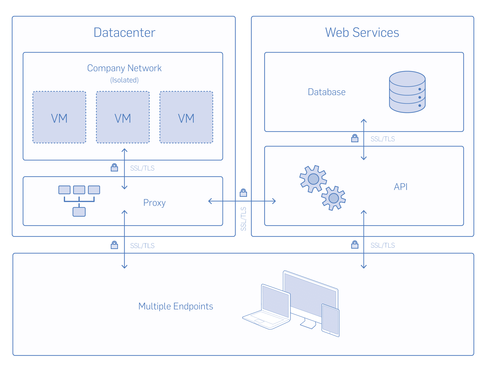

# 图纸空间安全性介绍

> 原文：<https://blog.paperspace.com/paperspace-security/>

#### 概观

### 安全性和隐私是您业务的核心

图纸空间的设计以安全性为首要考虑因素。我们知道安全性是所有业务的基石，我们致力于提供世界上最值得信赖的虚拟桌面环境。在当今的环境中，了解您公司的数据是安全的，权限是受管理的，并且与可能的攻击者完全隔离，这是迁移到云的基本要求。Paperspace 在各方面都超过了，可以成为您安全 IT 基础架构的主要支柱。

#### 数据安全

### 零知识平台的技术基础

Paperspace 的理念是只有您才能访问您的数据，我们孜孜不倦地设计符合这一目标的解决方案。这发生在应用层、网络层和物理数据中心(对于我们的托管产品)。

进出您的 Paperspace 虚拟机的所有通信都通过完全加密的通道进行保护。

*   客户端和远程服务器之间的加密流(SSL/TLS)独立于平台— web、桌面或移动。
*   我们的数据库、web 服务器、API 和内部网络之间的流量也是加密的(SSL/TLS)
*   使用 256 位 AES 或更高版本保护数据库
*   我们在证书中使用 2048 位公钥，并且只支持高强度对称密码。

#### 网络安全性

### 确保数据的安全传输

当您将 Paperspace 虚拟机放在网络上时，Paperspace 很可能是该网络上最安全的机器。

*   100%网络隔离
*   可配置的防火墙(或运行您自己的防火墙)
*   从 VPN 到 VPN 的加密通道(Paperspace 和您的办公室之间的 IPSec/OpenVPN 加密通道)
*   802.1q VLANs，这个专用连接可以划分成多个虚拟接口

#### 数据中心标准和合规性

### 保护和监控企业服务器

我们的数据中心采用了各种安全机制，包括严格的访问策略以及安全的保险库和保险箱。

*   Paperspace 数据中心符合 ISO 和 SSAE16 标准(经独立审计机构和第三方机构认证)。
*   我们的数据中心采用 24x7 现场安全措施，包括人员、移动侦测、门禁系统和闭路视频监控。
*   对包含公司服务器的区域的访问仅限于通过徽章访问系统授予的提升角色的授权人员。
*   不间断电源和备用系统，以及火灾/洪水检测和预防。

#### 用户和身份管理

### 知道谁，何时，何地

Paperspace 提供工具来集中管理身份和协作者，具有强身份验证和细粒度权限。

*   强大的基于角色的许可系统有助于保持对传统本地系统的更严格控制(包括机器和驱动器)。
*   用于访问控制的活动目录集成(可选)
*   高级帐户管理(远程注销所有会话、警报等)
*   登录监控和访问日志，为您帐户中的所有内容、用户、设备和活动提供智能和可见性。

#### 信用卡安全

### Paperspace 不存储信用卡信息

信用卡处理由 Stripe 处理。Stripe 符合 PCI 标准，所有与其 API 交互的流量都在安全通道(HTTPS)上运行。存储在他们服务器上的信用卡信息使用 AES-256 加密。

#### 流动性

### 防止数据被盗和丢失

Paperspace 独特的“零本地存储”模式是最安全的虚拟桌面交付系统。由于端点仅渲染从数据中心流出的像素，因此无法提取虚拟环境中的信息(从机器或共享驱动器)。我们的零本地存储政策在所有平台(web、桌面、移动)上实施，不受设备限制。

这里有一个可下载的版本(PDF):
[Paperspace 安全白皮书](https://s3.amazonaws.com/ps.public.resources/pdf/Paperspace+Security+Whitepaper.pdf)