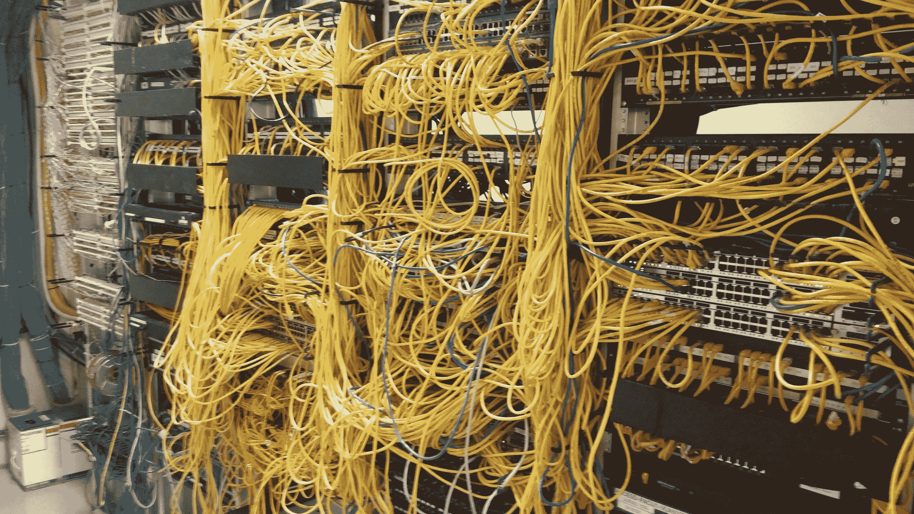

# 为什么 Paperspace 是企业桌面的未来

> 原文：<https://blog.paperspace.com/why-paperspace-is-the-future-of-enterprise-desktops/>

在云时代，内部 VDI 就像死了一样。当然，“本地”VDI 将会存在更长一段时间，就像所有传统技术一样，但它仍处于生命支持阶段。为什么？因为云的存在有一个很好的理由，让 VDI 保持活力的唯一原因是一个简单的事实，即除了在内部运行虚拟桌面之外，没有多少其他选择。

然而，VDI 非常强大。[98%的财富 500 强企业运行虚拟桌面](财富 100 强企业大量采用虚拟桌面([http://virtual ization . info/en/news/2009/08/more-of-10-of-Fortune-500-uses . html](http://virtualization.info/en/news/2009/08/more-than-10-of-fortune-500-uses.html))因为它们在许多方面都远远优于传统计算机:它们更安全、更易于管理，并且可以按需扩展和缩减。对于大多数企业来说，关键在于设置 VDI 并保持其运行。

> 想象一下，VDI 固有的所有复杂性都被抽象到一个简单的界面中，您只需点击一个按钮即可按需添加虚拟机。

这就是 Paperspace 要解决的问题:没有复杂性的 VDI 的强大功能。我们负责服务器、网络设备、虚拟化、灾难恢复、负载平衡、冗余、许可、防火墙等。并将其置于优雅的网络界面之后。这是第一次，任何规模的企业都可以获得通常为大公司保留的技术。事实上，它非常易于使用，我们 50%的客户无需 it 人员的参与即可设置和管理 Paperspace。

在过去的 10 年里，公司一直在远离本地模式。如今，随着公共云的成熟，你会疯了一样去安装自己的服务器。即使是最大的公司也在把所有东西都转移到云上。如果你正在考虑虚拟化，除非数据中心是你的核心竞争力，否则你不应该走这条路。

##### 这就是今天存在的情况:

## Citrix/VMware 内部模式

*庞大的基础设施开支、服务器维护、复杂的网络、VPN...*

##### This is what the future looks like: ## Welcome to Paperspace  *Click button, get machine*