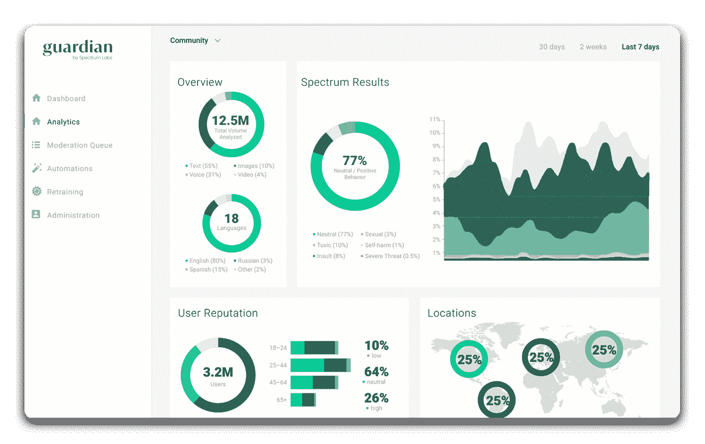

# Spectrum Labs 与 Paperspace 合作，推动基于 NLP 的有毒聊天建模工作

> 原文：<https://blog.paperspace.com/spectrum-labs-collaborates-with-paperspace-to-boost-nlp-based-toxic-chat-modeling-efforts/>

总部位于旧金山的技术公司 Spectrum Labs 提供情境人工智能、自动化和服务，以帮助消费者品牌识别和应对有毒行为，该公司与 Paperspace 合作，向互联网约会、游戏、市场和社交媒体社区提供有毒聊天检测模型。

**Guadian** is Spectrum Labs' content moderation platform. It allows customers to manage a moderation queue, build automated responses, analyze overall health, and train models.

随着世界越来越依赖于基于互联网的服务、应用和游戏，在线社区继续呈指数级增长，每天都有数十亿条消息和交易。[这些社区中的骚扰](https://www.forbes.com/sites/forbescommunicationscouncil/2020/03/30/the-implications-of-video-communication-in-the-digital-dating-world/#363473a0333f)、仇恨言论、[歧视](https://www.outlookindia.com/newsscroll/social-media-matters-spectrum-labs-launch-ai-to-detects-caste-discrimination-on-social-media/1802518)和其他有害行为正在加速，需要一种超越外包调节、关键词列表或内部遗留技术的解决方案，这些技术无法应对如此大规模的问题。

幸运的是，在线毒性是一个非常适合机器学习的问题。社区生成大量的文本数据和上下文元数据，这些数据和元数据形成了应用基于 NLP(自然语言处理)的机器学习技术来检测有毒和非法行为的坚实基础。

Spectrum Labs 以其高度精确、可调的[上下文感知模型](https://www.getspectrum.io/behavior-identification-at-spectrum-labs)及其工作流工具 [Guardian](https://www.spectrumlabsai.com/products) 而闻名。该公司在多种输入(如文本数据和各种形式的元数据)中使用基本的 NLP 技术(如矢量化)来创建关于用户行为的可信信号。然后，Spectrum 将这些模型作为端点提供给合作伙伴，以检测诈骗企图、厌女症、严重威胁、不受欢迎的性挑逗、仇恨言论、骚扰等。

Spectrum Labs 正在快速发展其机器学习团队和客户群。由于他们的每个最终用户都通过唯一的端点使用模型(每个端点代表一个经过调整以适应特定应用的基础模型)，该团队面临着扩大团队规模和增加唯一模型部署数量的双重挑战。这些需求为 Gradient 建立了一个强大的用例:帮助内部团队协作，并通过 CI/CD、可追溯性和确定性帮助扩展模型部署。

“保护用户体验免受在线毒害需要一种最先进的机器学习方法。Paperspace 有助于团队高效运作。”

Josh Newman，Spectrum Labs 联合创始人兼首席技术官

Paperspace 首席运营官公司的丹·科布兰(Dan Kobran)表示:“与 Spectrum 实验室及其才华横溢的机器学习团队合作，我们感到无比兴奋。Spectrum Labs 的技术正在使互联网成为一个更安全、更包容、更友好的地方，我们期待帮助他们成功完成这一重要使命。"

 

欲了解更多关于频谱实验室的信息，请访问:[www.spectrumlabsai.com](https://www.spectrumlabsai.com/)