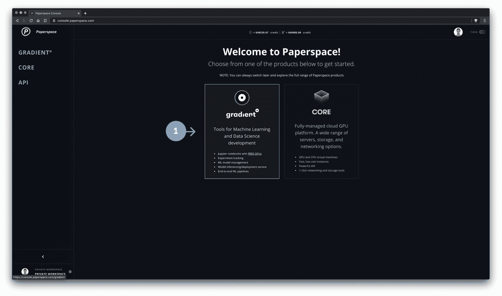
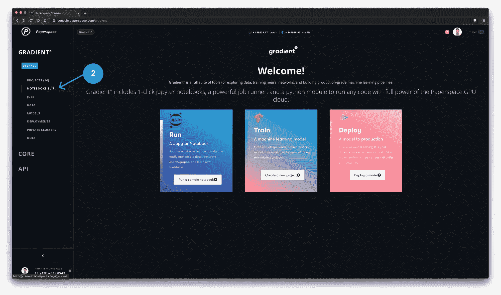
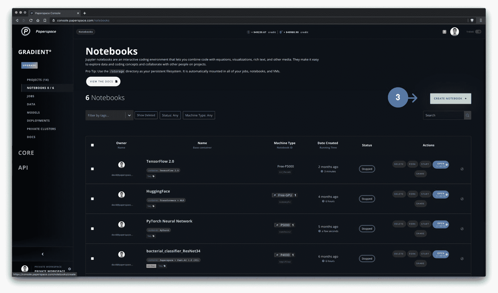
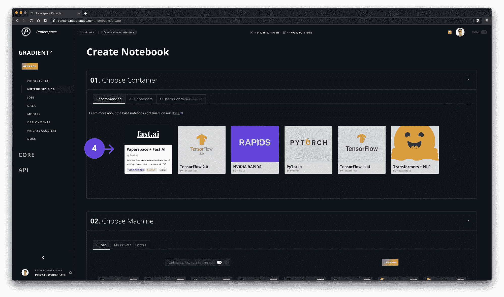
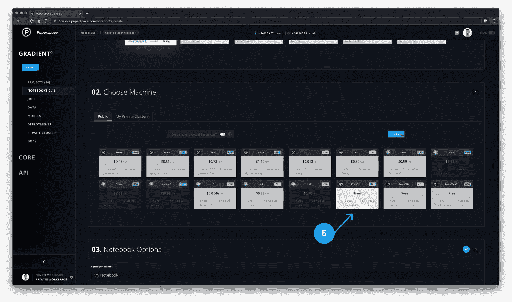
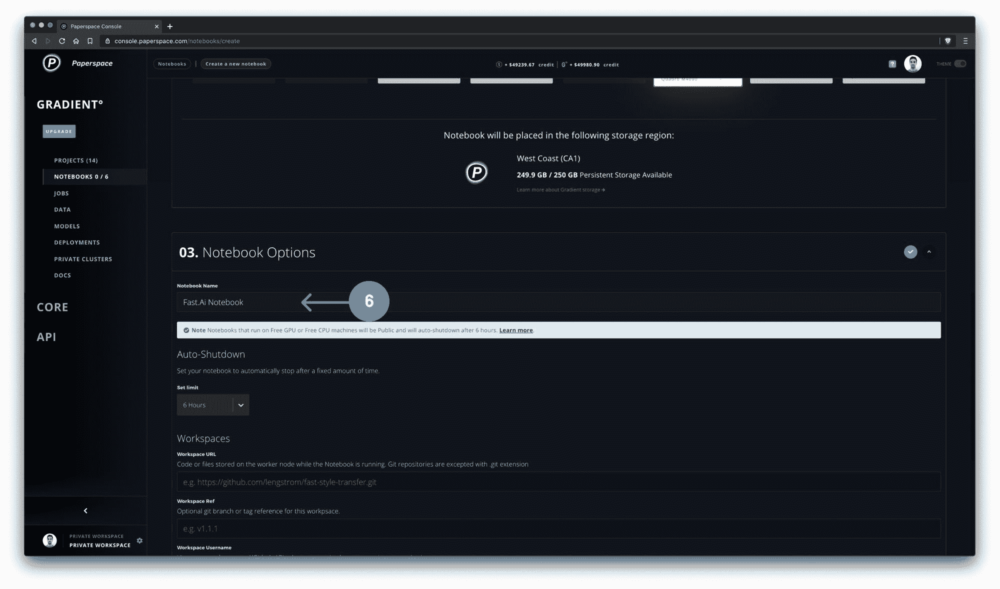
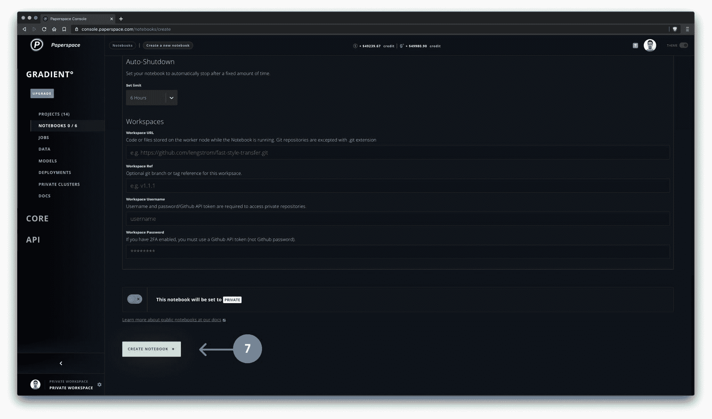
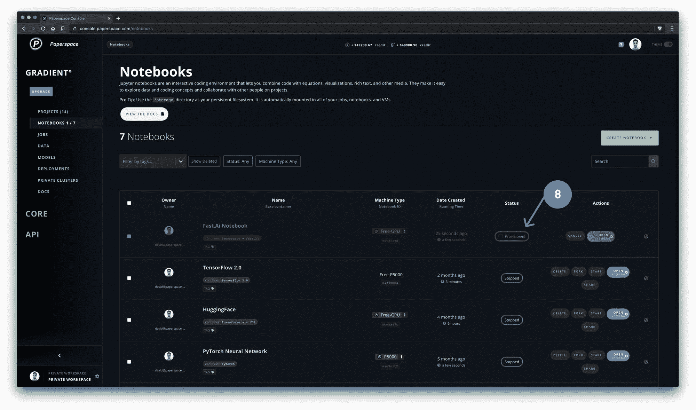
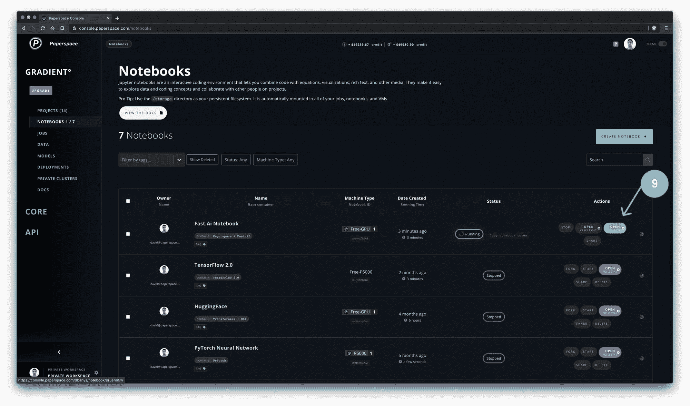
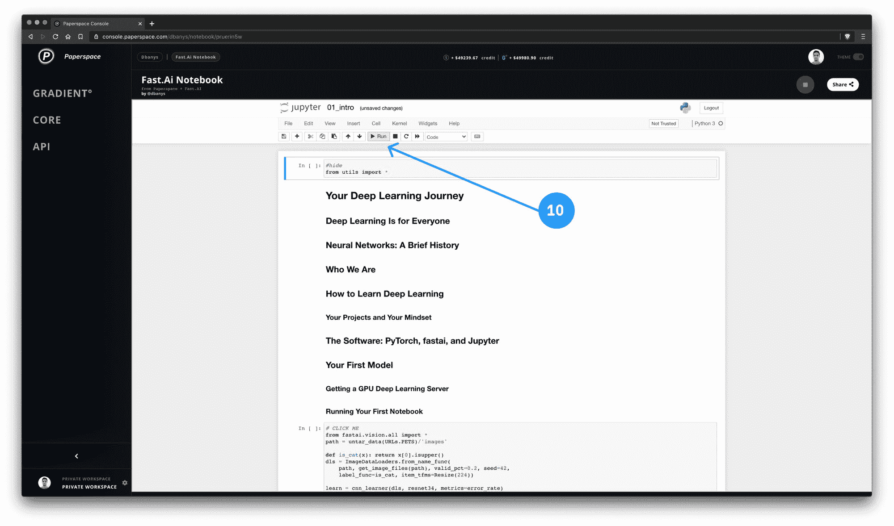

# 2020 年全新 Fast.ai 课程

> 原文：<https://blog.paperspace.com/fast-ai-2020/>

大约三年前，我们首次与杰瑞米·霍华德和 T2 的 Fast.ai 团队合作，推出了最初的课程。

如果你还不熟悉的话，Fast.ai 是一个非营利组织，它可能是 MOOC 推出的最受欢迎、最成功、最有效的机器学习项目——[面向程序员的实用深度学习](https://course.fast.ai/)。

我们很高兴地宣布，Fast.ai 团队已经[推出了 2020 年](https://course.fast.ai/)的更新课程，Gradient 再次成为这个新的改进课程的[推荐平台](https://course.fast.ai/start_gradient)之一。

Fast.ai 建议使用 Paperspace Gradient 来实现强大的可配置 Jupyter 笔记本环境。正如课程描述中提到的，“ *Gradient 是一个“真正的”Jupyter 笔记本，因此课程中的所有内容都有效。它还提供空间来保存您的笔记本电脑和模型。*

除了提供全功能的 Jupyter 笔记本环境，Gradient 还解决了其他流行的云笔记本在不同来源的数据管理和接收以及跨会话持久化笔记本方面存在的一些问题。

多年来，我们已经支持了数以万计的 Fast.ai 学生掌握深度学习——我们自豪地支持每年许多学生的成功，他们发现梯度在他们的 ML 旅程中有所帮助。

我们也很高兴继续为 Fast.ai 学生(以及任何对机器学习和深度学习感兴趣的人)提供免费的 GPU。

额外奖励:如果我们的免费机器容量不足，您可以在年底前使用促销代码 **FASTAIGR20** 获得 15 美元的免费梯度积分。️

我们希望您能抽出时间来看看新课程。我们会在这里支持你的 Fast.ai 之旅！

一如既往地感谢 Paperspace 团队。♥️

## 如何在 Paperspace 上启动并运行 fast.ai:

1\. If you haven't already, select Gradient from the Paperspace console home screen

2\. Select Notebooks from the Gradient sidebar

3\. Select Create Notebook

4\. Select the fast.ai container. This is pre-loaded with the latest fast.ai software.

5\. Select a machine type on which to run the notebook

6\. Give your new notebook a name

7\. Select Create Notebook to begin notebook provisioning

8\. Notebook will take a few minutes to provision and load

9\. Once notebook is ready to run, you will be able to press Open

10\. Run your notebook in the Paperspace Jupyter notebook environment!