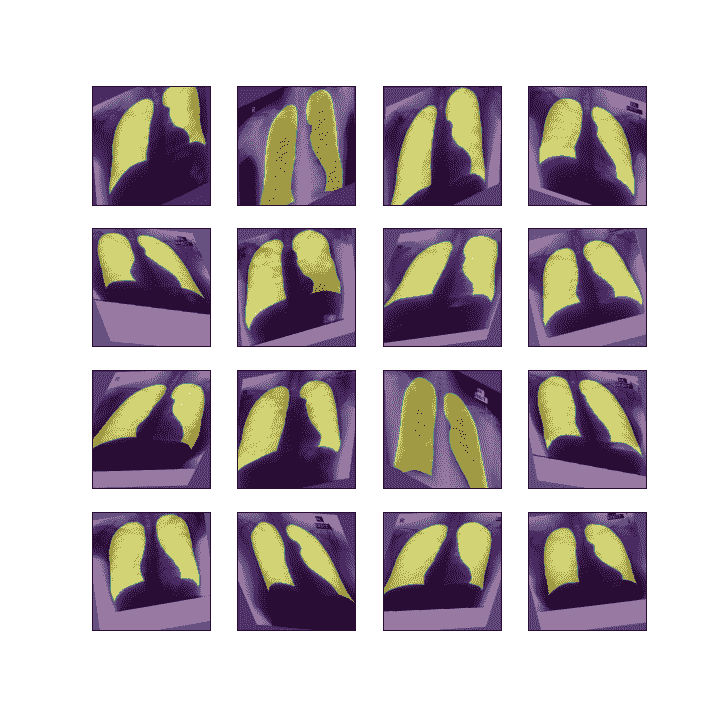

# Gradient Health 和 Paperspace 携手推进医学成像

> 原文：<https://blog.paperspace.com/gradient-health-and-paperspace-team-up-to-advance-medical-imaging/>

[Gradient Health](https://gradienthealth.ai/) 是一家为医学成像构建开放研究平台的医疗技术公司，它选择 Paperspace 作为其 MLOps 平台，为其机器学习管道带来可再现性和确定性。

Lung segmentations image set made available by Gradient Health

Gradient Health 由杜克大学的学生和毕业生创建，使用最新的机器学习技术为成像算法的开发者建立关键的基础设施。这些开发人员将尖端科学研究带入现实世界，为放射领域构建新颖的成像工作流程，造福于医生和科学家。

Paperspace 的高级机器学习架构师 Misha Kutsovsky 表示:“Gradient Health 的使命是帮助医学成像社区利用最新最伟大的 ML 技术进行创新。我们很高兴能够支持他们的机器学习工作，并与他们合作开展这项关键工作。”

凭借 Paperspace 的 MLOps 平台(恰好与 Gradient 同名)，Gradient Health 为其开发人员提供了一个可互操作的安全临床环境。拥有一个紧密的机器学习反馈循环是交付有价值产品的关键。

“通过与 PACS 供应商的合作，我们的目标是为所有研究人员提供安全的访问权限，以便在生产场景医疗数据集上训练和验证模型。Paperspace 为我们提供了一种更好地与研究人员交流的方式；使我们能够专注于构建工具和广泛适用于该领域的模型。”

渐变健康首席执行官黄

通过合作，Gradient Health 和 Paperspace 将比以往任何时候都更容易将领先的科学研究转化为现实世界的机器学习算法，从而改善患者的结果。

 

要了解更多关于梯度健康的信息，请访问: [www.gradienthealth.ai](https://gradienthealth.ai/)