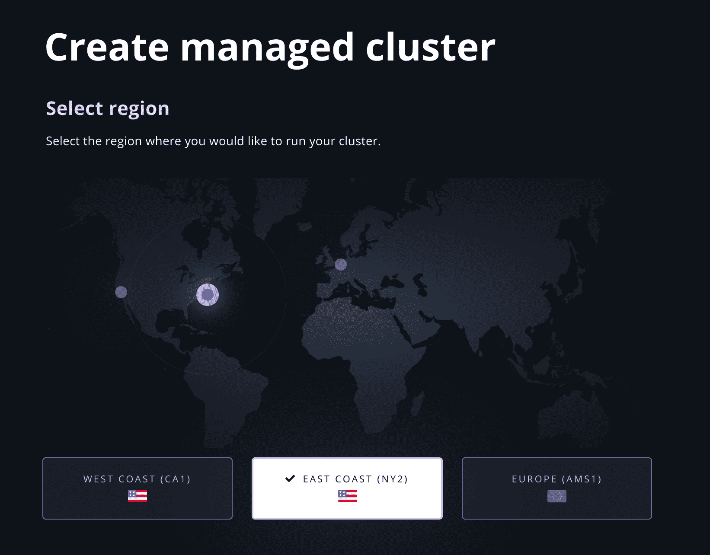
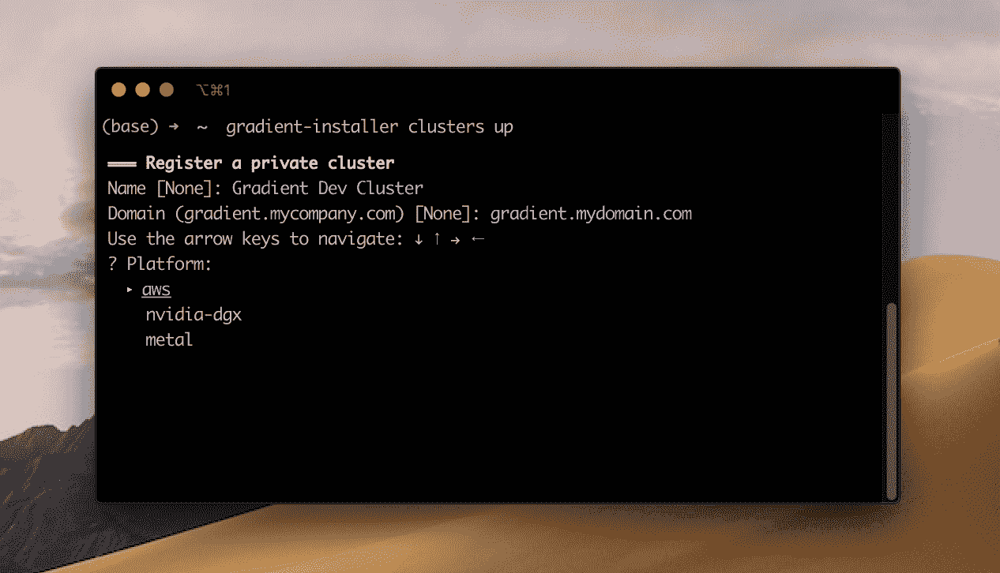

# 更新了 Terraform 安装程序、新的 CLI，并引入了托管私有梯度集群

> 原文：<https://blog.paperspace.com/introducing-private-gradient-clusters/>

我们最近推出了[基于 Terraform 的渐变 MLOps 安装程序](https://gradient.paperspace.com/gradient-installer)，让用户将任何云变成*超级强大的机器学习平台*。开箱即用的梯度安装程序允许你在公共云(AWS，GCP，Azure)上运行梯度，或者在你自己的私有云或本地集群上运行梯度。

## 私有集群🌱

我们很高兴地宣布**今天我们推出了一键式、完全托管的私有集群**，您无需离开 web 控制台就可以配置和管理这些集群！

任何拥有 **T1** 或更高梯度订阅的团队现在都可以提供他们自己的私有梯度集群。对于第一个版本，私有集群运行在 Paperspace 核心云上，这意味着您可以利用我们的高性能、低成本 GPU 基础设施。

您可以选择`single node`或`multi-node`集群，并选择位于美国西部(CA1)、美国东部(NY2)或欧洲西部(AMS1)的机器。



## 新安装程序 CLI👩🏽‍💻

你更喜欢在命令行工作吗？对于 Gradient Installer ( [参见 GitHub](https://github.com/paperspace/gradient-installer) )，我们还引入了一个 CLI 来管理您的集群。

要开始安装，请从以下来源安装 Gradient-Installer:

```py
/bin/bash -c "$(curl -fsSL https://raw.githubusercontent.com/paperspace/gradient-installer/master/bin/install)" 
```

接下来，运行更新程序:

`gradient-installer update`

当提示输入 API 密钥时，请访问 Paperspace 控制台以生成特定于应用程序的 API 令牌。一旦你登录到 Paperspace，你可以在这里找到你的 API 密匙:[https://console.paperspace.com/account/api](https://console.paperspace.com/account/api)

输入你的 API 密匙就可以了！您已经准备好开始构建了。

首先运行`gradient-installer clusters list`来查看您可用的私有集群。

想要启动新的集群吗？运行`gradient-installer clusters up`并按照设置提示进行操作——这就是全部内容！

当需要拆除集群时，只需使用命令`gradient-installer clusters down`。



## 这一切对✨意味着什么

我们希望您的机器学习团队能够随身携带 Gradient，无论您的数据位于何处，也无论您想要使用什么云进行训练和推理。这就是为什么我们对实现私有集群如此兴奋。

从现在开始，如果你想在 AWS 或 Azure 或你桌子下面的 GPU 上设置一个私有集群，我们可以帮助你。

无论在哪里运行计算，您都将获得 Gradient 的所有优势:

*   Jupyter 笔记本电脑
*   协作团队工作区
*   CI/CD
*   作业运行程序
*   生命周期管理
*   还有更多！

展望未来，我们将向托管专用集群产品添加新的配置和功能。

如果您想直接进入私有托管集群，[登录控制台](https://console.paperspace.com)并开始行动！

如果你想为你的团队做一个演示，或者想咨询我们的解决方案架构师，请在 sales@paperspace.com 给我们写信。