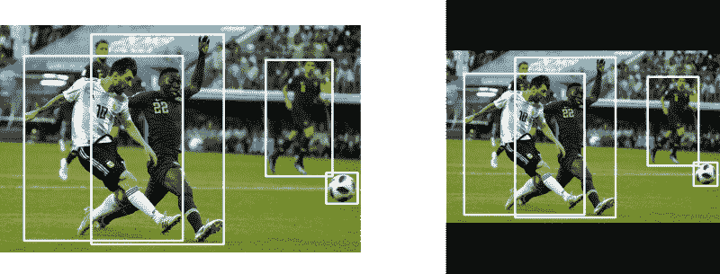

# 包围盒的数据扩充:为检测器构建输入管道

> 原文：<https://blog.paperspace.com/data-augmentation-for-object-detection-building-input-pipelines/>

你好。这是我们关于将图像增强方法应用于目标检测任务系列的第四部分，也是最后一部分。在前三篇文章中，我们已经讨论了各种图像增强技术，如翻转、旋转、剪切、缩放和平移。这一部分是关于如何将所有这些整合到一起，并将其烘焙到你的深层网络的输入管道中。那么，我们开始吧。

在开始之前，您应该已经阅读了本系列的前几篇文章。

这个系列有 4 个部分。
[1。第 1 部分:基础设计和水平翻转](https://blog.paperspace.com/data-augmentation-for-bounding-boxes/)
[2。第二部分:缩放和平移](https://blog.paperspace.com/data-augmentation-bounding-boxes-scaling-translation/)
[3。第三部分:旋转和剪切](https://blog.paperspace.com/data-augmentation-for-object-detection-rotation-and-shearing/)
[4。第 4 部分:烘焙增强到输入管道](https://blog.paperspace.com/data-augmentation-for-object-detection-building-input-pipelines/)

## GitHub 回购

本文和整个增强库的所有内容都可以在下面的 Github Repo 中找到。

[https://github . com/paper space/dataincreasationforobjectdetection](https://github.com/Paperspace/DataAugmentationForObjectDetection)

## 证明文件

这个项目的文档可以在你的浏览器中打开`docs/build/html/index.html`或者点击[链接](https://augmentationlib.paperspace.com/)找到。

## 结合多重转换

现在，如果您想要应用多个转换，您可以通过一个接一个地顺序应用它们来实现。例如，如果我要应用翻转，然后缩放和旋转，这是我将如何完成它。

```py
img, bboxes = RandomHorizontalFlip(1)(img, bboxes)
img, bboxes = RandomScale(0.2, diff = True)(img, bboxes)
img, bboxes = RandomRotate(10)(img, bboxes)
```

我需要应用的转换越多，我的代码就越长。

在这一点上，我们将实现一个函数，该函数单独组合多个数据扩充。我们将以与其他数据扩充相同的方式实现它，只是它将其他数据扩充的类实例列表作为参数。我们来写这个函数。

```py
class Sequence(object):

    """Initialise Sequence object

    Apply a Sequence of transformations to the images/boxes.

    Parameters
    ----------
    augemnetations : list 
        List containing Transformation Objects in Sequence they are to be 
        applied

    probs : int or list 
        If **int**, the probability with which each of the transformation will 
        be applied. If **list**, the length must be equal to *augmentations*. 
        Each element of this list is the probability with which each 
        corresponding transformation is applied

    Returns
    -------

    Sequence
        Sequence Object 

    """
    def __init__(self, augmentations, probs = 1):

        self.augmentations = augmentations
        self.probs = probs 
```

属性存储了我们讨论过的扩充列表。还有另一个属性`self.probs`，它保存了相应实例的增强将被应用的概率。

`__call__`函数看起来像。

```py
def __call__(self, images, bboxes):
    for i, augmentation in enumerate(self.augmentations):
        if type(self.probs) == list:
            prob = self.probs[i]
        else:
            prob = self.probs

        if random.random() < prob:
            images, bboxes = augmentation(images, bboxes)
    return images, bboxes
```

现在，如果我们要应用与上面相同的一组转换，我们将编写。

```py
transforms = Sequence([RandomHorizontalFlip(1), RandomScale(0.2, diff = True), RandomRotate(10)])

img, bboxes = transforms(img, bboxes)
```

这是结果。


## 调整到输入尺寸

虽然现在很多架构都是完全卷积的，因此大小是不变的，但为了统一起见，我们通常会选择一个恒定的输入大小，以便将我们的图像分批处理，这有助于提高速度。

因此，我们希望有一个图像转换，将我们的图像以及我们的边界框调整到一个恒定的大小。我们也想保持我们的长宽比。



Image is resized to 608 x 608

在上面的例子中，原始图像的大小是`800 x 505`。当我们必须在保持纵横比不变的情况下将矩形图像的大小调整为正方形时，我们各向同性地调整图像的大小(保持纵横比不变),以便长边等于输入维度。

我们实现调整大小的方式与我们调整扩充的方式相同。

```py
class Resize(object):
    """Resize the image in accordance to `image_letter_box` function in darknet 

    The aspect ratio is maintained. The longer side is resized to the input 
    size of the network, while the remaining space on the shorter side is filled 
    with black color. **This should be the last transform**

    Parameters
    ----------
    inp_dim : tuple(int)
        tuple containing the size to which the image will be resized.

    Returns
    -------

    numpy.ndaaray
        Sheared image in the numpy format of shape `HxWxC`

    numpy.ndarray
        Resized bounding box co-ordinates of the format `n x 4` where n is 
        number of bounding boxes and 4 represents `x1,y1,x2,y2` of the box

    """

    def __init__(self, inp_dim):
        self.inp_dim = inp_dim
```

在构建增强逻辑之前，我们将实现一个名为`letter_box` image 的函数，该函数调整图像的大小，使长边等于输入尺寸，图像沿短边居中。

```py
def letterbox_image(img, inp_dim):
    '''resize image with unchanged aspect ratio using padding'''
    img_w, img_h = img.shape[1], img.shape[0]
    w, h = inp_dim
    new_w = int(img_w * min(w/img_w, h/img_h))
    new_h = int(img_h * min(w/img_w, h/img_h))

    resized_image = cv2.resize(img, (new_w,new_h), interpolation = cv2.INTER_CUBIC)

    #create a black canvas    
    canvas = np.full((inp_dim[1], inp_dim[0], 3), 128)

	#paste the image on the canvas
    canvas[(h-new_h)//2:(h-new_h)//2 + new_h,(w-new_w)//2:(w-new_w)//2 + new_w,  :] = resized_image

    return canvas
```

我们最终实现了`__call__`函数。

```py
def __call__(self, img, bboxes):
    w,h = img.shape[1], img.shape[0]
    img = letterbox_image(img, self.inp_dim)

    scale = min(self.inp_dim/h, self.inp_dim/w)
    bboxes[:,:4] *= (scale)

    new_w = scale*w
    new_h = scale*h
    inp_dim = self.inp_dim   

    del_h = (inp_dim - new_h)/2
    del_w = (inp_dim - new_w)/2

    add_matrix = np.array([[del_w, del_h, del_w, del_h]]).astype(int)

    bboxes[:,:4] += add_matrix

    img = img.astype(np.uint8)

    return img, bboxes
```

## 为 COCO 数据集构建输入管道

现在，我们已经完成了增强，也有了组合这些增强的方法，我们实际上可以考虑设计一个输入管道，为我们提供来自 COCO 数据集的图像和注释，并动态应用增强。

## 离线增强与在线增强

在深层网络中，可以使用两种方式来完成增强。离线增强和在线增强。

在**离线扩充**中，我们扩充我们的数据集，创建新的扩充数据并将其存储在磁盘上。这可以帮助我们将我们的 train 示例增加任意多倍。因为我们有各种各样的增强，随机地应用它们可以帮助我们在开始重复之前将训练数据增加许多倍。

然而，这种方法有一个缺点，当我们的数据的大小太大时，它就不适合了。考虑占用 50 GB 内存的训练数据集。仅增加一次就会使大小增加到 100 GB。如果您有样本磁盘空间，最好是 SSD 或高 RPM 硬盘，这可能不是问题。

在在线增强中，就在图像被馈送到神经网络之前应用增强。这比我们以前的方法有几个好处。

1.  **没有空间需求**，因为增强是动态完成的，我们不需要保存增强的训练示例。
2.  每次图像被输入神经网络，我们都会得到相同图像的噪声版本。众所周知，微小的噪音可以帮助神经网络更好地泛化。每次神经网络看到相同的图像时，由于对它应用了增强，它会有一点不同。这种差异可以被认为是噪音，这有助于我们的网络更好地一般化。
3.  **我们在每个时期**获得不同的扩充数据集，而无需存储任何额外的图像。

## CPU 还是 GPU？

另一方面，从计算的角度来看，人们可能会想，在训练循环期间，是 **CPU 还是 GPU 应该进行在线增强**。

答案很可能是 CPU。CUDA 调用本质上是异步的。简而言之，这意味着在调用 GPU 命令(CUDA)之后，执行的控制权就回到了 CPU。

让我们来分析一下它是如何发生的。

CPU 不断读取代码，最终到达必须调用 GPU 的点。例如，在 PyTorch 中，命令`net = net.cuda()`通知 GPU 需要将变量`net`放到 GPU 上。现在任何使用`net`进行的计算都是由 GPU 完成的。

CPU 进行 CUDA 调用。这个调用是**异步**。这意味着 CPU 不会等待 GPU 完成调用指定的任务。**执行的控制权立即返回给 CPU** ，CPU 可以开始执行后面的代码行，而 GPU 可以在后台做它的事情。

这意味着 GPU 现在可以在后台/并行执行计算。现代深度学习库确保调用被正确调度，以确保我们的代码正常工作。然而，这个功能经常被深度学习库用来加速训练。**当 GPU 忙于执行当前时期的向前和向后传递时，下一个时期的数据可以同时由 CPU 从磁盘中读取并加载到 RAM 中。**

所以回到我们的问题，在线增强应该由 CPU 还是 GPU 来完成？它们应该由 CPU 完成的原因是，当 GPU 忙于执行当前时段的向前和向后传递时，下一个时段的增强可以在 CPU 上并行发生。

如果我们将增强功能放在 GPU 上，那么 GPU 将不得不等待 CPU 从磁盘中读取图像并将它们发送过来。这种等待状态会降低训练速度。另一件要注意的事情是，当 GPU 正在进行计算(增强+向前/向后传递)时，CPU 可能处于空闲状态(假设它已经从磁盘中读取了数据)。

## 设置 COCO 数据集

为了向您展示您应该如何使用我们刚刚实现的增强，我们以 COCO 数据集为例。出于演示目的，我们将使用`pytorch`和`torchvision`包。我会尽量保持它的通用性，这样你也可以让它与其他库或你自己的定制代码一起工作。

现在，在 PyTorch 中，数据管道是使用`torch.utils.dataset`类构建的。这个类基本上包含两个重要的函数。

1.  `__init__`函数描述了数据集的细节。这包括存储图像和注释的目录等。
2.  `__len__`返回训练样本的数量
3.  `__getitem__`返回一个单独的训练示例(也许是标签)。

在这三个函数中，`__getitem__`函数是我们感兴趣的。我们将在这里做图像放大。

通常，您应该查看代码库中的**位置，从磁盘**中读取图像和注释。这应该是你应该插入增强代码的地方。这确保了每个图像的增强是不同的，即使是一批图像。

下面这段代码通常用于 COCO 训练数据集中的示例。让我们假设`train2017`是包含图像的文件夹，`annots.json`是包含注释 json 文件的文件。

我没有深入讨论如何下载 COCO 数据集的原因是，这只是演示如何修改现有的输入管道来合并增强功能，而不是设置 COCO 输入管道的详尽指南

事实上，数据集的大小约为 19.3 GB，所以您可能不想下载它。

```py
from torchvision.datasets import CocoDetection

coco_dataset = CocoDetection(root = "train2017", annFile = "annots.json")

for image, annotation in coco_dataset:
	# forward / backward pass
```

现在，为了添加图像增强，我们需要找到负责从磁盘读取图像和注释的**代码**。在我们的例子中，这项工作是由`CocoDetection`类的`__getitem__`函数完成的。

我们可以进入`torchvision`的源代码并修改`CocoDetection`，但是修补内置的功能不是一个好主意。因此，我们定义了一个从 CocoDetection 类派生的新类。

```py
class CocoAugment(CocoDetection):

	def __init__(self, root, annFile, transforms, target_transforms, det_transforms):
		super(CocoAugment, self).__init__(root, annFile, transforms, target_transforms)
		self.det_transforms = det_transforms

	def __getitem__(self, idx):
		img, bboxes = super(CocoAugment, self).__getitem__(idx)
		bboxes = transform_annotation(bboxes)
		img, bboxes = self.det_transforms(img, bboxes)
		return bboxes
```

让我们看看这里到底发生了什么。

在我们的新类中，我们引入了属性`det_transforms`,它将用于保存应用于图像和边界框的增强。注意，我们还有属性`transforms`和`target_transforms`，它们用于应用`torchvision`的内置数据扩充。然而，这些扩充只是为分类任务而构建的，并不支持扩充边界框。

然后，在`__getitem__`方法中，我们首先获取图像，以及父类的`__getitem__`返回的注释`bboxes`。正如我们在本系列的第 1 部分中提到的，注释必须采用特定的格式，以便增强功能能够工作。我们定义函数`transform_annotation`来做这件事。

由`CocoDetection`的`__getitem__`方法返回的图像中对象的边界框注释是一个列表形式，其中包含每个边界框的字典。边界框属性由字典的元素定义。每个边界框由其左上角、高度和宽度定义。我们必须将其更改为我们的格式，其中每个边界框由左上角和右下角定义。

```py
def transform_annotation(x):
    #convert the PIL image to a numpy array
    image = np.array(x[0])

    #get the bounding boxes and convert them into 2 corners format
    boxes = [a["bbox"] for a in x[1]]

    boxes = np.array(boxes)

    boxes = boxes.reshape(-1,4)

    boxes[:,2] += boxes[:,0]
    boxes[:,3] += boxes[:,1]

    #grab the classes   
    category_ids = np.array([a["category_id"] for a in x[1]]).reshape(-1,1)

    ground_truth = np.concatenate([boxes, category_ids], 1).reshape(-1,5)

    return image, ground_truth
```

然后，简单地应用增强，现在我们得到了增强的图像。总结整个代码，

```py
from torchvision.datasets import CocoDetection
import numpy as np
import matplotlib.pyplot as plt

def transform_annotation(x):
    #convert the PIL image to a numpy array
    image = np.array(x[0])

    #get the bounding boxes and convert them into 2 corners format
    boxes = [a["bbox"] for a in x[1]]

    boxes = np.array(boxes)

    boxes = boxes.reshape(-1,4)

    boxes[:,2] += boxes[:,0]
    boxes[:,3] += boxes[:,1]

    #grab the classes   
    category_ids = np.array([a["category_id"] for a in x[1]]).reshape(-1,1)

    ground_truth = np.concatenate([boxes, category_ids], 1).reshape(-1,5)

    return image, ground_truth

class CocoAugment(CocoDetection):

	def __init__(self, root, annFile, transforms, target_transforms, det_transforms):
		super(CocoAugment, self).__init__(root, annFile, transforms, target_transforms)
		self.det_transforms = det_transforms

	def __getitem__(self, idx):
		img, bboxes = super(CocoAugment, self).__getitem__(idx)
		bboxes = transform_annotation(bboxes)
		img, bboxes = self.det_transforms(img, bboxes)
		return bboxes

det_tran = Sequence([RandomHorizontalFlip(1), RandomScale(0.4, diff = True), RandomRotate(10)])

coco_dataset = CocoDetection(root = "train2017", annFile = "annots.json", det_transforms = det_tran)

for image, annotation in coco_dataset:
	# forward / backward pass 
```

## 结论

这就结束了我们的一系列图像增强的目标检测任务。图像增强是对抗深度神经网络中过拟合的最强大但概念上简单的技术之一。随着我们的网络变得越来越复杂，我们需要更多的数据来获得良好的收敛速度，如果数据可用性是一个瓶颈，增强无疑是一种前进的方式。

我想象在接下来的几年里，我们会看到更复杂的数据增强形式，例如由生成网络进行的增强，以及智能增强，其中增强是为了产生更多网络努力的那种例子。

同时，我们的小库也定义了更多的扩充。通过打开`docs`文件夹中的 index.html 文件，可以找到它们的详细摘要。我们还没有涵盖我们系列中的所有增强。例如，关于 HSV(色调、饱和度和亮度)的增强不包括在内，因为它们不需要增强边界框。

您现在可以继续，甚至定义一些您自己的增强。例如，我们没有实现垂直翻转，因为在倒置的图像上训练分类器没有意义。然而，如果我们的数据集由卫星图像组成，垂直翻转只是交换对象的方向，可能是有意义的。黑客快乐！

**P.S.** 本项目的文档已使用 Sphynx 生成。如果您实现了新的扩充，并且想要生成文档字符串，请使用 Numpy 约定来生成文档字符串。该项目的 Sphynx 文件位于`docs/source`文件夹中。

## 进一步阅读

1.  [py torch 中的数据预处理](https://pytorch.org/tutorials/beginner/data_loading_tutorial.html)
2.  [Sphynx](https://www.patricksoftwareblog.com/python-documentation-using-sphinx/)
3.  [Numpy 文档约定](https://numpydoc.readthedocs.io/en/latest/format.html#docstring-standard)