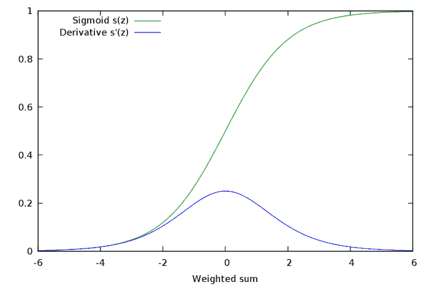
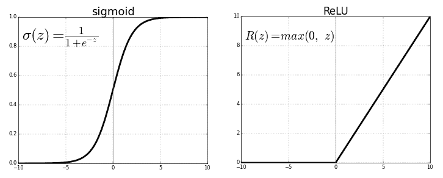
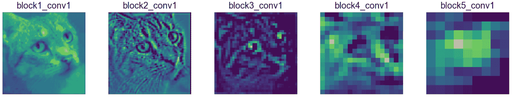
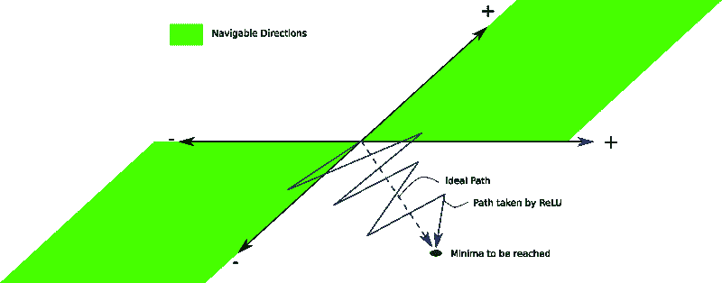
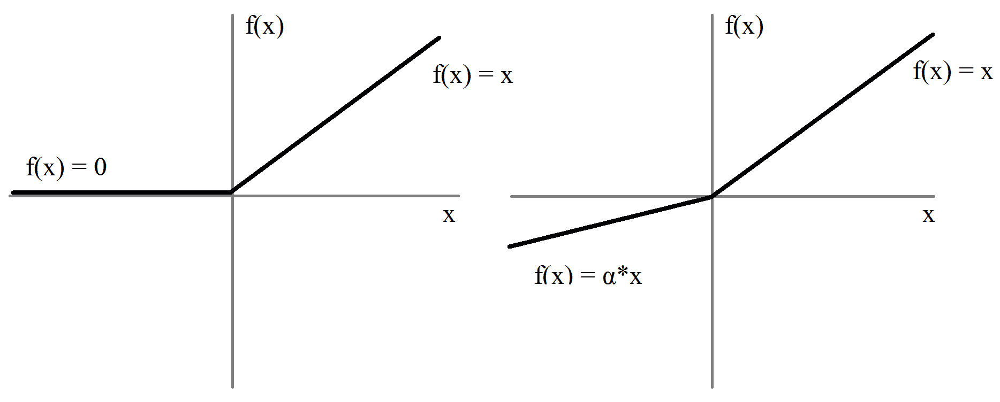
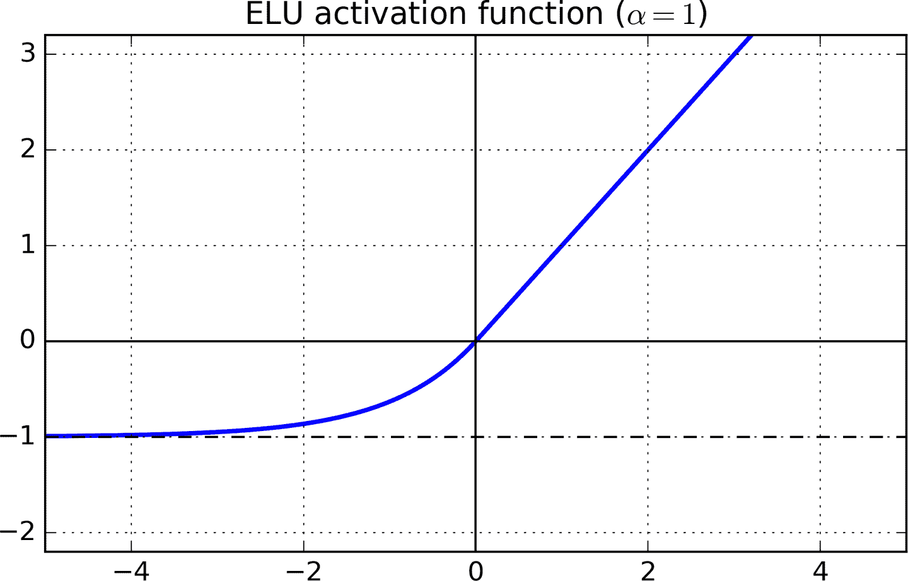

# 深度学习中的优化介绍:消失梯度和选择正确的激活函数

> 原文：<https://blog.paperspace.com/vanishing-gradients-activation-function/>

这是[优化系列](https://blog.paperspace.com/tag/series-optimization/)的第三篇帖子，我们试图给读者一个深度学习优化的全面回顾。到目前为止，我们已经了解了:

1.  [小批量梯度下降](https://blog.paperspace.com/intro-to-optimization-in-deep-learning-gradient-descent/)用于对抗局部最小值和鞍点。

2.  像 [Momentum、RMSProp 和 Adam](https://blog.paperspace.com/intro-to-optimization-momentum-rmsprop-adam/) 这样的自适应方法如何增加普通梯度下降来解决病态曲率的问题。

## 分布，该死的分布和统计

与之前的机器学习方法不同，神经网络不依赖于对输入数据的任何概率或统计假设。然而，确保神经网络正确学习所需的最重要的元素之一(如果不是最重要的元素的话)是馈送到神经网络的层的数据表现出某些属性。

1.  数据分布应该是以**零为中心的**，即分布的平均值应该在零附近。缺少这一点会导致**消失梯度**和紧张的训练。
2.  优选地，该分布是正态分布。缺少这一点会导致网络**过度适应**一个输入空间域。
3.  **随着训练的进行，批量激活和层激活的分布应保持恒定**。这种缺失被称为**内部协变量转移**，这可能会减慢训练速度。

在本文中，我们将讨论第一个和第二个问题，以及如何使用激活函数来解决它们。最后，我们给出了一些实用的建议来为你的深层网络选择激活功能。

## 消失渐变

消失梯度的问题是有据可查的，随着我们对神经网络的深入研究，这个问题变得更加突出。让我们理解它们为什么会发生。想象一下最简单的神经网络。一堆线性堆积的神经元。

人们可以很容易地将这种类比扩展到更深层的密集连接的架构。事实上，只要将网络中的每一个神经元都替换成完整的一层，就很容易做到这一点。每个神经元使用 Sigmoid 非线性作为它的激活函数。


sigmoid 函数的图形如下所示。


如果你观察 sigmoid 函数的斜率，你会发现它在任一条纹上都趋向于零。或者更好的是，让我们看看 sigmoid 函数的梯度图。



当我们根据 sigmoid 激活层的权重对其输出进行微分时，我们看到 sigmoid 函数的梯度是表达式中的一个因素。该梯度的值范围从 0 到 1。

$ $ \ frac { \ partial(\sigma(\omega^tx+b))} { \ partial \ omega } = \ frac { \ partial(\sigma(\omega^tx+b))} { \ partial(\omega^tx+b)} * \ frac { \ partial(\omega^tx+b)} { \ partial \ omega } $ $

第二项是 sigmoid 导数，其范围为 0 到 1。

回到我们的例子，让我们算出神经元 *A* 的梯度规则。应用链式法则，我们看到神经元 *A* 的梯度如下

$ $ \ frac { \ partial L } { \ partial a } = \ frac { \ partial L } * \ frac { \ partial d } * \ frac { \ partial c } * \ frac { \ partial b } * \ frac { \ partial b } { \ partial a }
$ $

要认识到，上述表达式中的每一项都可以进一步分解成梯度的乘积，其中之一是 sigmoid 函数的梯度。举个例子，

$ $ \ frac { \ partial d } { \ partial c } = \ frac { \ partial d } { \ partial(\sigma(\omega_d^tc+b _ d))} * \ frac { \ partial(\sigma(\omega_d^tc+b _ d))} { \ partial(\omega_d^tc+b _ d)} * \ frac { \ partial(\omega_d^tc+b _ d)} { \ partial c } $ $

现在，让我们假设 A 前面不是 3 个神经元，而是有大约 50 个神经元。这在网络可能很容易有 50 层的实际场景中是完全可能的。

那么 A 的梯度表达式中有 50 个 sigmoid 梯度的乘积，并且由于每个这样的项具有 0 和 1 之间的值，**A 的梯度值可能被驱动为零。**

为了了解这是如何发生的，让我们做一个简单的实验。让我们从 0 到 1 随机抽取 50 个数，然后一起相乘。

```py
import random
from functools import reduce

li = [random.uniform(0,1) for x in range(50)
print(reduce(lambda x,y: x*y, li)) 
```

你自己去试试。尽管多次尝试，我永远也不可能得到比$10^{-18}$.更多的订单价值如果这个值作为因子出现在神经元 A *的梯度表达式中，那么它的梯度几乎可以忽略不计。这意味着，在更深的架构中，更深的神经元不会学习，或者即使学习，其速度也比更浅更高层的学习慢得多。*

这种现象被称为**消失梯度问题**，其中更深层神经元的梯度变为零，或者说*消失*。问题是网络的深层学习非常慢，或者在最坏的情况下，深层根本不学习。

## 饱和神经元

饱和的神经元会使梯度消失的问题恶化。假设，馈送给具有 s 形激活神经元的预激活$\omega^Tx + b 要么非常高，要么非常低。在非常高或非常低的值处，sigmoid 的梯度几乎为 0。任何梯度更新几乎不会产生权重$\omega$和偏差$b$的变化，并且神经元将需要许多步骤来修改权重，使得预激活落在梯度具有实质值的区域中。

## 依靠救援

在一般的深层网络环境中，抑制梯度消失问题的第一次尝试是引入 ReLU 激活功能(LSTMs 也是为了解决这个问题，但它们仅限于循环模型)。



对于$x \gt 0$而言，ReLU 的梯度为 1，对于$x \lt 0$而言，其梯度为 0。它有多重好处。ReLU 函数的梯度乘积最终不会收敛到 0，因为值不是 0 就是 1。如果值为 1，渐变将按原样反向传播。如果为 0，则没有梯度从该点向后传播。

### 单边饱和

我们在 sigmoid 函数中有双侧饱和。也就是说，激活函数将在正方向和负方向都饱和。相反，ReLUs 提供单边饱和。

虽然称 ReLU 的零部分为饱和并不准确。然而，它在某种程度上服务于相同的目的，即当函数的输入变得越来越负时，函数值根本不变(与适当饱和度中非常非常小的变化相反)。你可能会问，单边饱和会带来什么好处？

我们倾向于认为深层网络中的神经元像开关一样，专门检测某些特征，这通常被称为*概念*。虽然较高层中的神经元可能最终专门检测高级概念，如眼睛、轮胎等，但较低层中的神经元最终专门检测低级概念，如曲线、边缘等。

我们希望当输入中出现这样的概念时，神经元会被激发，并且它的大小是输入中概念范围的度量。例如，如果一个神经元检测到一个边缘，它的大小可能代表边缘的锐度。



神经元创建的激活图学习不同的概念

然而，对于一个神经元来说，拥有一个无限的负值是没有意义的。虽然解释概念存在时的信心很直观，但对概念的缺失进行编码却很奇怪。

考虑与检测边缘的神经元相关的例子，与激活 5 相比，激活 10 可能意味着更尖锐的边缘。但是与-5 相比，值-10 有什么意义呢，其中低于 0 的值表示根本没有边缘。因此，对于对应于没有*概念*的情况(一些其他概念可能存在或者根本没有)的所有输入，具有统一的零值将是方便的。ReLUs 用他们的片面饱和实现了这一点。

### 信息解纠缠和对噪声的鲁棒性

单侧饱和使神经元对噪声具有鲁棒性。为什么？让我们假设我们有一个神经元值是无界的，即在任一方向上都不饱和。包含不同程度概念的输入在神经元的正输出中产生差异。这很好，因为我们希望幅度作为信号强度的指标。

然而，关于背景噪声或神经元不擅长的概念(包含被馈送给擅长检测线的神经元的弧的区域)的信号中的变化，在神经元的负输出中产生变化。**这种类型的差异会向其他神经元**贡献无关的无用信息，这些神经元与我们正在讨论的特定神经元具有依赖性。这也会导致相关的单元。例如，检测直线的神经元可能与检测弧线的神经元呈负相关。

现在，让我们考虑在负区域饱和的神经元的相同场景，(对于预激活< 0). Here, **,由于噪声引起的方差，其早先显示为负幅度，被激活函数的饱和元素压制。**这可以防止噪声产生外来信号。

### 稀少

使用 ReLu 激活函数也有计算上的好处。基于 ReLU 的网络训练更快，因为在计算 ReLU 激活的梯度时没有花费大量的计算。这与 Sigmoid 相反，在 Sigmoid 中，为了计算梯度，需要计算指数。

由于 ReLU 将负预激活箝位到零，它们隐含地在网络中引入了稀疏性，这可以被利用来获得计算上的好处。

* * *

## 垂死的 ReLU 问题

ReLUs 也有自己的缺点。虽然稀疏是一种计算优势，但过多的稀疏实际上会妨碍学习。通常，预激活还包含一个偏置项。如果该偏置项变得太负，使得$\omega^Tx + b \lt 0$,则在反向通过期间 ReLU 激活的梯度为 0。* *因此，导致负预激活的权重和偏差无法更新。**

如果学习到的权重和偏差使得整个输入域的预激活为负，则神经元永远不会学习，从而导致类似 s 形的饱和。这就是所谓的**死亡再路问题。**

## 零中心激活

因为 ReLUs 只输出非负激活而不管它的输入，它们总是产生正激活。这可能是一个缺点。让我们了解如何。

对于基于 ReLU 的神经网络，对于损失函数$L$来说，属于具有激活$z_n = ReLU(\omega_n^Tx_n + b_n)$的层$l_n$的任何权重集的梯度

$ $ \ frac { \ partial l } { \ partial \ omega _ { n } } = \ frac { \ partial l } { \ partial(relu(\omega_n^tx_n+b_n))}*i(relu(\omega_n^tx_n+b _ n))* x _ n $ $

这里，$i(relu(\omega_n^tx_n+b _ n)\ gt 0)$是一个指示函数，当参数为真时，条件为 1，否则为 0。因为，ReLU 只输出一个非负值($x_{n}$)。由于$x_n$的每个元素不是正就是零，所以$\omega_n$中每个权重的梯度更新与$ \ frac { \ partial l } { \ partial(relu(\omega_n^tx_n+b _ n))} $

这有什么问题吗？问题是，由于所有神经元的梯度更新的**符号是相同的，所以层$l_n$的所有权重在一次更新**期间可以增加或减少。然而，理想的梯度权重更新可能是一些权重增加而其他权重减少。这在 ReLU 中是不可能的。

假设一些权重需要根据理想的权重更新而减少。然而，如果梯度更新是正的，则这些权重在当前迭代中变得太正。在下一次迭代中，梯度可以是负的，也可以是大的，以补偿这些增加的权重，这最终可能超过需要很少负变化或正变化的权重。

这可能会导致在寻找最小值时出现曲折模式，从而减慢训练速度。



ReLUs 泄漏的问题

## 泄漏 relu 和参数化 relu

为了解决死亡 ReLU 的问题，提出了泄漏 ReLU。一个**泄漏 ReLU** 与正常 ReLU 相同，除了不是对$ x \lt 0 $为 0，它在那个区域有一个小的负斜率。



实际上，负斜率$\alpha$被选择为 0.01 量级的值。

泄漏 ReLU 的好处是反向传递能够改变权重，这产生了负的预激活，因为输入的激活函数的梯度是＄\αe^x$.例如，在 YOLO 目标检测算法中使用了泄漏 ReLU。

因为负的预激活产生负值而不是 0，所以我们不存在仅在与 ReLU 相关联的一个方向上更新权重的问题。

$\alpha$的值是人们已经试验了很多次的东西。存在一种被称为随机化泄漏 ReLU 的方法，其中负斜率是从具有平均值 0 和标准偏差 1 的均匀分布中随机选择的。

$ $ f(x)= \ left \ { \ begin { array } { ll } x \:\:\:\:\:\:\:when \:\:x \:\ gt 0 \ \ \ alpha x \:\:\:\:\:\:when \:x \ leq 0 \ \ \ end { array } \ right。\\\\ \alpha \sim U(0，1) $$

随机化 ReLU 的原始论文声称，它比 leaky ReLU 产生更好更快的结果，并通过经验方法提出，如果我们仅限于选择$\alpha$，就像 Leaky ReLU 一样，选择$\frac{1}{5.5}$会比 0.01 更好

随机化的泄漏 ReLU 工作的原因是由于负斜率的随机选择，因此负预激活的梯度的随机性，这在优化算法中引入了随机性。这种随机性或噪声帮助我们避开局部最小值和鞍点。如果你需要更多的观点，我鼓励你看看这个系列的第一部分，在那里我们已经深入讨论了这个话题。

利用每个神经元不同的负斜率的优势，人们进一步采取了这种方法，不是随机采样负斜率＄\ alpha ＄,而是将其转化为超参数，由网络在训练期间学习。这种激活被称为**参数化 ReLU** 。

## 修正饱和度

虽然神经元饱和似乎是神经网络中的一件非常糟糕的事情，但像 ReLU 这样的单边饱和并不一定那么糟糕。虽然上面讨论的 ReLU 的变体有助于零中心激活，但是它们没有上面讨论的单侧饱和的好处。

## 指数线性单位和偏移

根据上面的讨论，似乎理想的激活函数具有两个期望的性质:

1.  产生一个**以零为中心的分布，这可以使训练更快**。
2.  具有**单侧饱和，这导致更好的收敛**。

虽然 Leaky ReLUs 和 PReLU 解决了第一个条件，但它们无法满足第二个条件。另一方面，香草 ReLU 满足第二个条件，但不是第一个条件。

满足这两个条件的激活函数是指数线性单位(ELU)。



$ $ f(x)= \ left \ { \ begin { array } { ll } x \:\:\:\:\:\:\:\:\:\:\:\:\:\:\:\:\:\:when \:\:x \:\ gt 0 \ \ \ alpha(e^{x}-1)\:\:\:\:\:\:when \:x \ leq 0 \ \ \ end { array } \ right。$$

对于$ x \gt 0 $函数的梯度是 1，而对于$ x \lt 0 $函数的梯度是$ \alpha * e^x $。该函数对负值饱和，达到$ - \alpha $的值。\α是一个超参数，通常选择为 1。

因为，函数确实有一个负值区域，我们不再有非零中心激活导致不稳定训练的问题。

## 如何选择激活函数

1.  试试 ReLU 激活的运气。尽管我们已经概述了 ReLU 的问题，但是许多人已经用 ReLU 取得了很好的结果。根据奥卡姆剃刀原理，最好先尝试简单的东西。在所有其他可行的竞争者中，ReLUs 拥有最便宜的计算预算，而且如果你的项目需要从头开始编码，它也非常容易实现。

2.  如果 ReLU 没有输出有希望的结果，我的下一个选择是一个泄漏的 ReLU 或 eLU。我发现能够产生零中心激活的激活比不能产生零中心激活的要好得多。ELU 可能是一个非常容易的选择，但是基于 ELU 的网络训练很慢，推理时间也很慢，因为我们必须计算许多指数来计算负预激活的激活。* *如果计算资源对你来说不是问题，或者如果网络不是巨大的，去 ELU，否则，你可能想坚持使用 Leaky ReLUs。**.LReLU 和 eLU 都增加了另一个需要调整的超参数。

3.  如果您有大量的计算预算和时间，您可以将上述激活的性能与 PReLU 和随机化 ReLU 的性能进行对比。如果您的函数显示过度拟合，随机化的 ReLU 会很有用。使用参数 ReLU，您可以将一大堆需要学习的参数添加到您的优化问题中。因此，**参数化的 ReLU 应该只在你有大量训练数据的情况下使用。**

## 结论

在这篇文章中，我们讨论了为使神经网络正确学习，需要一个持续的、行为良好的数据分布。虽然激活函数隐式地试图规范化这些分布，但一种称为**批处理规范化**的技术显式地做到了这一点，可以说这是近年来深度学习领域的重大突破之一。然而，这将包括在系列的下一部分，直到那时，你可以尝试你的网络尝试不同的激活！体验愉快！

## 进一步阅读

1.  [爆炸梯度问题](https://machinelearningmastery.com/exploding-gradients-in-neural-networks/)
2.  [深入了解 ReLUs 的优势](https://stats.stackexchange.com/questions/176794/how-does-rectilinear-activation-function-solve-the-vanishing-gradient-problem-in)
3.  reddit 上关于 ReLUs 是否仍在使用的讨论，如果是，为什么？
4.  [ELU paper](https://arxiv.org/pdf/1511.07289.pdf)