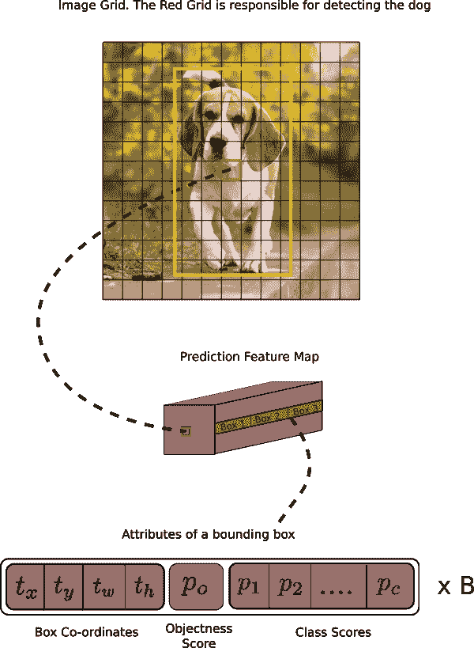
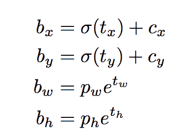
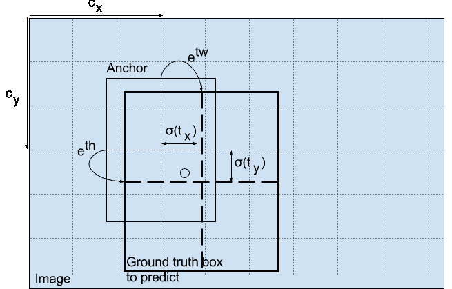
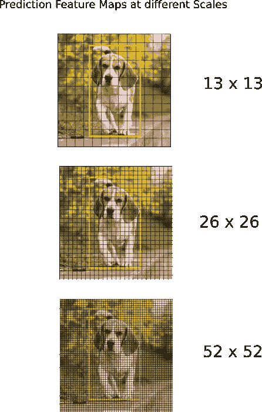
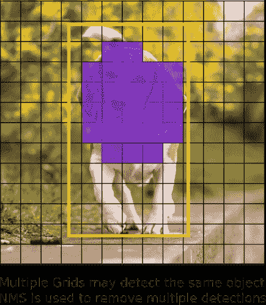

# 如何在 PyTorch 中从头开始实现 YOLO (v3)对象检测器:第 1 部分

> 原文：<https://blog.paperspace.com/how-to-implement-a-yolo-object-detector-in-pytorch/>

图片来源:凯罗尔·马杰克。查看他的 YOLO v3 实时检测视频[这里](https://www.youtube.com/watch?v=8jfscFuP9k)

对象检测是一个从深度学习的最新发展中受益匪浅的领域。近年来，人们开发了许多目标检测算法，其中包括 YOLO，SSD，掩模 RCNN 和 RetinaNet。

对象检测是一个从深度学习的最新发展中受益匪浅的领域。近年来，人们开发了许多目标检测算法，其中包括 YOLO，SSD，掩模 RCNN 和 RetinaNet。

在过去的几个月里，我一直在一个研究实验室致力于改进物体检测。从这次经历中最大的收获之一是认识到学习物体检测的最好方法是自己从头开始实现算法。这正是我们在本教程中要做的。

我们将使用 PyTorch 来实现一个基于 YOLO v3 的对象检测器，这是目前最快的对象检测算法之一。

本教程的代码旨在运行在 Python 3.5 和 PyTorch **0.4** 上。在这个 [Github repo](https://github.com/ayooshkathuria/YOLO_v3_tutorial_from_scratch) 可以找到它的全部内容。

本教程分为 5 个部分:

1.  第一部分(这一部分):理解 YOLO 是如何工作的

2.  [第 2 部分:创建网络架构的各层](https://blog.paperspace.com/how-to-implement-a-yolo-v3-object-detector-from-scratch-in-pytorch-part-2/)

3.  [第三部分:实现网络的前向传递](https://blog.paperspace.com/how-to-implement-a-yolo-v3-object-detector-from-scratch-in-pytorch-part-3/)

4.  [第 4 部分:客观分数阈值和非最大值抑制](https://blog.paperspace.com/how-to-implement-a-yolo-v3-object-detector-from-scratch-in-pytorch-part-4/)

5.  [第五部分:设计输入和输出管道](https://blog.paperspace.com/how-to-implement-a-yolo-v3-object-detector-from-scratch-in-pytorch-part-5/)

#### 先决条件

*   你应该明白卷积神经网络是如何工作的。这还包括残差块、跳过连接和上采样的知识。

*   什么是物体检测，包围盒回归，IoU 和非最大值抑制。

*   PyTorch 的基本用法。您应该能够轻松创建简单的神经网络。

我在文章末尾提供了链接，以防你在任何方面有所欠缺。

#### 什么是 YOLO？

YOLO 代表你只看一眼。这是一个对象检测器，使用深度卷积神经网络学习的特征来检测对象。在我们接触代码之前，我们必须了解 YOLO 是如何工作的。

#### 全卷积神经网络

YOLO 仅利用卷积层，使其成为完全卷积网络(FCN)。它有 75 个卷积层，带有跳跃连接和上采样层。不使用任何形式的池，使用步长为 2 的卷积层对特征图进行下采样。这有助于防止通常归因于池化的低级特性的丢失。

作为 FCN，YOLO 对于输入图像的大小是不变的。然而，在实践中，我们可能希望坚持一个恒定的输入大小，因为各种问题只有在我们实现算法时才会显露出来。

这些问题中的一个大问题是，如果我们想要批量处理我们的图像(批量图像可以由 GPU 并行处理，从而提高速度)，我们需要所有图像的高度和宽度都固定。这需要将多个图像连接成一个大批量(将许多 PyTorch 张量连接成一个)

网络通过称为网络的**步距**的因子对图像进行下采样。例如，如果网络的跨距是 32，那么大小为 416×416 的输入图像将产生大小为 13×13 的输出。一般情况下，网络中任一层的 ***步距*等于该层输出小于网络输入图像的因子。**

#### 解释输出

通常，(对于所有对象检测器来说都是如此)卷积层学习的特征被传递到分类器/回归器上，该分类器/回归器进行检测预测(边界框的坐标，类别标签..等等)。

在 YOLO，预测是通过使用 1 x 1 卷积的卷积层来完成的。

现在，首先要注意的是我们的**输出是一个特征图**。因为我们已经使用了 1×1 卷积，所以预测图的大小正好是它之前的特征图的大小。在 YOLO v3(及其后代)中，解释这个预测图的方式是每个单元可以预测固定数量的边界框。

> 虽然在特征图中描述一个单元的技术上正确的术语应该是一个*神经元*，但在我们的上下文中称它为细胞会更直观。

在深度方面，我们在特征图中有(B x (5 + C))个条目。 B 代表每个单元格可以预测的包围盒数量。根据这篇论文，这些 B 包围盒中的每一个都可能专门用于检测某一种对象。每个包围盒具有 *5 + C* 属性，这些属性描述了每个包围盒的中心坐标、尺寸、客观分数和 *C* 类置信度。YOLO v3 预测每个单元有 3 个边界框。

如果对象的中心落在特征图的每个单元的感受野内，你期望该单元通过它的一个边界框来预测对象。(感受野是细胞可见的输入图像区域。请参考卷积神经网络上的链接以获得进一步的说明)。

这与 YOLO 的训练方式有关，只有一个边界框负责检测任何给定的对象。首先，我们必须确定这个边界框属于哪个单元。

为此，我们将**输入**图像划分为一个网格，其尺寸等于最终特征图的尺寸。

让我们考虑下面的例子，其中输入图像是 416×416，网络的跨距是 32。如前所述，特征图的尺寸将是 13×13。然后，我们将输入图像分成 13×13 个单元。

然后，选择包含对象的地面真值框的中心的单元(*在输入图像*上)作为负责预测对象的单元。在图像中，是标记为红色的单元格，它包含地面真实框的中心(标记为黄色)。

现在，红色单元格是网格中第 7 行的第 7 个单元格。我们现在将特征图上第 7 行**的第 7 个单元(特征图上对应的单元)指定为负责检测狗的单元。**

现在，这个单元可以预测三个边界框。哪一个会被分配到狗的地面真相标签？为了理解这一点，我们必须先了解锚的概念。

> *注意，我们这里说的单元格是预测特征图上的单元格。我们将**输入图像**分成网格，只是为了确定**预测特征图**的哪个单元负责预测*

#### 锚箱

预测边界框的宽度和高度可能是有意义的，但在实践中，这会导致训练过程中不稳定的梯度。相反，大多数现代对象检测器预测对数空间变换，或者简单地偏移到预定义的默认边界框，称为**锚**。

然后，将这些变换应用于锚盒以获得预测。YOLO v3 具有三个锚，这导致每个单元三个边界框的预测。

回到我们之前的问题，负责检测狗的边界框将是其锚点与地面真实框的 IoU 最高的那个。

#### 做预测

以下公式描述了如何转换网络输出以获得边界框预测。

*bx，by，bw，bh* 是我们预测的 x，y 中心坐标，宽度和高度。 *tx，ty，tw，th* 是网络输出的。 *cx* 和 *cy* 是网格左上角的坐标。 *pw* 和 *ph* 为母扣的锚尺寸。

###### 中心坐标

请注意，我们正在通过 sigmoid 函数运行我们的中心坐标预测。这将强制输出值介于 0 和 1 之间。为什么会这样呢？请原谅我。

通常，YOLO 不会预测边界框中心的绝对坐标。它预测以下偏移量:

*   相对于预测对象的网格单元的左上角。

*   根据特征图中像元的尺寸进行归一化，即 1。

例如，考虑我们的狗图像的情况。如果中心的预测是(0.4，0.7)，那么这意味着中心位于 13×13 特征图上的(6.4，6.7)。(因为红色单元格的左上坐标是(6，6))。

但是等等，如果预测的 x，y 坐标大于 1，比如说(1.2，0.7)，会发生什么？这意味着中心位于(7.2，6.7)。请注意，中心现在位于我们红色单元格右侧的单元格中，即第 7 行的第 8 个单元格。这打破了 YOLO 背后的理论，因为如果我们假设红盒子负责预测狗，狗的中心一定在红盒子里，而不是在它旁边的那个。

因此，为了解决这个问题，输出通过一个 sigmoid 函数，该函数在 0 到 1 的范围内压缩输出，有效地将中心保持在正在预测的网格中。

###### 边界框的尺寸

通过对输出应用对数空间变换，然后乘以锚点，预测边界框的尺寸。

*如何对探测器输出进行转换以给出最终预测。图像学分。[http://christopher5106.github.io/](http://christopher5106.github.io/)*

得到的预测值 *bw* 和 *bh* ，通过图像的高度和宽度归一化。(训练标签就是这样选择的)。所以，如果包含狗的盒子的预测 *bx* 和 *by* 是(0.3，0.8)，那么 13 x 13 特征图上的实际宽度和高度是(13 x 0.3，13 x 0.8)。

###### 客观性分数

对象分数表示对象包含在边界框内的概率。对于红色和相邻的网格，它应该接近于 1，而对于例如角落处的网格，它应该接近于 0。

客观性分数也通过 s 形线传递，因为它被解释为概率。

###### 班级信心

类别置信度表示检测到的对象属于特定类别(狗、猫、香蕉、汽车等)的概率。在 v3 之前，YOLO 习惯于降低班级分数。

然而，v3 放弃了这种设计选择，作者选择使用 sigmoid 来代替。原因是 Softmaxing 类分数假设类是互斥的。简单地说，如果一个对象属于一个类，那么它肯定不能属于另一个类。这对于我们的探测器所基于的 COCO 数据库来说是真实的。

然而，当我们有像*女人*和*人*这样的职业时，这个假设可能不成立。这就是作者避免使用 Softmax 激活的原因。

#### 不同尺度的预测。

YOLO v3 在 3 个不同的尺度上进行预测。检测层用于在三种不同尺寸的特征图上进行检测，分别具有**步距 32、16、8** 。这意味着，使用 416 x 416 的输入，我们可以在 13 x 13、26 x 26 和 52 x 52 的比例上进行检测。

网络对输入图像进行下采样，直到第一检测层，在第一检测层，使用步长为 32 的层的特征图进行检测。此外，层以因子 2 被上采样，并且与具有相同特征地图大小的先前层的特征地图连接。现在在步长为 16 的层进行另一次检测。重复相同的上采样过程，并且在步长 8 的层进行最终检测。

在每个比例下，每个单元使用 3 个锚点预测 3 个边界框，使得使用的锚点总数为 9。(不同音阶的锚点不同)

作者报告说，这有助于 YOLO v3 更好地检测小物体，这是早期版本的 YOLO 经常抱怨的问题。上采样可以帮助网络学习有助于检测小对象的细粒度特征。

#### 输出处理

对于尺寸为 416 x 416 的图像，YOLO 预测((52 x 52)+(26 x 26)+13 x 13))x 3 =**10647 个边界框**。然而，在我们的图像中，只有一个物体，一只狗。我们如何将检测从 10647 减少到 1？

###### 通过对象置信度设定阈值

首先，我们根据它们的客观性分数过滤盒子。通常，分数低于阈值的盒子被忽略。

###### 非最大抑制

NMS 打算解决同一图像多次检测的问题。例如，红色网格单元的所有 3 个边界框可能检测到一个框，或者相邻的单元可能检测到相同的对象。

如果你不知道 NMS，我提供了一个解释这个问题的网站链接。

#### 我们的实施

YOLO 只能检测属于用于训练网络的数据集中存在的类的对象。我们将为我们的探测器使用官方重量文件。这些权重是通过在 COCO 数据集上训练网络而获得的，因此我们可以检测 80 个对象类别。

第一部分到此为止。这篇文章充分解释了 YOLO 算法，使你能够实现检测器。然而，如果你想深入了解 YOLO 是如何工作的，它是如何被训练的，以及它与其他探测器相比表现如何，你可以阅读原始论文，我在下面提供了链接。

这部分到此为止。在下一个[部分](https://blog.paperspace.com/how-to-implement-a-yolo-v3-object-detector-from-scratch-in-pytorch-part-2/)中，我们实现了组装探测器所需的各种层。

#### 进一步阅读

1.  [YOLO·V1:你只看一次:统一的、实时的物体检测](https://arxiv.org/pdf/1506.02640.pdf)

2.  YOLO V2: YOLO9000:更好、更快、更强

3.  [YOLO V3:增量改进](https://pjreddie.com/media/files/papers/YOLOv3.pdf)

4.  [卷积神经网络](http://cs231n.github.io/convolutional-networks/)

5.  [包围盒回归(附录 C)](https://arxiv.org/pdf/1311.2524.pdf)

6.  [借据](https://www.youtube.com/watch?v=DNEm4fJ-rto)

7.  [非最大抑制](https://www.youtube.com/watch?v=A46HZGR5fMw)

8.  [PyTorch 官方教程](http://pytorch.org/tutorials/beginner/deep_learning_60min_blitz.html)

Ayoosh Kathuria 目前是印度国防研究与发展组织的实习生，他致力于改进粒状视频中的物体检测。当他不工作的时候，他不是在睡觉就是在用吉他弹奏平克·弗洛伊德。你可以在 [LinkedIn](https://www.linkedin.com/in/ayoosh-kathuria-44a319132/) 上和他联系，或者在[GitHub](https://github.com/ayooshkathuria)T5 上看看他做了些什么