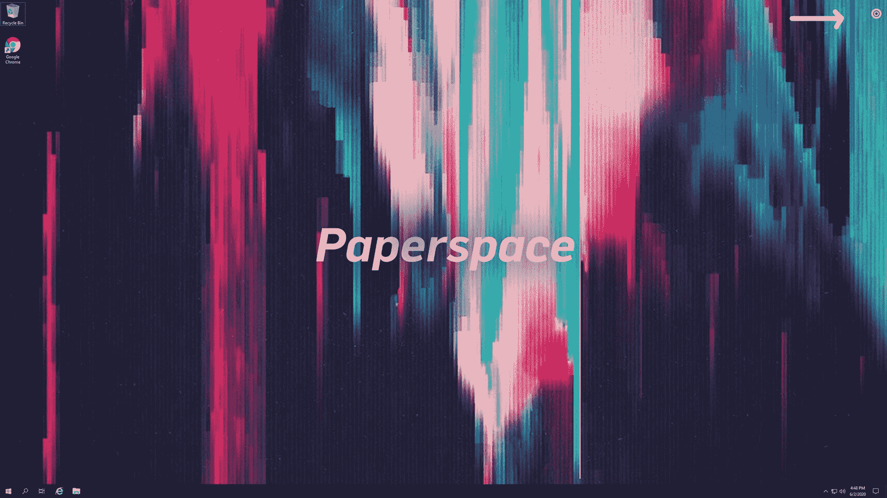
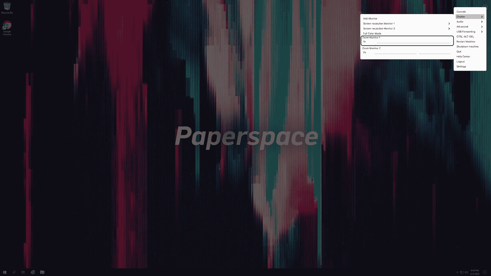
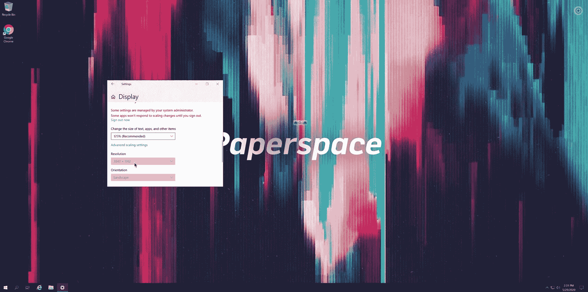

# 4K 流媒体登陆最新的 Paperspace 版本！

> 原文：<https://blog.paperspace.com/4k-streaming-comes-to-paperspace/>

我们很高兴地宣布，Paperspace 原生应用程序现在支持所有专用 GPU 虚拟机上的 4K 流。

***注** : 4K 流媒体仅在最新版本的 Paperspace 应用中可用。在这里下载 app:[https://www.paperspace.com/app](https://www.paperspace.com/app)*

以下是启用 4K 流的快速指南:

1.  打开 Paperspace 应用程序，找到设置菜单

Locate the settings menu in the upper righthand corner of the application

2.在**显示**设置中切换**缩放**选项，并确保选择了 **1x** 。

Make sure the Zoom setting for the monitor is set to 1x

3.检查虚拟机上的显示设置，并确认分辨率符合您对客户端显示器的期望。

You should now see resolutions at or close to the maximum supported by your client monitor

### 常见问题:

我需要什么来启用 4K？

*   你需要一个 4K 或更高的显示器和一个 GPU 驱动的 Paperspace 机器。

4K 在基于浏览器的 Paperspace 版本中可用吗？

*   还没有。4K 仅在本机应用程序中可用。

支持 5K、6K、8K 分辨率吗？

*   还没有。

我如何确保 4K 正常工作？

*   打开虚拟机上的显示设置。分辨率接近 4K 吗？如果没有，打开 Paperspace 应用程序设置，确保**缩放**被调低至 **1x** 。